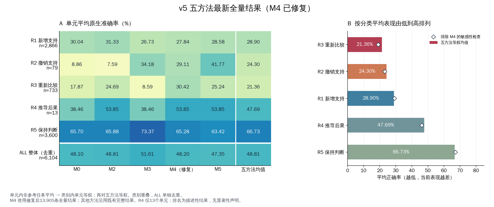

**2026-09-13：M7 当前主要方法已设为完整第二版 typed-control-v2（异常恢复＋额外优化）。384题试跑协议有效率95.31%；全量尚未运行。[方法设定与记录](benchmarks/2026-09-13_v5_complete/execution/EXPERIMENT_CHANGELOG_AND_REPRODUCIBILITY.md)。**

# cf_mrg · 医学 R1–R5 Benchmark 与 RAG 评测记录

评估医学证据变化后，模型能否新增支持、撤销支持、重新比较、推导后果，并在无关变化下保持判断。本仓库保存数据构建决策、方法实现、原生任务评分、修复试验和可复核的实验记录。

**最新状态 · 2026-09-13：v5 的 M0 / M2 / M3 / M4 修复版 / M5 均已完成全部 13,905 条输入。** M6 暂停于 52 条，M7 暂停于 1,646 条；两者尚无完整 v5 结果。

[最新完整报告](benchmarks/2026-09-13_v5_complete/completion/v5_benchmark_latest/README.md) · [近期工作总览](benchmarks/2026-09-13_v5_complete/README.md) · [全部文档目录](benchmarks/2026-09-13_v5_complete/DOCUMENTS.md) · [历史 Benchmark](benchmarks/README.md)

## 最新 v5 结果

每方法 **13,905 个唯一输入、15,616 条原生评分映射**，覆盖 **6,104 个单元、13,000 个入选判断**。五方法输入集合相同，缺失和重复均为 0。主指标为单元内非 reference 原生任务准确率平均，再在类别内对单元等权；下表单位为 %，无效回答保留分母。

| 类别 | 单元数 | M0 | M2 | M3 | M4 修复版 | M5 |
|---|---:|---:|---:|---:|---:|---:|
| R1 新增支持 | 2866 | 30.04 | 31.33 | 26.73 | 27.84 | 28.58 |
| R2 撤销支持 | 79 | 8.86 | 7.59 | 34.18 | 29.11 | 41.77 |
| R3 重新比较 | 733 | 17.87 | 24.69 | 8.59 | 30.42 | 25.24 |
| R4 推导后果 | 13 | 38.46 | 53.85 | 38.46 | 53.85 | 53.85 |
| R5 保持判断 | 3600 | 65.70 | 65.88 | 73.37 | 65.28 | 63.42 |
| ALL 整体（去重） | 6104 | 48.10 | 48.81 | 51.61 | 48.20 | 47.35 |




[完整精度 CSV](benchmarks/2026-09-13_v5_complete/completion/v5_benchmark_latest/category_scores_merged.csv) · [图 PDF](benchmarks/2026-09-13_v5_complete/completion/v5_benchmark_latest/v5_category_comparison.pdf) · [图 SVG](benchmarks/2026-09-13_v5_complete/completion/v5_benchmark_latest/v5_category_comparison.svg) · [覆盖验证](benchmarks/2026-09-13_v5_complete/completion/v5_benchmark_latest/validation.json)

R1–R5 存在重叠；ALL 对 6,104 个唯一单元去重计算。R3 的 733 个单元全部也属于 R1。R4 仅 13 个单元，指标为作者预期答案一致率。

## 方法与修复状态

| 方法 | 实现 / 骨干 | 当前状态 |
|---|---|---|
| M0 | Direct / Llama-3.1-8B | 全量完成 |
| M2 | 本地完整 MedRGAG / Llama-3.1-8B | 全量完成；保留 KGCC、KADS、五候选和重排 |
| M3 | 本地 MA-RAG intrinsic / Qwen3-8B | 全量完成；保留查询、候选、熵与投票流程 |
| M4 | MedRAG / Llama-3.1-8B | 明确输出契约＋JSON Schema/xgrammar 修复，全量重新生成 |
| M5 | MedRAG / Qwen3-8B | 原正式协议全量完成 |
| M6 | i-MedRAG | 52 条暂停；确定性 formatter 转换已验证，候选补丁未部署 |
| M7 | TC-RAG | 原全量暂停于 1,646 条；控制流程修复在 100 题开发复验中达到 99% 协议有效率，尚未全量部署 |

M4 在相同输入上，格式有效率 **61.41% → 99.09%**，原生有效率 **43.92% → 79.42%**，ALL 准确率 **29.76% → 48.20%**。旧预测完整保留。两项有效率以 13,905 个唯一输入计数，均不同于正确率。[完整修复报告](benchmarks/2026-09-13_v5_complete/completion/results_v5_m4_structured/RESULTS.md)

新 M4 改变了生成输出协议；M5 未同步改变，二者不能再描述为“仅骨干不同”。M4 仍有 2,735 条诊断未映射，格式修复没有解决全部诊断与评分兼容问题。

## 从哪里开始阅读

| 目的 | 文档 |
|---|---|
| 看最新分数、有效率与错误分解 | [五方法完整对照](benchmarks/2026-09-13_v5_complete/completion/v5_benchmark_latest/README.md) |
| 了解近期做过什么、哪些调整可用于论文 | [工作总览与时间线](benchmarks/2026-09-13_v5_complete/README.md)、[实施与复现总记录](benchmarks/2026-09-13_v5_complete/execution/EXPERIMENT_CHANGELOG_AND_REPRODUCIBILITY.md) |
| 理解 R1–R5 定义、来源、资格与 v5 抽样 | [分类指南](benchmarks/2026-09-13_v5_complete/workspace_reference/R1_R5_CLASSIFICATION_GUIDE.md)、[冻结 v5 数据构建](benchmarks/2026-09-10_r1_r5_v5/README.md) |
| 查看 M4/M5 配置与输入优化 | [安装与配置记录](benchmarks/2026-09-13_v5_complete/m4_m5_implementation/M4_M5_INSTALLATION_REPORT.md)、[原正式评测](benchmarks/2026-09-13_v5_complete/execution/results_v5_m0_m2_m4_m5/README.md) |
| 查看 M3 加速、分片与资源调度 | [M3 完成报告](benchmarks/2026-09-13_v5_complete/execution/results_v5_m3/RESULTS.md)、[性能分析](benchmarks/2026-09-13_v5_complete/execution/results_v5_m3/performance_notes.md) |
| 查看 M4 / M6 / M7 有效率问题 | [M4 全量修复](benchmarks/2026-09-13_v5_complete/completion/results_v5_m4_structured/README.md)、[M6 formatter](benchmarks/2026-09-13_v5_complete/execution/m6_formatter_pilot/README.md)、[M7 审计](benchmarks/2026-09-13_v5_complete/execution/m7_validity_audit/README.md) |
| 复查 M6/M7 上游兼容与吞吐尝试 | [论文复现记录](benchmarks/2026-09-13_v5_complete/m6_m7_implementation/PAPER_REPRODUCTION_RECORD.md)、[正式运行历史](benchmarks/2026-09-13_v5_complete/completion/results_v5_m6_m7/formal_balanced/README.md) |
| 追溯旧版结果及早期研究 | [Benchmark 归档](benchmarks/README.md)、[旧首页完整保留](README_HISTORY.md) |

M7 后续控制流程修复及真实续跑见[原实施记录第19节](benchmarks/2026-09-13_v5_complete/execution/EXPERIMENT_CHANGELOG_AND_REPRODUCIBILITY.md)：100题原61有效→修复99有效，原8步与熵阈值保持；3个原有效答案值改变，不宣称输出等价或全库99%。

## 当前研究重点

五方法分类均值由低到高为 **R3 21.36 → R2 24.30 → R1 28.90 → R4 47.69 → R5 66.73**。R3/R1 应先区分诊断映射问题与实质推理错误；R2 主要是有效但错误，适合检查撤销支持后的判断更新。R5 用于检查保持能力。来源集中与小样本限制见[分类分析及错误分解](benchmarks/2026-09-13_v5_complete/completion/v5_benchmark_latest/README.md#更新后的分类表现与错误分解)。

实现纠错、标准工程提速与研究候选分别记录。现有格式修复和约束解码本身不作为已确立的新算法贡献；统一证据支持更新仍需独立实验验证。

## 复核与发布范围

克隆后，无需 GPU 或模型即可检查归档表格、分母、评分一致性与本次文档链接：

```bash
git clone https://github.com/xiotakut/cf_mrg.git
cd cf_mrg
python3 benchmarks/2026-09-13_v5_complete/check_publication.py
```

发布内容包括完整工作文档、PNG/PDF/SVG 图、完整精度汇总和单元评分、配置、源代码快照及审计收据。[来源清单](benchmarks/2026-09-13_v5_complete/SOURCE_MANIFEST.csv)逐文件记录原始位置；[全部文档目录](benchmarks/2026-09-13_v5_complete/DOCUMENTS.md)提供分类导航。

原始 benchmark 正文、逐题完整响应、模型权重、检索索引及大型阶段缓存保留于服务器。历史脚本保留原环境路径，完整推理或重新绘图需要对应依赖和本地制品；本仓库不是下载后即可全量重跑的模型环境。详见[制品与复现边界](benchmarks/2026-09-13_v5_complete/README.md#制品与复现边界)。

## 比较限制

各方法骨干、语料和调用预算不同，不能把所有分数差异解释为算法收益。v5 已用于问题发现和修复方案选择，不是独立泛化确认集；100 条方案选择输入之外的结果另行报告。诊断使用冻结映射，没有新增同义词或模型裁判。旧 M4 的配对统计不能用于修复版 M4。历史 CF adapter / WM 实验属于不同协议，其结果不并入本次原生 v5 比较。
