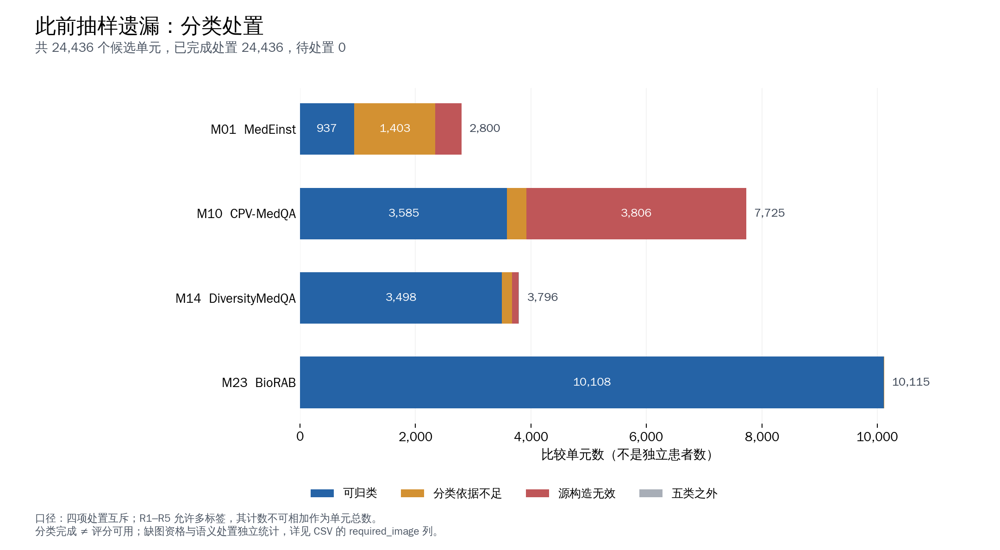
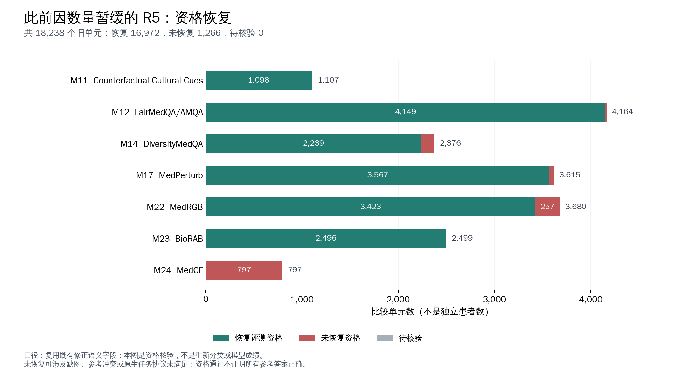
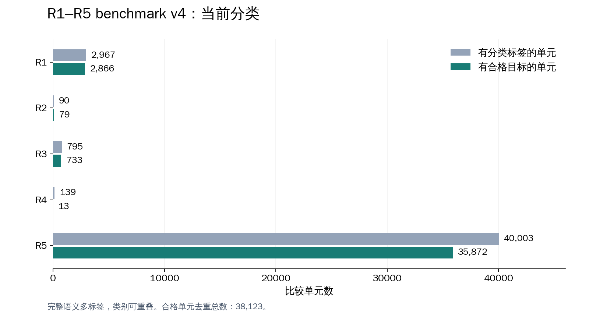

# R1–R5 benchmark v4（2026-09-10）

正式版本名为 **v4**，本地目录为 `benchmark_r1_r5_v4_20260910`。分类与资格已完成；模型运行接口兼容性尚未验证。

本轮补分类与资格整理已完成，待处理为 **0**。分类沿用[原规则和示例](../2026-09-10_r1_r5_full_coverage_plan/README.md)，保留 v3 及已完成 M0–M3 结果。历史抽样及版本形成过程见[流程说明](../2026-09-10_r1_r5_process_history/README.md)。

| 范围 | 已处理 | 可测 |
|---|---:|---:|
| 抽样遗漏比较单元 | 24,436 | 18,023 个单元 |
| 旧 R5 比较单元，复用既有目标标注 | 18,238 | 16,972 个单元 |
| M17 新增 RESOURCE 目标 | 3,615 | 3,529 个目标 |

RESOURCE 位于已有比较单元上，不能与前两行相加。全母库 55,991 个单元均有去向；共 109,599 个已审具体判断，其中 **77,781 个具备评分资格，分布在 38,123 个单元**。这些数值包含旧 v3 和其他旧已审目标，不是新增独立模型输入数。

旧 R5 的原标签、理由、证据及原始记录逐项保留。最后查明的 10 个实际无变化控制通过独立资格记录禁用：其中 9 个此前可测、1 个原已禁用，因此旧目标恢复数由 16,981 调整为 16,972。RESOURCE 独立增加了另 3 个单元的可测目标。

## 文件与链接

| 内容 | 文件 |
|---|---|
| 所有15个已取得来源及11个获取缺口 | [说明](source_scope_inventory.md)、[CSV](source_scope_inventory.csv) |
| 全来源类别及单元数 | [来源类别表](archive_source_category_counts.csv) |
| 全目标统计 | [all_target_summary.json](all_target_summary.json) |
| 全母库去向统计 | [archive_coverage_summary.json](archive_coverage_summary.json) |
| 两批增补统计 | [expansion_summary.json](expansion_summary.json) |
| 覆盖及旧语义保留检查 | [completion_audit.json](completion_audit.json) |
| 图表口径、表格及PDF | [图表目录](figures/README.md) |





## 使用边界和本地标注

此发布包含说明、聚合统计和图表。完整原文、逐目标标注及资格保留在服务器：

```text
/home/data3/txy/Documents/Codex/2026-09-09/agent-md-medrgag-workspace-guide-md/benchmark_r1_r5_v4_20260910/
  DELIVERY.md
  exports/all_reviewed_target_annotations.jsonl.gz
  exports/archive_unit_coverage.csv
  exports/changes_relative_to_frozen_review.csv
  legacy_target_qualification_overrides.jsonl
```

后续本地对话从 `/home/data3/txy/AGENTS.md`、`MEDRGAG_WORKSPACE_GUIDE.md` 和 `R1_R5_CLASSIFICATION_GUIDE.md` 进入，读取最终导出的逐目标 `evaluation_eligible`。父单元至少一个目标合格不能使其他目标自动合格。

必要缺失多模态输入、原题/参考问题、无法固定评分及原生任务协议不适用均有明确处置；没有按数量再次抽样。MedEinst 使用既有开放诊断归一化精确匹配，其局限不等同人工语义评分；MedCF 所需知识编辑步骤未执行，不能用普通问答代替。原始参考未声称得到临床专家独立验收。

本轮没有生成新版独立模型输入/评分映射运行包，也没有运行新版 M0–M3 评测。v3 仍是最近完成四方法评测的冻结版本。来源明细里的本地路径及代码格式文件名用于服务器追溯，未全部打包至本发布目录。

## v4 当前分类

按完整语义多标签统计，类别可重叠；合格单元去重总数为38,123。

| 类别 | 有标签单元 | 有合格目标的单元 | 合格具体判断 |
|---|---:|---:|---:|
| R1 | 2967 | 2866 | 4155 |
| R2 | 90 | 79 | 79 |
| R3 | 795 | 733 | 733 |
| R4 | 139 | 13 | 13 |
| R5 | 40003 | 35872 | 74268 |



[分类统计CSV](v4_category_summary.csv) · [分类图PDF](figures/v4_category_distribution.pdf)

## 两种范围方案对比

[当前v4与排除七来源方案的完整图表、逐来源采用数量及未采用原因](../2026-09-10_r1_r5_v4_scope_comparison/README.md)。第二种方案仅为预览。

后续已建立 [v5随机选择及探索记录](../2026-09-10_r1_r5_v5/README.md)：保留完整v4，R5每来源随机450。

面向论文写作及接手的[工作与具体调整总记录](https://github.com/xiotakut/cf_mrg/blob/main/benchmarks/2026-09-13_r1_r5_paper_work_record/README.md)，汇总v3→v4→v5过程、修改台账、验证边界及后续交接。
