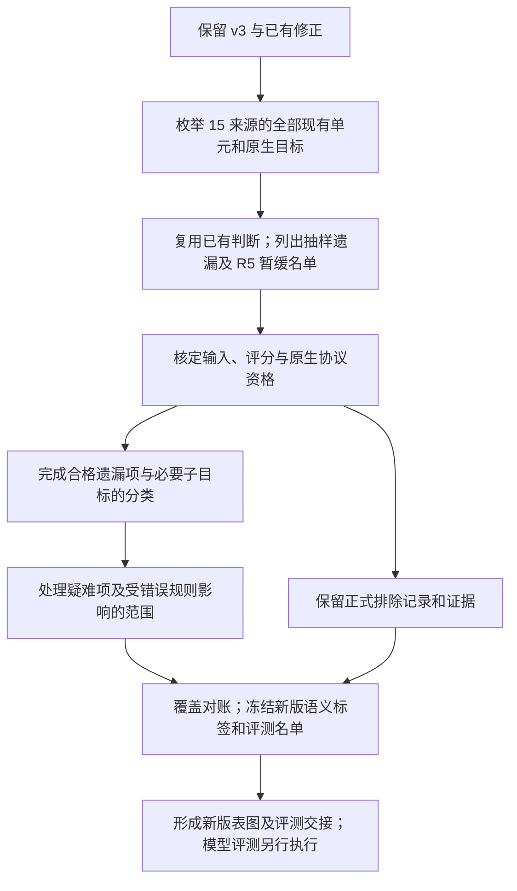

# R1–R5 全量补分类与评测资格整理计划

日期：2026-09-10。状态：**计划文件；尚未执行本轮补分类或新模型评测。**

本计划接续[分类与评测完整流程说明](../2026-09-10_r1_r5_process_history/README.md)。保留当前 v3，另建后续版本，补齐此前仅因抽样遗漏的候选，并重新处理因 R5 单来源和数量限制而暂缓的内容。后续版本暂称 `v4_candidate`；完成分类和资格核定后再冻结为正式新版。

## 1. 本轮决定与范围

用户本轮明确要求：已经收录一部分的来源，不能再用“数量太多所以随机抽样”解释其余部分缺失；R5 也不能因数量大而整批删除。新版本据此取消旧的“大来源抽 2,500”和“R5 仅 CPV、2,000 以内”限制。这是本轮新增决定，旧文件记载的当时决定继续作为历史保留。

具体执行范围是**已经取得数据的 15 个来源**：覆盖现有八个来源的遗漏部分，也审查另七个已取得来源的原任务资格。只要具体单元及原生子任务满足既有 R1–R5 定义、输入和评分要求，就全部纳入对应范围，不设来源配额、类别配额、总题数上限或结果导向的筛选。

“全量”指既定来源版本和原生任务范围内的全部合格单元；不表示忽略作者划分、补造缺失内容，或承诺全部归档记录都能成为可评分题目。26 项来源清单中另有 11 项历史上未取得固定数据，继续报告为获取缺口；本轮不把重新搜集所有外部候选作为补分类的前置任务。后续若取得其原始材料，单独记录扩展版本。

人工评分刚需、多模态刚需、关键内容缺失、评分依据缺失，以及在旧分类定义下确实缺少判断前提的内容，仍可正式排除。判定优先落到原生子任务或具体单元；只有整个来源都存在同一问题时才整体排除。

## 2. 保留 v3，并明确数量口径

当前 v3 的 3,105 个比较单元、4,872 个独立输入、每方法 6,030 条评分映射及已完成的 M0–M3 结果全部保留。R1–R5 互斥计数为 **1,601 / 77 / 324 / 13 / 1,090**。本计划不改写其分类、输入、评分、图表或运行结果。

后续文件写入独立目录；已有 v3 结果继续按 v3 名称引用。新版本的新增与撤销、资格变化及类别分配变化分别记录，不能覆盖旧结果后继续称其为 v3。

| 口径 | 已核实数量 | 本轮含义 |
|---|---:|---|
| 已取得来源的归档比较单元/题组 | 55,991 | 是母库记录数，不是独立患者数或最终测试题数 |
| 冻结分析集已审单元 | 28,243 | 包含 25,746 个文本单元及 2,497 个缺图多模态元数据单元；保留现有修正 |
| 仅因大来源抽样遗漏 | **24,436** | 本轮新增候选处理的主体；资格合格者继续按旧标准完成分类 |
| 母库不在冻结分析集内 | 27,748 | 还包括无变化记录和 MedCF 的非 test 划分，不能全部称为抽样遗漏 |
| 已分类、因旧 R5 范围限制暂缓的候选 | **18,238** | 主要复用分类并重新核定资格，不是 18,238 个尚未分类的新题 |

仅因抽样遗漏的计算如下，依据[原抽样清单](../2026-09-08_medical_cf_five_labels/reports/analysis_selection.json)：

| 来源 | 归档单元 | 抽样前有效池 | 已审 | 待补候选 |
|---|---:|---:|---:|---:|
| M01 MedEinst | 5,383 | 5,300 | 2,500 | **2,800** |
| M10 CPV-MedQA | 10,225 | 10,225 | 2,500 | **7,725** |
| M14 DiversityMedQA | 6,296 | 6,296 | 2,500 | **3,796** |
| M23 BioRAB | 12,615 | 12,615 | 2,500 | **10,115** |
| 合计 | 34,519 | 34,436 | 10,000 | **24,436** |

27,748 与 24,436 的差额可完整解释：MedEinst 83 个无可见临床变化记录、MedPerturb 14 个无实际变化记录、MedCF 3,215 个实际编辑的 train/valid 记录。即 **27,748 = 24,436 + 83 + 14 + 3,215**；MedCF 的 3,215 又分为 train 2,399、valid 816。后者不能为了补数量而混入原 test 评测。

现有 R5 暂缓候选按来源为：Cultural 1,107、AMQA 4,164、DiversityMedQA 2,376、MedPerturb 3,615、MedRGB 3,680、BioRAB 2,499、MedCF 797，合计 **18,238**。其中仍含可能缺图、无固定评分依据或原任务协议不适用于当前方法的内容，最终可纳入数量要在资格核定后给出。MedCounterFact 的 703 个重叠 R1/R5 单元已经存在于 v3；恢复其 R5 语义记录不产生 703 个新增单元。

这些计数相互不可直接相加来预测新版最终规模。一个比较单元可以有多个目标、多个输入及多条评分映射；最终分别报告来源记录、原题根、比较单元、具体判断、独立输入和评分映射数量。

## 3. 沿用的分类标准

分类以**具体变化、具体判断目标及其关系**为单位。父单元标签是已成立子判断标签的并集，允许语义多标签。作者给出的变化类型或答案标签可以定位原任务，不能单独替代功能分类依据。以[已审分类](../2026-09-08_medical_cf_five_labels/data/analysis_judgments.csv.gz)和[修正记录](../2026-09-08_medical_cf_five_labels/audit_20260908/corrections/README.md)为工作基线，不退回最初的批量初标规则。

| 类别 | 必须能够指出的关系 | 延续既有审核后的边界 |
|---|---|---|
| R1 | 变化为某个明确目标增加支持证据 | 重复原来已有的症状、只有“较既往加重”字样，不自动构成新增有效支持 |
| R2 | 变化明确撤销原先支持目标的前提或证据 | 没有再提及某条件不等于否定；不能把信息缺失当作明确排除 |
| R3 | 变化使可辨认候选之间的相对支持关系发生变化 | 写出相关候选和支持变化；不能仅凭 gold 改了或单一症状名称推定重排 |
| R4 | 前提变化通过有依据的关系，影响题面未直接给出的下游结果 | 指出前提、作用关系和下游目标；不能把直接复述答案或属性替换当作推演 |
| R5 | 相对于明确原任务目标，变化应不影响有效结论 | 必须说明无关性或任务约束依据；原 gold 相同、模型恰好答得相同均不充分 |

先还原原题/参照、变体和原生目标，再写出实际改变及简短依据；能成立几个判断就保留几个。人口属性、风格变化或检索噪声都不能跨语境默认 R5。没有有效变化的记录保留为来源参照，不算新增功能比较单元。

保留现有 `judgments`、`change`、`target`、`labels`、`rationale`、`evidence`、`cannot_infer`、审阅状态及来源定位；新记录沿用相同字段语义。分类理由写可核查的结论和依据，不要求输出冗长思维过程。分类者、模型、思考等级、时间和规则版本记录在任务元数据中；没有临床专家复核的记录继续标为 `clinical_review=false`。

“确实无法按这五类界定”与“尚未审完”分开。遇到疑难项，先查原生任务、原始上下文及适用的一手依据；若仍缺少决定分类的前提，说明缺什么、为何影响哪个目标。不得以模型第一次不确定、分类脚本尚未实现或处理成本高作为最终排除理由，也不得凭空增加医学因果关系或改 gold 来使其可分类。

## 4. 正式纳入和排除的依据

每个候选分别记录分类状态和评测资格。已经有 R 标签不保证能运行原任务；能自动评分也不保证符合 R1–R5。一个原生目标不合格时，其他可独立执行、可独立评分且有分类依据的原生目标仍应保留。

| 处理原因 | 需要记录的实际证据 | 处置 |
|---|---|---|
| 新回答必须人工/rubric 评分 | 原协议对新回答要求的质量、偏差、伤害或长答案语义评价，且没有可用的固定答案评分规则 | 排除对应评分子任务；已有标注留档 |
| 必需多模态输入不在当前文本协议内 | 具体图像/信号字段及原题对该信息的依赖 | 排除依赖该模态的目标；文字已完整给出所需信息的题不因提及影像而排除 |
| 关键内容缺失 | 缺少的原文、选项、图像、参照、配对或证据字段及已核对的官方材料 | 能从固定官方原件无歧义恢复则恢复，否则排除受影响目标 |
| 固定评分依据缺失或原参考已判定无效 | 缺少哪个 gold/答案集/映射，或既有参考问题及其影响 | 按原任务可独立评分的最小范围处理，不伪造新 gold |
| 源构造无效或不属于五类 | 无有效变化、构造不成立，或缺少定义要求的关系；附具体依据 | 保留来源记录；不放入有标签评测集 |
| 分类依据仍不足 | 已核实的目标、缺失前提、核对范围和无法界定的原因 | 标为已审未定类；从相应 R 类测试中排除，不冒充已分类 |
| 原生实验协议不适用当前方法 | 原任务必须执行的干预/编辑步骤，以及当前方法不具备该原生能力的事实 | 单列协议不适用；不能改写成另一个任务后宣称原 benchmark 结果 |
| 作者评测划分范围 | 固定来源的真实 train/valid/test 角色 | 保存全部来源和划分；正式 test 不混入真实训练/验证数据 |

格式适配、固定规则答案解析及已有人工 gold 的使用，不等于“必须人工评分”。反之，用另一个 LLM 给新答案打分，仍然改变了当前固定规则评分范围，不能用它绕过排除条件。**用 LLM 做本次分类**与**用 LLM 当评测答案裁判**是两个不同环节。

来源级理由可以被具体记录引用，但必须准确限定受影响的任务范围。每项排除记录原 ID、原生目标、主因、相关缺失字段/原文定位、核对材料和可恢复条件。若有多个问题，可列附加原因；流失统计使用唯一主因，避免重复扣数。

一时下载失败、尚未读完或运行中断属于待处理状态；不能直接写成“来源缺失”“依据不足”。确实无法取得必要材料时，报告实际获取限制和对应范围。输入太长也不能因为“太麻烦”被删除；若原生完整输入确实超出某方法的硬性能力，先保留候选并在方法适用性中单列，不静默截断证据或偷缩共同测试集。

## 5. 逐来源处理安排

下表的数量是现有可核查基线，不是预先承诺的新版本纳入数。“恢复”表示撤销旧规模限制并按本计划核定资格。

| 来源 | 本轮工作 | 关键资格或分类处理 |
|---|---|---|
| M01 MedEinst | 补 2,800；复用已审 2,500 的修正结果 | 在 5,300 个有效变化池内闭合覆盖；83 个无变化单列。延续新增支持、撤销支持、候选重排的严格界定 |
| M02 MedPIC | 183 个 CF 单元已有审阅，复用；当前 v3 167 个 | 区分 CF 记录与另存 GF 参照，不凭空构造配对；检查原题目标和多选答案集合 |
| M05 LabTest | 33 个 CF 单元已有审阅，30 个有标签 | 当前新回答仍需要原生 rubric 评分，维持对应任务排除；保留分类及理由 |
| M06 HIVART | 20 个 CF 单元已有审阅，当前 v3 13 个 | 继续如实标注与作者预期答案的一致性；不声称取得独立临床 gold，已知无效参考按目标处理 |
| M10 CPV-MedQA | 补 7,725；复用已审 2,500；当前 v3 1,091 个 | 新增合格 R5 全纳入。既有 20 个图像依赖 R5 继续按实际输入资格处理；人口属性是否与目标无关逐语境判断 |
| M11 Cultural | 1,349 个已审，当前 v3 67 个；恢复审查 1,107 个 R5 | 既有 R1 和 R5 分别按具体目标保留；不因某属性常被视作噪声而自动给所有变体 R5 |
| M12 FairMedQA / AMQA | 4,806 个已审，当前 v3 134 个；恢复审查 4,164 个 R5 | 使用作者发布的固定攻击输入和原答案；不在线重新生成攻击。复用已经修正的 30 个具体判断 |
| M14 DiversityMedQA | 补 3,796；当前 v3 2 个；恢复审查已审的 2,376 个 R5 | 从固定 MedQA 原件按准确原题匹配恢复选项/gold；不能模糊拼题。保留作者 train/test，不包装为新建独立 test |
| M16 EquityMedQA | 323 个已审，302 个有标签 | 对新回答的公平性/质量仍需要 rubric，维持对应任务排除；不能以撤销 R5 限制自动恢复为可评分题 |
| M17 MedPerturb | 3,745 个有效比较已审；恢复审查 3,615 个 R5 | 逐项核定图像依赖；保留原生 VISIT、MANAGE、RESOURCE 的目标与 gold，按目标确定 R 标签 |
| M20 MedCounterFact | 809 个已审，当前 v3 788 个 | 复用修正；保留其中 703 个重叠 R5 的语义信息，避免新增计数。证据槽变化不能默认等价于患者状态变化 |
| M22 MedRGB | 3,680 个题组已有分类，恢复逐子任务资格审查 | 主问题作答、错误文档识别、文档纠正分别处理；见下文，不整包认定可自动评分或不可自动评分 |
| M23 BioRAB | 补 10,115；恢复审查已审的 2,499 个 R5 | 原生输出为 positive/negative，保留原始示例与目标上下文。噪声示例标签不替代目标 gold；复用参考无效标记 |
| M24 MedCF | test 798 个有效编辑已有审阅，797 个有 R5 | 留存分类；普通 M0–M3 文本 RAG 不执行原知识编辑步骤，对其原生编辑评测继续单列协议不适用 |
| M25 MedMKEB | 2,497 个已审元数据单元 | 缺少必要图像且当前为文本协议，维持排除；部分文字目标标签不代表完整多模态任务可执行 |

### 5.1 MedPerturb：有人工标注不等于必须人工评分

原生 VISIT、MANAGE、RESOURCE 有已发布的 yes/no 目标及 gold，可用明确的固定输出格式评分。历史较大范围中，3,745 个比较有 468 个因图像依赖被排除、3,277 个进入文本范围；这只是新轮核定的起点。

需要分别确认各目标的分类关系。既有 VISIT/MANAGE 的 R5 不能自动转移给 RESOURCE；若这一目标尚无有效分类依据，应补对应判断，不为了保留更多评分行继承父标签。原题/变体与多目标展开数不等于新增比较单元数。

### 5.2 MedRGB：按原生可独立评分的任务拆分

主问题的固定答案正确率、错误文档 ID 检测、文档纠正内容质量分别审查。具有原生固定答案的主问题可保留；错误 ID 检测必须有对应条件的准确文档位置依据；长答案和纠正文稿若依赖人工语义评分，则排除相应子任务。

历史本地计划曾采用六档文档比例条件。这些是本地固定化构造，不能直接称为作者发布的六组原始条件；也没有可直接假定的官方 `DOC_n` 到 signal 文档位置映射。后续若原件不能支持某个比较或位置标注，明确排除该目标，不重新随机拼文档填补它。

历史输入预检查曾将 44 个图像依赖题组排除，余下 3,636 个中，每档主问题有 3,436 个可固定评分、200 个 MedLFQA 长答案没有该评分依据。这些数只用于定位已有材料，不能代替本次原生协议核定。缺字段的文档位置应按实际受影响任务处理；不可填造缺失内容、虚报噪声比例，或把 10 个文档槽和六档条件算成几十倍的新题组。

### 5.3 BioRAB 和 MedCF：保留原任务含义

BioRAB 是在发布的示例/目标上下文条件下判断 positive/negative；不得把它改成自造的三分类任务。已有较大范围映射中，2,500 对对应 5,000 条输入映射，其中 8 条参考曾被标记为不可评分；保留这些具体标记，按可独立评分目标判断影响，不能粗略解释成删除 8 对。

MedCF 的 efficacy、generality、locality 依赖知识编辑及编辑前后协议。现有 M0–M3 普通文本 RAG 方法不能用普通问答或临时增加编辑模块来冒充该任务。当前正式理由是原生协议不适用；旧 R5 数量限制撤销后，这一理由仍然成立。其 train/valid 保留为来源材料，不作为“抽样遗漏的 test”补入。

## 6. 实际执行流程与顺序

1. **建立新版本工作目录和覆盖清单。** 从母库及固定官方材料按来源 ID/原 ID 枚举；连接已经修正的分析集和 v3 名单。先证明 24,436 个遗漏候选的集合来源，再开始批处理。旧 `assemble_full.py` 含 2,500 抽样和初标逻辑，只参考其来源解析；不直接重跑它作为全量加载器。
2. **先处理来源/子任务资格。** LabTest、EquityMedQA、MedMKEB 和 MedCF 的已知限制复用已有证据；MedRGB、MedPerturb 按子目标处理。对所有同类记录采用同一规则。遇到可从官方原件恢复的字段，先恢复再判，不以本地适配暂缺为理由排除。
3. **补齐已进入 v3 的大来源。** 依次处理 MedEinst 2,800、CPV 7,725、DiversityMedQA 3,796。已有 2,500 子集的修正标注直接复用；只有新证据或同类规则问题影响旧记录时才在新版本中更新。
4. **补齐 BioRAB 并恢复其他合格 R5。** 处理 BioRAB 10,115 个遗漏候选，复用七来源 18,238 个 R5 暂缓候选的现有判断，补所需目标判断并核定资格。步骤 3、4 只是执行顺序，不决定最终纳入权重，也不允许执行到预算耗尽时把后面来源删掉。
5. **处理真实分歧与规则影响。** 对 R2/R4、属性相关性、临床相对支持、检索证据条件、参考无效及子目标未决项作针对性语义复核。若某条判定规则有问题，定位并修改所有受其影响的旧/新判断；不反复复查已经解决且没有新增证据的范围。
6. **完成覆盖、类别和评测资格对账。** 所有既定来源单元均有明确去向，所有应纳入的合格目标均有有效分类；列出仍未完成的项，未解决前不宣称全量完成。随后冻结新版、生成差异说明和图表。

批次按来源、原题根及真实上下文组织，大小由可完整阅读和输出的内容决定；批次是调度单位，不是抽样配额。同一原题的相关变体可以共读上下文，但每项判断必须绑定本项变化和目标。分组规则只能复用可验证条件，不能把“这组大体都是 R5”当成逐项分类。

中断时保存已完成记录及剩余原 ID，从未完成部分恢复，不替换 ID、不重复跑整个已完成集合。用首批实际完成工作的吞吐估计余量；时间或预算不足就报告真实进度和续跑范围，不能产生 `too_many`、`sampled_out`、`r5_cap` 等新版最终排除理由。

## 7. 复核要求与完成标准

结构核对服务于真实问题：检查来源覆盖和去向是否漏项、已审修正是否被初标覆盖、目标与答案是否错位、排除是否误伤可独立评分目标、标签是否具有具体依据。这些检查集中完成；文档或计数小改不触发全库语义重审。

语义复核优先覆盖上轮已发现的规则问题、所有新规则、明确冲突和难以界定的目标。历史已有 1,127 个有父标签的文本单元仍含未决子目标；如果这些目标要进入新版评测，仍须补判，不能因为复用了父标签就视为全部完成。可另做审阅质量抽查，但**质量抽查不限制数据集纳入规模**；有意挑选高风险项的错误比例也不能宣传为全库错误率。复用旧标注与新增逐项判断的数量、审阅方式如实报告，代理复核不写成临床专家复核。

本轮完成需同时满足：

- 15 个已取得来源的归档单元均能对应到已纳入、正式排除、来源参照或作者非评测划分等明确去向；处理中的 `pending` 单列，不能藏在排除总数中。
- 24,436 个抽样遗漏候选已逐项得到有效分类或有证据的正式处置；不再存在仅因旧抽样未处理的候选。
- 18,238 个 R5 暂缓候选已撤销规模限制并完成资格处置；不承诺不合格者也成为新测试题。
- 已纳入目标满足既有 R 定义、完整原生输入与固定规则评分条件；既有已知无效参考没有重新混入评分。
- 原题、变体、目标、来源划分和 gold 的对应关系保持可追溯；同一目标不因来自旧子集或新增部分而适用不同规则。
- 新版本有各来源流失表、类别分布、v3 差异表和明确的适用范围说明；当前 v3 和已完成结果保留。

若实际发现来源自身缺失了分类所需前提，经过核对后将其标成“已审未定类、依据不足”可以完成该项处置；仅仅“本轮没有时间再看”则仍是未完成。

## 8. 新版本数据与汇总口径

语义分类继续多标签。若沿用 v3 的互斥图表口径，在**新版本全部合格目标确定后**，一次性统计新版各语义类别规模，再沿用“有效标签中总体规模较小的类别优先”的既有规则分配 `eval_category`；新版预先规定同数时按 R1→R5 固定顺序处理。规则在读取任何新增方法输出前固定，不沿用旧 v2 的规模数值，不动态调配类别，也不靠删除 R5 平衡图表。

`labels`/具体判断与 `eval_category` 分别保存。互斥展示中一个单元只有一个类别，不意味着删除其他成立的语义关系。MedPerturb 等多目标来源的评分映射必须连接对应的具体目标，不能把父标签直接复制到每个未审子任务。

报告至少包含：来源 × 状态流失表、来源 × R1–R5 多标签表、互斥类别表、原题根及变体数量、v3 到新版的新增/退出/重新分配表。图显示全量合格内容的真实构成。R5 占比高是需要解释的来源组成事实，不能靠砍题消除；后续方法结果可同时报告来源内表现和来源宏平均，避免只用一个混合总分解释所有来源。

不把多个变体当作独立患者。未来若给置信区间或比较方法，应按原题根处理同源相关性。相同完整输入可在条件一致时复用一次推理，但仍保留各来源和目标映射，不能为了去重删除有意义的原生条件。

## 9. 交付文件与后续评测交接

尽量沿用现有 JSONL/CSV 格式，在新的工作目录保存以下内容，不引入数据库或新框架：

| 文件 | 内容 |
|---|---|
| `README.md` | 新版范围、来源版本、执行状态、规则与最终数量 |
| `coverage.jsonl` | 每个来源单元/目标的去向、分类状态、评测资格及原 ID |
| `annotations.jsonl` | 复用或新增的具体判断、依据与审阅元数据；保留现有字段语义 |
| `exclusions.csv` | 正式排除及已审未定类的原因、证据定位和受影响范围 |
| `changes_from_v3.csv` | 新增、资格变化、必要分类修正与互斥分配变化；区分变化类型 |
| `source_category_counts.csv` / `source_flow.csv` | 类别分布与各来源逐阶段去向 |
| `figures/` | 来源组成和类别分布图，PNG 与 PDF/SVG |
| `evaluation_handoff.md` | 合格原生子任务、固定评分规则、输入展开、旧预测复用条件及剩余调用量 |

候选仍有未完成项时保留候选版本状态。完成分类与资格冻结后，再生成正式评测输入和评分映射；最终题量不在本计划中预定为某个好看的整数。

随后评测继续使用已约定的 M0/M1/M2/M3 方法配置与原生评分，不额外添加本项目模块、知识编辑器或模型裁判。仅当完整输入、方法配置和相关推理条件一致时复用已有预测；只改变类别归属无需重新推理，新增或实质改变输入则属于后续运行工作。无法支持原协议的方法/任务组合如实标明适用性。

本轮交付到计划文件为止。完整补分类、输入冻结及 M0–M3 新版测试是后续执行阶段，不能用已完成的 v3 成绩宣称新版本也已测完。

## 10. 推荐模型和思考等级

**具体建议：后续主分类与语义裁决使用 GPT-6 Astra，思考等级 `max`。** 本地当前配置已经是 `model = "gpt-6-astra"`、`model_reasoning_effort = "max"`，无需为了本计划修改配置。

OpenAI Docs 的[官方 Astra 模型页](https://developers.openai.com/api/docs/models/gpt-6-astra)确认其支持 `low`、`medium`、`high`、`xhigh` 和 `max`。选择 `max` 用于本项目是任务建议：本轮需要同时判断临床支持关系、反事实前提、原生任务边界和旧分类修正，不能仅按关键词贴标签。该建议不等于官方证明 `max` 能保证医学分类正确。

| 工作 | 建议配置/承担者 |
|---|---|
| 新增单元语义分类、难例裁决、排除理由的实质判断、必要旧规则修正 | **主代理 GPT-6 Astra + max** |
| 文件枚举、集合差、已有字段复用、计数、表图生成 | 优先直接用已有脚本/固定规则；不需要另派高思考代理 |
| 长任务存活、进度、异常、输出缺漏和断点状态监督 | **Luna max subagent，仅监督**；主代理定期检查 |

Luna max 不承担本次分类、医学依据裁决、资料解读或普通图表提取。监督发现语义问题时报告主代理处理，不自行改分类。无实际长任务运行时不启动监督代理；本计划编写也无需调用它。

本地模型列表另有 `ultra`，描述包含自动任务委派。本项目目前已有明确的代理职责边界，建议直接使用 `max`，无需开启额外自动委派。`max` 是推理设置，不要求为简单操作拖延或对已解决记录反复检查。

## 11. 后续可直接使用的执行指令

> 按本计划执行 R1–R5 全量补分类。保留当前 v3、输入及全部 M0–M3 结果，另建新版候选目录。覆盖已取得的 15 个来源；补处理 MedEinst 2,800、CPV 7,725、DiversityMedQA 3,796、BioRAB 10,115 个抽样遗漏候选，复用已修正标注，并撤销其他已分类 R5 的旧来源/数量限制。所有合格内容全部纳入；按原生子任务和具体目标记录有证据的正式排除，不允许因数量、比例或预算随机删题。沿用旧 R1–R5 定义及审核修正，保留作者划分、原始输入和 gold；MedRGB 按可独立评分子任务处理，MedCF 不用普通 RAG 冒充知识编辑。主分类和语义裁决使用 Astra max；Luna max 仅在有长任务时监督。分批保存并可恢复，未审完如实报告，不伪装成排除。交付覆盖清单、分类与排除记录、新旧差异、来源/类别表图及评测交接；本执行阶段先完成分类与资格冻结。

## 12. 依据与适用限制

本计划数量来自 09-08 固定收集/分类归档和 09-10 v3 本地结果核对，来源获取状态是已留存材料的状态，不是对所有作者仓库今日发布状态重新作出的保证。最终全量可评测数量、R 类比例及所需调用量，要到新增候选和原生子任务资格全部处理后才能确定。

已有标注并非全部同等强度的临床专家逐病例审查：历史 28,243 个单元使用过逐项语义审阅、按机制/原题分组审阅和结构/任务约束核验；已修正 172 个判断、涉及 130 个单元。后续如实保留审阅方式，不能将本轮覆盖补齐描述成获得临床验证。

主要来源入口：

- [历史流程、原数量决定与 v3 形成过程](../2026-09-10_r1_r5_process_history/README.md)。
- [固定来源与分类归档](../2026-09-08_medical_cf_five_labels/README.md)、[抽样规则及各来源计数](../2026-09-08_medical_cf_five_labels/reports/analysis_selection.json)、[来源审核表](../2026-09-08_medical_cf_five_labels/audit_20260908/来源审核表.csv)。
- [已审单元](../2026-09-08_medical_cf_five_labels/data/analysis_units.csv.gz)、[具体判断](../2026-09-08_medical_cf_five_labels/data/analysis_judgments.csv.gz)、[未定类记录](../2026-09-08_medical_cf_five_labels/data/analysis_unclassified.csv.gz)、[分类修正](../2026-09-08_medical_cf_five_labels/audit_20260908/corrections/README.md)。
- 服务器工作区 `/home/data3/txy/AGENTS.md` 与 `/home/data3/txy/MEDRGAG_WORKSPACE_GUIDE.md`：当前入口及已完成 v3 结果；按该指南的 `CF_PACK` 路径定位 `benchmark_r1_r5_text_auto_cpv_v3_exclusive_20260909/`。
- 同一 `CF_PACK` 下 `results_r1_r5_m0_m1_20260908/baseline_contract.md`、`results_r1_r5_m0_m1_20260908/code/prepare_benchmark.py` 和既有 `coverage.jsonl` / `evaluation.jsonl`：历史原生任务接口与可评分性材料。它们用于定位证据，不把其旧规模选择和本地条件构造自动沿用为新版协议。
