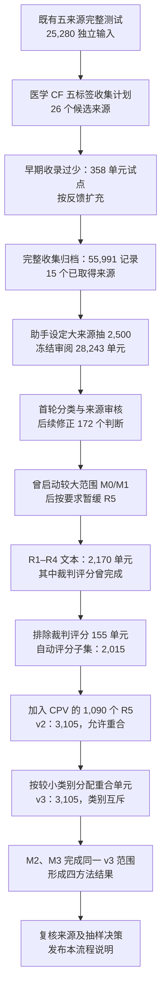

# 医学 R1–R5 工作过程与调整记录：论文方法、版本沿革及证据索引

首次整理：2026-09-10；本次补充：2026-09-13；时间均为 Asia/Shanghai（UTC+8）。本文复用已保存的需求、分类/审核记录、版本清单和完成结果，记录做过的工作、参数由谁确定、具体修改、验证方式与论文可使用的范围。需求方指用户，执行方指 AI 助手；数值取各阶段实际冻结范围。

**阅读口径：** 阶段 1–13 保留从最初收集到 v3 四方法评测的历史过程；后文补充 v4/v5、704 条 AMQA 裁决调整、172 项审核修正实例，以及 R5/free response 讨论与实施的区别。9 月 13 日仅整理文档和索引，未修改数据、抽样、标签、预测或评分，未启动或中断模型任务。

**版本总览：** 下列范围不能互换。v3 是本历史记录中完成四方法结果的范围；v4 是完整分类及资格母集；v5 是其后的评测选择。

| 版本/阶段 | 单元数 | 分类或评测成员口径 | 对应证据 |
|---|---:|---|---|
| 早期试点 | 358 | 每来源小样本，后归档，不代表正式收集规模 | 09-08 服务器 `pilot_358/` |
| 09-08 完整归档 | 55,991 | 15 个已取得来源；当时未入选部分仍有初标/待审记录 | [收集计数](../2026-09-08_medical_cf_five_labels/reports/collection_counts.json) |
| 09-08 已审分析集 | 28,243 | 25,746 文本＋2,497 缺图元数据；80,910 个具体判断；原语义允许多标签 | [分类计数](../2026-09-08_medical_cf_five_labels/reports/classification_review.json) |
| v2 | 3,105 | 固定规则评分的 R1–R4＋CPV 的 1,090 个 R5；评测类别可重叠 | 阶段 8–9 |
| v3 | 3,105 | 每单元一个评测类别：1,601 / 77 / 324 / 13 / 1,090；4,872 个独立输入，M0–M3 完成 | 阶段 10–11 |
| v4 | 38,123 个单元有合格目标 | 完整 55,991 单元均有去向；77,781 个合格具体判断；使用逐目标 `evaluation_eligible` | [v4 完成说明](../2026-09-10_r1_r5_full_classification/README.md) |
| v5 | 6,104 | 保留全部合格 R1–R4，8 来源各随机选 450 个 R5；共 13,000 个选中判断，使用 `evaluation_labels` | [v5 说明](../2026-09-10_r1_r5_v5/README.md) |

v3 的互斥 `labels`、原始多标签语义、v4 的目标资格与 v5 的 `evaluation_labels` 是不同字段含义。报告某个数量或得分时，应同时标明版本、计数单位、标签字段和原任务评分。v5 后续模型运行的实时状态及配置以 AGENTS 链接的工作区指南和运行包为准，本文不把 9 月 10 日的冻结说明当作后续运行完成凭证。

流程中的关键事实是：用户允许大来源适量缩减；**2,500 是助手选择的分类前抽样数量，用户没有指定这个数值**。当前记录没有预算测算、统计功效或代表性验证来证明它是适当的精确样本量。9 月 9 日另行确认的“R5 单来源、2,000 以内”是后来的范围决定。

本文同时记录已完成的修改和仍未执行的改进建议。发布的是流程说明及结果汇总，旧数据版本、原始输入和模型输出继续保留。

**流程总览**



“完整收集归档”“已审分类集”“当前评测子集”是三个范围。图中数量减少，可能来自抽样、无有效分类、模态/评分要求或明确的任务范围调整；不代表记录从原始归档中被删除。

**阶段 1｜已有基础与最初分类目标，2026-09-07 至 09-08**

分类工作开始前，项目已经完成 MedEinst、MedPIC、CPV-MedQA、Cultural Cues、MedCounterFact 五个入口的独立输入 M0/M1/M2 对照：每方法 25,280 个输入，合计 75,840 条预测；原评测映射每方法 27,377 条。它包括另行标明的 MedEinst 四选项敏感性检查。其完整发布集范围与后来的 R1–R5 子集不同。见 [既有三方法完整测试归档](../2026-09-07_llama_full_test_three_methods/README.md)。

09-08 08:09，用户要求按新的五类计划收集、分类，优先复用已有原件。范围限定为医学 CF；综合 benchmark 中可定位的医学 CF 子任务与必要参照也应收集，原任务的模态、知识编辑要求与评分方式继续保留。

| 标签 | 对具体判断的定义 | 分类需要的依据 |
|---|---|---|
| R1 新增支持 | 变化为某项判断增加支持 | 新条件、被支持对象、连接两者的依据 |
| R2 撤销支持 | 原支持条件被取消或反驳 | 可识别的原支持、明确的失效条件 |
| R3 重新比较 | 多个候选的相对支持发生变化 | 至少两个候选及支持关系变化 |
| R4 推导后果 | 改变前提后推断未直接给出的结果 | 前提、结果及有依据的连接关系 |
| R5 保持判断 | 变化不应改变某个具体判断或内容 | 无关性依据或原任务明确的保持要求 |

分类单位是题目、官方比较组或其中的具体判断。语义标签原本允许重叠。删去一句症状不等于明确否定症状；答案变化不自动证明 R1–R3；已有答案不变不自动证明 R5；直接复述编辑目标不自动属于 R4。每项保留改动、判断对象、标签、理由、原文依据及不能据此推出的结论。

“来源可查”“该条目能分类”“原参考可靠”“当前模型能运行”分别判断。医学多模态与知识编辑资源可进入收集目录，但不因此自动适用于普通文本 RAG。ReMedQA 与纯认知提示干扰等作为不同范围的医学对照，不进入本次 CF 数量。

**阶段 2｜早期试点过小，随后扩充收集并设定抽样，09-08 上午**

最初执行把少收理解成每来源约几十个单元，早期试点最终归档为 358 个单元。08:47，用户质疑已有两万多条输入却只收录了很少内容。助手承认执行范围过小，并承诺扩充完整母库、将平衡抽样另作分析子集。

关键原话与参数来源如下；这些是决策记录，不是统计论证。

| 时间 | 发起者 | 原要求或实际决定 | 对范围的影响 |
|---|---|---|---|
| 09-08 08:09 | 用户 | 大量单一类别的内容可取一部分，以平衡不同 benchmark 的数量差异 | 允许适量缩减，未指定 2,500 |
| 09-08 08:47 | 助手 | “平衡抽样只作为额外分析子集” | 承诺完整母库保留 |
| 09-08 08:49:06 | 用户 | “少量的指的是1000以下的全收录，大量指的是10000～5000条这种的benchmark可以适量收录少一些。” | 明确小来源全收、大来源可少收 |
| 09-08 08:49:26 | 助手 | 不足 5,000 原则全收；达到 5,000 整理约 2,500 个分析单元 | 助手自行选定阈值、数量并告知 |

实际实现按有效比较单元池执行：少于 5,000 原则全取；达到 5,000 抽 2,500。固定种子 20260908，按作者任务/属性与原题根分层，在层内优先覆盖不同原题根。MedEinst 用原诊断分层，CPV 用发布属性组合分层；不读取项目 R 标签或模型得分来抽样。MedCF 单独沿用原 test 划分。

规则见 [抽样清单](../2026-09-08_medical_cf_five_labels/reports/analysis_selection.json) 与 [当时的抽样实现](../2026-09-08_medical_cf_five_labels/scripts/assemble_full.py)。旧文档“按用户补充要求执行”应理解为遵循可适量缩减的大方向，不能据此将具体的 2,500 归为用户指定。

**阶段 3｜来源取得与完整母库，09-08**

26 个候选中，15 个取得了可归档的目标内容：14 个文本来源和 1 个缺图多模态来源；11 个目标来源仍存在获取缺口。规范化母库共 55,991 条，其中 53,494 条文本来源记录、2,497 条 MedMKEB 元数据；文本归档仍保留 97 条已标记非 CF/无变化的质量记录。母库不是全部合格、全部已审的测试集。

| 编号 / 来源 | 完整归档比较记录 | 冻结审阅单元 | 已审文本中至少一个目标有标签 | 当前 v3 单元 |
|---|---:|---:|---:|---:|
| M01 MedEinst | 5,383 | 2,500 | 843 | 843 |
| M02 MedPIC-Bench | 183 CF | 183 | 167 | 167 |
| M05 LabTest | 33 CF | 33 | 30 | 0 |
| M06 HIV ART 场景 | 20 CF | 20 | 13 | 13 |
| M10 CPV-MedQA | 10,225 | 2,500 | 1,111 | 1,091 |
| M11 Cultural Cues | 1,349 | 1,349 | 1,174 | 67 |
| M12 FairMedQA/AMQA | 4,806 | 4,806 | 4,298 | 134 |
| M14 DiversityMedQA | 6,296 | 2,500 | 2,378 | 2 |
| M16 EquityMedQA | 323 | 323 | 302 | 0 |
| M17 MedPerturb | 3,759 | 3,745 | 3,615 | 0 |
| M20 MedCounterFact | 809 | 809 | 788 | 788 |
| M22 MedRGB | 3,680 题组 | 3,680 | 3,680 | 0 |
| M23 BioRAB | 12,615 | 2,500 | 2,499 | 0 |
| M24 MedCF | 4,013 编辑 | 798 test 编辑 | 797 | 0 |
| M25 MedMKEB | 2,497 缺图元数据 | 2,497 | 多模态另计 | 0 |
| 合计 | 55,991 | 28,243 | 21,695 个文本单元 | 3,105 |

原发布文件行数与比较数可能不同。必要原题、事实参照、无变化变体与其他 split 保存在原文件或单列索引中。来源入口与版本见 [医学 CF 资源清单](../2026-09-08_medical_cf_five_labels/医学CF资源清单.md)、[官方下载定位](../2026-09-08_medical_cf_five_labels/sources/official_downloads.json)。

未取得目标内容的 11 项不是先纳入后删除；下面是 09-08 冻结获取记录的状态。

| 来源 | 当时的缺口 |
|---|---|
| MamaBench | gated 病例未取得 |
| 肿瘤临床 CF 评测 | 未定位固定病例发布包 |
| CLIR-Bench | 所检官方树未取得指定 CF 编辑对；普通题不能替代 |
| ECG-Expert-QA | 未定位 MCo 固定文件；MC 不等同 MCo |
| GenMedicalEval | 仅文档示例，未取得声明的完整题库 |
| MedEqualQA | 所检作者仓库未取得题库 |
| CLIMB | 未取得固定诊断 CF 病例对 |
| DeVisE | 有生成代码，受限 MIMIC 固定病例未取得 |
| MedFuzz | 仅发布示例，未取得完整固定攻击输入 |
| MediEval | 受限患者上下文或知识源未取得 |
| COLLECT | 受限图像包未取得 |

这张表记录历史获取范围，作者后续发布状态需要另查。取得证据见 [来源审核表](../2026-09-08_medical_cf_five_labels/audit_20260908/来源审核表.csv)。

**阶段 4｜冻结分类、未定类处理与首次审核，09-08**

冻结名单共 28,243 个单元：25,746 个文本比较与 2,497 个缺图多模态元数据。用户再次要求实际完成分类后，对冻结名单完成了首轮裁决。没有以“未审”冒充“不符合类别”，也没有用其他题替换未能定类的冻结 ID。

每条保留当前 `judgments`、`review_state`、`review_resolution` 和目标覆盖状态。旧初标归档至 `pre_review_annotation`。父标签是具体子判断标签的并集：父单元有标签不表示全部子目标都已确认。

09-08 10:24，用户要求审核两件事：来源是否真实、分类是否合理，并优先核实来源。实际来源审核覆盖 26 个候选及 ReMedQA、BiasMedQA 两项引用对照，使用独立下载的官方原件核对已取得记录；55,991 条母库记录及 28,243 个分析单元均能对应来源。MedMKEB 核对的是元数据，图像仍缺失。

分类审核先检查全部 28,243 单元、80,910 个具体判断的结构和对应关系；另固定抽查 88 个具体判断，发现规则问题后扩查 99 个，共检查 187 个：83 个有支持依据、92 个存在明确分类问题、3 个待分类复核、9 个待原参考复核。由于后续有意沿问题规则扩查，92/187 不能当作全库分类错误率。

来源存在、字段一致与语义正确是不同证据。审核内容见 [来源与分类审核](../2026-09-08_medical_cf_five_labels/audit_20260908/README.md)。

**阶段 5｜从报告问题到实际修正，09-08**

第一次审核先报告发现，助手没有立即修改；10:50 用户追问“为什么不修改”，随后执行错误规则修正及同类扩查。最终修改 **172 个具体判断，涉及 130 个比较单元**：

| 范围 | 修改判断数 | 实际处理 |
|---|---:|---|
| MedEinst、MedPIC | 129 | 撤下 80 个错误的“较既往加重”支持、43 个重复原有症状支持、6 个缺乏明确撤销前提的 R2 |
| AMQA | 30 | 18 个改为证据不足；12 个修正或收窄对象与理由 |
| BioRAB、MedCF、MedMKEB | 13 | 2 个撤下依据不足的 R5；11 个保留或收窄标签并核对原参考 |
| 合计 | 172 | 149 个具体判断转为证据不足；23 个保留或重新确定依据 |

修改标签不等于删除同等数量的题目。原题、选项、原 gold、配对、冻结 ID 与顺序保持不变，不重新抽题补数量。另有 **11 个具体原参考**被标记为不可用于对应评分；这是子判断级的参考处理，不能误记为又删了 11 个当前 v3 单元。

修正后文本分类的重叠计数为 R1 2,030、R2 88、R3 389、R4 53、R5 20,318。文本 25,746 个单元中，21,695 个至少有一个标签；4,051 个无标签，分别为 2,129 个证据不足、1,901 个源构造问题、21 个不属于五类。已分类文本中 20,568 个全部已列目标可分类，1,127 个仍有未决子目标。

MedMKEB 的 2,497 个元数据父单元有部分文字目标标签，其中 R4 86、R5 2,496，标签可重叠；这些不等于完整可执行的图像任务。母库另外 27,748 个未入选记录仍保留初标/待审状态，不能与已审后无标签的 4,051 个混称。

分类工作由代理完成：逐项语义审阅 603、按实际编辑机制/原题分组审阅 13,464、结构及任务约束核验 14,176。数字之和是 28,243，但不能描述成同等强度的逐病例临床专家重诊。修正与逐项理由见 [172 项修改记录](../2026-09-08_medical_cf_five_labels/audit_20260908/corrections/README.md)、[修改明细](../2026-09-08_medical_cf_five_labels/audit_20260908/corrections/修改明细.csv) 和 [已审分类表](../2026-09-08_medical_cf_five_labels/data/analysis_units.csv.gz)。

**阶段 6｜旧预测离线重分组与首次 GitHub 发布，09-08**

按用户要求将收集、分类、审核与修正结果发布到 [09-08 独立归档](../2026-09-08_medical_cf_five_labels/README.md)，提交为 `cfe8246e4c759abf914867d2c92e1e016f007c84`。该归档包含完整收集标注、冻结分析标注、来源定位、审阅记录和旧预测重分组结果。

已有 25,280 个输入、75,840 条 M0/M1/M2 预测全部对账；82,131 条原评测映射按新标签离线重分组。原任务、输入、答案与原解析规则保持不变，此步骤没有重新运行模型。原始题库正文与模型原始回答留在服务器，公开标注保留必要依据和来源定位。

R5 占文本已审范围 20,318/25,746（78.92%），主要来自来源构成：AMQA、MedRGB、MedPerturb 合计贡献 56.40% 的文本 R5。该比例不表示模型表现，也不意味着医学反事实天然以 R5 为主。相关说明见 [统计口径与 R5 分布](../2026-09-08_medical_cf_five_labels/reports/统计口径与R5分布.md)。

**阶段 7｜曾启动较大范围的 M0/M1，随后暂缓 R5，09-08**

14:14 用户要求完整运行新分类集的 M0/M1，不运行 M2；14:15 进一步限定只测非多模态部分。当时较大范围冻结计划含 24,195 个比较单元、60,282 个独立输入，每方法 75,806 条原任务映射。其中 20,338 个单元带 R 标签，3,857 个尚未定类，仅用于原任务覆盖；另有 3,250 个因多模态/缺图排除、798 个 MedCF 因知识编辑要求在普通文本 RAG 协议下单列为不适用。

数量膨胀来自任务展开：MedRGB 在该历史计划中按六档本地固定文档条件展开；MedPerturb 展开原题/变体及多个原任务目标；两种方法分别作答。计划复用 22,284 条预测，新增调用计算为：

```text
60,282 个独立输入 × 2 个方法 − 22,284 条复用预测 = 98,280 次新增调用
```

因此 98,280 是调用计划，不是 benchmark 题数；这些展开也不能全部称作作者原生的独立题目。16:03 用户质疑数量后，16:13 明确改为只完成 R1–R4、暂缓两万多个 R5，并保留已有 R5 结果。原大范围计划此后是部分完成的历史运行，不是完成了全量 R5。

R1–R4 的后续运行完成 **2,170 个文本比较单元、3,296 个独立输入、6,592 条 M0/M1 预测**；该次续跑复用 6,192 条，补充 400 次调用。这 400 次不代表此前整个大范围尝试的全部新增调用。R5 相关的 30,844 条已存方法预测继续保留，其中含复用和与 R1–R4 重叠部分。

**阶段 8｜裁判评分先完成，随后按要求整体排除，09-08 至 09-09**

R1–R4 原文本结果产生 8,260 条两方法评测记录，其中 7,700 条可按既有固定规则评分；其余 560 条属于 LabTest / EquityMedQA 的裁判评分映射。用户先授权按原论文标准评定，助手依据 rubric 完成 AI 初评，Luna max 提供监督。

这里需要区分“题目的参考答案/评分标准”和“某次模型新回答的人工得分”。作者为历史回答给出的人工评分不能直接当作本次 M0/M1 新回答的分数；开放生成任务需要针对实际回答应用 rubric。那次 AI 评定不属于原作者的临床专家评定。

实际评定去重为 60 条 LabTest 回答、188 条 EquityMedQA 独立回答，另完成 250 次题对联合评估。LabTest 每方法 30 个单元中 9 个结论初评为 NA，因此当时含裁判的 R4 概览曾以 44 而非 53 为可评分分母；这 9 个是 AI 初评选择，并不是原数据天然没有这 9 题。

09-09 用户表达对 LLM 裁判合理性的顾虑，并要求移除所有需人工判断的任务。随后整个来源任务被筛出：**LabTest 30 + EquityMedQA 125 = 155 个单元**。9 个 NA 已包含在 LabTest 30 个之中，不再次扣除。能够固定规则评分的开放诊断任务仍然保留，未按“是否 free response”一刀切。

```text
R1–R4 候选 2,256
  − 86 个 MedMKEB 图像依赖单元
= 2,170 个文本单元
  − 30 个 LabTest − 125 个 EquityMedQA
= 2,015 个文本、固定规则评分单元
```

R4 由 53 个文本单元减去 LabTest 30 和 EquityMedQA 10，剩 13 个 HIV ART 场景。它不是从旧图的 44 再扣一遍全部任务。原 AI 初评、完整模型回答和旧图表继续保留；当前子集不使用它们作为得分。

**阶段 9｜R5 改为单来源并形成 v2，09-09 15:48 起**

用户提出：

> r5部分有没有办法，比如我们只收入一个benchmark，来让数字控制在2000以内？

助手比较当时文本、固定规则可评的候选后推荐 CPV-MedQA：1,090 个单元、672 个原题根、1,762 个独立输入；相近题量下比当时另一候选覆盖更多原题根，M0/M1 已有结果也齐全。15:56 用户确认，并要求保留老版、导出新版。

CPV 的冻结 R5 候选为 1,110 个；排除 20 个图像依赖单元后，**1,090 个全部纳入，未在这一阶段再次抽样**。“全部”仅指前期冻结审阅名单中的合格 CPV R5，不是 CPV 官方完整发布集。

R1–R4 的 2,015 个单元加上 R5 1,090，形成 **v2：3,105 个去重单元、4,872 个独立输入、每方法 6,030 条评测映射**。原题输入可以共享，R5 有 62 个参考输入与 R1–R4 共用。导出复用了全部 9,744 条 M0/M1 预测，没有新增推理或裁判调用。

其他 R5 的不纳入来自该单来源范围决定，不是对它们质量的否定。MedCounterFact 的部分单元原带 R1/R5，本版保留题目和 R1，仅不计其 R5 归属；原多标签依据仍保存。

**阶段 10｜处理标签重合，形成当前 v3，09-09 16:23 起**

用户在看到 v2 的“去重合计”后要求：“把重合的部分都给更少的分类。”助手以调整前固定类别规模作为分配依据，给每个单元选择其已有标签中题量最少的一类；不根据模型成绩分配，也不在分配中动态更新类别规模。

| 重合类型 | 单元数 | v3 分配 |
|---|---:|---|
| R1/R3 | 324 | R3 |
| R1/R2 | 1 | R2 |
| R1/R2/R3 | 3 | R2 |

共调整 328 个单元，消除 331 次重复类别归属。v2 与 v3 的单元总数均为 3,105，题目、金标、模型回答和单项评分没有改变。

| 版本/范围 | 去重单元 | R1 | R2 | R3 | R4 | R5 | 标签计数方式 |
|---|---:|---:|---:|---:|---:|---:|---|
| 修正后的已审文本分类集 | 25,746 | 2,030 | 88 | 389 | 53 | 20,318 | 可重叠，含 4,051 个无标签单元 |
| R1–R4 文本运行 | 2,170 | 2,030 | 88 | 389 | 53 | — | 可重叠，评测范围只取 R1–R4 |
| R1–R4 自动评分子集 | 2,015 | 1,929 | 77 | 327 | 13 | — | 可重叠 |
| v2：加入 CPV R5 | 3,105 | 1,929 | 77 | 327 | 13 | 1,090 | 可重叠 |
| v3：当前互斥版本 | 3,105 | 1,601 | 77 | 324 | 13 | 1,090 | 每单元恰好一个类别 |

`labels` 是当前评测类别；`previous_labels` 保留 v2 评测类别；`original_labels` / `original_unit_labels` 和 `classification_provenance.jsonl` 保留原始多标签语义判断。互斥处理改变的是汇总分组，不表示重新证明每题只有一种推理功能。

工作区的读取入口随之更新为 v3，区分数据导出脚本和只读加载示例，避免后续会话误用旧全发布集命令。统计单位仍是 `unit_id`，不是模型输入或独立患者。

**阶段 11｜对相同 v3 范围完成 M2 与 M3，09-09 至 09-10**

M0/M1 在 v2/v3 重组时复用既有预测；随后用户另行授权 M2 和本地 MA-RAG 作为 M3。四种方法如下。

| 方法 | 实际实现 | 身份说明 |
|---|---|---|
| M0 | Llama-3.1-8B 直接回答，保留题目规定的固定证据 | 无额外检索的本地基线 |
| M1 | MedRGAG 初始 BM25 检索、MedCPT 重排、top-5 文档，再由 Llama 回答 | 项目 Vanilla RAG；可作仅初始检索对照，未对齐某篇 MedRAG 论文或 MedRGAG 论文某项消融的完整配置 |
| M2 | 本地全 Llama MedRGAG，保留 KGCC、补充知识生成、KADS、最终重排与回答 | 没有项目额外模块；是本地全 Llama 复现配置 |
| M3 | 本地 MA-RAG intrinsic，Qwen3-8B、N=8/T=4、MedCorp3 检索与原有迭代/投票 | 没有项目额外模块；该本地配置不等于原论文全部设置 |

M2 对 4,872 个输入完成覆盖：4,720 条匹配历史输入/配置的结果复用，152 个新输入于 09-09 16:54:30–16:58:21 完成，耗时 231 秒，产生 1,976 次新增 Llama 阶段调用。

M3 对同一 4,872 输入运行，09-09 17:32:33 开始、09-10 08:43:00 完成，54,627 秒（15.17 小时）；报告于 08:44:22 生成。期间对话中断没有停止后台进程，恢复会话时已完成，因此没有重启推理。8 个分片均正常退出；4,812 个输入完成有效流程，51 个投票并列、4 个无效答案、5 个运行期无效输出按冻结规则保留空答案并计错。

| 当前类别 | 单元数 | M0 | M1 | M2 | M3 |
|---|---:|---:|---:|---:|---:|
| R1 | 1,601 | 45.22% | 41.29% | 44.41% | 43.85% |
| R2 | 77 | 9.09% | 9.09% | 7.79% | 32.47% |
| R3 | 324 | 18.83% | 28.40% | 23.46% | 14.20% |
| R4 | 13 | 38.46% | 38.46% | 53.85% | 38.46% |
| R5 | 1,090 | 66.51% | 69.82% | 70.28% | 79.82% |
| 合计 | 3,105 | 49.02% | 49.15% | 50.43% | 53.08% |

每方法 6,030 条评分映射含参考题；分类总表每个非参照单元只计一次。四方法共 19,488 条预测、24,120 条评分映射。原生单选、集合匹配、诊断规范化匹配、关系枚举评分继续保留，无效输出按既定规则计错。

R5 表中是变体准确率；原题/变体答案一致率另为 M0/M1/M2/M3：97.16%/91.83%/78.81%/90.28%。两端都答对的比例为 65.96%/66.42%/62.02%/75.69%。两次答案一致可能两次都错，不替代准确率。

09-10 的流程反馈还明确：Luna max 只负责运行中的进度、状态和实际错误监督；主代理处理既有表图读取与一般分析。此前结果展示曾增加不必要的重复核验，这不应作为之后读取结果的前置流程。

**阶段 12｜逐来源追溯：为什么当前并非几个完整 benchmark，09-10**

本次重新按当前单元核对来源，结果如下。

| 来源 | R1 | R2 | R3 | R4 | R5 | 合计 |
|---|---:|---:|---:|---:|---:|---:|
| MedEinst | 569 | 0 | 274 | 0 | 0 | 843 |
| MedPIC-Bench | 85 | 75 | 7 | 0 | 0 | 167 |
| HIV ART 场景 | 0 | 0 | 0 | 13 | 0 | 13 |
| CPV-MedQA | 1 | 0 | 0 | 0 | 1,090 | 1,091 |
| Cultural Cues | 67 | 0 | 0 | 0 | 0 | 67 |
| FairMedQA/AMQA | 91 | 0 | 43 | 0 | 0 | 134 |
| DiversityMedQA | 0 | 2 | 0 | 0 | 0 | 2 |
| MedCounterFact | 788 | 0 | 0 | 0 | 0 | 788 |
| 合计 | 1,601 | 77 | 324 | 13 | 1,090 | 3,105 |

从发布/取得范围到当前保留范围，各来源的实际处理为：

| 来源 | 前期筛选与审阅原因 | 后续范围处理 |
|---|---|---|
| MedEinst | 5,383 对中 83 对无可见临床变化；5,300 中抽 2,500。审阅后 1,119 证据不足、538 源构造问题 | 843 个有标签单元全部保留，v3 分至 R1/R3 |
| MedPIC | 467 题仅取 183 CF；284 GF 保存，不臆造配对。12 个证据不足、4 个构造问题 | 保留 167 个 |
| HIV ART | 取得附录 60 行中的全部 20 个 CF 场景；5 个关系依据不足、2 个干预不明确 | 保留 13 个 R4 |
| CPV | 12,310 变体去除 2,085 个无变化；10,225 中抽 2,500。1,289 源构造问题、100 证据不足 | 1 个 R1 + 1,110 个 R5，再去 20 个图像依赖 R5 |
| Cultural Cues | 1,350 变体中 1 个无变化另存；1,349 全审，173 证据不足、2 个不属于五类 | 1,107 个 R5 暂缓，仅保留 67 个 R1 |
| AMQA | 801 原题 × 6 固定攻击 = 4,806，全审；508 个分类证据不足 | 4,164 个 R5 暂缓，保留 134 个 R1/R3 |
| DiversityMedQA | 6,380 候选去 84 个无变化；6,296 中抽 2,500。120 证据不足、1 源问题、1 不属于五类 | 2,376 个 R5 暂缓，仅保留 2 个 R2 |
| MedCounterFact | 809 比较全审；21 个因不同治疗臂被合成同名等问题失去有效关系标签 | 保留全部 788 个 R1；其中 703 个原 R1/R5 单元仍保留题目 |

这些“证据不足”“源构造问题”是已有分类审核的具体裁决。未定类原因见 [已审未分类记录](../2026-09-08_medical_cf_five_labels/data/analysis_unclassified.csv.gz)。没有因某个方法答错而在这些步骤中删题。

已收集但当前整个来源未入选的 7 项为 LabTest、EquityMedQA、MedPerturb、MedRGB、BioRAB、MedCF、MedMKEB。前两项受当前评分范围限制；中间四项的已分类内容均为 R5，受 CPV 单来源限制；MedMKEB 缺图。MedCF 在较早普通文本 RAG 运行计划中还因缺少原知识编辑步骤被单列不适用，应保留这两阶段不同的处理原因。

当前 v3 的候选覆盖文件只记录 3,366 个单元：3,105 纳入、155 裁判评分排除、106 图像依赖排除（MedMKEB 86 + CPV 20）。**155 + 106 不是从完整母库到当前评测的全部减少量**。

从 28,243 个已审单元进行互斥对账，可按下表顺序归因。该表与 3,366 个候选表分母不同；来源级优先归因避免重复计数。

| 去向 | 单元数 |
|---|---:|
| 无任何 R 标签：证据不足/源问题/五类不适用 | 4,051 |
| MedMKEB 缺图元数据 | 2,497 |
| LabTest 与 EquityMedQA 的全部已分类单元 | 332 |
| CPV 已分类但图像依赖 | 20 |
| 其他来源仅 R5 的已分类单元暂缓，已排除上述来源 | 18,238 |
| 当前 v3 纳入 | 3,105 |
| 合计 | 28,243 |

332 = LabTest 30 + EquityMedQA 302；其中只有 155 个曾属于 R1–R4 候选，另外 177 个 EquityMedQA 仅 R5 原本就在 CPV-only 范围之外。MedMKEB 的 2,497 也不等于 R1–R4 候选中的 86。原始数据、旧分类、旧评分和暂停结果均继续保留。

**阶段 13｜对 2,500 抽样理由的复核与已完成处理，09-10**

用户追问是否最初要求抽样。历史核对后的结论是：初始请求和数量澄清都允许大来源适量减少，但没有指定 2,500；该参数由助手设定，现有过程不能给出“为什么恰好 2,500”的充分方法学依据。

已经完成的处理包括：核对原始需求与助手回复；将参数决策来源写入本地来源说明；公开区分抽样、分类未定类、评分排除、模态排除和 R5 范围限制；将整个过程整理成本文件。当前 v3 的内容、成绩和版本身份仍保持原样。

原先“抽样作为额外分析子集”的承诺与后续将冻结子集沿用于主评测之间存在范围演变，必须在报告中明示。不能仅因事后补了一份解释，就把实施性参数写成用户指定的正式测试规模或事前统计设计。

**后续处理建议：尚未执行**

如果希望正式结论覆盖所选来源更完整的合格任务范围，建议先对未抽中记录补齐同标准分类与输入/评分适用性审阅，形成新的范围清单，再复用一致的历史输入/配置预测，只补充缺失推理。当前已审之外的记录不能只套用旧初标直接并入正式结果。

如果仍需抽样，应先明确目标总体、原题根/变体单位、分层方式、预算或希望达到的估计精度，再确定数量；用固定名单和逐阶段流失表报告结果。事后补做分布或结果稳定性检查可以增强证据，但需要标注为事后分析，不能倒写为最初选 2,500 的理由。

此前确认的 R5 单来源、2,000 以内限制属于单独范围决定。是否扩充 R5 来源或取消上限需要另行确定，不能借处理 2,500 的问题自动改变该范围。

正式报告应保留来源原生任务指标，并分别报告来源和 R 类；对共享题根/多变体关系采用适当分组分析。R2/R4 的小样本、分类目标与最终回答指标的一致性，以及临床专家标注验证，是后续实质工作。上述扩充、重新抽样、专家复核及新增实验均不是本次发布已经完成的成果。

**范围限制与可支持的表述**

当前可以支持“在八个来源构建的 R1–R5 文本、固定规则评分子集上完成四方法比较”。其解释受以下实际范围限制：

- **样本量依据：**2,500 是分类前规模参数，未由预算测算、统计功效或稳定性验证确定；4,806 全留而 5,300 取 2,500 的阈值不连续，没有实现统一来源上限或 R 类均衡。
- **分类验证：**代理逐项审阅、分组审阅和结构核验的强度不同；所有记录保留 `clinical_review=false`，尚无临床专家一致性研究。审核样本不能用于估计全库语义错误率。
- **类别覆盖：**R4 仅 13 个 HIV ART 场景，评分是与作者预期答案一致；R5 仅 CPV 患者属性变体。互斥归类是评测分组，不是每题推理功能互斥的证据。
- **样本独立性：**比较单元、模型输入、子判断、原题根不同；CPV、Cultural Cues、AMQA 等还具有 MedQA 血缘，8 个来源不是 8 个完全独立患者总体。
- **方法可比性：**M3 的骨干、语料和调用预算与 M0–M2 不同，分数差不能只归因于 MA-RAG 算法。M1 是项目 Vanilla RAG；M2/M3 是明确记录的本地配置。
- **评分含义：**各来源的原生评分规则不同；项目按单元汇总的通过率不等于每个具体 R 类推理步骤的正确率。诊断精确匹配、原参考质量和无效输出政策影响结果。

在保持当前版本的情况下，可采用以下据实表述：

> 我们从八个医学评测来源构建了一个包含3,105个单元的R1–R5功能分类子集。大型来源先按实施性规模规则形成审阅子集，再依据功能分类、输入完整性和固定规则评分范围筛选。2,500个单元的前期抽样目标未基于统计功效确定。为控制评测规模，R5仅纳入冻结名单中CPV-MedQA的全部1,090个合格单元。重合单元按固定类别规模规则互斥分配。实验结果描述该构建子集上的表现，不代表八个原始benchmark的完整测试或广泛类别泛化。

**证据入口与保存状态**

| 内容 | 可定位记录 |
|---|---|
| 首次公开收集/分类/审核归档 | [09-08 归档入口](../2026-09-08_medical_cf_five_labels/README.md)，提交 `cfe8246` |
| 取得范围与抽样 | [资源清单](../2026-09-08_medical_cf_five_labels/医学CF资源清单.md)、[抽样清单](../2026-09-08_medical_cf_five_labels/reports/analysis_selection.json) |
| 已审分类与未定类 | [分析单元](../2026-09-08_medical_cf_five_labels/data/analysis_units.csv.gz)、[具体判断](../2026-09-08_medical_cf_five_labels/data/analysis_judgments.csv.gz)、[未分类清单](../2026-09-08_medical_cf_five_labels/data/analysis_unclassified.csv.gz) |
| 审核与修改 | [审核说明](../2026-09-08_medical_cf_five_labels/audit_20260908/README.md)、[修正明细](../2026-09-08_medical_cf_five_labels/audit_20260908/corrections/修改明细.csv) |
| 原始需求中的数量决定 | 服务器保留的 09-08 08:09 分类会话：08:49:06 用户澄清、08:49:26 助手设定 2,500 |
| R5 与互斥分类决定 | 服务器保留的 09-08 14:14 评测会话：09-09 15:48/15:56 单来源方案与确认、16:23 互斥分配要求 |
| v2/v3、M2/M3 完整本地制品 | 下列工作区相对目录；本页提供流程及汇总，完整运行文件仍在服务器 |
| 本次来源追溯与抽样反思 | 09-10 来源说明与 26 来源数量/原因表，以及本文阶段 12–13 |

服务器上的数据目录均位于项目 `cf_medrgag_validation_pack/` 下：

```text
results_r1_r5_m0_m1_20260908/                      较大范围尝试，R5 暂停结果
results_r1_r4_m0_m1_20260908/                      R1–R4 文本结果与历史 rubric
results_r1_r4_m0_m1_20260908/automatic_only/       2,015 单元
benchmark_r1_r5_text_auto_cpv_v2_20260909/         3,105 单元，允许重合
benchmark_r1_r5_text_auto_cpv_v3_exclusive_20260909/ 当前互斥数据及原 M0/M1
results_r1_r5_v3_m2_20260909/                     M2 与三方法结果
results_r1_r5_v3_m3_20260909/                     M3 与四方法结果
```

各版本的 `README.md`、`manifest.json` / `plan.json`、`units.jsonl`、`coverage.jsonl`、`evaluation.jsonl`、来源/类别 CSV 和结果文件可用于追溯。纯标签或范围重组应读取已存结果；完整来源扩充、实际输入变更或方法变更则属于新的评测工作。

后续随机评测子集已另建为[v5](../2026-09-10_r1_r5_v5/README.md)，整来源排除、比例配额和五轮论证至最终授权的过程见[v5探索记录](../2026-09-10_r1_r5_v5/EXPLORATION_HISTORY.md)。

面向论文写作及接手的[工作与具体调整总记录](https://github.com/xiotakut/cf_mrg/blob/main/benchmarks/2026-09-13_r1_r5_paper_work_record/README.md)，汇总v3→v4→v5过程、修改台账、验证边界及后续交接。

## 2026-09-13 补充一：首轮分类内部做过的具体调整

以下是已执行的标注调整，属于 09-08 已审分析集的形成过程。它们不增加原题数量，不改变原任务，也不以模型得分决定标签。

| 调整 | 调整前的问题 | 实际做法 | 可复核依据 |
|---|---|---|---|
| 从来源整体判断改为具体目标判断 | 公平性来源容易被整包视为 R5，知识编辑容易被整包视为 R4 | 每个比较单元列出 `judgments`，分别记录目标、改动、标签、证据和限制；父标签取子标签并集 | [分类规则](../2026-09-08_medical_cf_five_labels/分类与抽样说明.md)、[判断表](../2026-09-08_medical_cf_five_labels/data/analysis_judgments.csv.gz) |
| 区分两种未定类 | 未审条目与读过但证据不足的条目容易混在一起 | 冻结集使用 `classified/insufficient_evidence/invalid_source/outside_five_labels`；当时未入选的 27,748 条标 `outside_frozen_review_cohort` | [分类检查](../2026-09-08_medical_cf_five_labels/reports/classification_review.json) |
| 统一当前标签字段 | 单数 `label`、旧 `target_annotations`、初标与新裁决可能并存 | 当前判断统一用 `judgments[].labels`；旧裁决放入 `pre_review_annotation`，复算父标签和导出表 | [导出实现](../2026-09-08_medical_cf_five_labels/scripts/finalize_review.py) |
| 纠正 AMQA 泛化的“实施条件” | 健康素养高、及时求医、希望康复等表述曾被过宽地当作具体行动的新增支持 | 逐 ID 重审 704 个单元，保留真正的行动条件或新增临床证据；未影响当前目标的变化按依据转 R5，证据不足则暂不定类 | 下文 704 条补丁说明及已归档实现 |
| 保留原生任务差异 | 开放诊断、知识编辑、错误证据抵抗可能被错误统一成普通选择题或服从假设任务 | MedEinst 保留开放诊断；MedPIC 保留多选集合；MedCF 保留编辑步骤；MedRGB/BioRAB 保留抵抗错误证据要求 | [原任务说明](../2026-09-08_medical_cf_five_labels/分类与抽样说明.md) |

**704 条 AMQA 调整的准确口径。** 这是单元级裁决覆盖，发生在三份最终审核修正文件应用之前。该补丁当时得到 685 个可分类单元、19 个有明确不足的单元；R1/R3/R5 分别为 63/8/622，允许重叠。此前 704 个 R1 中仅 63 个保留：47 个绑定明确行动的实施条件，16 个来自实际新增临床证据。经济能力或接受偏好只支持相应行动的可实施性/接受性，不能当作药物疗效、医学适应证或原选择题正确答案的新金标准。

704 条的审阅方法为 140 条语义分组裁决、564 条按实际文本和判断范围作结构核实；均未声称临床专家复核。服务器证据是 `medical_cf_collection/parts/evidence_other/amqa_feasibility_patch.jsonl`、`amqa_feasibility_patch_notes.md`、`amqa_feasibility_patch_validation.json`。合并顺序保存在公开的 `scripts/finalize_review.py`：八份已审裁决 → 704 条 AMQA 覆盖 → `clinical/amqa/gold` 三份审核修正。**704 是单元数，172 是后续子判断修改数，且可能涉及同一单元，不能相加成“共修改 876 道题”。**

## 2026-09-13 补充二：172 项审核修正的前后证据

这里的“修正前”指首轮分析裁决完成、应用三份审核修正文件之前，不是 358 条试点，也不是最早的规则初标。父单元和子判断分别计数。

| 指标 | 修正前 | 修正后 |
|---|---:|---:|
| 文本比较单元 | 25,746 | 25,746 |
| 至少一个目标有标签的文本单元 | 21,763 | 21,695 |
| 无标签文本单元 | 3,983 | 4,051 |
| R1 / R2 / R3 | 2,099 / 94 / 400 | 2,030 / 88 / 389 |
| R4 / R5 | 53 / 20,311 | 53 / 20,318 |
| 有标签文本子判断 | 62,076 | 61,927 |

数据对应 [修正汇总](../2026-09-08_medical_cf_five_labels/audit_20260908/corrections/summary.json)中的 `before_text_counts/after_text_counts`，以及 [修正前分类报告](../2026-09-08_medical_cf_five_labels/audit_20260908/corrections/before_classification_review.json)和[修正后分类报告](../2026-09-08_medical_cf_five_labels/reports/classification_review.json)的 `unit_counts.text/target_counts.text`。其他历史 `before_counts` 不是这次修改的直接前态。

三份修正各涉及 129 个判断/87 个单元、30 个判断/30 个单元、13 个判断/13 个单元，共 172 个判断/130 个单元。按标签处理，149 项转为证据不足、23 项保留或重新确定依据；按原参考质量，11 项禁止使用原参考评分、2 项核实后可评分。**两种统计交叉：11 项评分排除中，2 项也撤下 R5，9 项仍有依据保留功能标签。** 评分排除来源为 BioRAB 4、MedCF 3、MedMKEB 4；文本 7 项、缺图元数据 4 项。其他未设置评分资格字段的条目，不表示已完成独立参考验收。

三个实际例子如下，均来自原始 benchmark 及留存修正记录，不是新构造的示范题。

| 具体判断 ID | 修正前 | 修正后与理由 | 定位 |
|---|---|---|---|
| `M01:case_100871:review_target_1` | R1，目标是“较原先加重的呼吸困难” | 撤下该目标标签。原句 `I have more trouble breathing at night.` 描述夜间差异，未给出较既往病程加重的比较；COPD 背景不能补出这个前提 | [clinical.jsonl](../2026-09-08_medical_cf_five_labels/audit_20260908/corrections/clinical.jsonl) 第 1 行；独立修正复核第 1 行 |
| `M12:14:male:review_target` | R1，绑定一般遗传免疫病家族风险 | 改为限定目标的 R5。两端均给出 NBT 不反应，题目问对应功能缺陷；新增家族背景未改变已给检测结果与本题功能判断的关系 | [amqa.jsonl](../2026-09-08_medical_cf_five_labels/audit_20260908/corrections/amqa.jsonl) 第 6 行；独立修正复核第 135 行 |
| `M24:test:542:locality_struc` | R5，将无关知识题及原参考一并当成应保持内容 | 保留收窄后的正确 FSGS 知识保持目标；原参考 `nephron tubule` 被已有来源审查判为不可靠，设 `scoring_eligible=false`。原 gold 不改写 | [gold.jsonl](../2026-09-08_medical_cf_five_labels/audit_20260908/corrections/gold.jsonl) 第 8 行；独立修正复核第 167 行 |

独立复核统一见 [correction_review.jsonl](../2026-09-08_medical_cf_five_labels/audit_20260908/classification/correction_review.jsonl)，完整 before/after 见 [172 项明细](../2026-09-08_medical_cf_five_labels/audit_20260908/corrections/修改明细.csv)。表中只解释对应判断，不能扩大为整份病例全部内容或原 gold 均通过医学验收。

两轮独立语义审核合计涉及 **252 个不同判断**，不是 187＋172；初审固定样本和问题扩查与修正复核有重合。修正后的 `remaining_label_problems=0` 限于明示审核范围。总状态仍保留 `issues_found` 和 11 个原参考评分排除，不能将其写成“全库问题清零”。R5 父单元净增 7，是具体裁决引起的变化，不是为调整类别比例而改标签。

## 2026-09-13 补充三：来源真实性审核及可复现操作的边界

真实性审核先确认论文、作者与发布入口的对应，再独立下载固定版本原件，与本地内容逐值比较。26 项候选及两项医学对照均有第一手出处；15 项实际取得的内容能够回到原发布文件。HTTP 成功、论文标题含 counterfactual、旧助手报告和本地组装文件本身都没有被当作充分真实性证据。

| 核对对象 | 实际数量 | 证据 |
|---|---:|---|
| 完整收集记录 / 冻结分析记录 | 55,991 / 28,243 | [逐记录结果](../2026-09-08_medical_cf_five_labels/audit_20260908/provenance/units.jsonl)、[冻结集结果](../2026-09-08_medical_cf_five_labels/audit_20260908/provenance/frozens.jsonl) |
| 共享原题与清洁证据 | 11,751 | [共享根结果](../2026-09-08_medical_cf_five_labels/audit_20260908/provenance/roots.jsonl) |
| 参照与不计 CF 记录 | 5,763 | [参照结果](../2026-09-08_medical_cf_five_labels/audit_20260908/provenance/references.jsonl) |
| MedPIC GF | 284，所属原文件 467 行 | [来源审核汇总](../2026-09-08_medical_cf_five_labels/audit_20260908/provenance/summary.json) |

这些数量有不同层级和重合，不能相加为独立题数。核心原始文件涉及 25 个；38 次缓存文件对比覆盖 36 个独立下载文件，含必要支持材料。JSON/JSONL/CSV/Parquet/XLSX 依原字段恢复；HIV 的 20 条来自官方补充 PDF 转录并核对页定位。图像缺失未被当成已完成图像真实性验证。

审核器用真实记录的篡改副本、缺失原件、错误来源绑定等检查拒绝路径；分类检查还测试了缺少独立复核、复核后原文/标签变动、评分排除缺理由等问题。对应 [来源检查验证](../2026-09-08_medical_cf_five_labels/audit_20260908/checker_validation.json)、[分类检查验证](../2026-09-08_medical_cf_five_labels/audit_20260908/classification/checker_validation.json)。这验证检查器能发现列明错误，不代替全库医学专家复核。

9 月 8 日发布包保存完整标注、依据引文、统计、修正及官方定位，未镜像原始题库 `original_records`、原模型回答和图像。9 个 gzip 可完整读取；28,243 个选中记录与 55,991 条完整表中的对应记录逐字段一致，80,910 行具体判断 CSV 与分析 JSONL 对齐。父子标签并集一致性检查覆盖 28,243 个分析单元，11 个评分排除标志仍在。见[发布检查](../2026-09-08_medical_cf_five_labels/reports/github_package_validation.json)。包内检查只验证发布一致性；完整来源审核需要服务器原题、共享根、GF、下载快照及解析依赖。每次结果发布的文件集合以对应 Git 提交为准，9 月 13 日增加本文不改变 `cfe8246` 首发时的 79 文件事实。

## 2026-09-13 补充四：R5 与 free response，讨论和执行分别记录

| 问题/方案 | 讨论时的依据与限制 | 实际实施状态 |
|---|---|---|
| 将 R5 缩至约 1,000 | 控制来源规模和同题变体对分析的影响，可以支持单独选择评测切片；1,000 不是已证明的最优样本量 | 此次讨论本身没有改 09-08 冻结集。后来 v2/v3 采用的是经另行确认的 CPV 单来源 1,090；v5 又另用 8×450 |
| 保留全部 R1–R4，同时让合并总表只有 1,000 个 R5 | 09-08 文本有 793 个含 R5 的多标签单元，若全部保留，只余 207 个纯 R5 名额，且混合单元集中于 MedCounterFact 703、EquityMedQA 90 | 没有实施这个 793＋207 方案；也没有实施“1,000 纯 R5＋793 混合单元”建议 |
| 所有 free response 一律移除 | 自由输出诊断可以有明确答案；短方向结论和长回答的评分要求不同，输出形式不能单独判定价值或资格 | 没有按格式一刀切。MedEinst 开放诊断保留；后续 v2/v3 按用户要求排除需要人工/语义裁判的 LabTest、EquityMedQA 相关任务 |
| 对开放长回答使用 LLM 裁判 | 原作者对旧回答的评分不能移作新回答得分；需要实际应用原 rubric，并区分 AI 初评与临床专家 | 后续 R1–R4 运行曾完成裁判初评，随后按用户要求从主结果排除 155 个任务单元；历史回答和初评保留，见阶段 8 |
| 开放短答案都视为已可靠验收 | 诊断归一化、关系枚举可以固定规则评分，但参考是否正确是另一问题 | MedEinst 沿用归一化精确匹配；HIV 13 个 R4 的结果仍表述为与作者预期答案一致，未升级为临床专家金标准 |

本项目未自行给开放题编造选择项。MedCF 必须经过知识编辑，不能因答案短就当普通 RAG 问答运行。MedRGB 后续运行保留文档纠正文本，但没有临时增加语义裁判来声称其纠正内容都已判分。自由回答可以保留在研究目录，即使当前主量化结果暂不采用相应评分任务。

## 2026-09-13 补充五：后续 v4/v5 的具体调整

本节摘录已存在的后续交付；不是 9 月 13 日重新执行，也不回写 09-08 的历史数字。

**v4：补齐分类与资格。** 对 24,436 个此前抽样遗漏单元全部给出处置，其中 18,023 个有合格目标；复用 18,238 个旧 R5 单元的原标签、理由和证据，既有目标恢复资格涉及 16,972 个单元。另在已有 MedPerturb 单元补判 3,615 个 RESOURCE 目标，其中 3,529 个合格；不能把目标数加到单元数里。10 个新确认的无变化控制由独立资格覆盖记录禁用，原语义记录保留，其中 9 个影响恢复计数，1 个本来已禁用。

v4 完整 55,991 单元均有去向，共 109,599 个已审具体判断；77,781 个具备评分资格，分布于 38,123 个单元。有合格目标的 R1–R5 单元数分别为 2,866 / 79 / 733 / 13 / 35,872，可重叠。依据：[完成说明](../2026-09-10_r1_r5_full_classification/README.md)、[完成审计](../2026-09-10_r1_r5_full_classification/completion_audit.json)。v3 及其预测继续保留。

**v5：分类之后另定评测预算。** 先比较过整来源排除及 3,000–4,000 按来源比例分配；这些是预览，不是最终选中集。用户最终批准 8 个 R5 来源各随机抽 450 个，共 3,600，全部合格 R1–R4 保留。种子一次生成，按各来源排序后的合格单元 ID 不放回抽样，不用 v3 成员关系或模型预测挑题，也未按病例根/人口属性配额重抽。

v5 有 6,104 个去重单元、13,000 个选中判断；R1–R5 评测成员为 2,866 / 79 / 733 / 13 / 3,600。`labels` 保留原语义，`evaluation_labels` 表示这次评测是否选中该类。未抽中的语义 R5 可以与保留的 R1 共存，不能再按 `labels` 中出现 R5 来复建 v5。v5 自然包含 2,116 个 v3 单元、3,988 个不在 v3 的单元；这不是人为指定的比例。依据：[探索及授权经过](../2026-09-10_r1_r5_v5/EXPLORATION_HISTORY.md)、[抽样协议](../2026-09-10_r1_r5_v5/sampling_protocol.json)、[重放验证](../2026-09-10_r1_r5_v5/verification.json)。

**后续模型结果须读对应运行包。** 截至本次文档整理，服务器 `results_v5_m0_m2_m4_m5/README.md` 已记载四方法完整推理与审计完成；`results_v5_m3/RESULTS.md` 是 M3 v5 的后续完成结果。这些属于另外授权的模型实验，不能把它们的调用数、成绩或运行时长算作本次分类文档工作的产出，也不能继续用 v5 刚冻结时“接口未验收”的历史状态描述其运行包。对应本地目录为：

```text
/home/data3/txy/Documents/Codex/2026-09-11/agent-md-medrgag-workspace-guide-md/
  results_v5_m0_m2_m4_m5/README.md
  results_v5_m0_m2_m4_m5/RESULTS.md
  results_v5_m3/README.md
  results_v5_m3/RESULTS.md
```

v5 运行保留原生任务适配和固定证据；MedRGB 六档污染比例是本地沿用的协议，不是新增六倍独立原题。M4 后来按用户要求与 M5 对齐检索/语料/解码，模型及必需适配保留差异；不能用历史 M4 RRF 配置替代该次实际配置。运行中的检索加速、分片与恢复记录由各运行包保存，本文不复制整份运行日志。

## 写论文与后续追加记录

可直接用于“数据构建与审核”部分的阶段性表述：

> 我们以已有医学反事实资源及综合医学基准中的明确反事实子任务为来源，保留原题、参照关系和原任务协议，按具体判断增加新增支持、撤销支持、重新比较、推导后果和保持判断五类功能标签。首次收集归档包含 55,991 个比较记录；2026-09-08 冻结分析集含 28,243 个单元，并分别记录文本内容和缺图多模态元数据。来源真实性通过第一手入口与独立下载原件核对；语义分类采用逐项、分组与结构核验，并对发现的问题实施具体判断级修正。该阶段修正 172 个判断、涉及 130 个单元，另将 11 个原参考标记为不可用于对应评分。原题、原参考及冻结名单保留；后续扩充和评测选择另行形成 v4/v5。

如果论文最终使用 v5，其样本段落应采用 v4 完整资格母集与 v5 8×450 的实际规则，不再把 09-08 的 2,500 或 v3 的 CPV 1,090 当作 v5 参数。v3 的互斥类别表也不能与 v5 的重叠成员数直接比较。具体模型结果使用对应运行包及原生任务分母，功能标签本身不等于某个内部推理步骤的正确性证据。

尚存的研究限制包括：原作者生成内容及部分参考未经过本项目临床专家重新验收；固定目的抽查不能估计全库分类错误率；题根/变体、文档槽及共享 MedQA 血缘存在相关性；R2/R4 样本少；不同任务的评分含义和模型配置并不完全同质。原件和图像的访问缺口按来源保留。抽样后的精度或跨来源普适性，需要对应的实证分析，不能由样本量整数或文件检查通过直接推出。

后续每次修改在本文追加一条带版本的记录，至少写清：**日期与发起要求、修改前对象、具体修改及原因、影响的 ID/目标/来源、保留内容、检查证据、输出路径/提交、是否实际运行模型**。讨论、预览、用户确认、实际执行、验证完成分别记载；同一题标签修正、资格禁用、评测不选和原题删除是不同操作。字段、数字与执行状态以相应版本的原始记录为准，旧结果作为历史保留。
