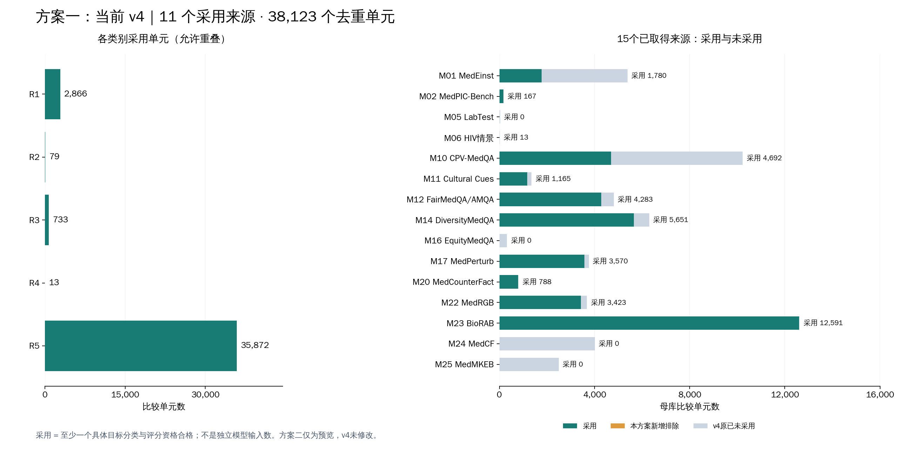
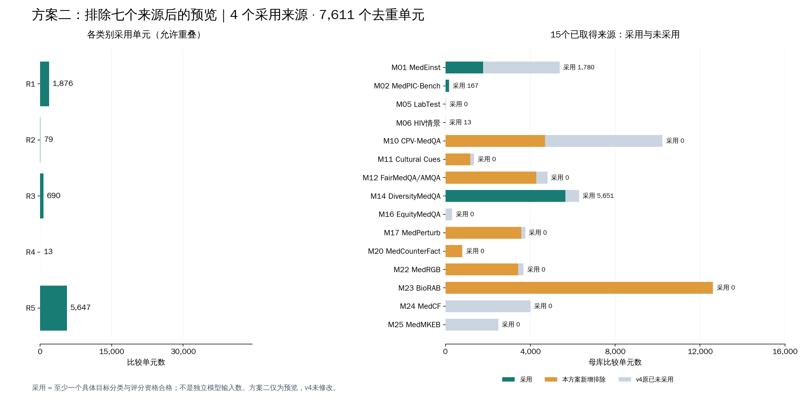

# R1–R5 benchmark：当前 v4 与排除七来源方案对比

本报告以 v4 最终逐目标标注和资格文件复算。**方案一是现有 v4；方案二是用户指定七个来源全部移除后的预览，未修改 v4 或 v3。** 两种方案均包含分类表、每类来源构成、逐来源采用数量、未采用理由和图。

## 统计口径

- **采用单元**：该比较单元至少有一个带R1–R5标签且 `evaluation_eligible=true` 的具体目标。某类别采用数只计该类别有合格目标的单元。
- 同一单元可以属于多个类别，因此R1–R5数量不可直接相加；来源之间按原ID分开计，来源采用数可相加得到总数。
- **benchmark数量按Mxx来源项目计**，不把文本变体、原题、子目标或MedRGB文档槽位拆成多个benchmark；FairMedQA/AMQA按一个来源计算。不同来源可能共享底层题库，来源数不等于相互独立题库数。
- 每个来源的分母是已归档比较母库，**不是作者发布包的全部行数**。普通原题参照、无变化记录、作者train/valid、获取缺口分别说明，不冒充抽样遗漏。
- 已分类但无评分资格的内容不进入主表的采用数。评分资格不等于M0–M4运行兼容性已验证；独立输入和评分映射尚未物化。

## 两种方案概览

| 项目 | 方案一：当前v4 | 方案二：排除后预览 |
|---|---:|---:|
| 已取得来源范围 | 15 | 同一15个来源用于对照 |
| 实际采用来源 | **11** | **4** |
| 本次新增整来源排除 | 0 | **7** |
| 原本无合格内容的来源 | 4 | 4，保持不变 |
| 去重采用单元 | **38,123** | **7,611** |
| 采用的具体判断 | **77,781** | **8,662** |
| 未取得来源 | 11 | 11，均不进入分母 |

方案二从v4已采用的11个来源中排除7个，因此剩4个；在15个已取得来源范围内，共11个不再/未曾贡献采用内容，即7个新增范围排除加4个既有不合格来源。

## 方案一：当前 v4

实际采用 **11 个来源、38,123 个去重比较单元、77,781 个具体判断**。

[图PDF](v4.pdf) · [类别表CSV](v4_categories.csv) · [来源表CSV](v4_sources.csv)

### R1–R5 各类内容与来源

| 类别 | 含义 | 采用单元 | 采用具体判断 | 来源数 | 每来源采用单元 |
|---|---|---:|---:|---:|---|
| R1 | 新增支持 | 2,866 | 4,155 | 6 | MedEinst：1,780；MedPIC-Bench：96；CPV-MedQA：1；Counterfactual Cultural Cues：67；FairMedQA/AMQA：134；MedCounterFact：788 |
| R2 | 撤销支持 | 79 | 79 | 2 | MedPIC-Bench：75；DiversityMedQA：4 |
| R3 | 重新比较 | 733 | 733 | 3 | MedEinst：680；MedPIC-Bench：10；FairMedQA/AMQA：43 |
| R4 | 推导后果 | 13 | 13 | 1 | HIV治疗因果情景研究：13 |
| R5 | 保持判断 | 35,872 | 74,268 | 8 | CPV-MedQA：4,691；Counterfactual Cultural Cues：1,098；FairMedQA/AMQA：4,149；DiversityMedQA：5,647；MedPerturb：3,570；MedCounterFact：703；MedRGB：3,423；BioRAB：12,591 |

### 每个已取得来源采用了多少内容

采用数按单元去重；未采用数=母库−采用。表中的未采用包含参照/作者划分以及不合格内容，不能统称题目质量差。完整R1–R5逐来源列及目标数在CSV中。

| 来源 | 母库单元 | 采用单元 | 未采用单元 | 本次额外排除原合格单元 | 未采用原因 |
|---|---:|---:|---:|---:|---|
| M01 MedEinst | 5,383 | 1,780 | 3,603 | 0 | 无变化参照；前后文本不足以支持具体关系；实际编辑与声明不符、关键上下文删除等构造无效。并非随机抽样。 |
| M02 MedPIC-Bench | 183 | 167 | 16 | 0 | 12个目标缺少明确前态或风险支持撤销依据；4个目标的病例、变化方向与参考规则不一致。这里每单元一个目标，共16个单元未采用。 |
| M05 临床检验因果推理评测 | 33 | 0 | 33 | 0 | 30个有标签单元的新答案需人工/rubric语义评分；另2个依据不足、1个题干构造无效。 |
| M06 HIV治疗因果情景研究 | 20 | 13 | 7 | 0 | 5个单元缺少改变前提到结果的充分依据；2个干预指代/构造无效。 |
| M10 CPV-MedQA | 10,225 | 4,692 | 5,533 | 0 | 患者性别等实际文本冲突、比较构造无效；无法确认具体不变关系；必要图像缺失。含已分类但仍缺图的4个目标，不能把相同gold当评分资格。 |
| M11 Counterfactual Cultural Cues | 1,349 | 1,165 | 184 | 0 | 173个分类关系依据不足、2个仅格式修改、9个需要缺失图像，共184个单元。 |
| M12 FairMedQA/AMQA | 4,806 | 4,283 | 523 | 0 | 508个单元未能确立具体分类关系；15个单元依赖缺失图片，共523个单元。 |
| M14 DiversityMedQA | 6,296 | 5,651 | 645 | 0 | 297个依据不足、112个构造无效、11个五类外；另225个已分类目标因缺图或参考等资格问题未采用，共645个单元。 |
| M16 EquityMedQA | 323 | 0 | 323 | 0 | 新答案需人工语义评分；另包含作者因处理错误撤回的配对及依据不足子目标。已发布历史人评分不能用于新模型答案。 |
| M17 MedPerturb | 3,759 | 3,570 | 189 | 0 | 原有无变化参照与新增查明的编辑性声明控制；截断/错改正文等无效构造；分类依据不足；必要图像缺失。按VISIT、MANAGE、RESOURCE分别判断，至少一个合格目标才计采用单元。 |
| M20 MedCounterFact | 809 | 788 | 21 | 0 | 21个单元的治疗臂替换后无法恢复清晰的比较指代；数字保留不代表仍有有效对照关系。 |
| M22 MedRGB | 3,680 | 3,423 | 257 | 0 | 200个单元对应长答案语义rubric，57个单元依赖缺失图片，共257个单元未采用。保留单元中的错误文档定位/自由纠正等辅助目标另判资格，不能从主问继承。 |
| M23 BioRAB | 12,615 | 12,591 | 24 | 0 | 8个分类依据不足，16个已分类目标存在原参考冲突、文本截断或结论缺失等评分限制，共24个单元。 |
| M24 MedCF | 4,013 | 0 | 4,013 | 0 | 3,215个作者train/valid实际编辑不混入test；797个已分类暂缓单元需要原生知识编辑步骤，当前文本问答协议未执行；另1个旧test记录未能定类。 |
| M25 MedMKEB | 2,497 | 0 | 2,497 | 0 | 2,497个eval比较单元缺少当前任务需要的图像，文本方法不能执行；其中子目标是否已分类另行保留。 |

## 方案二：排除七来源后的预览

实际采用 **4 个来源、7,611 个去重比较单元、8,662 个具体判断**。

[图PDF](reduced_preview.pdf) · [类别表CSV](reduced_preview_categories.csv) · [来源表CSV](reduced_preview_sources.csv)

### R1–R5 各类内容与来源

| 类别 | 含义 | 采用单元 | 采用具体判断 | 来源数 | 每来源采用单元 |
|---|---|---:|---:|---:|---|
| R1 | 新增支持 | 1,876 | 2,233 | 2 | MedEinst：1,780；MedPIC-Bench：96 |
| R2 | 撤销支持 | 79 | 79 | 2 | MedPIC-Bench：75；DiversityMedQA：4 |
| R3 | 重新比较 | 690 | 690 | 2 | MedEinst：680；MedPIC-Bench：10 |
| R4 | 推导后果 | 13 | 13 | 1 | HIV治疗因果情景研究：13 |
| R5 | 保持判断 | 5,647 | 5,647 | 1 | DiversityMedQA：5,647 |

### 每个已取得来源采用了多少内容

采用数按单元去重；未采用数=母库−采用。表中的未采用包含参照/作者划分以及不合格内容，不能统称题目质量差。完整R1–R5逐来源列及目标数在CSV中。

| 来源 | 母库单元 | 采用单元 | 未采用单元 | 本次额外排除原合格单元 | 未采用原因 |
|---|---:|---:|---:|---:|---|
| M01 MedEinst | 5,383 | 1,780 | 3,603 | 0 | 无变化参照；前后文本不足以支持具体关系；实际编辑与声明不符、关键上下文删除等构造无效。并非随机抽样。 |
| M02 MedPIC-Bench | 183 | 167 | 16 | 0 | 12个目标缺少明确前态或风险支持撤销依据；4个目标的病例、变化方向与参考规则不一致。这里每单元一个目标，共16个单元未采用。 |
| M05 临床检验因果推理评测 | 33 | 0 | 33 | 0 | 30个有标签单元的新答案需人工/rubric语义评分；另2个依据不足、1个题干构造无效。 |
| M06 HIV治疗因果情景研究 | 20 | 13 | 7 | 0 | 5个单元缺少改变前提到结果的充分依据；2个干预指代/构造无效。 |
| M10 CPV-MedQA | 10,225 | 0 | 10,225 | 4,692 | 本方案人为整来源排除；这是范围选择，不是新增技术不合格。v4已有未采用原因：患者性别等实际文本冲突、比较构造无效；无法确认具体不变关系；必要图像缺失。含已分类但仍缺图的4个目标，不能把相同gold当评分资格。 |
| M11 Counterfactual Cultural Cues | 1,349 | 0 | 1,349 | 1,165 | 本方案人为整来源排除；这是范围选择，不是新增技术不合格。v4已有未采用原因：173个分类关系依据不足、2个仅格式修改、9个需要缺失图像，共184个单元。 |
| M12 FairMedQA/AMQA | 4,806 | 0 | 4,806 | 4,283 | 本方案人为整来源排除；这是范围选择，不是新增技术不合格。v4已有未采用原因：508个单元未能确立具体分类关系；15个单元依赖缺失图片，共523个单元。 |
| M14 DiversityMedQA | 6,296 | 5,651 | 645 | 0 | 297个依据不足、112个构造无效、11个五类外；另225个已分类目标因缺图或参考等资格问题未采用，共645个单元。 |
| M16 EquityMedQA | 323 | 0 | 323 | 0 | 新答案需人工语义评分；另包含作者因处理错误撤回的配对及依据不足子目标。已发布历史人评分不能用于新模型答案。 |
| M17 MedPerturb | 3,759 | 0 | 3,759 | 3,570 | 本方案人为整来源排除；这是范围选择，不是新增技术不合格。v4已有未采用原因：原有无变化参照与新增查明的编辑性声明控制；截断/错改正文等无效构造；分类依据不足；必要图像缺失。按VISIT、MANAGE、RESOURCE分别判断，至少一个合格目标才计采用单元。 |
| M20 MedCounterFact | 809 | 0 | 809 | 788 | 本方案人为整来源排除；这是范围选择，不是新增技术不合格。v4已有未采用原因：21个单元的治疗臂替换后无法恢复清晰的比较指代；数字保留不代表仍有有效对照关系。 |
| M22 MedRGB | 3,680 | 0 | 3,680 | 3,423 | 本方案人为整来源排除；这是范围选择，不是新增技术不合格。v4已有未采用原因：200个单元对应长答案语义rubric，57个单元依赖缺失图片，共257个单元未采用。保留单元中的错误文档定位/自由纠正等辅助目标另判资格，不能从主问继承。 |
| M23 BioRAB | 12,615 | 0 | 12,615 | 12,591 | 本方案人为整来源排除；这是范围选择，不是新增技术不合格。v4已有未采用原因：8个分类依据不足，16个已分类目标存在原参考冲突、文本截断或结论缺失等评分限制，共24个单元。 |
| M24 MedCF | 4,013 | 0 | 4,013 | 0 | 3,215个作者train/valid实际编辑不混入test；797个已分类暂缓单元需要原生知识编辑步骤，当前文本问答协议未执行；另1个旧test记录未能定类。 |
| M25 MedMKEB | 2,497 | 0 | 2,497 | 0 | 2,497个eval比较单元缺少当前任务需要的图像，文本方法不能执行；其中子目标是否已分类另行保留。 |

## 七个新增排除来源的影响

以下是用户指定的范围排除，不把数量较多改写成数据无法评分的正式理由。该方案移除30,512个原合格单元，涉及69,119个具体判断；不改变任何保留目标的分类。

| 排除来源 | 原合格单元 | 减少R1 | 减少R2 | 减少R3 | 减少R4 | 减少R5 |
|---|---:|---:|---:|---:|---:|---:|
| CPV-MedQA | 4,692 | 1 | 0 | 0 | 0 | 4,691 |
| Counterfactual Cultural Cues | 1,165 | 67 | 0 | 0 | 0 | 1,098 |
| FairMedQA/AMQA | 4,283 | 134 | 0 | 43 | 0 | 4,149 |
| MedPerturb | 3,570 | 0 | 0 | 0 | 0 | 3,570 |
| MedCounterFact | 788 | 788 | 0 | 0 | 0 | 703 |
| MedRGB | 3,423 | 0 | 0 | 0 | 0 | 3,423 |
| BioRAB | 12,591 | 0 | 0 | 0 | 0 | 12,591 |

R2保持79、R4保持13；R1减少990、R3减少43、R5减少30,225。保留的R5全部来自DiversityMedQA，覆盖7,611个单元的约74.2%；R4全部来自HIV情景研究。类别和来源的关联更强，不能把这直接解释为类别难度差异。

## 为什么分母不等于作者发布包全量

以下是母库之外的参照/划分边界，未被重复计作母库内未采用单元。

| 来源 | 发布范围与归档边界 |
|---|---|
| M01 MedEinst | 83无变化母库参照；旧38部分定类父单元目标已另列台账。 |
| M02 MedPIC-Bench | 183 CF已收；284 GF为参照，不猜配对；既有缺前态判断沿用。 |
| M05 临床检验因果推理评测 | 33 CF已收；66非CF为参照；新答案原生人工/rubric评分限制保留。 |
| M06 HIV治疗因果情景研究 | 20官方附录CF及页定位已收；原参考可靠性禁用按具体目标沿用。 |
| M10 CPV-MedQA | 12310发布变体中2085无变化不在实际变化母库；按具体构造与图像资格排除。 |
| M11 Counterfactual Cultural Cues | 1350发布变体中1无变化另存；旧R5复用语义恢复资格。 |
| M12 FairMedQA/AMQA | 801根×6变体，原题/中性题作参照；旧R5资格及原参考禁用传播。 |
| M14 DiversityMedQA | 6380变体中84无变化另存；保留author_train/test；原题精确恢复选项/gold与具体图像排除。 |
| M16 EquityMedQA | 323官方配对已收；原生新答案人工评分限制；66部分定类父单元目标另列台账。 |
| M17 MedPerturb | 14个原有无变化母库参照；既有VISIT/MANAGE资格恢复3567单元；新发现10个实际无变化控制采用资格覆盖。RESOURCE3615目标已独立判断，3529可测，不增加单元数。 |
| M20 MedCounterFact | 809替换比较已收；假设证据与现实医学区分；703旧R1/R5重叠不计新增；20部分定类父单元目标另列台账。 |
| M22 MedRGB | 3680组内36800 DOC槽单独计；固定主问与文档定位/纠正内容分开；200长答案目标及具体缺图排除。 |
| M23 BioRAB | 12616发布记录中1无变化另存；双强度重复不算独立病例；原gold冲突禁用。 |
| M24 MedCF | 3215 train/valid实际编辑不补入test；原单项知识编辑步骤未执行，当前方法协议不适用；15原发布无变化另存。 |
| M25 MedMKEB | 2497 eval编辑元数据缺图，不能纳入文本评测；train/attack留作来源，不充test。 |

## 11个获取缺口

这些来源没有取得所需固定输入，属于获取缺口；不计作本次排除的7个，也不计入55,991母库分母。状态沿用本地获取记录，本报告没有重新联网获取。

| 来源 | 缺口 |
|---|---|
| M03 MamaBench | gated病例未取得 |
| M04 肿瘤临床CF评测 | 未定位原病例发布包 |
| M07 CLIR-Bench | 指定CF编辑对未发布于所检树 |
| M08 ECG-Expert-QA | MCo固定文件未定位，MC不能替代 |
| M09 GenMedicalEval | 仅栏目文档示例，未取得声明12000条 |
| M13 MedEqualQA | 所检作者仓库未发布题库 |
| M15 CLIMB | 未取得固定诊断CF病例对 |
| M18 DeVisE | 仅生成代码，受限MIMIC病例未取得 |
| M19 MedFuzz | 未取得完整固定攻击输入release |
| M21 MediEval | 受限患者上下文/知识源未取得 |
| M26 COLLECT | 受限图像包未取得 |

## 复算与文件入口

[当前v4说明](../2026-09-10_r1_r5_full_classification/README.md) · [分类规则和示例](../2026-09-10_r1_r5_full_coverage_plan/README.md) · [机器可读汇总](summary.json)

本报告采用已保存的分类与资格记录，没有用旧模型预测反推标签。源级原因是逐目标裁决的归纳；同一未采用单元可同时存在多个原因，主表不将不同原因重复相加。MedPerturb的RESOURCE与VISIT/MANAGE独立计目标，单元只计一次；MedRGB主问合格不会自动使所有辅助目标合格。

本地权威目录：`/home/data3/txy/Documents/Codex/2026-09-09/agent-md-medrgag-workspace-guide-md/benchmark_r1_r5_v4_20260910`。读取 `exports/all_reviewed_target_annotations.jsonl.gz` 与 `exports/archive_unit_coverage.csv`；来源及原件定位见 `source_scope_inventory.csv`。旧无变化控制资格覆盖已经包含在最终导出中。

`build_report.py`保留复算过程；在本地 v4 的 `reports/two_scenarios/` 下，用已有Matplotlib环境运行。本GitHub目录只发布说明、汇总和图表，不发布完整病例正文。
