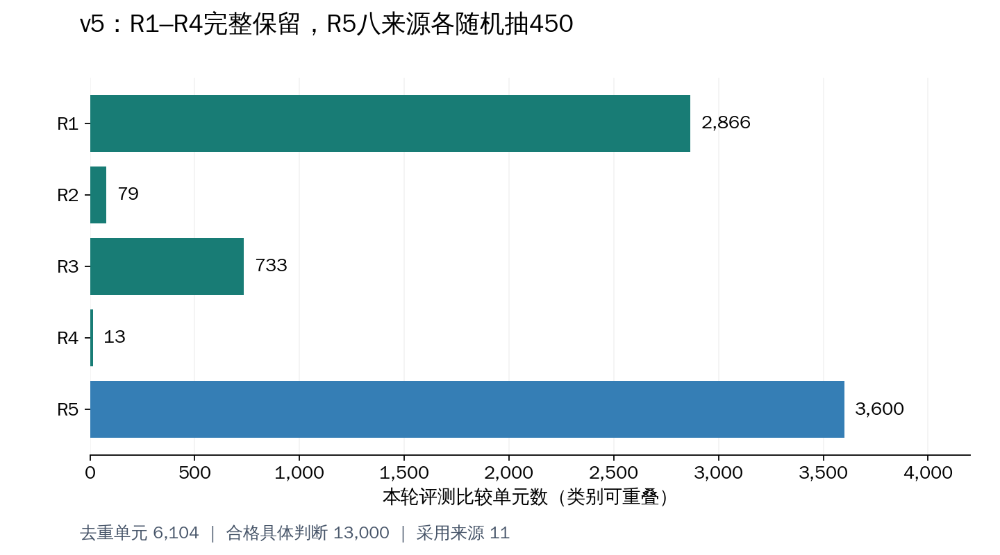

# R1–R5 benchmark v5：八来源各450个随机R5单元

> 本文主体记录2026-09-10冻结时的状态。9月13日已查到其他对话完成的v5 M0/M2/M4/M5运行结果；后续状态、本线程具体调整及论文写作证据见[工作总记录](https://github.com/xiotakut/cf_mrg/blob/main/benchmarks/2026-09-13_r1_r5_paper_work_record/README.md)。原版本/抽样元数据保持历史口径。


v5已从完整v4的合格R5候选中，按来源不放回随机抽取8×450=**3,600个R5比较单元**；所有合格R1–R4目标完整保留。v3、v4数据与原语义标注不变。抽样使用一次生成并保存的随机种子，未按模型成绩、难度、v3成员身份筛选或重抽。

v5共 **6,104 个去重单元、13,000 个合格具体判断、11 个来源**。这不是模型调用数；M0–M4运行兼容性尚未验证。

## 当前评测范围

| 类别 | v4合格单元 | v5评测单元 | v5合格具体判断 | 来源数 |
|---|---:|---:|---:|---:|
| R1 | 2,866 | 2,866 | 4,155 | 6 |
| R2 | 79 | 79 | 79 | 2 |
| R3 | 733 | 733 | 733 | 3 |
| R4 | 13 | 13 | 13 | 1 |
| R5 | 35,872 | 3,600 | 8,959 | 8 |

类别可重叠，各类单元/目标数不能直接相加。未抽中R5的单元若还有R1等目标，会继续保留用于对应类别。



[分类图PDF](v5_categories.pdf)

## 八来源随机抽样结果

| 来源 | 合格R5候选 | 抽中 | 来源内入选概率 | 候选原题ID数 | 抽中原题ID数 | 抽中单元最多共享同一原题数 |
|---|---:|---:|---:|---:|---:|---:|
| M10 CPV-MedQA | 4,691 | 450 | 9.59% | 931 | 374 | 4 |
| M11 Counterfactual Cultural Cues | 1,098 | 450 | 40.98% | 134 | 133 | 7 |
| M12 FairMedQA/AMQA | 4,149 | 450 | 10.85% | 796 | 357 | 4 |
| M14 DiversityMedQA | 5,647 | 450 | 7.97% | 1495 | 380 | 4 |
| M17 MedPerturb | 3,570 | 450 | 12.61% | 1817 | 412 | 2 |
| M20 MedCounterFact | 703 | 450 | 64.01% | 190 | 183 | 4 |
| M22 MedRGB | 3,423 | 450 | 13.15% | 3423 | 450 | 1 |
| M23 BioRAB | 12,591 | 450 | 3.57% | 5555 | 437 | 2 |

450是比较单元配额，不是450个独立病例。此次没有按原题数、人口属性或难度重新平衡样本；同一来源内每个合格单元入选概率均为450/N。原题ID保留，便于后续按组计算不确定性。跨来源相同原题尚不能仅凭不同来源ID认定独立。

## 随机性与复现

1. 候选池严格取v4最终记录中 `evaluation_eligible=true` 且带R5标签的单元，按来源去重，共35,872个。
2. 使用 `secrets.token_hex(32)` 生成一次主种子，先保存协议，再抽样；没有根据结果寻找种子。
3. 每来源候选ID按字典序排序，来源随机种子为 `master_seed_hex + ":" + resource_id`。
4. 使用Python标准库 `random.Random(source_seed).sample(sorted_pool, 450)`，来源内等概率、不放回。仅在抽样后排序选中ID，便于导出。
5. 验证时从完整候选清单重放，检查选中ID精确一致；同时逐字段核对全部109,599个目标的原语义和证据，检查所有R1–R4合格目标保留。

记录时间（UTC）：`2026-09-10T14:05:03.891262+00:00`；Python版本：`3.10.12`。

主随机种子：

```text
b87c62c6ca40257d55f671c89c04dc200c2000ba5e46690210677f96830305f1
```

这验证的是随机抽样程序和可复现性，不声称某次随机结果必然在人口属性/难度上均衡。完整候选池与抽中标记一起提供，未入选是预算抽样处置，不是技术不合格。

## 原语义与评测选择必须分开

- `labels`：保留v4原语义标签。
- **`evaluation_labels`：本次v5允许参与评测汇总的类别。下游必须读取此字段。**
- `v4_evaluation_eligible`：原v4资格；`evaluation_eligible`：目标是否被v5选中。
- `r5_sample_selected`：单元是否属于3,600个随机R5单元。
- `v5_selection_reason`：区分原本不合格和本次预算未选中。
- `selected_targets.jsonl.gz`保留选中目标的完整原始证据和来源定位；`target_annotations.jsonl.gz`保留全部v4目标与v5选择标记。

例如MedCounterFact中未抽中R5的R1/R5单元，其原标签仍可为R1/R5，但v5的 `evaluation_labels` 只含R1，不能因原标签有R5就把它重新计入R5。所需前后对照不截断，也不以缺失判断替代原目标。

## v3已评测范围与v5选择的对应

| v5单元身份 | 数量 |
|---|---:|
| 属于v3冻结单元 | 2,116 |
| 不属于v3 | 3,988 |

这些是单元成员标记。旧预测能否复用仍需核对实际输入、目标、答案接口和方法配置；不属于v3也不保证从未在更早实验中产生预测。未为了省推理而偏向旧v3单元。完整交叉表含全部38,123个v4合格单元。

## 文件入口

| 文件 | 用途 |
|---|---|
| [EXPLORATION_HISTORY.md](EXPLORATION_HISTORY.md) | 从完整v4、整来源排除预览、比例方案、五轮辩论到450配额的全部决策记录 |
| [sampling_protocol.json](sampling_protocol.json) | 一次生成的种子、候选定义、抽样程序和Python版本 |
| [manifest.json](manifest.json) | v5版本与数量、加载字段 |
| [r5_sampling_summary.csv](r5_sampling_summary.csv) | 各来源候选、样本、原题覆盖与v3交集 |
| [r5_sampling_frame.csv](r5_sampling_frame.csv.gz) | 全部候选ID、抽中标记、入选概率与设计权重 |
| [selected_r5_unit_ids.json](selected_r5_unit_ids.json) | 八来源抽中ID |
| [selected_r5_units.csv](selected_r5_units.csv) | 抽中单元、来源、原题ID和v3标记 |
| [category_summary.csv](category_summary.csv)、[source_summary.csv](source_summary.csv) | 类别与来源统计 |
| [v3_v4_v5_membership.csv](v3_v4_v5_membership.csv.gz) | 完整v4合格单元的版本交叉表 |
| [verification.json](verification.json) | 随机重放、原语义保留与目标选择验证结果 |
| [replay_sampling.py](replay_sampling.py) | 仅用公开候选ID、种子和选中ID重放验证 |
| [build_v5.py](build_v5.py)、[verify_v5.py](verify_v5.py) | 本地构建及全量校验代码 |

复现随机清单（不修改文件）：`python3 replay_sampling.py`。主种子生成代码留在协议说明中；构建脚本只读取种子，已有选中清单不同则拒绝覆盖。

## 本地数据与后续使用

本地目录：`/home/data3/txy/Documents/Codex/2026-09-09/agent-md-medrgag-workspace-guide-md/benchmark_r1_r5_v5_20260910`。本地还包含 `units.jsonl`、`selected_targets.jsonl.gz`、`target_annotations.jsonl.gz`。GitHub发布协议、完整候选ID、选中清单、统计和探索说明，不发布完整病例正文。

当前是正式冻结的分类/评测选择版本，不宣称已经具备经过验证的M0–M4运行输入包。后续需物化模型输入、评分映射并验证兼容性。主汇总和来源加权汇总的评分协议尚未冻结；采样表中的设计权重支持后续按实际估计目标选择加权方式。

[完整v4说明](../2026-09-10_r1_r5_full_classification/README.md) · [之前的两方案预览](../2026-09-10_r1_r5_v4_scope_comparison/README.md) · [分类规则](../2026-09-10_r1_r5_full_coverage_plan/README.md)
