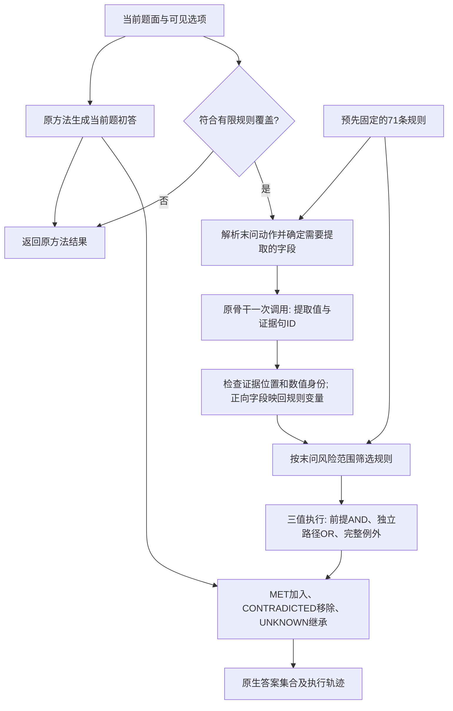

# R2支持重算head：方法、实验与失败经验

2026-09-16专项审查完成：[论文方法证据判断](#r2-paper-method-assessment)认为当前结果可支撑有限老年用药范围内的问句范围约束与三值支持重算组件，尚不足以独立证明通用R2泛化。固定最终事实、只切换范围处理，两骨干均24→48/48；严格匹配旧强控制输入的子集上，当前程序/充分推理模型为Llama12/26对10/26、Qwen18/29对17/29。常数None总分优势及保留侧同时报告；本次0新模型调用，默认头未改。

2026-09-16审计补充：[同口径交叉审计完成](#r2-cross-head-evidence-audit)，553条API结果、385次真实请求及基线/事实来源复核通过，0新模型调用。130条修复均来自有效初答；当前头的总分低于同覆盖常数None，但能保留2–6/9道仍有支持的题，事实语义和独立临床验证缺口保持。所选版本未改。

本文负责R2独立支持重算接口的机制、版本、跨方法分析、成功与失败试验及复现证据。2026-09-14从[优化研究总览](optimization.md)拆出：本方向已形成独立研究问题、连续实验系列和可交付接口，符合AGENTS的主题拆分标准（本地来源：`/home/data3/txy/AGENTS.md#documentation-growth`）；跨类文献筛选与其他head的通用经验仍由优化总览维护。

最新状态：2026-09-15（Asia/Shanghai，补充执行指南与七方法证据复核；所选方法版本仍为2026-09-14）。R2保留为有机制依据的开发候选；原79题已反复参与调优，尚无独立临床泛化验证。最终接口未发现按测试题查答案或检索带标签病例直接答题的逻辑，但这不消除方法选择层面的过拟合，详见[与R3问题的对照核查](#r2-test-reuse-audit)。r2_condition_head.optimize（本地来源：`/home/data3/txy/Documents/Codex/2026-09-14/new-chat/r2_condition_head.py`）采用原模型一次短提示正向事实提取、问句范围筛选、三值规则执行和UNKNOWN初答保留；覆盖55/79，其余24保留原方法。七方法同骨干事实离线挂载为M0 7→29、M2 6→23、M3 27→43、M4 23→39、M5 33→46、M6 15→38、M7 23→37/79。原M4保留3→4/9、原M5 0→6/9；M7保留3→2/9，不能声称所有子组无伤迁移。553条接口结果与385条模型请求回放已核验，实际新事实来自两个原骨干，不把七组离线组合写成七次完整新运行。

本轮方法交付与全部938次新生成已完成，详见[当前选用版本和证据](#r2-head-delivery)。[796次证据/范围系列](#r2-evidence-scope-complete)发现Llama在48范围探针中有8个极性错误；随后[142次正向字段对照](#r2-positive-facts)将其40→48/48，Qwen保持48/48，七方法原生553条预测逐条不变。正向表示已统一接入默认接口并再次通过553条结果/385条请求回放；旧96机制题为Qwen96/96、Llama93/96。所选事实的原答案×骨干交叉表仍显示M4/M5当前剩余差距来自初答继承与回退。仅MET与同覆盖总选None的原生总分持平，保留为政策对照。失败、未采用方案、成本、代码和PDF/SVG图均落盘，当前本队列无活动推理。此前1,016次、522次及1,919次历史试验保留，正式v5和原模型权重未改。

范围：临床开发集仅79个R2单位（75 MedPIC＋4 M14），不运行其他92题或R5。合成规则题不纳入v5、不冒充临床验证。已在原M4/M5观察到跨method收益，尚未验证独立临床泛化。75题中66道None与9道保留的构成会明显放大不同method的决策倾向，必须同时报告两侧。

统一文档入口（本地来源：`/home/data3/txy/docs/README.md`） · 运行与接入入口（本地来源：`/home/data3/txy/Documents/Codex/2026-09-14/new-chat/README.md`） · [其他head的构建经验](optimization.md#cross-head-lessons)

2026-09-15后续组件复用：当前冻结接口已在R3 M02用药子题完成迁移与同事实执行对照。该批与R2所选79题存在3个item重合，完整范围、重复调用成本、七方法结果与限制统一见[R3迁移主记录](r3_candidate_comparison.md#r3-frozen-rule-transfer)。本页原R2阶段结果与默认实现未改，不把该迁移称为独立临床泛化。

## 内容导航

- [执行指南：方法怎样运行、七方法到底测到了哪一步](#r2-execution-guide)（2026-09-15）
- [成功形成路径与新发现](#r2-development-lessons)
- [失败、未采用方向及结论更正](#r2-failure-index)
- [执行失败与恢复](#r2-engineering-failures)
- [当前交付与结果](#r2-head-delivery) · [论文方法定义](#r2-head-method-draft)
- [完整历史](#r2-history)：[初始诊断](#r2-initial-diagnosis)、[首轮复核](#r2-first-prompt-trial)、[七方法差异](#r2-backbone-retrieval)、[v1/v2](#r2-independent-interface)、[原子/CAD](#r2-head-continuation)、[M5提示](#r2-m5-prompt-trial)、[固定规则](#r2-executable-rule-head)、[任务动作](#r2-task-scoped-complete)、[问句范围](#r2-evidence-first)、[正向表示](#r2-positive-facts)
- [本次拆分记录与保存验证](#r2-documentation-split)

<a id="r2-execution-guide"></a>

## 执行指南：当前R2头的方法、接入与七方法验证

更新：**2026-09-15（Asia/Shanghai）**。本指南解释2026-09-14最终选用的正向事实版本，承接本页的方法与实验主记录。2026-09-15为解释和证据复核日期，方法、规则和模型配置没有因此更新。

阅读顺序：[方法定位](#r2-guide-purpose) → [执行步骤](#r2-guide-execution) → [实际案例](#r2-guide-examples) → [接入与回放](#r2-guide-api) → [七方法验证范围](#r2-guide-seven) → [限制](#r2-guide-limitations)。

### 先回答：M0、M2、M3、M4、M5、M6、M7真的都测过了吗？

**七个方法各79道R2都有真实保存的加头结果，并已通过当前接口回放；实际执行方式是“两骨干提取事实＋七方法各自原答案的离线组合”。尚未做七条完整方法流水线分别重新生成原答案、再独立调用head的端到端新运行。**

本次直接核对了各方法正式评分源文件：M4确实使用结构化修复版，M6确实是MedGENIE，M7确实使用完整第二版。553条原答案、正确性、无效原因、gold及评分记录ID与head组合所用摘录一致。随后调用当前`optimize`回放553条，385次事实回调的messages/schema与真实生成请求一致，最终预测、正确性和无效状态全部复现。另沿两骨干的物理GPU输出核对每组27条新事实和28条原样复用事实。

本次新增模型调用为0。新核验收据：guide_verification_20260915.json（本地来源：`/home/data3/txy/Documents/Codex/2026-09-14/new-chat/r2_question_scope_analysis/guide_verification_20260915.json`）。下文解释这些数字为什么成立，以及它们能支持什么结论。

<a id="r2-guide-purpose"></a>

### 1. R2头要解决什么

R2的分类定义（本地来源：`/home/data3/txy/docs/data/classification.md:160`）是“某条原有支持被撤销”。例如原先一条风险条件成立，现在明确不成立，应撤掉这条理由；如果另一条风险还成立，就仍须保留相关选项。R2不要求最终答案一定改变，也不等于看到否定句就把所有药物删掉。

当前模块通过**重算当前患者的支持条件**来实现这一目标：

> 原方法先给出当前题的答案；同一骨干再做一次短事实提取；Python执行预先编码的公开规则，增加得到支持的选项，删除库内支持全部失效的选项，未知选项继承原答案。

这里的“头”是外置Python后处理接口，没有新训练参数。它不是Transformer中新加的一层，也没有微调原权重。推理入口不接收干预前病例、不比较前后两个答案、不先生成反事实病例。原答案`initial_answer`始终指**同一个当前病例**的预测。

当前作用范围是老年用药多选题。虽然研究名称叫R2头，代码里没有自动R2分类器；R2标签只在评测准备阶段选取79道研究题，运行时的覆盖门槛使用可见题面、题型和药名。

### 2. 输入、知识和输出分别来自哪里

| 信息 | 实际来源和用途 |
|---|---|
| 当前患者 | `item['question']`；是事实提取的患者证据来源 |
| 可见候选 | `item['options']`，例如`{'A': 'Gabapentin', ...}`；用于选规则、保留原生选项键 |
| 题型 | `item['answer_format']`；当前入口只对符合覆盖条件的`multi`执行 |
| 当前题初答 | 原方法自己的已解析预测，列表或元组；无有效预测时传`None` |
| 医学规则 | 本地`r2_guideline_rules.py`中预先编码的71条有限规则，涉及153个不同药名字符串 |
| 事实提取模型 | 调用方提供的原Llama或Qwen骨干；通过`generate(messages, schema)`调用 |
| 结果 | 原生选项键、是否成功组装、动作/范围、清理后事实、逐规则状态和证据拒绝原因 |

**事实提取模型实际看到的是：编号后的当前题面、可见选项、所需字段定义和提取指令。** 原方法的检索文档、完整推理过程和初答都不放入这次提取提示；规则全文也不交给模型重写。原方法已有检索和推理的影响，通过其最终初答进入后面的UNKNOWN继承及覆盖外回退。

开发脚本可以读取gold、R标签和评分文件来准备范围、计分；这些不属于`optimize`的模型输入。当前入口没有按`item_id`查答案的步骤，甚至不要求提供`item_id`。

<a id="r2-guide-execution"></a>

### 3. 一道题的完整执行顺序



#### 3.1 覆盖判断：哪些题会触发模型调用

`r2_program_head.eligible(item)`同时检查：

1. `answer_format == 'multi'`。
2. 题面能匹配`(\d+)-year-old`，匹配年龄至少65岁。
3. 至少一个选项药名与有限规则库匹配。匹配方式是去首尾空白、忽略大小写后的完整字符串匹配。

本批79题中55题通过，另外24题原样回退。24题包括20道非老年MedPIC多选和4道M14单选。55道覆盖题的动作是44道`avoid`、11道`dose_reduce`；其中22道明确限定肾功能范围。

这个门槛只保证进入规则分支，不保证每个选项有规则或每个事实都已知；入口也不会为药物组合、任意商品名或不同年龄写法自动做语义归一化。某题通过门槛后，若末问动作仍是`other`，仍可能产生一次提取调用而最终无法取得明确支持。

#### 3.2 把“问什么”与“患者是什么情况”分开

`r2_action_scope.requested_action`优先取最后一个Which/What问句；找不到时用最后一段。它匹配已实现的英文形式：

| 动作 | 典型形式 | 执行的规则含义 |
|---|---|---|
| `avoid` | avoided、avoidance、inappropriate、should not be prescribed | 是否应把该药列入题目要求避免/不适当的集合 |
| `dose_reduce` | dose reduction、dosage adjustment、dose(s) be reduced/adjusted | 是否应把该药列入需减量/调整剂量的集合 |
| `other` | 两种动作都匹配或都不匹配 | 没有确定的受支持动作 |

例如患者描述出现“以前调整过剂量”，但末问是“哪些药应避免”，应执行`avoid`。这些动作由代码解析，事实模型不再生成动作标签或动作证据。

`r2_task_scoped_head.required_fields`先取“药名匹配且动作匹配”的规则，把前提和例外用到的变量取并集，再加入年龄。**不是每题都抽取全部字段。** Gabapentin/Famotidine减量示例只需`age_years`、`crcl`。

#### 3.3 用一次短提示提取患者事实

`r2_indexed_head.sentences`按现有英文句界/换行规则切分题面，得到`S0`、`S1`等片段。模型返回如下结构，具体字段集合由本题决定：

```json
{
  "facts": {
    "age_years": {"value": 78, "evidence_ids": ["S0"]},
    "crcl": {"value": 55, "evidence_ids": ["S0"]}
  }
}
```

数值字段允许数字或`null`，布尔字段允许`true`、`false`、`null`。未知用`null`和空证据列表；明确否定才应填`false`。提示还明确：列在选项里不代表正在服用，当前未服药不代表拟用疗程，CrCl与eGFR不能互代，无痴呆不等于无谵妄或无跌倒。

字段定义总库有7个数值字段和42个布尔字段，定义全文在r2_program_head.py（本地来源：`/home/data3/txy/Documents/Codex/2026-09-14/new-chat/r2_program_head.py`）。可按下列任务理解它们：

| 字段组 | 代表字段及作用 |
|---|---|
| 年龄、肾功能 | `age_years`、`crcl`、`egfr`；保留数值变量身份 |
| 剂量、疗程 | `digoxin_mg_day`、`doxepin_mg_day`、`ppi_duration_weeks`、`metoclopramide_weeks`；只抽取定义要求的已陈述单位，不自动换算 |
| 疾病和风险 | 心衰及症状/射血分数类型、晕厥及原因、谵妄/高风险、痴呆、跌倒/骨折、帕金森、溃疡病史 |
| 人群及泌尿条件 | `female`、`urinary_incontinence`、`bph_or_luts` |
| 拟用目的、疗程、途径 | AP用途、苯二氮䓬类特定用途、长期抑制治疗、慢性/定时NSAID、全身激素途径等 |
| 完整例外 | 胃保护、其他治疗效果、更安全替代、非药物治疗失败/不可行、严重伤害风险等 |

#### 3.4 两个正向字段怎样映回原规则

旧提示曾让Llama把“有更安全替代”错误抽成`no_safer_alternative=true`。当前只对这两个实际出过问题的变量更换表示：

| 模型抽取的正向字段 | 程序供规则使用的字段 | 映射 |
|---|---|---|
| `safer_alternative_available`：有更安全替代 | `no_safer_alternative`：没有更安全替代 | true→false，false→true，null→null |
| `alternatives_effective`：其他治疗有效 | `alternatives_ineffective`：其他治疗无效 | true→false，false→true，null→null |

`r2_positive_facts`同时改变字段名及其定义，再由Python取反。规则库、阈值与例外表达保持原表示。最终`result['facts']`里的字段因此是规则侧名称。没有相关字段的题，当前请求与先前短提示请求完全相同。

#### 3.5 证据检查真正检查了什么

`clean_facts`对每个必需字段进行检查：

- 非null值必须有至少一个证据ID，且所有ID能在当前题面找到。
- 数值必须在引用片段中出现，布尔值不能当成数值。
- `crcl`的引用还须出现CrCl或creatinine clearance，`egfr`须出现eGFR或glomerular filtration。
- 未通过的值清为`None`，并记录`evidence_errors`；缺字段等结构错误由上层接口处理。

这些是位置及部分数值身份检查。代码没有再调用一个模型来验证布尔语义，也没有独立实现完整单位换算或语义蕴含证明；当前生成端依赖JSON schema保证值类型和必需字段。题面同一句同时出现多个数值或两个肾功能变量时，数值出现和变量名出现也不足以证明二者绑定正确。这些区别直接影响如何解释“证据检查通过”。

#### 3.6 风险范围筛选：一般问句与仅肾功能问句

`renal_question`检查最后一个Which/What问句是否以`given … renal function?`或`given … kidney function?`这一已实现的形式结束。

- 一般问句：保留所有与选项相符的候选规则，再按动作执行。
- 明确肾功能限定：只保留前提或例外使用`crcl`/`egfr`的规则，再按动作执行。

患者段中出现CrCl或eGFR本身不会收窄问句。无匹配肾规则的选项得到UNKNOWN。**范围筛选发生在规则执行阶段；事实请求只按药名和动作缩减，没有再按肾范围缩减。** 这也是历史上可以固定同一份事实，只对比问句范围处理的原因。

#### 3.7 执行预先固定的71条规则

每条规则包括`id`、`drugs`、`action`、`when`、`unless`、来源URL和PDF页码。知识主要来自已冻结AGS Beers 2023部分推荐：一般老年用药建议、疾病/风险相互作用、肾功能相关动作；类别成员另有公开药品标签核查记录。早期还尝试过KIDs儿童指南，但当前默认规则头没有因此具备儿童分支。

一个规则的代码结构可以读成：

```python
{
    "id": "renal_reduce_gabapentin",
    "drugs": ["gabapentin"],
    "action": "dose_reduce",
    "when": ["test", "crcl", "lt", 60],
    "unless": None
}
```

这里省略来源元数据，仅展示现有研究编码结构。程序另外给每条规则加入年龄≥65的共同前提。`test`执行比较，`all`代表AND，`any`代表OR；不是请模型再判断“55是否小于60”。

三种状态为：T=`MET`、F=`CONTRADICTED`、U=`UNKNOWN`。

| 组合 | 结果 | 直观解释 |
|---|---|---|
| AND中有F | F | 一个必需条件已不成立，就足以使该路径失效 |
| AND全是T | T | 所有必需条件都成立 |
| AND没有F但有U | U | 还不能确定整个前提 |
| OR中有T | T | 仍有一条独立支持，不能因另一条失效而撤销该选项 |
| 非空OR全是F | F | 当前匹配的所有支持都失效 |
| OR没有T且有U，或没有匹配路径 | U | 未知/没有覆盖不会被直接当作否定 |

**完整例外与默认推荐政策**是另一层处理。当前默认名称为`documented`：

| 人群＋规则前提 | 完整例外 | 单条路径结果 |
|---|---|---|
| 任意 | T | F：例外已经成立，关闭这一条支持 |
| F | F或U | F |
| T | F | T |
| T | U | **T，并标记`used_default_recommendation=True`** |
| U | F或U | U |

也就是说，“前提成立、例外还没证实”时，默认继续保留推荐；例外事实仍记为U，没有改写成false。历史`strict`对照则把T前提＋U例外留为U。当前`optimize`没有策略参数，使用固定默认，不能按每题挑更高分的政策。

以库内溃疡规则为例，例外是“其他治疗无效 **AND** 有胃保护”。只确认胃保护、另一项未知，完整例外就是U，默认仍保留该路径。即使一个例外明确关闭了一条规则，同药物的其他独立规则仍须继续计算。

最后，每个实体选项把自己的匹配路径做OR汇总。`MET`的含义是**在当前问句及有限库政策下，该选项应进入答案集合**，不是泛指“这个药好”或“这个药在所有情况下有害”。

#### 3.8 怎样修改原答案

对于可用初答，设原来选中的实体选项为A₀，程序得到T/F/U三个集合，最终实体选择是：

**A = T ∪ (A₀ ∩ U)**。

因此，T可以补选，F可以撤回，U只继承原先是否选择。按输入选项顺序返回所有选中键；实体集合为空时，返回可见的`None of the above`键。None不会与实体选项混选。

“可用初答”在组装器中要求非空list/tuple、所有键有效、None不与其他键混合。若初答不可用且还有任意U，组装器返回`None`，接口保留原结果；若所有选项都已明确，程序可以直接形成答案。若最终实体集合为空而题目没有None选项，也无法形成答案并回退。

`applied=True`仅表示成功形成程序答案，**不等于答案发生改变，也不等于答对**。本次553条回放中，372条成功形成答案，168条为24×7覆盖外回退，另外13条进入了事实提取但因初答不可用且仍有UNKNOWN而回退；总共385条触发事实回调。

<a id="r2-guide-examples"></a>

### 4. 三个例子把流程连起来

以下例子解释冻结研究代码的执行，不对基准之外的病例重新作医学裁决。

#### 例一：同一道题同时撤回一项、补回另一项

接口自带示例：78岁，CrCl=55，题目问需减量的药物；A为Gabapentin，B为Famotidine，C为None。初答为`['B']`。

1. 多选、年龄与药名满足门槛；末问为`dose_reduce`。
2. 模型仅提取年龄78、CrCl55及S0证据。
3. 当前库中A的阈值为CrCl<60，得到T；B的阈值为CrCl<50，得到F。
4. 从初答移除B、加入A，输出`['A']`。不是把原答案统一清空或统一改成None。

#### 例二：实际题s001115——撤销晕厥支持，保留跌倒支持

题面77岁、明确无晕厥，但保留反复跌倒史；选项A/B/C分别为Amitriptyline/Sertraline/Venlafaxine，D为Bupropion，E为None。M4和M5原答案均为`['A']`。

- 晕厥相关路径失效，但跌倒条件仍为true；A另有独立通用路径。
- “没有更安全替代”未知，默认政策保留已成立跌倒前提对应的推荐，轨迹标记例外未知。
- A/B/C汇总为MET，D无匹配支持为UNKNOWN且原先未选。
- 两个原骨干事实接各自初答后，最终都输出`['A', 'B', 'C']`。

这体现了当前机制的补选及独立支持保留，也展示了默认例外政策怎样实际影响答案。

#### 例三：实际题s001171——问的是肾功能，不能混入一般建议

题面71岁、eGFR=75，末问明确“given this patient's renal function”。A为Baclofen，B为Tizanidine，C为Dantrolene，D为None，E为Methocarbamol。

- 肾范围仅留下相关肾规则；E的一般肌肉松弛剂规则不进入本题执行范围。
- A的库内eGFR<60条件为F；B/C/E在该范围没有支持路径，均为U。
- M4原选A，去掉A后输出D；M5原选D，仍输出D。

这里返回D并不意味着程序证明B/C/E没有任何风险，而是它们没有明确可执行支持且原先也未被选择。这正是UNKNOWN继承政策的实际行为。

案例的原始题面及事实见r2_task_scoped_qwen/inputs.jsonl（本地来源：`/home/data3/txy/Documents/Codex/2026-09-14/new-chat/r2_task_scoped_qwen/inputs.jsonl`）、Llama清理后事实（本地来源：`/home/data3/txy/Documents/Codex/2026-09-14/new-chat/r2_positive_facts_llama/extractions.jsonl`）、Qwen清理后事实（本地来源：`/home/data3/txy/Documents/Codex/2026-09-14/new-chat/r2_positive_facts_qwen/extractions.jsonl`）。按上述item_id定位即可。

<a id="r2-guide-api"></a>

### 5. 怎样调用，以及怎样复现已保存结果

#### 5.1 在线调用契约

入口是r2_condition_head.py（本地来源：`/home/data3/txy/Documents/Codex/2026-09-14/new-chat/r2_condition_head.py`）：

```python
from r2_condition_head import optimize

result = optimize(item, initial_answer, generate)
```

调用方实现`generate(messages, schema)`，使用该方法原骨干、相应聊天模板及约束解码，返回事实JSON字符串。它不是生成最终答案的回调。入口不加载模型、不自行读取旧结果、不把返回值写回某个方法目录。

要复现所选提取配置，应读取对应Llama配置（本地来源：`/home/data3/txy/Documents/Codex/2026-09-14/new-chat/r2_positive_facts_llama/config.json`）或Qwen配置（本地来源：`/home/data3/txy/Documents/Codex/2026-09-14/new-chat/r2_positive_facts_qwen/config.json`）：两者BF16、temperature=0、seed=42、top_p=1、最大输出2048、JSON约束；Qwen关闭thinking并保留记录中的YaRN配置。正向阶段引擎上下文为8192，旧事实复用来自先前引擎配置，具体运行批次与资源记录保留在来源包中。相同请求的回放复现不等于已经验证新批次生成逐字一致。

调用成功时可读：

| 返回字段 | 含义 |
|---|---|
| `answer` | 选项键集合或保留的初答 |
| `applied` / `reason` | 是否形成程序答案；覆盖外、提取失败、初答不可用且支持未决分别有原因 |
| `action` / `scope` | 解析出的动作与general/renal；覆盖外等早退结果不含这些字段 |
| `facts` | 证据清理、正向映射后的规则侧事实 |
| `options` | 每个实体选项的状态、各路径的rule_id/前提/例外/状态/默认推荐标记 |
| `evidence_errors` | 被拒绝的字段与原因；并非全部事实的语义审核报告 |

JSON解析、缺必需字段等代码已捕获的提取错误会回退原答案。模型回调位于该异常处理块之外，模型加载或服务调用错误由调用方处理。若需保留原始请求和完整证据ID，调用方应保存回调输入/输出；`result`不会自动把成功字段的原始JSON和全部句子复制回来。

#### 5.2 不加载模型的最小示例

在运行包目录用现有Python环境执行下面代码即可检查接口；`replay`明确返回示例事实，不构成新的模型实验。

```python
import json
from r2_condition_head import optimize

item = {
    'question': 'A 78-year-old woman has creatinine clearance (CrCl) 55 mL/min. '
                'Which medicines require dose reduction given her renal function?',
    'answer_format': 'multi',
    'options': {'A': 'Gabapentin', 'B': 'Famotidine', 'C': 'None of the above'},
}

def replay(messages, schema):
    return json.dumps({'facts': {
        'age_years': {'value': 78, 'evidence_ids': ['S0']},
        'crcl': {'value': 55, 'evidence_ids': ['S0']},
    }})

result = optimize(item, ['B'], replay)
print(result['answer'])                 # ['A']
print(result['options']['A']['state'])  # MET
print(result['options']['B']['state'])  # CONTRADICTED
```

#### 5.3 全部七方法的CPU回放

现有验证脚本会按每个方法的真实初答调用当前API，在回调处核对messages/schema并返回冻结事实输出，然后使用原生评分器核对最终结果。

```bash
cd /home/data3/txy/Documents/Codex/2026-09-14/new-chat
/home/data3/txy/MedRGAG/.venv/bin/python r2_condition_head.py
/home/data3/txy/MedRGAG/.venv/bin/python r2_condition_head_validation.py
```

第二条命令不调用GPU模型，会重写同目录下已有`r2_question_scope_analysis/positive_interface_validation.json`回放收据，预期输出`PASS553 native records;385 exact original-model request replays, no new inference.`。本次复核实际把该脚本收据捕获到内存后写入另一个日期文件，保留了旧收据。

若需从已经清理的事实重新生成七方法统计，可运行：

```bash
cd /home/data3/txy/Documents/Codex/2026-09-14/new-chat
/home/data3/txy/MedRGAG/.venv/bin/python r2_positive_facts_pilot.py analyze
```

该命令会更新`positive_facts_summary.json`、逐题评分、变化表及成本汇总，不产生新推理。输出包含`inherit_unknown`和`support_only`两种政策；阅读当前默认结果要筛选前者。旧`r2_program_all_methods/summary.json`是加入肾范围之前的结果，不能拿它的27/19/41/36/44/36/34冒充当前版本。

#### 5.4 源码职责地图

所有文件位于现有运行包（本地来源：`/home/data3/txy/Documents/Codex/2026-09-14/new-chat/README.md`）。

| 文件 | 当前职责 |
|---|---|
| r2_condition_head.py（本地来源：`/home/data3/txy/Documents/Codex/2026-09-14/new-chat/r2_condition_head.py`） | 统一入口、模型回调、失败/覆盖外回退 |
| r2_positive_facts.py（本地来源：`/home/data3/txy/Documents/Codex/2026-09-14/new-chat/r2_positive_facts.py`） | 两个正向字段及规则侧取反 |
| r2_task_scoped_head.py（本地来源：`/home/data3/txy/Documents/Codex/2026-09-14/new-chat/r2_task_scoped_head.py`） | 按动作确定字段、当前短提示及schema |
| r2_indexed_head.py（本地来源：`/home/data3/txy/Documents/Codex/2026-09-14/new-chat/r2_indexed_head.py`） | 当前链路复用其句子编号和`clean_facts`；其旧请求构造不是当前默认 |
| r2_action_scope.py（本地来源：`/home/data3/txy/Documents/Codex/2026-09-14/new-chat/r2_action_scope.py`） | 末问动作、肾功能范围筛选 |
| r2_program_head.py（本地来源：`/home/data3/txy/Documents/Codex/2026-09-14/new-chat/r2_program_head.py`） | 字段定义、覆盖、规则执行、最终集合组装 |
| r2_guideline_rules.py（本地来源：`/home/data3/txy/Documents/Codex/2026-09-14/new-chat/r2_guideline_rules.py`） | 71条有限规则、药物类别及来源 |
| r2_support_interface.py（本地来源：`/home/data3/txy/Documents/Codex/2026-09-14/new-chat/r2_support_interface.py`） | 当前链路复用比较、三值组合、选项键等工具；文件内早期自由审计流程不是当前head |
| r2_positive_facts_pilot.py（本地来源：`/home/data3/txy/Documents/Codex/2026-09-14/new-chat/r2_positive_facts_pilot.py`） | 正向事实新生成/精确复用、评分、七方法离线组合 |
| r2_condition_head_validation.py（本地来源：`/home/data3/txy/Documents/Codex/2026-09-14/new-chat/r2_condition_head_validation.py`） | 通过当前公开API回放全部七方法 |

<a id="r2-guide-seven"></a>

### 6. 七方法测试：逐层拆开证据

#### 6.1 每个方法用的是什么

| 方法 | 当前方法版本 | 自己的原答案 | head事实来源 |
|---|---|---|---|
| M0 | Direct Llama | 79条正式原预测复用 | Llama事实55份 |
| M2 | MedRGAG all-Llama | 79条正式原预测复用 | 同一组Llama事实55份 |
| M3 | MA-RAG / Qwen | 79条正式原预测复用 | Qwen事实55份 |
| M4 | MedRAG / Llama，结构化修复版 | 79条正式原预测复用 | 同一组Llama事实55份 |
| M5 | MedRAG / Qwen | 79条正式原预测复用 | 同一组Qwen事实55份 |
| M6 | MedGENIE / Llama | 79条正式原预测复用 | 同一组Llama事实55份 |
| M7 | TC-RAG / Qwen，完整第二版 | 79条正式原预测复用 | 同一组Qwen事实55份 |

原版本总览以[v5当前七方法](../evaluation/v5.md#current-seven-methods)为准，本次核对的五个正式评分文件绝对路径完整列于核验收据的baseline_sources（本地来源：`/home/data3/txy/Documents/Codex/2026-09-14/new-chat/r2_question_scope_analysis/guide_verification_20260915.json`）。M4/M5也是复用既有初答，并没有在本head阶段从零重跑其全部检索及回答。

复用同骨干事实有直接的方法依据：给定相同当前题、选项、字段定义、提示/schema及指定骨干配置，提取器没有方法名、原检索或初答这些方法特有输入。因此同一份事实可以固定后，分别考察它怎样更新七种初答。这是已运行提取器输出上的**缓存组合评估**；如果以后让提取器读取各方法检索材料或完整推理，这个复用依据就需要重新判断。

#### 6.2 79、55、110、142、385、553分别是什么

| 数字 | 分母及含义 |
|---|---|
| 79 | 同一组R2临床开发题：75 MedPIC多选＋4 M14单选；每个单位此处只有一条非reference评分任务 |
| 55 | 每方法进入有限规则分支的题；另24题仍纳入79分母但不提取事实 |
| 110 | 最终七方法实际共用的临床事实输出：55题×2骨干；这是所选输出数量，非整个开发史调用总数 |
| 54新＋56复用 | 正向版本的临床事实来源：每骨干27条变化请求新生成＋28条完全相同请求复用 |
| 142 | 正向字段试验实际新增调用：两骨干各71＝27原生＋12旧96探针＋32已暴露48探针 |
| 385 | 七方法×55覆盖题的逻辑回调/规则分支次数；CPU回放时385次回调均返回缓存，新增模型调用0 |
| 553 | 七方法×79题的完整输出及评分；包含168条覆盖外回退 |

正向试验每骨干还复用128份事实＝28原生＋84旧规则探针＋16范围探针。因此两个正向试验合起来是142次新生成＋256次已有输出复用；不能把两者之和398写成正向版本的新调用数，也不能把385次回放叫成385次新推理。

#### 6.3 已完成哪些验证，尚未完成哪些

| 验证层次 | 当前状态 | 能说明什么 |
|---|---|---|
| 七组原答案来源与当前基线版本对应 | **本次553条逐字段核对通过** | 没有拿旧M4、旧i-MedRAG或旧M7冒充当前基线 |
| 两原骨干真实事实提取 | **已运行并保留原始GPU输出** | 事实不是凭空补造，也不是给Llama方法使用Qwen事实 |
| 七方法统一规则、统一政策离线组合 | **已完成79×7评分** | 所选head对这七种既有初答的具体效果 |
| 当前独立API接冻结生成回放 | **本次553条全部复现，385请求全部一致** | 当前代码能重现所公布结果，没有只写表格而未经过接口 |
| 七个原生runner各自加入head后从头运行 | **尚未完成** | 没有七条完整在线流水线的新生成、调度和端到端开销证据 |
| 当前七方法全部13,905输入加入R2头 | **尚未完成** | 79题的收益不能直接解释为全v5 ALL收益 |
| 冻结方法后独立临床来源/病例泛化 | **尚未完成** | 当前成绩继续属于开发证据 |

#### 6.4 当前默认结果如何读

完整的79题、66道None和9道保留分数只在本页[当前交付表](#r2-head-delivery)维护。这里补上按逐题文件可复算的修复/误伤，帮助判断净增益：

| 方法 | 原→加头正确/79 | 原错→对 | 原对→错 |
|---|---:|---:|---:|
| M0 | 7→29 | 24 | 2 |
| M2 | 6→23 | 18 | 1 |
| M3 | 27→43 | 17 | 1 |
| M4 | 23→39 | 19 | 3 |
| M5 | 33→46 | 13 | 0 |
| M6 | 15→38 | 23 | 0 |
| M7 | 23→37 | 16 | 2 |

每行均满足“原正确＋修复−误伤＝新正确”。M7总数虽然上升，9道保留题却由3→2；M2该子组保持4/9。M4/M5分别为3→4和0→6。因此当前证据支持七方法在这79题上总分都提高，不能写成七者都无误伤或每个子组都提高。逐题证据：positive_facts_scored.jsonl（本地来源：`/home/data3/txy/Documents/Codex/2026-09-14/new-chat/r2_question_scope_analysis/positive_facts_scored.jsonl`），默认筛选`policy == 'inherit_unknown'`。

原M4/M5初答×两骨干事实的交叉对照，固定M4初答时两格均39/79，固定M5初答时均46/79。当前事实集下，M4只有s001058预测随提取骨干变化且两次均错，M5预测全部相同；剩余7题总分差来自覆盖内UNKNOWN继承和覆盖外回退。这解释了为什么“规则程序相同”仍会保留method差距。证据见所选事实交叉表（本地来源：`/home/data3/txy/Documents/Codex/2026-09-14/new-chat/r2_question_scope_analysis/positive_backbone_answer_cross.json`）。

### 7. 为什么选这个版本，成本是多少

当前选择来自连续失败与控制实验：自由生成长审计有规则/患者错绑；只让模型复核更容易增加None但损害保留侧；固定公开规则后首次有双侧改善；再将动作从模型提取中分离、加入末问风险范围、修复两个事实极性变量，形成当前版本。详细旧尝试及数值只在[失败索引](#r2-failure-index)和[完整历史](#r2-history)维护。

支持当前机制的主要控制有：

- **固定事实的问句范围对照**：同一组事实只改变规则适用范围，七方法各净增2–4题，未增加整题误伤。
- **正向表示对照**：Llama已暴露48范围探针40→48/48，Qwen保持48/48，七方法原生预测逐条不变。
- **强LLM执行控制**：旧版本同事实且充分推理时，Qwen模型执行43/79对程序44，Llama35对程序34。程序的确定逻辑与省去额外执行调用有证据，不能说模型普遍不会执行逻辑。
- **同覆盖常数None控制**：仅MET对照与总选None在55题都46/55，但前者保留5个实际应选答案、后者为0；不能凭偏向None的高总分证明机制。当前默认仍是UNKNOWN继承。

部署增量按原方法初答已经存在来算：覆盖内每题一次提取，覆盖外零次；程序执行不增加生成token。所选55题事实合计：

| 骨干 | 输入token/55题 | 输出token/55题 | 平均每覆盖题输入/输出 |
|---|---:|---:|---:|
| Llama | 30,853 | 9,079 | 约561 / 165 |
| Qwen | 29,919 | 9,242 | 约544 / 168 |

这不包含各原方法的检索和初始作答成本。若从头对一个方法的79题独立加头，需55次额外事实生成；本次共享缓存评估已避免按相同骨干重复生成。最终正向阶段142次是研究试验开销；938次则是796证据/范围系列＋142正向试验，也不是所有R2历史实验的总数。完整成本边界见positive_facts_costs.json（本地来源：`/home/data3/txy/Documents/Codex/2026-09-14/new-chat/r2_method_analysis/positive_facts_costs.json`）。

<a id="r2-guide-limitations"></a>

### 8. 已知限制与目前能成立的结论

1. **规则覆盖有限。** 71条是公开推荐的研究编码，支持老年用药的部分场景。AP类级用途例外、谵妄/痴呆条文及脚注优先关系等仍有已记录近似；没有完成全部逐药适应证建模。来源核查经过及暂停决定见[源级核查](#r2-source-label-audit)。F只意味着本库当前匹配路径失效，U也不代表安全。
2. **事实检查仍有语义缺口。** Llama旧96探针仍93/96，3题漏提明确否定并弃答；Qwen正向版原生46个字段、旧96共54个字段被证据检查拒绝。检查有效地拦截这些值，但“无解析错误”不表示语义全正确。
3. **末问解析是已实现英文模式。** 当前没有任意措辞、多语言或开放诊断的自动理解能力，也没有已验证的自动R类别路由。
4. **默认政策有取舍。** UNKNOWN依赖初答，未证实例外时可能保留默认推荐；它会保留一部分原错误，也会产生具体误伤。M7保留侧退步已经在结果中体现。
5. **开发暴露明确。** 原79题多次用于选择提示、规则表示、范围与政策，75道MedPIC中66道None、9道保留；合成96/48来自少量同源规则模板，48在正向修复前已经暴露。这些分数没有建立独立临床泛化。
6. **跨方法评估的范围明确。** 已验证同骨干事实与七种原答案的组合效果；没有验证七个原生runner完整在线接入、全v5增益或其他R类整体无害性。后续R3用药10题的复用另有[独立主记录](r3_candidate_comparison.md#r3-frozen-rule-transfer)，其中3题与本R2集重合，不能充当新的独立R2验证。

综上，当前可以准确表述为：**已实现一个原权重不变、一次事实提取、按问句范围执行有限规则并继承未知初答的R2后处理模块；在79道开发题上，使用两原骨干真实事实输出，完成七方法原答案的统一组合评估与完整接口回放。** 独立临床泛化和七条完整在线流水线接入仍待验证。

### 9. 本指南的核对范围与本次记录

本次通读本页完整R2实验历史、所选调用链全部源码，核对正向试验prepare/score/analyze、通用模型worker、七方法初答来源、接口回放、相关评分/分类协议及原R2任务中的关键用户要求。针对“当前方法版本”和“是否真实执行”两个问题，进一步直接比较正式基线源文件、逐GPU原始事实、请求及当前API结果；没有把文件存在当作运行证明。

新增核验事实为：553条当前正式基线来源一致；两骨干原生事实各27新＋28复用的物理输出一致；当前API553条回放一致，385次请求一致；372条成功组装、168条覆盖外回退、13条未决回退。完整逐题收据及路径已保存至guide_verification_20260915.json（本地来源：`/home/data3/txy/Documents/Codex/2026-09-14/new-chat/r2_question_scope_analysis/guide_verification_20260915.json`）。本次只补充指南、入口导航和复核证据，没有新增模型实验、改动默认方法或覆盖正式v5结果。

<a id="r2-development-lessons"></a>

## 成功形成的路径与新发现

2026-09-14整理。这里的“成功”指当前R2开发范围内形成可调用、可复现且有双侧改善证据的模块。各阶段使用的事实、策略和对照不同，以下是决策沿革，不把先后分数差都解释成单因素贡献。

1. **从自由生成规则转向固定公开规则。** 自由审计可以把题目问句当作充分规则，或把别的药物和患者事实绑定进来；数值执行器无法修复这些前提。固定公开规则后，原M5首版达到40/79、保留4/9，句ID版达到44/79、保留6/9。这个转向首次带来撤销与保留两侧的改善，模型职责收窄为当前患者事实提取。详见[绑定失败](#r2-binding-failures)、[固定规则系列](#r2-executable-rule-head)。
2. **问句的动作与风险范围参与规则适用性。** “避免用药”“降低剂量”和“仅按肾功能判断”需要执行不同范围的规则。在固定事实上加入显式末问范围，七方法各增加2–4个正确答案；新增48探针区分了相同患者段落下的一般问句与肾限定问句。收益及实际支持的英文形式见[范围对照](#r2-evidence-first)。
3. **用实际反例选择事实表示。** 长提示未解决Llama新48探针中的8个最终错误；把两个否定式变量改成正向事实，由程序取反，修复至48/48，Qwen保持48/48，七方法原生553条预测不变。它同时改变字段名和定义，证明的是这一表示组合在已暴露反例上的作用。详见[正向表示试验](#r2-positive-facts)。
4. **method差距包含初答继承与回退的影响。** 当前M4/M5初答分别交叉两骨干事实，M4两格均39/79、M5两格均46/79；覆盖部分分别27/55和36/55。这把当前组合中的剩余正确数差距定位到初答与回退，不支持将原七方法差异全部归因于骨干、检索或某一个模块。详见[交叉对照](#r2-scope-cross-control)和[所选版本复核](#r2-head-delivery)。
5. **高总分需要能区分机制的控制。** 仅MET策略与相同55题覆盖的总选None控制，在七方法总分上完全持平；覆盖内二者同为46/55，前者为41个None＋5个保留，后者为46个None＋0个保留。因此保留侧、具体误伤和决策政策是论文证据的一部分。详见[政策与常数控制](#r2-selection-policy)。

<a id="r2-failure-index"></a>

## 失败、未采用方向与更正索引

此表是完整历史的检索入口。除特别说明，正确数分母均为同一79个R2单位；保留侧分母为9。模型调用、重复变体及合成题不能累加为独立临床样本。数值按完成结果和后续更正读取，早期“尚待运行”保留在历史正文中。

| 尝试方向 | 实际结果与已确认问题 | 处置及对后续head的启发 |
|---|---|---|
| [原M4提示复核](#r2-first-prompt-trial) | 基线23，通用/来源/支持复核为12/12/22；支持版修复6、误伤7。早期还运行了其他MedPIC与R5回归。 | 未采用；先对齐额外调用与输出协议，再判断支持操作是否有贡献。后续已按用户要求收窄至79题。 |
| [v1完整支持审计](#r2-v1-result) | 普通复核6；程序审计2，后者34条无效，包括19条未完成JSON和15条超出路径/前提数限制。 | 停止全答案重建原型；长审计和结构有效性不能代替规则绑定验证。 |
| [v2局部撤回](#r2-v2-result) | 普通局部复核36、保留1；程序版仍23、保留3。181/241个前提为UNKNOWN，唯一程序撤回仍答错且删掉原集合中的正确选项。 | 不采用为成功版本；普通局部复核留作对照。只允许删除无法修复漏选；整题0误伤也可能掩盖错误题内的正确选项损失。 |
| [原子判断及模型自述反例](#r2-atomic-result) | 632次调用全部有效、无截断，两个候选仅7/8。 | 停止；问题仍在医学规则及动作语义，不能继续用格式错误解释。模型写出的反例叙述不是独立病例干预验证。 |
| [解释→动作映射](#r2-action-mapping) | 固定316份解释后新增316次映射，结果5，低于原子版7；纠正一项Dabigatran动作后，同题另一错误规则仍使整题失败。 | 停止；文本一致性修复与医学正确性需要分别测量。 |
| [CAD及自然词标签](#r2-verbalizer) | 字母版完整患者15、CAD主配置15；自然词版8和5。字母语义互换225/316个完整患者margin符号不一致，自然词展示顺序互换仍有78/316。 | 停止本地单token改写，不继续扫标签/阈值求高分；两个互换实验的处理不同，不能直接当同一消融的改善幅度。 |
| [指南整页检索](#r2-guideline-pages) | 原M4普通复核17、指南复核15；药名字面匹配会漏掉按类别组织的规则。 | 未采用；先判断是没检索到，还是已提供却未正确使用，再选择检索优化。 |
| [M5提示、预算与覆盖](#r2-m5-prompt-trial) | 初版条件复核47但保留0；thinking条件51低于同配置重答56，保留仍0；完整人群表覆盖65/79，条件版38、保留0。 | 不把相对旧基线33的上涨都算给head；更多推理或更长资料没有解决保留侧。详见[预算](#r2-thinking-result)、[覆盖](#r2-coverage-result)。 |
| [多选输出顺序](#r2-order-native-result) | 合成96题普通/条件复核均96/96；原生临床条件版43，比此前47低4题。临床批次组成同时变化。 | 合法选项顺序限制是实际接口问题；不能把临床差值全归因于schema，也不能用合成满分证明条件提示独有优势。 |
| [聚焦规则且不看旧答](#r2-head-current) | 匹配新答控制37、保留2；条件核查54、保留0。相对控制净增17，却牺牲保留侧。 | 高总分提示版未选为主head；保留为固定规则转向的证据。 |
| [串联组合的旧负结论](#r2-native-answer-type-fix) | tuple/list组装错误修正后，source_redo＋默认程序49、保留5；条件新答＋默认程序55、保留3，严格版57、保留2。均为原输出离线重算。 | 撤回“串联只能恢复1/9”；不得继续把受实现错误影响的旧结果当作方法失败。旧评分仍保存。 |
| [同事实LLM执行](#r2-samefacts-reasoning) | 短输出控制弱；充分推理后Qwen43对程序44，Llama35对程序34。 | 修正“LLM无法执行”和“程序两骨干全面领先”的说法。程序的确定执行及节省额外执行调用有证据，医学上限仍受事实与规则影响。 |
| [覆盖外再答路由](#r2-task-scoped-complete) | 原Qwen完整路由54、保留6；原Llama27、保留4，覆盖外24题有13条长输出截断。 | 不选为统一默认，24个覆盖外输入保留原方法。一个骨干的路由收益未稳定迁移。 |
| [长提示、证据先行](#r2-evidence-scope-complete) | 没有改善原生主结果；旧96中Llama有所修复，Qwen却新增11个明确否定→null字段错误；新48的Llama极性错误仍在。 | 保留短提取并改用正向事实表示；引用拒绝率、字段准确与整题正确分开观察。 |
| [仅MET高分策略](#r2-selection-policy) | 七方法总分与同覆盖总选None完全持平；会误伤原本正确且只有UNKNOWN路径的保留题。 | 留作政策对照，默认继承UNKNOWN。总分高不足以替代证据覆盖与有效支持保留。 |
| [正向字段后的剩余问题](#r2-head-delivery) | Llama新48修复，但旧96仍3次弃答；Qwen无证据赋false增多，原生46次、旧96共54次证据拒绝，被清理回UNKNOWN。M7保留3→2仍存在。 | 当前采用版本也保留负结果；端到端不变不等于中间提取正确，更不等于所有method子组无损。 |

<a id="r2-engineering-failures"></a>

## 执行失败与恢复经验

这些记录用于复现和避免重走弯路；资源与接口故障按实际影响单列，不计为医学机制的负结果。

- **schema后端不支持。** v1首轮四卡初始化后被xgrammar拒绝，产生0条输出；移除本地版本不支持的数组长度关键词，在resolve保留限制，再构造实际grammar后重启。后续句ID版本也保存了失败与修复。见[v1启动记录](#r2-independent-interface)、[句ID试跑](#r2-schema-failures)。
- **PDF抽取遗漏旋转表。** 缺少pdftotext，pypdf的layout抽取遗漏旋转内容；保留不完整输出，改用标准提取并对实际表页核验。不能只因抽取文件存在就认为指南覆盖完整。见[来源取得与修复](#r2-guideline-pages)。
- **内存中的答案类型与落盘类型不同。** 原生评分现场返回tuple，冻结JSON恢复为list；单测或回放只覆盖后者会漏掉共享组装错误。修复后用已有原始输出重算，不重复GPU生成。见[更正范围和前后表](#r2-native-answer-type-fix)。
- **共享GPU的显存预算判断错误。** 五次初始化失败独立留存；`.35`恢复尝试失败后，从实际vLLM 0.8.5代码确认其预算包括同卡其他进程的non-torch占用，改为可容纳当前占用的配置，并只补缺失请求。失败初始化成本未并入成功worker墙钟和。见[恢复与原因修正](#r2-scope-recovery)。
- **生成完成但driver未退出。** task_scoped输出已齐，子进程僵尸状态，driver仍等待；从实际完整输出完成评分，仅结束本任务已完成的driver。根本退出原因未确认，不能写成已修复底层并发问题。见[运行结束记录](#r2-task-scoped-complete)。
- **正向表示prepare中的错误假设。** 原以为旧96请求不受字段改变影响，断言失败后发现其中12个也受影响；修改实际请求范围后纳入对照，未把这12个跳过。见[正向字段启动](#r2-positive-facts)。

<a id="r2-head-delivery"></a>

## 2026-09-14：本轮R2独立head交付、选用版本与论文结论

正向字段Qwen71次新生成完成。原生46/79（38None、6保留、2M14）、旧96为96/96、新48为48/48；新48手定字段全部一致。它相对旧短提示没有原生总分增益，且原始无证据赋false增加：原生证据拒绝46次，旧96为54次，后者集中于9个年龄撤销题每题6个未提及疾病字段。原检查将无句ID的赋值退回UNKNOWN，因此最终答案和手定事实对照没有因此变坏。此负面中间结果保留，不能把完整流程的成绩写成原始提取已完全正确。

两个原骨干的正向表示事实统一离线挂载七method后，553条原生预测、正确与无效状态与上一短提示范围版逐条一致，没有新增原生误伤；仅MET对照的各组指标也不变。采用正向字段为统一默认，理由是它在同一机制反例中修复Llama的8个最终错误与两骨干相关字段问题，而保持已测原生及旧96结果；不按method或gold选择提示。模型输出仍必须通过证据检查，不因表示改善去掉该步骤。`r2_condition_head.py`现导入`r2_positive_facts`，未知初答保留政策不变；旧接口和验证代码以`*_short_version.py`保存在`r2_question_scope_analysis`，旧结果不覆盖。

所选方法是推理阶段的“问句范围限定的支持重算head”：原模型抽取当前事实→检查当前题面证据→执行公开有限规则的前提/例外→保留有效支持并撤销库内失效支持；未知部分继承同一当前题目的原答案。它借鉴附件C06 MedGuideX的可执行指南逻辑，不复现该文训练，也不主张三值逻辑、正向表示或该组合是原创。接口不加载评测集，不接gold/R标签，不改原模型权重；覆盖内新增一次原骨干调用，覆盖外不追加调用。自动R类别路由仍未验证，但不妨碍将该模块作为论文当前R2分支的明确实现。

| 原method | 原79题正确 | 所选head后/79 | None正确：原→后 /66 | 保留正确：原→后 /9 |
|---|---:|---:|---:|---:|
| M0 | 7 | 29 | 0→21 | 5→6 |
| M2 | 6 | 23 | 1→18 | 4→4 |
| M3 | 27 | 43 | 22→36 | 1→3 |
| M4 | 23 | 39 | 17→32 | 3→4 |
| M5 | 33 | 46 | 31→38 | 0→6 |
| M6 | 15 | 38 | 9→29 | 2→5 |
| M7 | 23 | 37 | 16→31 | 3→2 |

表中M4/M5事实分别在其原Llama/Qwen骨干实际生成；其他method使用其原生答案及同骨干事实离线组合，并非七个完整方法重新执行。4道M14保持各方法原结果；统一有限规则覆盖55/79。主分数是冻结作者预期答案的一致性。

所选正向接口已再次完成553条结果/385条实际请求回放，覆盖27条新事实请求与28条不变事实请求/骨干的正确来源，且通过阈值撤销/保留、无效提取回退和覆盖外不调用的检查。收据`r2_question_scope_analysis/positive_interface_validation.json`。所选事实再次交叉M4/M5初答，四个全79单元仍为M4×Llama39、M4×Qwen39、M5×Llama46、M5×Qwen46；覆盖55分别27/27/36/36，证据`positive_backbone_answer_cross.json`。这一冻结控制把当前差距定位到原答案继承与覆盖外回退，不能外推成所有骨干效果相同，也不能据此分离原回答中的检索、格式和骨干贡献。

可用于论文的实证链：七方法R2开发增益；原66None/9保留双侧与误伤披露；同事实问句范围消融；两骨干正向字段表示的实际反例修复；同事实充分推理控制的先前结果；同覆盖总选None及仅MET控制；增量调用成本和失败记录。仅MET的原生总分与同覆盖None仍持平，因此它保留为政策对照，不据高分代替主head。一般问句与肾限定问句的48探针，原短提示已先看到Qwen48/48、Llama40/48，后正向表示两者48/48；后者属于对已暴露反例的修复，不能称新一轮独立测试。

本轮新增合计938次：796次证据/范围系列＋142次正向字段；544,788输入/141,934输出token、0截断，实际成功worker墙钟和3,165.65秒。五次失败初始化另存且未并入此成功总和，两次正向运行正常退出，当前无本队列活动推理。所选head部署增量为每55覆盖题Qwen29,919输入/9,242输出、Llama30,853/9,079；约每覆盖题544/168及561/165token。其余24题新增调用0，不含原method自身成本。汇总`r2_method_analysis/positive_facts_costs.json`；调用/评分/回算命令见运行包README与对应pilot。

当前代码与图表可交付：独立接口（本地来源：`/home/data3/txy/Documents/Codex/2026-09-14/new-chat/r2_condition_head.py`）、接入和复现入口（本地来源：`/home/data3/txy/Documents/Codex/2026-09-14/new-chat/README.md`）、七方法PDF图（本地来源：`/home/data3/txy/Documents/Codex/2026-09-14/new-chat/r2_question_scope_analysis/r2_condition_head_positive.pdf`）（另有SVG/PNG/positive_figure_data.csv）、`positive_facts_summary.json`/scored、`positive_facts_changes.jsonl`（原生变化为空）。新图已检查显示完整。此阶段已形成可接入、可复现并能明确写入论文方法与实验部分的R2模块；不再为本阶段持续增加提示变体或重复相同测试。

**当前结论的限制。** 原79题被反复开发使用；仅9道保留题且有限库覆盖55题，不能宣称独立临床泛化或全R2适用。M7保留3→2的退步、Llama旧96的3个弃答、未知和来源/题目范围不一致仍存在。新48只有3个机制模板、后续已经暴露，不能冒充48个独立临床病例。问句解析支持当前固定英文限定形式，证据句ID检查不等于语义证明；有限规则的F只表示库内支持失效，默认例外政策也不是完整临床决策准则。当前交付支持有边界的适配实验，不把自动选R类、其他R类无害性或临床部署写成已完成。若后续扩大论文主张，应在固定此版本后另做独立来源验证；该工作目前未开展，不补造结果。

<a id="r2-head-method-draft"></a>

## 2026-09-14：论文方法表述草稿——R2支持重算head

本方法定义对应上述已选正向事实版本及可执行独立接口，结果以冻结制品与当前交付表为准。核心设计借鉴[MedGuideX](https://arxiv.org/html/2605.26567v1)将指南推荐表示为患者变量上的可执行决策逻辑；此处使用推理阶段的外置head，没有复现其事实/反事实SFT及RL训练流程，也不将三值逻辑或规则执行声称为原创。

设当前题目为 $x$，可见候选为 $A$，原方法针对**同一当前题目**的原生预测为 $A_0$，预先冻结的有限规则库为 $K$。$A_0$不是另一患者或干预前样本的答案。head只接当前题面/选项、原方法结果和公开规则；评测中的R2标签用于选取研究范围，不进入提取模型或规则程序，也没有已验证的自动R类别路由。它通过重算当前条件下的支持修正原预测，推理时不计算参考/反事实题对差分。

第一步从实际问句解析动作 $u$（例如avoid或dose_reduce），选取与候选、动作相符的规则。当前接口还解析显式问句范围 $q$：末问明确以given…renal/kidney function限定时，仅执行依赖CrCl/eGFR的相关规则；一般问句仍执行所有相关规则，题干出现肾功能数字本身不触发范围收缩。该问句解析目前支持固定英文表达，不声称任意措辞的语义解析。模型按候选与动作提取当前患者变量 $z$，同时返回当前题面证据句ID；范围筛选在执行时进行，保持旧事实请求完全相同。布尔变量允许true/false/null；对实际出现极性反转的“无更安全替代”“其它治疗无效”两个变量，模型改抽取正向的“有更安全替代”“其它治疗有效”，程序将明确布尔值取反映回规则变量，null保持UNKNOWN。数值保留变量身份与单位。缺少证据、未通过显式数字或变量名检查的值成为UNKNOWN；未提及与明确否定分开。证据ID只能核实位置，不能自行证明医学语义正确；同一句同时包含两个测量变量时，现行词面检查也不能独立证明数值绑定正确。

对于每条支持候选 $a$ 的规则 $r$，分别执行包含人群条件的前提 $p_r(z)$和完整例外 $e_r(z)$，两者使用Kleene三值AND/OR及显式数值比较。无例外的规则取 $e_r=F$。当前主版本执行默认推荐策略：

| 前提与例外状态 | 单条支持状态 |
|---|---|
| 前提F，或完整例外T | F |
| 前提T，完整例外F或U | T |
| 其余情况 | U |

即已成立的默认推荐仅被已证实的完整例外解除，例外未知会被如实记为U而不伪造为false。严格版本在 $p_r=T,e_r=U$ 时保留U，作为明确不同的政策对照。该默认策略是本有限形式化的设定，不是所有医学指南都适用的通用解释规则。

同一选项的独立支持采用三值OR聚合，记为 `S_a = OR_K3(s_r)`；没有对应规则时为U。对有效原预测，更新式为：

`A_new = MET选项集合 ∪ (A_0 ∩ UNKNOWN选项集合)`

因此，一条路径失效不会删除仍有其他MET路径支持的候选；所有已编码路径均失效才移除原候选，未知选项保留原预测。没有选中实质选项时按原生格式返回None。若原预测无效且仍有UNKNOWN选项，则保留失败；程序不为缺少的完整答案补造选择。有限库覆盖55个原生输入；当前统一候选对其余24题保留各自原方法输出。另行新答的路由候选已测试，在Qwen有收益、Llama频繁截断，未作为统一默认。覆盖判断来自可见输入与规则范围，既不看gold，也不按运行正确性择优。

当前可支持的研究问题是：把患者事实定位、条件执行与选项合并分开，能否在R2中同时改善失效支持撤销和独立支持保留，并减少额外LLM执行成本。应同时呈现原生79题、66/9两子组、修复/误伤、覆盖/UNKNOWN、原骨干迁移、同事实充分推理控制及新增规则反例。整体准确率、子组宏平均和原生无效各有不同含义，不用总选None在不平衡数据中的高分替代保留能力。

限制集中在：79题已反复用于开发；规则反例是有限模板与固定规则库上的机制验证；规则库覆盖不完整且有类级用途/源例外近似，其F只表示库内支持失效；原答案回退会继承原方法误差；未验证其他R类上的无害性或自动分类选头。上述边界限定当前结论，不能将输出称为临床用药判断的充分依据。

<a id="r2-test-reuse-audit"></a>

## 2026-09-14：R2与R3答案检索、测试集调优问题的对照核查

用户询问R2是否没有R3的问题。本次只核对已有实现、来源沿革和实验记录，没有新增推理。结论是：R2的最终机制与R3训练病例最近邻不同，但同样存在原测试范围被反复用于开发的问题，不能因不直接读取gold而将现有成绩认作独立泛化。

**已核对的最终推理链路。** 独立接口（本地来源：`/home/data3/txy/Documents/Codex/2026-09-14/new-chat/r2_condition_head.py`）经`r2_positive_facts.py`、`r2_task_scoped_head.py`、`r2_indexed_head.py`抽取并核对当前题面事实；`r2_action_scope.py`限定末问动作/风险范围；`r2_program_head.py`执行`r2_guideline_rules.py`中的有限公开规则并合并选项。所读最终链路没有加载测试评测文件、按item_id映射答案或检索带标签训练病例；输入中的原答案是原方法对同一道当前题的预测。71条规则有公开指南及药物类别来源记录，事实值参与阈值、前提、例外与独立支持计算。UNKNOWN选项及覆盖外24题继承原预测，所以也不等同于R3在680道诊断题上完全丢弃原方法答案的共同替代。源规则的医学正确性与完整性仍按已有[源核查限制](#r2-source-label-audit)解释，本次不是新的医学来源审核。

**测试集调优确实存在。** 同一79道R2原测试题反复参与提示、事实字段、规则表示、问句范围、路由及最终选择政策的开发；这些题的分数和错误用于决定下一方案。尤其当前肾功能范围解析只支持`given … renal/kidney function`等固定英文问句形式，尚未验证不同表达。规则内容有公开来源，不代表挑选规则范围、形式化和提示的过程与测试样本独立。M4的23→39/79、M5的33→46/79及其他组合分数继续保留为开发结果。

**合成高分的含义。** 96道规则题及48道范围题来自同一有限规则库的少数机制模板，答案在相应首轮推理前手定，再与程序检查一致性；它们不是通过直接调用最终模型获取gold，但也不是独立临床病例。48道范围题暴露出Llama错误后，正向字段修正得到40→48/48，这一结果属于已见反例上的开发修复。Qwen的96/96或48/48亦不能外推为完整R2准确率。前后结果和手定标注均保留，详见[范围探针结果](#r2-evidence-scope-complete)、[正向字段修正](#r2-positive-facts)。

**已有控制支持的范围。** R2确有同事实执行、支持撤销/保留和问句范围对照，足以继续研究条件管理机制；但充分推理LLM与程序在旧版本原79题接近（Qwen43对44、Llama35对34），不能声称程序普遍提高推理上限。75道MedPIC中66道答案为None、仅9道仍有应选选项；同覆盖常数None控制已达到仅MET策略的总分。默认UNKNOWN继承策略并非该仅MET策略，不能混写。七方法结果仍主要来自两骨干新事实与七组原答案的离线组合。完整证据分别见[同事实强控制](#r2-samefacts-reasoning)、[常数控制](#r2-selection-policy)和[交付表](#r2-head-delivery)。

**取舍。** 不因R3最近邻被否决而自动判R2无效，也不因R2机制更明确而豁免独立验证。当前保留其接口、机制假设和开发证据；“已交付”指实现与本轮开发实验完成，不表示R2泛用优化研究已完成。后续若声明泛化或跨方法机制收益，应冻结候选，在未参与选择且按病例/模板隔离的范围上使用资源匹配对照，并按真实执行范围报告。本次发现应将这一边界提升到主文档及总览顶部，原始结果与正式v5不变。定位代码时三个猜测文件名不存在，已沿实际import读取正确模块；没有因此发生模型任务失败。

**用户随后明确的研究标准（2026-09-14）。** 允许继续用这79题作为开发范围改进prompt、问句范围与策略；测试集调优史本身不否决这些方法组件。其论文有效性由冻结后独立评测中的泛化和资源匹配增益决定，完整共同标准见[开发数据与泛化证据](optimization.md#development-generalization-boundary)。当前开发成绩的身份不变，不因缺少独立验证而判R2机制无效，也不把它写成已经通过泛化验证。

<a id="r2-guideline-selection-boundary"></a>

### 2026-09-15：题目驱动的指南匹配与答案反查的边界澄清

用户明确可接受的执行方式：从当前题干取得线索，匹配指南并得出答案；不能先看到答案，再寻找对应指南。本次沿当前`r2_condition_head`、`r2_positive_facts`、`r2_task_scoped_head`、`r2_action_scope`及`r2_program_head`核对数据依赖，未改实现或新增推理。

**当前运行时符合题目驱动匹配这一边界。** `relevant_rules(item)`用题目提供的全部可见选项药名匹配预先编码的71条规则，不用原方法选中的答案筛选药物；`requested_action(item)`从当前末问判断动作，`required_fields(item)`按药名和动作确定事实字段。提取请求仅接`item`，不接原答案；当前患者事实和末问肾范围决定规则适用状态。`execute_scoped(item, action, facts)`也不接原答案。原预测仅在之后的`assemble(item, initial_answer, trace)`参与UNKNOWN继承，以及覆盖外或失败时回退。标准答案不进入该链路。这里的可见选项是题目组成部分，不是已知的正确答案；当前也不是在线检索整份指南，而是匹配本地有限规则库。代码证据：药名匹配（本地来源：`/home/data3/txy/Documents/Codex/2026-09-14/new-chat/r2_program_head.py:69`）、执行与组装入口（本地来源：`/home/data3/txy/Documents/Codex/2026-09-14/new-chat/r2_condition_head.py:14`）。

**规则库开发的独立性是另一项事实。** 编库前已经观察本批题目、答案及错误，相关条款范围、事实表示与后续问句/决策设计受这些开发观察影响，沿革见[测试集调优核查](#r2-test-reuse-audit)及[固定规则计划](#r2-head-current)。因此不能声称规则库是在完全未看本批答案的条件下独立建立，也不能把公开条款来源等同于开发过程与测试集隔离。当前证据没有显示运行时按标准答案或原预测反查指南；已见题驱动的开发过程仍须如实报告。

解释更正：此前对话将“离线看错误后开发方法”“运行时修改内部初答”和“知道正确答案后倒找指南”连续讨论，可能造成当前程序依赖答案选择指南的误解。后续按上述实际数据依赖解释，不能因用户质疑而把未发生的答案反查写成现有实现，也不能用运行时未读gold掩盖已有开发暴露。此处只记录用户明确标准与解释澄清，不撤销既有分数、不新增泛化或临床有效性结论。

<a id="r2-design-feedback-trace"></a>

### 2026-09-15：标准答案、错误观察对当前设计的具体影响

用户要求把“开发过程接触标准答案”落实到实际设计。按历史记录核对后，影响主要发生在研究方向、规则覆盖重点、问句处理及候选版本的选择；不能把每一项工程修复都归为读取gold，也不能据此断言71条规则逐条由gold反推。本节是已有实验到当前实现的追溯索引，完整数值与过程继续在原章节维护，本次无新模型调用或参数训练。

| 观察及反馈来源 | 对设计或选择产生的具体影响 | 当前落点与完整证据 |
|---|---|---|
| 原79题按gold评分，提示型条件复核54/79但保留侧0/9；同时回读输出发现药物类别、例外和数值错误 | 没有选总分较高的提示头，转为固定规则＋事实提取；预定优先覆盖已观察到的药物类别/例外/肾阈值错误 | 当前`r2_guideline_rules.py`和`r2_program_head.py`；[转向计划](#r2-head-current)、[固定规则实现](#r2-executable-rule-head)。能确认方向和覆盖重点受影响，不能据此为每条规则补造一个gold来源 |
| s001171按gold被识别为误伤，回读题面发现末问明确限定肾功能，而旧程序加入一般肌肉松弛剂建议 | 新增`given … renal/kidney function`末问匹配，仅执行CrCl/eGFR相关规则；在同79题观察到七方法各净增2–4题 | `r2_action_scope.renal_question/execute_scoped`；[范围触发与结果](#r2-evidence-first)。gold用于定位失败和比较结果，运行时分支条件来自问句，不读取该题gold |
| 同79题比较短提示、字段顺序调整、长证据先行提示；长提示没有稳定优于短提示 | 继续保留短提示作为基础，未将长提示设为默认 | `r2_task_scoped_head.build_request`；[短/长提示选择](#r2-evidence-first)及`evidence_variant_all_method_sensitivity.json` |
| 同79题的原答案与覆盖外新答比较：Llama覆盖外24题原答12正确，条件新答3正确且13条截断；Qwen另有收益 | 覆盖外新答路由未选为共同默认，维持24题回退各自原答案 | `r2_condition_head.optimize`覆盖外早退；[跨骨干路由结果](#r2-task-scoped-complete)。评分和实际运行失败共同参与选择，不是为每题按gold择优 |
| 同79题对比UNKNOWN继承、仅MET及同覆盖常数None；仅MET会失去s001086等原正确保留题，其总分又与常数None持平 | 默认UNKNOWN继承没有被更高总分的仅MET策略替换 | `r2_program_head.assemble`；[政策选择](#r2-selection-policy)。该策略原已存在，反馈影响的是保留/不替换，不能写成看gold后才发明UNKNOWN规则 |
| 新48合成范围探针的手定事实与答案暴露出Llama“有更安全替代”被抽成相反极性的错误；不是原79道benchmark gold直接触发 | 两个否定式字段改成正向字段，程序取反；在已暴露48题上40→48，且原79题预测不变后采用 | `r2_positive_facts.ALIASES`；[极性反例及修正](#r2-positive-facts)、[选用结论](#r2-head-delivery)。这是合成开发反馈与原生回归选择，不能笼统写成由benchmark正确药物反推字段 |

存在明确未按gold改规则的记录：s001084失分后曾考虑逐药细化AP适应证例外，但所查标签不支持“Haloperidol＋双相障碍必然应避免”这一简单判断，最终未据gold添加该规则；见[源级核查与未采用决定](#r2-source-label-audit)。数值大小关系自相矛盾、引用不存在、schema不兼容和tuple/list类型错误也可以不依赖标准答案定位，不能把这些检查等同于答案监督。

据此，“接触答案影响设计”的准确含义是：gold和分组成绩参与了发现关注对象、评价候选与决定保留版本；有些修改本身又能从可见问句、患者原文或公开指南得到依据。已有记录支持这些具体反馈链，尚不能量化每一部分开发提分有多少来自测试集适配，也不证明运行时存在答案反查或参数训练。

<a id="r2-history"></a>

## 完整实验历史

下文按原阶段保留计划、启动、失败、停止及更正，段落中的“当前”“尚未运行”“持续目标活动”是当时状态，现状以本文顶部和当前交付为准。早期两轮曾覆盖全部167道MedPIC及首轮少量R5；用户随后明确要求仅研究79个R2单位，之后的独立接口遵守该范围。保留早期真实范围与成本，不能把历史改写为始终只测79题。

源正文从原优化主记录迁入；原运行工作目录仍为`/home/data3/txy/Documents/Codex/2026-09-14/new-chat`。下文相对命令与证据路径据此解析，不在docs目录运行。原始来源、附件筛选和未拆出的跨类分析见[优化总览](optimization.md#record-0255)。

<a id="r2-initial-diagnosis"></a>

### 3. 新完成的离线分析：R2不能只看整类分数

范围：R2的79个单位中，取全部75个MedPIC单位，均为非reference、多选任务，每单位恰好一条评分映射。六方法均复用已有评分；未生成新预测或重跑评分器。本表不是整个R2的79单位分数。

| 方法 | 整组正确 | 仅多选 | 仅漏选 | 同时多选与漏选 | 原生无效 |
|---|---:|---:|---:|---:|---:|
| M0 | 5 | 0 | 3 | 67 | 0 |
| M2 | 5 | 2 | 1 | 67 | 0 |
| M3 | 23 | 4 | 2 | 44 | 2 |
| 新M4 | 20 | 3 | 3 | 46 | 3 |
| M5 | 31 | 1 | 3 | 29 | 11 |
| M7 | 19 | 2 | 1 | 51 | 2 |

**最关键的结构：75题中66题的gold为“None of the above”，只有9题仍须选择药物。** 在这75题上恒选“以上皆非”会得到66/75=88%的描述性分数。因此这一局部准确率不足以证实撤销支持机制有效。这是分析标签分布的反例，不是建议使用该策略，也不是全v5基线。

“同时多选与漏选”也不能直接解释为同时发生两个独立医学推理错误：当gold是“以上皆非”，模型选了一个药物，就会同时产生FP和FN。

| 方法 | gold为“以上皆非”：正确/66 | 其中无效 | gold仍选药物：正确/9 | 其中无效 |
|---|---:|---:|---:|---:|
| M0 | 0/66 | 0 | 5/9 | 0 |
| M2 | 1/66 | 0 | 4/9 | 0 |
| M3 | 22/66 | 1 | 1/9 | 1 |
| 新M4 | 17/66 | 3 | 3/9 | 0 |
| M5 | 31/66 | 9 | 0/9 | 2 |
| M7 | 16/66 | 2 | 3/9 | 0 |

M5在该来源R2中得分最高，但9道仍需选药物题为0/9（含2条无效）；M0在这9题为5/9，却在66道“以上皆非”题为0/66。数量小、方法协议不同，这不是能力因果归因，却直接说明不能把较高R2总分等同于同时掌握撤销与保留。开发实验应同时覆盖风险激活、取消一个风险但保留另一个风险、全部已知相关风险均取消等情况，正式结果保持冻结v5，不按结果重新抽题。

新M4还有2题同时选“以上皆非”和药物；JSON格式有效并不保证答案集合语义相容。后续若对这种可见选项约束做修复，应单列为任务协议改进，并在所有受控条件对齐，不能计为反事实推理贡献。

证据：机器可读结果（本地来源：`/home/data3/txy/Documents/Codex/2026-09-14/new-chat/offline_summary.json`）、离线脚本（本地来源：`/home/data3/txy/Documents/Codex/2026-09-14/new-chat/audit_existing_results.py`）、执行输出（本地来源：`/home/data3/txy/Documents/Codex/2026-09-14/new-chat/audit_execution.log`）。

### 4. 原始输出与检索证据：最小机制能针对什么

以下为基准输出分析，临床参考沿用冻结任务，未重新裁定临床gold。

**案例A：题面数值存在，规则也已检索到，却没有正确代入。** `M02:RK-CF-RIV-001-B` / `s001169`：题面CrCl为70；原检索Document 4含15–30这一范围；新M4输出明确把70判断为处于15–30区间，并返回药物选项与“以上皆非”的混合集合。这条证据支持优先测试数值条件核查，不支持“因为文献没找到所以再检索”。未来可对已明确抽出的数值谓词使用简单确定性比较；规则抽取、单位及适用范围仍须与原文对齐。证据：原检索prompt（本地来源：`/home/data3/txy/Documents/Codex/2026-09-14/new-chat/prompt_s001169.json`）、对应输出及评分（本地来源：`/home/data3/txy/Documents/Codex/2026-09-14/new-chat/audit_cases.jsonl`）。

**案例B：文献中的他人病例被绑定为当前患者事实。** `M02:PG-WAR-NEG-001` / `s001219`：当前题面只有34岁、房颤、需长期抗凝、未孕。新M4输出却把繁忙轮班、饮食不规律及纯合factor V Leiden突变归于当前患者。我回读了该输入的真实检索prompt，这些细节确实来自文献中另一个病例。该输出最终原生无效，因此不能将此例当成独立解释准确率损失的统计；但患者来源混淆是直接可见、可复查的过程错误。证据：原检索prompt（本地来源：`/home/data3/txy/Documents/Codex/2026-09-14/new-chat/prompt_s001219.json`）、对应输出（本地来源：`/home/data3/txy/Documents/Codex/2026-09-14/new-chat/audit_cases.jsonl`）。

**案例C：取消一条支持后仍有其他风险。** `M02:CS-CF-AD-001-B`：题面明确无晕厥史，但保留反复跌倒史，gold仍有3个药物选项；新M4只选1个。它支持按选项检查剩余支持和覆盖完整性，而不只是让模型更经常选“以上皆非”。另一个Parkinson病案例`M02:CS-CF-AP-002-B`也保留其他重要条件，gold为3个选项、新M4只选1个。只依据这两题不能断言“漏选”的全部原因已确定。证据：案例及输出（本地来源：`/home/data3/txy/Documents/Codex/2026-09-14/new-chat/audit_cases.jsonl`）。

**案例D：任务所问范围需要参与适用性判断。** `M02:DDI-CF-OB-001-B`题面问总体潜在不适宜加药，gold为“以上皆非”；模型却讨论年龄相关风险。这个例子须在实施前核对来源是在评特定相互作用规则，还是总体不适宜性。不能仅因为输出与gold冲突，就要求删除所有其他风险理由。本轮保存其prompt用于后续来源核查，未宣布参考错误或修改参考。证据：prompt（本地来源：`/home/data3/txy/Documents/Codex/2026-09-14/new-chat/prompt_s001131.json`）。

同时，已有正确答案案例的长解释仍可能前后矛盾，例如`M02:CS-CF-A1-002-B`。后续过程指标应核对具体事实、条件与最后选择之间的关系，不能只检查是否输出了一张漂亮的审计表。

<a id="r2-initial-plan"></a>

### 7. 建议的第一轮实验：尚未执行

最小流程：当前独立输入＋允许的检索资料→抽取有原文定位的患者事实→对每个可见选项/自生成候选检查适用规则和例外→只撤销不成立的支持路径→根据全部剩余支持输出原生答案。对于开放诊断不读取gold候选表；对于多选题逐项判定；不读取R标签、gold、另一条配对病例来决定动作。对比关系只能来自当前题面或合法推理产物，不能借用历史pair-aware接口偷带对照病例。

第一轮使用新M4作为一个起点，复用其归档检索证据、骨干和修复后的输出协议。先比较四个条件：

1. 冻结基线。
2. 同等额外调用/可比token预算的通用自检。
3. 只有患者事实/来源绑定的审计。
4. 在3上增加逐条件核查、支持撤回及多理由保留。

这组消融分别检验额外计算、来源绑定、规则/支持操作的增量贡献。若第4项优于第3项，再把同一条件核查机制与普通逐选项重答作对照，检验改善是否只是多选覆盖更完整。判别性检索另开增量条件并对照EA-RAG风格覆盖/对比检索，不一开始把全部组件绑在一起。

开发时覆盖MedPIC风险激活与撤销两端、仍有风险的9题及其他来源的合法保持任务；不能把只含R2、主要答案为“以上皆非”的样本当成完整机制验证。开发运行与正式报告分开，正式v5保持全manifest。R1/R3开放诊断先并行做来源分层的测量审计；R5必须报告原本正确→错误与原本错误→正确、正确配对；R4只做13例个案与原生指标。

指标保留现有单位等权主分数，额外给出来源/条件分层、数值条件代入错误、患者事实来源错绑、输出集合矛盾及临床支持遗漏的审计结果。这些过程标签须有可核对证据及固定准则，不能由生成审计表自我认证。统计以病例/配对组为依赖单位，R1/R3重叠不重复计算独立证据。冻结方法后，确认实验使用未参与设计且经去重的病例组/来源。

论文可检验问题：在相同模型、检索及答案协议下，对患者事实绑定和具体支持路径实施可核查的更新，能否同时修复失效支持残留与有效支持遗漏，并降低不必要改判？如果优势仅限MedPIC或特定规则，不扩张成统一解决R1–R5。

<a id="r2-first-prompt-trial"></a>

### 2026-09-14：R2支持更新第一轮真实试验

用户请求：“好的，先尝试优化r2分类的相关步骤”。承接上一轮建议，解释为优化R2任务上的推理行为，冻结已有分类标签。

#### 实现与冻结范围

- 最小实验脚本（本地来源：`/home/data3/txy/Documents/Codex/2026-09-14/new-chat/r2_support_pilot.py`）：复用新M4原始inputs中的完整messages、schema及已生成初始输出；追加一次复核生成。没有新检索、候选词表或诊断映射。
- 四条件：已完成的新M4基线；通用自检`self_review`；患者事实来源/主体/否定状态核查`source_review`；在来源核查上增加逐选项规则、前提状态、数值比较、例外及其他理由保留的`support_review`。
- 三个新增条件使用相同的多选完整性与“以上皆非”互斥提示、相同JSON协议和2048生成上限；因此互斥提示的变化不能单独归为支持更新贡献。未使用硬编码药物规则或答案，数值核查第一版由模型显式比较，尚未加入确定性数值执行器。
- 单次复核保留原生`step_by_step_thinking`及答案字段；内部审计条目由提示要求，尚未以新schema保证。先检验这个最小候选有无增益，避免一开始引入不同输出结构的混杂。
- 232独立输入、241原生评分映射、196单位：v5全部167道MedPIC题；其余4个R2单位的原题/变体；R5八来源各按seed=20260914选择2个病例组并保留选中组全部v5记录。共79个R2单位完整覆盖。分组ID、R5单位数及题型数见plan.json（本地来源：`/home/data3/txy/Documents/Codex/2026-09-14/new-chat/r2_support_pilot/plan.json`）。这是开发子集试验，不是全v5新方法正式结果。
- 所有生成输入只含原题、原始检索证据、原输出和复核提示；R标签/gold/来源操作标签仅用于离线选样和评分。推理不读取另一条病例。原始MedPIC元数据确认`DDI-CF-OB-001-B`属interaction identification，但题面未给出该标签；本次不向模型补入它或人为收窄总体问题，相关任务范围疑点保留。
- 模型Llama-3.1-8B-Instruct/BF16，temperature=.7、top_p=1、seed42，与原M4生成设置一致；每条件额外一次调用，计划696次新生成，基线232条复用。调用数与上限匹配，实际token及输入提示长度不宣称完全相同。

#### 资源与执行

启动前GPU0/1/3有现有任务，GPU2显存0且利用率0。新试验使用GPU2、60%显存配置、32并行序列、8192合批token、131072上下文；现有MedGENIE作业不操作。

消息构造自检已通过。第一次prepare因输入字段校验过严失败：MedRGB既有题目还包含合法的`max_tokens`元数据，初版仅允许五个核心字段。检查原输入字段后把`max_tokens`纳入允许集合；失败时只有空运行目录，移除空目录后重新prepare，未改原始题目。运行包保存配置（本地来源：`/home/data3/txy/Documents/Codex/2026-09-14/new-chat/r2_support_pilot/config.json`）、提示文本（本地来源：`/home/data3/txy/Documents/Codex/2026-09-14/new-chat/r2_support_pilot/reviews.json`）、冻结代码快照、输入和独立评分文件。下一步执行真实生成并使用原评分器计分，核对R2总分、66/9两组、MedPIC其他92题与R5回归误伤。

11:33:36准备完成，最终R5回归为22个单位；11:33:58通过独立tmux socket `r2-support-pilot`启动launch.sh（本地来源：`/home/data3/txy/Documents/Codex/2026-09-14/new-chat/r2_support_pilot/launch.sh`），worker PID2367667。模型初始化53.25秒，首32次复核生成耗时37.28秒；GPU2使用59,551MiB（约58.2GiB），其他作业未操作。持续状态见runtime.json（本地来源：`/home/data3/txy/Documents/Codex/2026-09-14/new-chat/r2_support_pilot/runtime.json`）、run.log（本地来源：`/home/data3/txy/Documents/Codex/2026-09-14/new-chat/r2_support_pilot/run.log`），逐条结果见predictions.jsonl。评分阶段另加原基线241映射逐条一致性检查及R5配对统计；该调整只影响离线验证，不改变正在运行的提示或生成过程，生成与评分代码快照分别保留。

首批过程观察：`s001053`的support_review输出了逐选项条目，但部分条目同时写“Patient Premise and Quote: None”和“Premise Status: MET”。这说明提示驱动的审计结构不保证前提引用与状态一致。保留原输出作为失败证据；未据此中途改提示或挑选重跑。最终应把准确率变化与过程遵循分开判断。

#### 完成结果：本轮不采用

11:53:14完成696/696次新生成（每条件232次），随后完成原生评分。生成墙钟1150.31秒，即19分10秒，含53.25秒模型初始化；无缺失、无重复、无生成进程异常。GPU2已释放至0MiB。个别输出仍有截断/格式无效，见下表与原始文件；进程成功不等于输出有效。

评分前用同一原评分器重新核对基线的241条原生映射，正确性、有效性及无效原因与已保存M4评分逐条一致。原基线和三条件各241条映射，共964条评分。所有无效保留分母，未改分类、gold或评分规范。

| 条件 | R2正确/79 | R2准确率 | 相对原M4百分点 | R2修复/误伤 | R2无效 |
|---|---:|---:|---:|---:|---:|
| 原M4 | 23/79 | 29.11% | — | — | 3 |
| 通用自检 | 12/79 | 15.19% | -13.92 | 2/13 | 0 |
| 来源核查 | 12/79 | 15.19% | -13.92 | 2/13 | 5 |
| 来源＋支持更新 | 22/79 | 27.85% | -1.27 | 6/7 | 0 |

R2范围内每单位只有一条非reference任务，因此这里修复/误伤既是任务数也是单位数。支持更新比两种自检条件好，但相对冻结基线仍为净误伤1题，不能报为已实现R2优化。

| 条件 | R2/MedPIC：以上皆非正确/66 | R2/MedPIC：仍选药正确/9 | MedPIC其他题正确/92 | MedPIC全167题正确 |
|---|---:|---:|---:|---:|
| 原M4 | 17 | 3 | 28 | 48 |
| 通用自检 | 6 | 3 | 28 | 37 |
| 来源核查 | 9 | 1 | 33 | 43 |
| 来源＋支持更新 | 16 | 3 | 29 | 48 |

支持更新在全部MedPIC上的修复/误伤为11/11，准确率仍为28.74%。它没有解决主要撤销题，也没有稳定改善“其他风险仍成立”的9题。来源核查在其余92题多对5题，但R2退化，不能仅报这部分正结果。

R5回归覆盖八来源16个病例组中的22个R5单位，按单位平均任务得分：

| 条件 | R5非reference单位均分 | 非reference任务修复/误伤 | R5两端都正确（单位等权） |
|---|---:|---:|---:|
| 原M4 | 50.00% | — | 36.36% |
| 通用自检 | 50.00% | 2/2 | 36.36% |
| 来源核查 | 40.91% | 1/3 | 31.82% |
| 来源＋支持更新 | 50.00% | 0/0 | 27.27% |

支持更新虽然保持非reference均分，却改错了原本正确的两条reference输入：`s024062`（M14）与`s129114`（M22）。因此只看变体准确率或修复数会漏掉退化。该22单位回归为小规模开发探针，不是全R5泛化或保持能力证明。

证据：完整结果表（本地来源：`/home/data3/txy/Documents/Codex/2026-09-14/new-chat/r2_support_pilot/RESULTS.md`）、机器可读汇总（本地来源：`/home/data3/txy/Documents/Codex/2026-09-14/new-chat/r2_support_pilot/summary.json`）、逐条评分（本地来源：`/home/data3/txy/Documents/Codex/2026-09-14/new-chat/r2_support_pilot/scored.jsonl`）、R5配对（本地来源：`/home/data3/txy/Documents/Codex/2026-09-14/new-chat/r2_support_pilot/r5_pairs.jsonl`）、生成输出（本地来源：`/home/data3/txy/Documents/Codex/2026-09-14/new-chat/r2_support_pilot/predictions.jsonl`）。

#### 误伤定位与机制判断

已回读支持更新全部7道R2误伤的原始过程，并对照前轮5道重点病例。

1. **数值条件仍由模型判错。** `s001165`（`RK-CF-ENO-001-B`）：输出列出CrCl=52与规则CrCl<30，却把状态记为MET，基线正确的“以上皆非”被改成药物选项。`s001111`也把62判为满足30–59范围。要求模型写出比较没有保证比较被执行。
2. **审计状态与答案没有绑定。** `s001229`同时记载未孕、妊娠禁忌、MET以及CONTRADICTED，最后仍选原规则药物。`s001231`承认非孕，却用潜在意外妊娠维持禁忌结论。过程条目没有约束最终选择。
3. **多选仍塌缩成单选。** `s001125`支持更新中认为C与D不适宜，结尾却声称只能选一个并返回C；原题、schema和复核提示都允许多选。该题原本就错，不能计入新增误伤，但可以解释当前机制为何没有修好。
4. **判断目标发生混淆。** `s001092`将“对疾病有治疗支持”混入“是否应避免”的选项支持判断，说明只写通用SUPPORTED标签不足以明确支持的到底是什么判断。
5. **来源提示也未保证事实归属。** `s001219`的来源核查输出仍提及从文献病例带入的轮班与饮食细节；支持更新最终仍答错。初始长答案是否进一步造成锚定尚未通过有/无初始答案的对照验证，不能宣称已确认原因。

在全部167道MedPIC中，“以上皆非”与实体选项混选仍有：原M4 3题、通用自检10题、来源核查4题、支持更新3题。三条件共同加入互斥提示也没保证执行；这些混选沿用原评分器判定，未进行后处理修正。新增混选具体ID在summary.json的option_consistency中。

#### 开销与停止决定

| 新增条件 | 新调用 | 输入token | 输出token | 达生成上限 |
|---|---:|---:|---:|---:|
| 通用自检 | 232 | 1,230,137 | 113,650 | 1 |
| 来源核查 | 232 | 1,245,681 | 112,846 | 6 |
| 来源＋支持更新 | 232 | 1,290,689 | 150,093 | 1 |

共新增3,766,507输入token、376,589输出token。以上只计复核调用，基线232条初始生成复用。支持更新比通用自检多生成约32%的token，因此这轮仅做到调用次数与最大预算对齐，不能声称实际计算量完全匹配。墙钟为同一GPU混合运行的总时间，不按方法虚构各自独立时间。

其中一批32请求耗时214.05秒，包含最长281,201字符的归档上下文；该批仍完整执行，未改变截断策略或丢题。没有做完整阶段性能剖析，不将其耗时全部归因于某单一组件。

**决定：完成并停止这一版提示复核候选，不替换现有M4，也不扩大到全v5。** 负结果和全部原始输出保留。这次尝试反驳了“只要补充详细审计提示就能改善R2”的初步设想；它不等于证据支持更新这个方向已被否定。

下一候选应把规则条件和最终选择连起来：对已抽出且有来源的数值条件做确定性比较；逐选项记录当前问题所问判断是否获得支持；由这些状态生成完整答案集合，并把多选与“以上皆非”的互斥作为所有对照共有的确定性适配。规则抽取和来源绑定仍需要验证，不能把错误抽取交给代码后就声称逻辑可靠。应另设相同结构的普通逐选项判断对照，并检验有/无初始答案的影响。该候选仅为本轮结论，尚未实现或运行。

<a id="r2-backbone-retrieval"></a>

### 2026-09-14：从七方法差异诊断R2（启动记录）

触发：用户确认四张GPU可用、M6全量v5已完成，并建议从不同方法R2效果差异过大入手。此阶段继续优化研究，不改既有M0–M7实现或冻结结果。

已读取M6正式全量MedGENIE结果及其生成/reader实现。M6共13,905输入，R2为15/79=18.99%；MedPIC R2中“以上皆非”9/66、仍选药物2/9，其余4题4/4。该来源全部167道多选均原生有效，错误不能归因为JSON无效。M6的现有reader保留单选示例，73/167道多选实际输出单个字符串后被序列化为单元素数组；是否因此引起少选尚须受控验证。此前M6运行中陈述保留为当时状态。

现有方法混合因素：M0/M2为Llama直接答案协议及greedy最终生成；M4为Llama检索＋完整结构化修复；M5为Qwen检索＋原协议；M3/M7为Qwen但采用不同检索/候选/控制流程；M6为Llama生成背景＋单示例reader。仅凭七个分数不能把差距归因于方法机制或骨干。M2最终预算64 token是事实，但当前核查案例只输出7 token即正常停止，不把该预算直接判为截断原因。

#### 受控实验设计（已准备，启动后补记）

- 范围：v5全部167道MedPIC：75道R2（66题gold以上皆非、9题仍选药物）及其余92道；不含另4道M14 R2，也不含R5。每题独立输入，推理看不到gold、类别、原结果、配对病例或原始来源metadata。
- 四条件：GPU0 `llama_direct`、GPU1 `llama_retrieval`、GPU2 `qwen_direct`、GPU3 `qwen_retrieval`。每组3种子42/43/44，2,004次全新生成。重复种子不是新增独立样本。
- 固定相同M4修复后的system、题面、选项和JSON schema；检索两组使用同一归档文档字符串；无检索两组仅把文档块替换成无外部文档说明。无初始答案、无新增检索、无复核提示。schema沿用原规则，也不新增“以上皆非”互斥后处理。
- 两骨干为本地Llama-3.1-8B-Instruct和Qwen3-8B，BF16，temperature=0.7、top_p=1、max_tokens=2048；Qwen关闭thinking并沿用正式M5的YaRN 4×配置，max_model_len=131072。原生聊天模板和tokenizer是骨干条件组成部分，未声称逐token相同。
- 准备时检查167题覆盖、文档切分后题面完整以及已有上下文未截断，避免把输入丢失误记为检索效应；运行时检查模型窗口容纳完整输入，否则停止该条件。最终用冻结原生集合评分，报告每种子结果、修复/误伤、无效及token开销。

证据与入口：脚本（本地来源：`/home/data3/txy/Documents/Codex/2026-09-14/new-chat/r2_backbone_retrieval.py`）、计划（本地来源：`/home/data3/txy/Documents/Codex/2026-09-14/new-chat/r2_backbone_retrieval/plan.json`）、配置（本地来源：`/home/data3/txy/Documents/Codex/2026-09-14/new-chat/r2_backbone_retrieval/config.json`）、输入（本地来源：`/home/data3/txy/Documents/Codex/2026-09-14/new-chat/r2_backbone_retrieval/inputs.jsonl`）。启动脚本、逐条件日志与runtime、预测、评分将保存在同一运行包。

启动：2026-09-14T12:08:18.927700+08:00，tmux socket `r2-factors` / session `experiment`，执行 `bash r2_backbone_retrieval/launch.sh`，四条件分别记录于 `<arm>.log` 与 `<arm>/runtime.json`；任务完成后自动评分。启动前GPU0已有约9.9GB占用，其进程未操作；其余GPU空闲，每条件配置显存上限60%。

<a id="r2-seven-method-diagnosis"></a>

#### 七方法离线分析完成

下面均复用已完成v5评分，不重算gold、不生成预测。R2全部79单位；其中MedPIC 75单位占94.94%，另4单位来自M14。每个所列单位均恰好一条非reference任务。括号内为相应子集分母。

| 方法 | 全R2正确（79） | MedPIC R2以上皆非（66） | MedPIC R2仍选药物（9） | 其余MedPIC（92） | 全部MedPIC（167） |
|---|---:|---:|---:|---:|---:|
| M0 | 7 | 0 | 5 | 37 | 42 |
| M2 | 6 | 1 | 4 | 32 | 37 |
| M3 | 27 | 22 | 1 | 50 | 73 |
| M4结构化修复版 | 23 | 17 | 3 | 28 | 48 |
| M5 | 33 | 31 | 0 | 33 | 64 |
| M6 MedGENIE | 15 | 9 | 2 | 31 | 42 |
| M7完整第二版 | 23 | 16 | 3 | 38 | 57 |

**主要差异由答案为以上皆非的撤销题贡献。** M5相对M2在这66题多对30题，却在9道仍选药物题少对4题；其余M14多对1题，共多对27/79。M5的R2排名不能直接解释为全面掌握风险撤销和保留。M3在全部167道MedPIC反而最高（73/167），其中其余92题50/92；M5在全部167道为64/167。这一排序变化是后续优化必须同时报告对照题的原因。

**各方法有交叉错误。** 在75道MedPIC R2中，M4与M5共同正确11题，M4独自正确9题，M5独自正确20题，两者均错35题；M4与M7共同正确仅5题。七方法至少一方法正确50/75，全部方法都错误25/75，无一题七方法全对。这是oracle覆盖的描述，不是可实现集成或可达上限保证。

**短预算未导致本来源M0/M2截断。** 回读167题最终输出，两者length停止均为0；最大输出分别16和13 token，均低于64。因此不能用“64 token截断”解释R2差距；直接答案协议、候选推理和模型差异仍可能有影响。

**M6的集合覆盖问题独立于JSON有效率。** 167题中154题最终只选一个选项，而gold有53题需要多个选项。73题原始字符串被转换为单元素数组，其中23题gold实际多选。该表示转换没有偷偷增加答案，其本身正确；多选覆盖不足需要从reader决策检查。该统计不能证明单选示例是唯一原因。

**原M4/M5归档消息并非逐字符全部相同。** 145/167完全相同，其余22题经比较仅有空白差异；去掉空白后167/167相同，无文档截断。新四条件实验在两检索组固定同一归档字符串，因此控制更明确。空白差异不被当成已确认的分差原因。

证据：分析脚本（本地来源：`/home/data3/txy/Documents/Codex/2026-09-14/new-chat/r2_method_analysis.py`）、机器可读汇总与分组（本地来源：`/home/data3/txy/Documents/Codex/2026-09-14/new-chat/r2_method_analysis/summary.json`）、逐题方法对照及原始输出（本地来源：`/home/data3/txy/Documents/Codex/2026-09-14/new-chat/r2_method_analysis/cases.jsonl`）、冻结评分摘录（本地来源：`/home/data3/txy/Documents/Codex/2026-09-14/new-chat/r2_method_analysis/frozen_scores.jsonl`）。首次脚本因M14旧评分未含`old_evaluation_record`字段而报KeyError，改为对这个可选来源字段记录null；MedPIC字段完整，指标计算未改变；随后完成。分析输出文件均为新制品，未覆盖正式结果。

#### M6生成背景的实际质量问题：定性案例

沿用前轮已选的三道案例回读M6五份生成背景，而非随机抽样；不据此估计全量问题比例。`s001169`把题面CrCl=70与需调整剂量的区间混淆，第一段背景后半段退化为不连贯词串，最后读出Warfarin，与冻结gold“以上皆非”不同。`s001053`的多个背景后半段同样明显退化，最终仅返回A，漏掉gold中的C/D。`s001219`背景也有不连贯文字，但最终答案正确，说明背景退化不必然造成最终错误。

背景生成使用temperature=0.9、frequency_penalty=1.95、512 token上限，系原MedGENIE参数在Llama-3.1-8B上的移植，详见MedGENIE实现记录（本地来源：`/home/data3/txy/docs/baselines/medgenie.md`）。当前未做penalty消融，不把1.95直接确认为退化原因，也不修改该正式基线。后续若研究生成证据质量，应单列为适配/采样实验，保留原版本。

证据：s001169背景（本地来源：`/home/data3/txy/Documents/Codex/2026-09-14/new-chat/r2_method_analysis/m6_contexts_s001169.json`）、s001053背景（本地来源：`/home/data3/txy/Documents/Codex/2026-09-14/new-chat/r2_method_analysis/m6_contexts_s001053.json`）、s001219背景（本地来源：`/home/data3/txy/Documents/Codex/2026-09-14/new-chat/r2_method_analysis/m6_contexts_s001219.json`）。三份摘录含原事件和原预测路径。

#### 四条件实验中途进展（最终结果以下一小节为准）

无检索两组已先完成各501请求，均含167输入×3种子；Llama三种子R2正确14/13/17（每次75题），Qwen为32/34/29。统一协议后差距仍同向。其余92题Llama为35/35/35，Qwen为33/39/35，因此该观察是R2子集上的模型条件差异，不能表述为Qwen在所有MedPIC任务都明显更好。完整原生评分及检索效应待四组完成后统一报告。

生成期间回读同一已选病例的seed42过程：`s001169`中Llama检索组再次写出“70在15–30范围内”，Qwen检索组最终答对；`s001165`中Qwen检索组也写出“52在15–50范围内”，但仍给出正确最终答案；`s001229`中Qwen检索组先正确识别未孕导致原妊娠禁忌不适用，最后却返回该药物。由此后续条件绑定机制应在两骨干验证，不能将算术/条件/结论脱节全部归为Llama特有故障，也不能仅用答对率判断过程是否修好。原输出均在运行包各arm的predictions.jsonl，item_id与seed可直接定位。

#### 四条件实验完成：结果、归因与下一步

2026-09-14约12:19完成最后一组生成并自动完成冻结原生评分。四条件各501条（167输入×3种子），共2,004条唯一`arm/item_id/seed`组合，全部覆盖预定输入，无运行失败或重试。逐输入未截断上下文；所有输出，无论正确、无效或达到生成上限，均保留在分母。

下表为三个种子的准确率均值，括号是每种子独立病例分母；不是把重复种子当成新增病例。这里的R2仅75道MedPIC，不能与全79道R2分数直接相减。

| 条件 | MedPIC R2（75） | R2以上皆非（66） | R2仍选药物（9） | 其余MedPIC（92） | 全部MedPIC（167） |
|---|---:|---:|---:|---:|---:|
| Llama，无检索 | 19.56% | 17.68% | 33.33% | 38.04% | 29.74% |
| Llama，同一份检索证据 | 21.78% | 21.72% | 22.22% | 38.41% | 30.94% |
| Qwen，无检索 | 42.22% | 44.95% | 22.22% | 38.77% | 40.32% |
| Qwen，同一份检索证据 | 52.44% | 58.59% | 7.41% | 36.23% | 43.51% |

R2三种子正确数依次为：Llama无检索14/13/17、Llama检索17/17/15、Qwen无检索32/34/29、Qwen检索42/37/39，每项分母75。R2仍选药物正确数分别2/4/3、0/4/2、3/2/1、1/0/1，每项分母9。完整每种子、全部分层及修复/误伤见机器可读结果。

!骨干与检索受控实验（本地来源：`/home/data3/txy/Documents/Codex/2026-09-14/new-chat/r2_backbone_retrieval/factor_comparison.png`）

**一、统一协议后，骨干条件仍解释了相当大的R2差异。** Qwen相对Llama在无检索条件平均高22.67个百分点，在相同检索证据条件高30.67个百分点，三个种子均同向。两模型的原生聊天模板、tokenizer及既有位置编码配置随骨干一起变化，因此这里定位为“骨干及其原生适配条件”的实验效果；不能宣称完全分离预训练知识、架构等内部因素，也不能将其推广为全部医学任务上的普遍优势。其余92题的模型差距很小或反向。

**二、检索收益依赖模型，并伴随保留风险的代价。** Llama加入证据在R2每种子净增3/4/−2题，均值+2.22个百分点，方向不稳定；Qwen净增10/3/10题，均值+10.22个百分点，三个种子均增加。但Qwen在9道仍选药物题均值−14.81个百分点，在其余92题均值−2.54个百分点，且后者三个种子均下降。提升主要来自更常正确输出“以上皆非”，不能把它解释为整个支持更新过程已改善。已有M5的高R2分数应在这一结构下重新理解。

**三、格式损失不足以解释骨干差距。** 全501请求中Llama无检索2条、检索10条原生无效，全部对应达到2,048生成上限；Qwen两组0条。R2子集对应Llama无检索2/225、检索5/225无效。即使把Llama检索组这5条全部视为本可答对，最多补2.22个百分点，仍无法解释30.67个百分点的模型差距。这只是格式损失的最大算术幅度，不是改写评分。schema允许的“以上皆非＋药物”混选分别12/5/2/0条（每组501请求），继续按原评分计分。

**四、下一轮改进应约束撤销的对象与保留的对象。** 第一轮详细复核提示未提升，当前Qwen加检索又表现为“撤销题收益＋保留题代价”。后续候选应按选项检查当前问题所问判断的支持条件，对明确数值条件执行比较，由条件结果生成完整选项集合；只撤销不成立的支持，同时保留其他成立的支持。用相同结构的普通逐选项判断作对照，在Llama/Qwen都跑，并加入R5保持回归。实验推理不输入R2标签，也不按本批gold决定是否选“以上皆非”。该候选仍未实现；本轮停止于已经完成的诊断实验，不把52.44%冒充新方法的全v5成果。

##### 耗时与证据

| 条件 | 新调用 | 输入token | 输出token | 生成上限停止 | GPU进程墙钟（含初始化） |
|---|---:|---:|---:|---:|---:|
| Llama无检索 | 501 | 307,590 | 120,851 | 2 | 252.85秒 |
| Llama检索 | 501 | 1,153,962 | 198,968 | 10 | 650.07秒 |
| Qwen无检索 | 501 | 298,953 | 116,449 | 0 | 237.47秒 |
| Qwen检索 | 501 | 1,161,462 | 156,960 | 0 | 438.22秒 |

总新增2,921,967输入token、593,228输出token。四GPU并发从最早worker启动到最后完成为650.07秒（10分50秒，不含启动Python前的少量开销），worker驻留时间合计0.439 GPU小时；不是计量的满负载GPU小时。比较固定调用数与最大预算，实际token开销不相同。工作进程已退出，GPU1/2/3显存归零，GPU0原有约9.9GB占用保留未操作。

证据：运行包与复现命令（本地来源：`/home/data3/txy/Documents/Codex/2026-09-14/new-chat/r2_backbone_retrieval/README.md`）、完整结果（本地来源：`/home/data3/txy/Documents/Codex/2026-09-14/new-chat/r2_backbone_retrieval/RESULTS.md`）、每种子分数/修复误伤/开销（本地来源：`/home/data3/txy/Documents/Codex/2026-09-14/new-chat/r2_backbone_retrieval/summary.json`）、逐题评分（本地来源：`/home/data3/txy/Documents/Codex/2026-09-14/new-chat/r2_backbone_retrieval/scored.jsonl`）、无效与混选定位（本地来源：`/home/data3/txy/Documents/Codex/2026-09-14/new-chat/r2_backbone_retrieval/output_failure_analysis.json`）、评分日志（本地来源：`/home/data3/txy/Documents/Codex/2026-09-14/new-chat/r2_backbone_retrieval/scoring.log`）、图PDF（本地来源：`/home/data3/txy/Documents/Codex/2026-09-14/new-chat/r2_backbone_retrieval/factor_comparison.pdf`）、构图脚本（本地来源：`/home/data3/txy/Documents/Codex/2026-09-14/new-chat/plot_r2_diagnostics.py`）。图已检查可读性，PNG/PDF/SVG均保留。七方法分层图另在r2_method_analysis/subgroup_comparison.png（本地来源：`/home/data3/txy/Documents/Codex/2026-09-14/new-chat/r2_method_analysis/subgroup_comparison.png`）。

##### 本轮限制

使用已分析过的公开v5子集进行开发诊断，不是独立确认；9题保留风险子集很小，未做显著性检验。三种子反映生成波动，不扩大独立病例数。本轮未覆盖另4道M14 R2和R5，未隔离输出prompt与约束解码各自的效应，也未验证M6采样参数是否造成背景退化。正式v5、分类、gold和所有既有方法结果均保持原版本。

#### 2026-09-14：按用户反馈澄清范围、方法身份与泛用性证据

用户追问为何不只测R2、是否在原模型上修改，以及跨method差异和优化泛用性的结论。上次汇报将首轮优化尝试与第二轮差异诊断紧邻呈现，未充分突出两者的方法身份和证据边界。本节澄清，不增加推理运行，不改已有结果。

- 首轮在原M4的Llama权重、归档检索证据和输出协议上追加一次复核，完整覆盖79个R2单位；同来源其他题和少量R5用于观察误伤。三个复核条件均没有超过原M4，详见首轮结果。
- 第二轮采用原有Llama/Qwen权重，无训练或微调，但统一了回答流程、输出协议并控制是否提供检索证据；没有运行M2/M3/M6/M7各自完整流程，也没有在各method上加入首轮支持更新模块。其75道同来源R2与92道非R2对照分开计分，另4道M14 R2未纳入。52.44%仅属于该受控回答条件，不是正式M5优化版的得分。
- 两骨干在统一回答条件下的差异说明骨干选择需要控制，但未分解七个完整method之间各步骤贡献，不能据此量化“原method分差有多少比例由骨干造成”。同一骨干内部的方法差异仍缺少阶段消融。多个种子也不能充当跨method、跨数据泛用性证据。
- 后续范围调整为：先在全部79个R2单位上，以原method为比较单位，固定各自原模型与主流程，测试明确的一项步骤改动，并分别检查R2内部的撤销与剩余风险保留。获得有效候选后再接入其他原method检验迁移，随后单独做其他类别副作用检查。该顺序是计划，尚未执行；本批已用于开发，独立泛化结论仍需未用于调参的数据。

新增明确结论：当前取得的是故障定位和差异诊断，尚无已验证有效、可泛用于现有多个method的R2优化成果。既有79/75范围、代码配置和分数证据见前述两轮运行包，不重复生成或补造实验。

<a id="r2-independent-interface"></a>

#### 2026-09-14：R2独立支持审计接口 v1（实现与试验计划）

用户要求依据此前资料继续探索单独优化R2的独立接口。主记录继续在本文件，新增代码与运行证据放在既有优化运行根目录；本次没有把短期试跑拆成新的研究主文档。

依据附件报告第4.1节的“撤销失效路径、保留其他路径”，结合文献清单C02的规则分解、C05的患者事实/医学知识区分、C06的可执行条件思想。属于本地推理阶段候选，并非复现这些论文完整方法或其训练流程。新颖性判断沿用前文，尚未确立。

接口实现：r2_support_interface.py（本地来源：`/home/data3/txy/Documents/Codex/2026-09-14/new-chat/r2_support_interface.py`）。Python提供`build_request`、`resolve`和`optimize`，命令行提供request/resolve；模型通过调用方的`generate(messages, schema)`传入。输入是可见题面、选项、原方法已有文档及原答案；输出原生answer和逐选项审计，不读gold/R标签或配对病例。当前支持本次79道R2实际使用的single/multi题型，不搭建HTTP服务或引入新依赖。

每个选项最多记录3条独立支持路径，每条最多4个前提；路径内AND、路径间OR。模型抽取前提、患者原文、医学来源、observed/required值和原模型判断；代码核对引用片段存在、数值出现位置及声明单位一致，再执行数值或布尔比较，将结果用于完整选项集合。以上皆非只由空实体选项集合产生，不与药物混选。单选根据模型完整排序选首个保留候选。没有可选候选且无以上皆非时保留无效，不暗中选择gold或回填旧答案。

UNKNOWN不会自动变为否定：缺少可定位患者引用、规则引用、数值或匹配单位时，该条件为UNKNOWN；若一个选项既无成立路径、也不能判定全部路径被否定，采用审计模型给出的临时选项判断，并记录这次回退。它不是无条件保留原方法答案。引用存在校验不能证明语义蕴含，规则/变量/患者真假抽取仍可能错；model_knowledge路径是未外部验证的模型知识。这些是本候选的具体边界。

已运行可执行检查（本地来源：`/home/data3/txy/Documents/Codex/2026-09-14/new-chat/check_r2_support_interface.py`），通过70与30的数值反例、否定状态比较、撤销一条而保留另一条支持、同一路径的AND、无引用转UNKNOWN及单选改选。检查只验证确定性组合，不代表模型规则抽取已正确。

预定真实试验：固定原M4 Llama-3.1-8B-Instruct权重与归档检索/初始答案，仅取79个R2非reference输入，不加入其余92题、R5或reference。新增普通逐选项复核与结构化支持审计各一次调用，temperature=.7、top_p=1、seed42；两种新增调用统一4096 token上限以容纳内部审计，原基线答案沿用已完成结果。计划158次新生成。对同一份支持审计离线分别读取临时推荐、按模型给出的前提状态组合、按代码比较结果组合，定位收益是否来自结构提示、路径组合或执行比较；这些重算不是额外模型调用。最终仍用冻结原生评分报告全部79题、MedPIC 66/9两组、M14 4题及修复/误伤、无效、开销。

启动：2026-09-14T12:41:01.975286+08:00，执行`bash r2_interface_pilot/launch.sh`，tmux socket `r2-interface` / session `pilot`。四个worker按原输入序号取模分片，GPU0/1/2/3每卡60%显存；GPU0原有约9.9GB占用未操作。证据包：r2_interface_pilot（本地来源：`/home/data3/txy/Documents/Codex/2026-09-14/new-chat/r2_interface_pilot`），包含已冻结接口/运行代码、79条输入及标签分离的evaluation、158条请求、配置、逐卡日志与runtime；结束后自动评分。

首次运行失败：四卡模型均完成约55秒初始化，但首批请求验证时被vLLM 0.8.5的xgrammar拒绝，原因为数组`minItems/maxItems`不受支持；没有产生模型输出。原schema、日志和逐卡runtime保留于failed_schema_attempt（本地来源：`/home/data3/txy/Documents/Codex/2026-09-14/new-chat/r2_interface_pilot/failed_schema_attempt`）。修复将数组长度限制改为提示要求及resolve阶段同样的显式验证，去掉后端不支持的关键词；数值/布尔语义与AND/OR规则保持不变。重新运行确定性检查通过，并在重新占用GPU前对新请求执行后端验证和grammar构造检查。

重启：2026-09-14T12:44:58.336653+08:00。158条请求通过当前vLLM验证器，12种不同schema通过xgrammar构造；证据 schema_check.json （本地来源：`/home/data3/txy/Documents/Codex/2026-09-14/new-chat/r2_interface_pilot/schema_check.json`）。同一运行包和相同79题重新启动四worker，历史失败材料保留。

<a id="r2-v1-result"></a>

##### v1真实结果与停止决定

兼容修复后的158次调用已全部完成；冻结基线79条重新评分一致。普通逐选项复核6/79=7.59%（修复4、误伤21、无效6）；支持审计临时推荐2/79（无效34）、按模型状态组合1/79（无效34）、代码执行组合2/79=2.53%（修复1、误伤22、无效34）。执行版在66道以上皆非题1/66，在9道保留风险题0/9，在4道M14题1/4。完整结果：RESULTS.md（本地来源：`/home/data3/txy/Documents/Codex/2026-09-14/new-chat/r2_interface_pilot/RESULTS.md`）、summary.json（本地来源：`/home/data3/txy/Documents/Codex/2026-09-14/new-chat/r2_interface_pilot/summary.json`）、原输出和可执行轨迹（本地来源：`/home/data3/txy/Documents/Codex/2026-09-14/new-chat/r2_interface_pilot/README.md`）。

接口可调用、确定性逻辑可通过检查，但当前全选项结构化审计显著损害任务表现。实际输出含过长/未完成审计、未匹配的患者/规则引用，以及超出预定3条路径的输出。schema还让临时推荐先于其解释和路径生成，这与希望先验证再决策的顺序有偏差；未单独消融其因果贡献。不能把条件比较正确等同于医学规则及答案正确。

停止这一版全答案重建候选，不迁移到M5、不扩大其他类别。下一候选收窄为局部撤回：仅审计原方法已选的实体选项；未知保持该选项，任一路径仍成立也保持；只有全部已识别支持路径明确失效才移除。空路径不证明不适用。不给模型新增或重排所有选项的权限，避免全答案重建带来的大范围改动。该接口首先适用于有“以上皆非”的多选风险任务；4道单选仍纳入79题评分但保留原方法输出，并明确报告作用覆盖。它不能修复漏选或原本错误的以上皆非，属于有明确边界的R2局部候选，尚未执行。

##### v1补充成本与机制证据

普通复核79调用：输入200,348 / 输出45,219 token，6次长度停止；支持审计79调用：输入231,948 / 输出168,485 token，19次长度停止。成功解析并符合v1路径数限制的45份审计含531个条件，执行比较与模型状态冲突32处，最终答案相对模型状态组合改变6题，正确数仅从1到2。支持版34条无效中19条JSON未完成/无效、15条违反3路径/4前提限制，均未丢出分母。重启后四worker墙钟分别239.12/226.62/232.30/229.60秒，含初始化；之前失败的约55秒/卡额外记录，未混入成功运行耗时。所有158份原始输出保留。

##### 局部撤回接口 v2：实现与启动

实现：r2_retraction_interface.py（本地来源：`/home/data3/txy/Documents/Codex/2026-09-14/new-chat/r2_retraction_interface.py`），复用v1的条件执行函数，不复用其全选项重新推荐流程。接口使用原方法已经解析的`initial_answer`及原响应，不读取参考答案。只生成原已选实体选项的规则路径；不先输出推荐字段、不新增未选药物、不让LLM再次自由写最终答案。保留其他成立路径，引用/观察未知时保留原选项；只有所有已识别路径为CONTRADICTED才移除。空规则列表为UNKNOWN。全部实体选项被移除后用可见的以上皆非表示；部分移除则保留原有其余键。

路由只使用输入题型、可见None选项和原预测：本次79题中54题触发审计；其余25题（单选4、原生无效3、原答案只有None的18题）沿用原输出。54题各做普通局部复核和路径审计，计划108次新生成；所有79题仍全部评分。普通复核同样只能撤回原已选项，也同样在审计无效时保留原输出。模型状态组合与代码比较组合共享同一审计，实际比较新增执行器贡献。审计格式失败单列，不因退回原答案就记成审计成功；原生评分继续评价实际返回的答案。

v2只在提示中建议3路径/每路径4前提，处理所有实际返回且可解析的路径，不因超过建议数把整题判无效；非空证据、AND/OR与UNKNOWN语义不变。此修改针对v1的15条实际限长失败，不删掉额外路径挑答案。现有计算上限仍为4096输出token。局部撤回、其他支持保留、未知、路由及无效审计保留的检查已通过；新增请求在GPU启动前验证后端schema。记录与运行入口：r2_retraction_pilot（本地来源：`/home/data3/txy/Documents/Codex/2026-09-14/new-chat/r2_retraction_pilot`）。尚不能据此认定v2有效。

启动：2026-09-14T13:00:36+08:00，108条请求全部通过vLLM验证，30种schema通过xgrammar构造，见schema_check.json（本地来源：`/home/data3/txy/Documents/Codex/2026-09-14/new-chat/r2_retraction_pilot/schema_check.json`）。执行该包`launch.sh`，tmux socket `r2-retraction` / session `pilot`，四卡各使用60%显存、原模型原材料。启动前GPU0约9.9GB、GPU2约4.3GB其他占用保留，未操作其他进程。全部推理完成后自动做原生评分及79条基线一致性检查。

<a id="r2-v2-result"></a>

##### v2完成：普通局部复核增分，支持执行无净修复

108次新调用全部完成，79条原M4评分逐条一致。所有分支均以79题计分，原生无效均为原基线的3条。支持审计的模型状态版和执行版共享同一份输出；25题未触发审计的原答案直接沿用，不算新增推理成功。

| 条件 | 全部R2 /79 | 以上皆非 /66 | 仍选药物 /9 | M14 /4 | 修复 / 误伤 |
|---|---:|---:|---:|---:|---:|
| 原M4 | 23（29.11%） | 17 | 3 | 3 | — |
| 普通局部复核 | 36（45.57%） | 32 | 1 | 3 | 15 / 2 |
| 支持审计＋模型状态组合 | 23（29.11%） | 17 | 3 | 3 | 0 / 0 |
| 支持审计＋代码比较组合 | 23（29.11%） | 17 | 3 | 3 | 0 / 0 |

普通局部复核54次调用中22题发生撤回、28题保留、4题审计JSON截断后保留原输出。它修复15道以上皆非题，却误伤2道原正确的仍选药物题；+16.46个百分点不能表述为完整R2支持更新已改善。支持执行54次调用中51题保留、1题撤回、2题审计JSON截断后保留原输出。模型状态组合未改变任何答案，代码比较改变1题，错误答案仍错误。按精确集合计分的0误伤不表示所有正确选项都被保留，见下例。

完整数值和状态：RESULTS.md（本地来源：`/home/data3/txy/Documents/Codex/2026-09-14/new-chat/r2_retraction_pilot/RESULTS.md`）、summary.json（本地来源：`/home/data3/txy/Documents/Codex/2026-09-14/new-chat/r2_retraction_pilot/summary.json`）、逐题评分（本地来源：`/home/data3/txy/Documents/Codex/2026-09-14/new-chat/r2_retraction_pilot/scored.jsonl`）。接口调用、模型回调要求及输出适配见运行包README（本地来源：`/home/data3/txy/Documents/Codex/2026-09-14/new-chat/r2_retraction_pilot/README.md`）。代码和请求保持运行时快照，失败回退与不适用路由均显式记录。

<a id="r2-binding-failures"></a>

##### 新发现：比较可执行，不代表支持关系成立

52份可解析支持审计共66个目标选项、155条路径、241个条件。156个条件缺少可匹配患者引用、10个缺少规则引用、11个未观察到取值，另4个存在数值定位/布尔类型/单位问题；181/241条件最终为UNKNOWN。可执行比较60个，其中22个结果与模型自报状态不同。最终66个选项中51个UNKNOWN、13个MET、2个CONTRADICTED（后两者属于同一道题）。路径多数未建立可用患者证据；保守保留避免v1式大范围损失，同时也几乎不改原错误。

定向检查3类实际案例，完整原文与轨迹见audit_analysis.json（本地来源：`/home/data3/txy/Documents/Codex/2026-09-14/new-chat/r2_retraction_pilot/audit_analysis.json`）及resolved.jsonl（本地来源：`/home/data3/txy/Documents/Codex/2026-09-14/new-chat/r2_retraction_pilot/resolved.jsonl`）：

- `s001054`：支持审计把“题目询问应避免哪种药物”本身列为选择A的充分规则；问题原句确实存在，布尔比较也成立，但该句不支持选择A。还有将“无心动过缓史”写成正向选药支持路径的情况。这证明当前引用存在检查与执行比较不足以验证临床支持语义，不能将MET计作医学依据正确。
- `s001058`：唯一发生代码撤回的题，原答案B/C/E、gold为E，改为C，仍错误且移除了原本包含的gold选项。B是Famotidine，生成规则却谈Nitrofurantoin，引用又来自Canagliflozin；E的规则还谈Phenazopyridine。模型用“无晕厥/体位性低血压史”的真引用给“是否存在UTI/是否服ACEI或ARB”赋false，代码照值比较后撤回。这里同时可见药物目标错绑、医学规则与引用不对应、患者引用与所测命题不对应；不是单纯数值计算问题。
- 普通复核的两道误伤为`s001078`和`s001111`。后一题原A/D正确，复核理由仍写有消化性溃疡史及出血风险，却把两个retain都设为false，返回None；其中还提到伴用PPI可降低风险，而题面明确目前无PPI。这里解释与最终保留动作的语义不一致是直接可见现象，不用医学gold反推规则正确性。

本轮没有分离上述语义问题各自的因果份额。因而当前结论是：观察支持优先修复“目标选项—充分规则—当前患者前提—撤回动作”的绑定，不能靠增加比较代码就声称解决。不得根据这79题的gold硬编码哪些药物或病例应撤回。

##### 成本、边界及本轮停止点

普通局部复核54调用：输入131,705 / 输出24,307 token，4次长度停止；支持审计54调用：输入149,849 / 输出37,575 token，2次长度停止。四worker含初始化墙钟分别126.89/162.12/83.26/139.20秒，最早开始至最后结束约162.12秒。实际调用与上限对齐，实际输出token不同。评分完成后已确认本次worker退出；GPU0原有两进程及GPU2另一作业仍在，未操作。v1/v2合计266次新调用，不含早先诊断和复核试验。

本轮不采用v1/v2作为优化成功版本，也不将普通局部复核36/79写为解决R2的成果。保留普通局部复核作为后续必要对照：它展示了限制改动范围可以带来的开发集增分，同时暴露仍需选药物题的撤回代价。暂不扩到M5或非R2；只有单原M4、一个种子，且v5已用于开发，不具备跨method或未见数据泛化证据。

下一独立候选的研究问题已明确、尚未实现或运行：先建立更短的原子判断接口，显式绑定被审计选项、该选项的充分适用规则、对应当前患者命题，以及该规则对当前“应避免/不应处方”问题的动作含义，再检验剩余支持保留；将通用医学陈述与患者前提分开，避免用题目问句或其他药物引用充当充分条件。首先继续用本次79道R2、原M4、普通局部复核作对照，优先观察9道保留风险是否被保护。具体方案和收益待后续试验，不预写为有效方法。

<a id="r2-head-continuation"></a>

#### 2026-09-14：持续目标与原子选项head试验

用户明确持续目标：形成有证据支撑论文的分类适配优化head，目前只实现R2，可以借用既有论文方法。上一轮产生接口、两组完整实验与改变后续选择的负结果，属于实质进展；尚无可判定目标完成的有效方法。本轮继续，不将“接口能调用”替代性能、机制和泛化验证。

重新读取附件30条文献记录，并核对[CFDX方法正文](https://arxiv.org/html/2603.27820v1#S4.SS3)、[MediEval发表页](https://aclanthology.org/2026.acl-long.734/)及新增近邻[Chain-of-Verification](https://arxiv.org/html/2309.11495v2#S3)。CoVe将核查问题隔离于原答案，并可逐问题独立回答；原文也报告开放核查比简单yes/no更好。因此本轮采用先写短的条件/证据解释，再决定选项，而非直接反复问原答案是否正确。CFDX借鉴点是有限病例变化与保留其他支持的检查；本轮不是完整CFDX多代理/概率差复现。

实现r2_atomic_head.py（本地来源：`/home/data3/txy/Documents/Codex/2026-09-14/new-chat/r2_atomic_head.py`）：每个实体选项独立请求，只接收当前完整题面、可见选项、原方法已有文档；不展示原响应或原预测，原预测仅用于未决/失败回退。普通atomic先给短解释再SELECT/REJECT/UNKNOWN；counterexample先生成适用条件、当前患者证据、会逆转暂定决定的最小假设变化，以及该变化后仍存在的其他支持，最后回答原始患者。后者是生成式反例推理，还没有让独立调用回答实际编辑后的病例，不能声称已做反事实敏感性验证。

相比v2，此head逐项检查全部候选，允许增加漏选和修复原None答案。多选按所有明确SELECT以及原先选中的UNKNOWN拼成集合；全部不选时使用可见None。原基线无效且有未决核查时保持原无效，不默认None。单选只有唯一SELECT且无UNKNOWN时采用，否则保留原答案，单列这类不确定回退。没有新增药物规则库、医学gold映射、训练或检索材料。脚本内检查已验证补选与撤回、剩余支持、未知、原无效及单选歧义。

准备：79道R2，每题4个实体选项，共316个选项；两个条件共632次新调用。固定原M4 Llama权重、temperature=.7、seed42；两条件统一1024输出token、每卡60%显存，沿用现有四GPU worker和原生评分器。基线23/79复用并逐条重算一致性；报告79总分、66/9分层、4题单选、修复/误伤、失败回退与成本。运行包r2_atomic_pilot（本地来源：`/home/data3/txy/Documents/Codex/2026-09-14/new-chat/r2_atomic_pilot`），代码及请求已冻结。后续根据实测选择是否进入独立反例验证或跨原method迁移，不以单次增分宣告论文目标完成。

启动：2026-09-14T13:23:38+08:00；632请求、2种schema通过xgrammar构造，执行该包`launch.sh`，tmux socket `r2-atomic` / session `pilot`。四卡运行，原有GPU0/GPU2其他进程保留。

运行期间补查MediEval与MedGuideX原文：当前读取的正文没有确认其方法代码或可直接下载训练集的官方入口（arXiv渲染页中的GitHub链接大多是报告渲染错误或引用其他数据集，不是方法发布）。MedPIC原文说明其临床材料经过受控规则适用性简化，因此仍保留“任务gold一致率”与临床支持关系正确性的区别。未因此修改任何冻结gold，也未声称这些方法无法复现；只是本轮没有拿到可直接复用的训练包。

<a id="r2-atomic-result"></a>

##### 原子head完成：632次调用全部有效，但两条件均退化

全部79条基线重算一致。atomic为7/79（66题None中2正确、9题保留中2正确、4题单选3正确），修复1、误伤17；counterexample为8/79（分层5/66、0/9、3/4），修复3、误伤18。所有632条审计均可解析、没有长度停止；atomic有51个UNKNOWN判断、counterexample有29个，按既定规则回退，原生最终无效分别1和0。对应66和69个最终答案变化。由此停止当前逐选项生成式候选，不能把失败归因于v1的格式问题，也不能将反例自述当作有效的反事实验证。

atomic输入670,189 / 输出25,370 token，counterexample输入702,737 / 输出41,331 token，各316调用。四worker墙钟约97–104秒（含约54秒初始化），精确时间见summary.json（本地来源：`/home/data3/txy/Documents/Codex/2026-09-14/new-chat/r2_atomic_pilot/summary.json`）。原始输出、每题评分及回退完整保存于运行包（本地来源：`/home/data3/txy/Documents/Codex/2026-09-14/new-chat/r2_atomic_pilot/README.md`）。该结果仅否定当前本地改写，不是否定CoVe或CFDX原论文在其任务上的结果。

##### 下一机制：患者上下文对比打分（计划）

核对[CAD原论文NAACL 2024第2节](https://aclanthology.org/2024.naacl-short.69.pdf)及[官方实现](https://github.com/xhan77/context-aware-decoding)。原文用`(1+alpha)*logit_with_context-alpha*logit_without_context`，知识冲突实验固定alpha=1。本地候选将上下文定义为当前患者病例，保留相同任务问句、选项、已有检索资料，对每个选项的纳入/排除计算同一模型的对数概率差。比较完整上下文原分数与alpha=1的对比分数，预先保留alpha=.5作敏感性观察，不根据本批gold挑参数。该方法不生成医学规则，也不让模型自行报告支持图；不同输入的概率差只是模型对上下文的响应，不是已识别的医学因果效应。

为减少输出标签A/B位置偏差，两个标签映射互换各计算一次，取语义对齐后平均margin；两份真实概率均保留。多选取正margin选项，空集合派生None；单选取最大margin。完整患者分数与对比分数使用相同这一输出适配，以区分拆题/概率选择与CAD增量。只测试当前79道R2、原M4，尚未运行。

实现与启动：2026-09-14T13:29:31+08:00，独立r2_context_head.py（本地来源：`/home/data3/txy/Documents/Codex/2026-09-14/new-chat/r2_context_head.py`）及运行包（本地来源：`/home/data3/txy/Documents/Codex/2026-09-14/new-chat/r2_context_pilot`）。316选项×两种患者上下文×两个标签方向，共1,264次单token概率查询；固定原Llama，temperature=1、max_tokens=1、仅允许A/B并返回两个logprob。使用对数概率差等价实现两类logit差，保存原概率及符号对齐后的margin；没有在推理阶段加载gold。tmux socket `r2-context` / session `pilot`，四卡每卡60%显存。

准备阶段曾失败、无模型调用：原问句提取仅识别Which/What/This patient开头，漏掉实际`s200001`的“The expression of which...”问句。改为对非分段病例抽取末尾问句，仍保留患者原文与原问句；新增该真实模式的检查通过。失败信息与原提取代码保留于包内`failed_prepare.json`和`failed_question_split.py`，全部79题拆分见`question_splits.jsonl`。CAD符号、不变上下文、多选集合及单选取最大值的检查均通过。

同时回读原子head的`s001169`：atomic对Dabigatran的解释明确指出CrCl70不满足15–30，decision却为SELECT；反例版还将其他药物信息写入Rivaroxaban的剩余支持。这些是后续可直接检验的动作映射错误和目标错绑反例，尚未量化发生率，不自动认为其他解释都正确。

<a id="r2-cad-result"></a>

##### CAD完成：无净提升，停止当前改写

1,264次单token概率查询完成，两个标签logprob均为有限数，79条基线重算一致。完整患者概率版15/79（13/66、0/9、2/4），CAD主配置alpha1为15/79（13/66、1/9、1/4），预定alpha.5为14/79（12/66、1/9、1/4）；原M4为23/79。主CAD与完整分数正确数相同，保留药物子组净增1同时M14净失1，不是有效的整体R2优化。详见RESULTS.md（本地来源：`/home/data3/txy/Documents/Codex/2026-09-14/new-chat/r2_context_pilot/RESULTS.md`）、逐项margin和原始概率（本地来源：`/home/data3/txy/Documents/Codex/2026-09-14/new-chat/r2_context_pilot/resolved.jsonl`）及summary.json（本地来源：`/home/data3/txy/Documents/Codex/2026-09-14/new-chat/r2_context_pilot/summary.json`）。不继续在本批gold上扫描alpha或阈值。

<a id="r2-action-mapping"></a>

##### 解释到动作的独立映射：已实现并启动

基于`s001169`中“解释正确执行条件、最终decision反向”的直接反例，固定上轮atomic全部316份解释，不重新抽医学规则，仅独立判断每段解释在原问句下支持纳入还是排除选项。这是文本一致性实验，不假定解释的医学内容正确。映射器只看原任务问句、目标选项与固定解释，不看原decision、患者正文、检索材料、gold或R标签；先简短转述解释结论，再输出SELECT/REJECT/UNKNOWN。最终集合和失败/未知处理复用原子head，以比较“解释生成”与“动作映射”的不同损失。

实现r2_action_mapper.py（本地来源：`/home/data3/txy/Documents/Codex/2026-09-14/new-chat/r2_action_mapper.py`），运行包r2_action_mapping（本地来源：`/home/data3/txy/Documents/Codex/2026-09-14/new-chat/r2_action_mapping`）。2026-09-14T13:32:29+08:00通过tmux socket `r2-action` / session `pilot`启动四卡，316次新调用、原Llama、temperature.7、seed42、512输出上限。推理边界检查已确认患者正文不进入mapper、固定解释保留；底层集合检查沿用已有可执行检查。前316份解释复用，316次映射是新增；若将完整方法从头运行，每题需要4次解释加4次映射。改造已有原子评分函数接收显式运行目录及variant，原试验代码快照保留，不改旧预测。尚待结果。

完成：316次映射全部可解析、无长度停止，17个UNKNOWN；最终5/79（2/66、0/9、3/4），相对原M4修复2/误伤20，相对原atomic的7/79仍退化。`s001169`的Dabigatran动作从SELECT改对为REJECT，但错误的Apixaban医学规则仍被选择，整题仍错；这说明纠正一个文本动作错误不足以纠正医学规则错误。完整轨迹和结果见该包`resolved.jsonl`、`RESULTS.md`及`summary.json`。新增输入118,919 / 输出10,757 token；四worker含初始化墙钟60.10–61.96秒。该映射候选停止，不作为成功head。

<a id="r2-verbalizer"></a>

##### CAD的标签敏感性与自然词复测

新增离线诊断：diagnostics.json（本地来源：`/home/data3/txy/Documents/Codex/2026-09-14/new-chat/r2_context_pilot/diagnostics.json`）。对同一316个选项，只互换A/B的语义映射，完整患者条件225/316个margin符号不一致、无患者条件221/316不一致。平均两个方向已用于原CAD结果，但这么高的标签敏感性削弱其作为稳定患者依赖测量的证据。主CAD实际改变完整分数版30题、alpha.5改变20题，不是概率未变化或程序根本未动作。原始概率全有限；总成本2,427,140输入token、1,264输出token，四worker63.31–65.24秒。

为检验是否与字母选择接口有关，新建自然词复测：Yes始终表示纳入、No始终表示排除，仅互换这两行在提示中的展示次序，避免将Yes强行赋予否定含义。仍保留所有原患者/文档/问句、相同alpha和零margin阈值；这是标签设计变更，不是调gold阈值。准备1,264次同模型单token查询，2026-09-14T13:35:55+08:00启动tmux socket `r2-verbalizer` / session `pilot`，证据r2_verbalizer_pilot（本地来源：`/home/data3/txy/Documents/Codex/2026-09-14/new-chat/r2_verbalizer_pilot`）。通用概率worker新增按请求记录真实候选词，保留旧A/B运行的可复算方式，旧冻结代码和概率不变。尚待结果。

完成：自然词完整分数8/79（6/66、1/9、1/4），CAD alpha1为5/79（4/66、0/9、1/4），alpha.5为8/79（5/66、2/9、1/4）。按自然词两种展示顺序，完整患者78/316、无患者62/316个margin符号不同，低于字母映射试验但仍明显；两种试验的改变分别为语义互换与顺序互换，不能直接视为同一处理的改善幅度。当前自然词CAD亦不采用。输入2,427,140 / 输出1,264 token，四worker61.71–63.95秒；summary.json（本地来源：`/home/data3/txy/Documents/Codex/2026-09-14/new-chat/r2_verbalizer_pilot/summary.json`）与diagnostics.json（本地来源：`/home/data3/txy/Documents/Codex/2026-09-14/new-chat/r2_verbalizer_pilot/diagnostics.json`）保留全部分数及标签顺序诊断。本轮停止这一单token概率head分支，不再扫描标签词或阈值求本批高分。

##### 独立指南检索方向：来源准备

生成式解释多次出现医学规则错误，因此开始准备一个不同干预点：参考附件EA-RAG/MedGuideX对规则覆盖的强调，使用公开原始指南作检索语料，再比较原方法已有证据与指南证据。已查到2023 AGS Beers Criteria原文的Rush公开副本及PPA官方2025 KIDs List PDF，正下载到guideline_sources（本地来源：`/home/data3/txy/Documents/Codex/2026-09-14/new-chat/guideline_sources`）。只取原始指南正文，不读取MedPIC逐题规则元数据/答案来选证据。该语料准备属于方法研究，并非新增或修改benchmark题目；尚未建立检索、更未运行优化结果。

<a id="r2-guideline-pages"></a>

##### 指南来源取得、提取失败修复与可执行对照

已下载[AGS Beers 2023原文公开副本](https://aging.rush.edu/wp-content/uploads/2023/10/J-American-Geriatrics-Society-2023-American-Geriatrics-Society-2023-updated-AGS-Beers-Criteria-for-potentially.pdf)（30页、1,803,868字节）及[PPA官方KIDs 2025](https://ppag.org/wp-content/uploads/2025/11/2025-KIDs-List.pdf)（18页、228,824字节）。获取记录`guideline_sources/acquisition.json`。这两份资料是原始推荐文本，不包含本benchmark逐题答案或配对信息。

提取阶段：服务器无`pdftotext`，命令失败；当前Python环境也无可用PDF解析器。将pypdf6.18.1及其typing_extensions依赖安装到运行证据目录的`python_deps`，没有改模型环境；pip报告了模型环境原有sentence-transformers/transformers版本约束警告，安装只落在指定目录。第一次pypdf layout提取警告旋转文本被省略，AGS若干横排旋转表格确实未完整提取，弃用这份文本并保留`pages_layout_incomplete.jsonl`。改用包含旋转正文的普通提取，48页共197,951字符，保留为`pages.jsonl`。另将PyMuPDF1.28.2安装在同一隔离目录用于渲染，检查AGS PDF第14/21页及KIDs第3页；确认药物/患者条件表和肾功能阈值文本可对应原页，渲染PNG保留。没有把字段位置仅凭字符存在就宣称全部语义已验证。

实现r2_guideline_pilot.py（本地来源：`/home/data3/txy/Documents/Codex/2026-09-14/new-chat/r2_guideline_pilot.py`）：用当前题面与可见药名检索48个整页单元，标准BM25(k1=1.5,b=.75)、药名词权重3、top3，要求页面命中可见药名词。只对多选用药题添加指南，单选继续相同普通复核；72/79题检索到指南，其余7题两条件提示相同。以整页保留规则上下文，尚未手工改写为规则库。

两个条件完整复用原M4 system、原生schema、原8篇文档及旧答案，附相同的短复核指令；唯一证据差异为是否添加检索到的指南页。输出恢复原生`step_by_step_thinking/answer_choice`，不再使用SELECT/REJECT中间动作标签。全79题各两次调用，共158次；原Llama、temperature.7、seed42、2048输出上限。2026-09-14T13:42:14+08:00启动tmux socket `r2-guideline` / session `pilot`，四卡执行，包内冻结请求、检索页面与分数、代码和配置：r2_guideline_pilot（本地来源：`/home/data3/txy/Documents/Codex/2026-09-14/new-chat/r2_guideline_pilot`）。检索检查通过药物命中与单选不路由。

准备时发现一个需在结果中保留的覆盖反例：`s001169`的top3为AGS PDF第13/17/7页，未进入包含肾功能动作表的第21页；`s001054`能取到第14/15/22页。未在运行中按这些病例手工改排名。后续若收益受覆盖限制，应按选项或条件生成检索子查询并做固定对照，不能直接塞入按gold挑的指南页。

##### 指南复核完成及下一轮决定

158次新增推理完成，79条原基线重算一致。普通同指令复核17/79（11/66、3/9、3/4；修复7、误伤13、无效4），指南增强15/79（10/66、2/9、3/4；修复5、误伤13、无效2），均低于原M4的23/79。未采用当前“BM25整页＋原模型复核”配方。普通复核输入231,452 / 输出49,684 token、4次长度停止；指南复核输入437,615 / 输出42,661 token、2次长度停止。四worker含初始化墙钟176.72/155.56/170.70/149.37秒，执行后本次worker全部退出。完整结果和命令见README（本地来源：`/home/data3/txy/Documents/Codex/2026-09-14/new-chat/r2_guideline_pilot/README.md`）与summary.json（本地来源：`/home/data3/txy/Documents/Codex/2026-09-14/new-chat/r2_guideline_pilot/summary.json`）。

`s001169`两种复核均再次复述“70位于15–30内”；指南版还把整体用药避免建议带入原本只问肾功能剂量调整的任务。这一案例同时存在检索未命中目标表、对已知数值关系判断错误和问句范围混用，不能仅用“多给指南”来归因或保证修复。该负结果不证明原始指南无用，而是否定本轮具体取页及消费方式。

本轮完成的五组研究运行共3,634次调用：原子/反例632、字母CAD1,264、动作映射316、自然词CAD1,264、指南/普通复核158。它们都是同一79题上的开发尝试，不是3,634道独立样本。原型均保留并注明失败，不将任何高于某个弱对照的局部数字当作论文head成功。

下一轮计划（未运行）：目前多种独立机制均在原Llama M4上退化，而既有受控实验显示Qwen对相同R2证据的行为差异很大。将以**原M5自己的Qwen权重、原检索及旧答案**测试头部适配，并设置显式输出协议/约束解码对照，分开格式修复、额外复核与条件head的收益；只用79道R2，不新增非R2。首批比较原M5冻结结果、结构化原流程重答、普通复核和条件/指南核查，再根据效果决定是否值得重复种子、做独立反例确认及进一步方法迁移。此处改变探索顺序，是为了区分原型失败与骨干条件的关系，不声称M4已优化成功，也不把换模型的增分算成head贡献。

论文目标仍未达到：需要一个超过合适对照、兼顾撤销与有效支持保留的候选，并补机制对照、可复现实现及与开发暴露相称的泛化证据。本轮没有将目标缩成接口交付或失败汇总，持续目标保持活动。

<a id="r2-m5-prompt-trial"></a>

#### 2026-09-14：原M5四条件适配试验

恢复时重新读取根AGENTS、文档入口及本主记录，确认前一轮全部完成且未留下本任务GPU进程；前一轮的真实实验、规则/动作反例及概率标签敏感性是实质进展，目标仍未完成。本轮直接执行已记录的原M5计划。

实现r2_m5_head_pilot.py（本地来源：`/home/data3/txy/Documents/Codex/2026-09-14/new-chat/r2_m5_head_pilot.py`），读取原M5自己的`M5/prompts.jsonl.gz`和`M5/predictions.jsonl`，没有把M4输出换名当M5基线。79题原生基线33正确、11无效，逐条重算correct/invalid/invalid_reason一致。首次在系统python3下运行这项检查因缺numpy而失败，未进入推理；改用既有MedRGAG虚拟环境后通过，未改依赖。

四个新增条件各79次：

- structured_redo：归档M5 messages完全不变，只加入与其他三条件相同的可见选项schema，作为输出协议对照。
- plain_review：同一schema，追加原M5旧答案和普通正确性/完整性复核。
- condition_review：同样追加旧答案，按问题所问动作、患者事实、被撤销的条件与独立剩余支持核查，再输出原生答案；不使用SELECT/REJECT中间标签。
- guideline_review：condition_review再添加上轮已冻结的公开指南页；不按M5的gold重排或手工选页，因此已知top3覆盖限制也保留。

四条件固定原Qwen3-8B、temperature.7、top_p1、seed42、2048输出上限、`enable_thinking=False`及YaRN factor4/original32768，原8篇检索文档不变。通过修改公共worker读取实际模型/chat配置实现，不引入另一模型。推理不读取R标签、gold或另一配对病例。所有79个structured_redo提示已验证与归档M5完全一致；新输出schema改变生成允许集，不声称与原生成token等价。指南覆盖72题、4题单选不路由用药指南。

启动：2026-09-14，执行r2_m5_head_pilot/launch.sh（本地来源：`/home/data3/txy/Documents/Codex/2026-09-14/new-chat/r2_m5_head_pilot/launch.sh`），tmux socket `r2-m5-head` / session `pilot`；实际worker时间见包内runtime。四卡每卡60%显存，现有GPU0/GPU2其他作业保留。运行包包含配置、固定请求、原M5基线、离线评分材料、源码快照、指南页和各卡日志，结束自动评分。后续主要看条件head是否超过普通复核及结构约束重答，同时检查66道撤销题与9道保留题；不把修复原11条格式失败直接计成条件推理贡献。

完成结果：316/316次，79条原生基线重算一致。每卡包含初始化共129.5–160.0秒，初始化约60秒。四条件输入/输出tokens分别156,108/28,358、189,555/24,704、206,856/26,127、426,381/27,318。只有condition_review的`s001058`达到2048上限并进入空白循环，造成1条无效；原文保留，未用原答案回填。全部运行已结束，没有继续占用本任务GPU。

| 条件 | 正确/79 | None正确/66 | 剩余药物正确/9 | M14正确/4 | 无效 | 相对原M5修复/误伤 |
|---|---:|---:|---:|---:|---:|---:|
| 原M5冻结 | 33 | 31 | 0 | 2 | 11 | — |
| structured_redo | 38 | 36 | 0 | 2 | 0 | 12/7 |
| plain_review | 42 | 39 | 1 | 2 | 0 | 11/2 |
| condition_review | 47 | 45 | 0 | 2 | 1 | 14/0 |
| guideline_review | 40 | 37 | 1 | 2 | 0 | 11/4 |

证据：summary.json（本地来源：`/home/data3/txy/Documents/Codex/2026-09-14/new-chat/r2_m5_head_pilot/summary.json`）、同包`scored.jsonl`、`raw_predictions.jsonl`及`gpu*/runtime.json`。条件核查超过同模型结构/普通复核对照的点估计，值得继续，但其所有新增正确均来自66道None题。不能把59.49%总体正确率当作已经解决R2两侧，不能将原M5的格式失败修复全部归功于条件机制。

逐题查看9道保留药物的条件核查输出：除`s001058`截断外，`s001111`忽略题面消化道病史、只考虑肾阈值，`s001115`只保留一个药物而漏掉同题其他类别，`s001121`解释与最终集合不一致，`s001125`把某个药物归成不适用该风险的例外；另外几题把“当前没有服用”或狭窄副作用当成不需要回答潜在避免用药的理由。这些是模型输出及冻结评分的错误模式，不代表本次已经完成每条gold的临床独立审核。

<a id="r2-fictional-rule-probes"></a>

#### 2026-09-14：平衡R2规则反例，冻结与试验计划

根据用户允许继续提出反例实验的范围，新增生成器（本地来源：`/home/data3/txy/Documents/Codex/2026-09-14/new-chat/r2_rule_counterexamples.py`），已冻结96条**虚构药物、明确完备规则**的机制题，48条失效后无剩余药物、48条仍有有效支持。8类各12个表面/数值变体：唯一支持撤销、同选项OR支持保留、AND条件失效、其他选项保留、例外生效、例外后另一路支持保留、严格阈值越界、阈值撤销但其他两个选项保留。固定随机种子2026091401，随机药名、标记名、选项位置、否定表述及阈值；冻结发生在这些题的模型生成之前。

每题从before/current执行规则计算支持路径，断言确实撤销至少一条路径且没有新增路径。推理只得到current病例和规则文本，不得到before、路径、标签、gold或剩余支持分层字段。生成器的最小检查已通过OR保留、AND失效和严格阈值边界。证据包r2_rule_counterexamples（本地来源：`/home/data3/txy/Documents/Codex/2026-09-14/new-chat/r2_rule_counterexamples/plan.json`）包含输入、独立评分映射、规则证明和源码快照。它们不是医学病例，不改冻结v5，不把12个变体算成12个独立规则家族。

计划：同一Qwen先对96条完整规则题生成结构化初答，再用同一初答比较普通复核与上述未经改写的条件核查指令，各96次。此试验区分“在已给定正确规则时不能执行撤销/保留”与“实际医学规则识别/覆盖不足”，不能单独证明临床泛化。启动前完成96条可执行gold与原生评分器的一致性检查及可见输入字段检查，均通过。随后于2026-09-14启动两阶段四卡任务，命令见`r2_rule_counterexamples/launch.sh`，tmux socket `r2-probes` / session `pilot`；96次初答完成后自动准备192次复核，全部结束后评分。当前状态为已完成，结果如下。

合成反例288次完成，初答93/96（无剩余47/48、保留46/48），普通复核93/96（48/48、45/48，修复2/误伤2），条件核查94/96（48/48、46/48，修复2/误伤1），均无无效或长度截断。初答的3个错误分布在例外撤销、例外后其他路径保留和阈值后其他选项保留；条件核查剩余2错均属最后一类。其余7类条件核查各12/12。此处接近满分，不能将1题增益宣传为机制优势；至少显示在明示完备规则下，Qwen能够处理大多数撤销与保留逻辑。

初答/普通/条件的输入tokens为30,100/58,159/79,183，输出22,491/22,457/19,238；初答阶段每卡70.4–72.3秒，复核78.2–79.5秒，两阶段各约60秒初始化。证据：`r2_rule_counterexamples/summary.json`、`scored.jsonl`、`raw_predictions.jsonl`和两阶段runtime。

新的真实接口疑点：条件核查在`threshold_other_options_04`与`_08`的解释均正确点名应保留的两药，但只输出D，gold为A,D。检查实际schema发现，`m4_output_schema.output_schema`只枚举可见键顺序的非空组合；D之后不允许再接A，即使D,A在原生集合评分中完全合法。这是既有约束解码的可达顺序限制，不是缺少A,D这个集合。当前还不能断定这两题因它而错；计划用**相同请求、采样和模型，仅将schema换成所有非空排列**做因果对照。这个问题若确认，属于输出协议适配，不能把它独立包装成R2语义head贡献，也不修改原v5结果。

#### 2026-09-14：同一Qwen权重的thinking推理预算对照（已准备）

M5条件核查相对结构化重答修复13/误伤4，相对普通复核修复8/误伤3；不是所有对照下都没有误伤。9道保留题中同时出现知识、完整性和输出集合错误，下一步检验增加推理能否处理，并把预算收益与条件提示收益分开。

新建r2_thinking_pilot.py（本地来源：`/home/data3/txy/Documents/Codex/2026-09-14/new-chat/r2_thinking_pilot.py`），直接复用上一轮structured_redo、plain_review、condition_review的237份请求，固定原Qwen权重、原M5证据与初答。三条件均开启模型本地模板支持的thinking、输出上限8192、取消整个生成阶段的JSON grammar，以允许思考文本；其他采样参数和YaRN不变。structured_redo沿用旧实验臂名，此轮实际上是原JSON指令重答，不再带解码grammar。它是推理配置实验，不是训练新模型，不将其相对旧原M5的全部增益归功于head。

已检查本地tokenizer模板，`enable_thinking=False`会插入空think结束块；开启时由模型生成推理。评分只读取完成thinking后的最终回答；没有结束的think即使包含答案JSON也不计为答案，原始输出完整保留。最小检查覆盖此截断失败和237条提示与上一轮一致性，均通过。主worker新增实际使用的`guided_json`配置、评分器接受最终文本转换，以复用现有四卡执行与原生评分，旧默认行为保持一致。

计划237次，全部79道R2，先等待当前合成反例任务正常完成后使用四卡。三条件同上限，对比真实消耗tokens；单独增加thinking不是足以支持论文head的贡献。状态：合成反例正常完成后，于14:09:41启动237次推理；tmux socket `r2-thinking` / session `pilot`，命令及日志见`r2_thinking_pilot/launch.sh`。

#### 2026-09-14：多选顺序限制的受控接口试验（已准备）

实现r2_order_pilot.py（本地来源：`/home/data3/txy/Documents/Codex/2026-09-14/new-chat/r2_order_pilot.py`），从前一轮归档请求直接读取，只把多选答案schema从升序非空组合换成所有非空排列；药名、字母、请求、旧初答、模型、采样、输出上限完全不变。对于4个选项枚举64种、5个选项325种有序回答，不允许重复键，单选schema不变，原生集合评分不变。这个对照不把新初答回灌复核，因此三条件仍使用原来同一个旧初答，隔离当前这一轮解码限制的影响。

先准备96道合成题三条件288次（`r2_order_synthetic`），最小检查确认允许D,A等反序、所有且仅有合法非空无重复排列，已通过；14:16:16启动`r2_order_synthetic/launch.sh`，每卡只在上一thinking worker进程退出后加载新模型；保留尚在运行的GPU2作业，其余卡先执行。tmux socket `r2-order-synthetic` / session `pilot`。若反例支持该解释，再在原79道R2做相同三条件237次（已实现准备入口，尚未准备/运行），区分升序约束的协议损失与真正条件head增益。原正式M4、M5结果不变；不将这项探索提前发布为基线修复。

补充的源规则核查（用于下一步设计，未修改gold/未进入推理）：重新读取[MedPIC原论文](https://arxiv.org/html/2608.03028v1)及[AGS2023原指南](https://aging.rush.edu/wp-content/uploads/2023/10/J-American-Geriatrics-Society-2023-American-Geriatrics-Society-2023-updated-AGS-Beers-Criteria-for-potentially.pdf)，与已保存页文本对照。MedPIC将动作、患者条件和例外作为独立字段，不能只按药名风险判断。AGS PDF第16页的既往溃疡规则，其例外同时要求替代方案无效和胃保护措施；只看到PPI存在并不足以完成整个例外。这能解释`s001121`为何仍需检查独立剩余理由，不能因无症状心衰和已用PPI就直接撤销全部支持。第15–16页的药物类别覆盖也支持继续检查跌倒题漏选及帕金森题例外，而不是仅修订最终字母。第6页Nitrofurantoin还涉及长期抑制治疗条件，题面是否提供这一条件需另行判断。本次没有将9道保留题整体归因于错误gold，也没有完成独立临床审核；只确认这些具体源条文对后续机制的约束。

<a id="r2-thinking-result"></a>

#### 2026-09-14：thinking及合成顺序对照完成，临床顺序对照启动

thinking共237/237次完成，原M5基线重算79条一致，三条件均没有8192长度截断。重答56/79（None52/66、保留0/9、M14 4/4），普通复核47/79（44/66、0/9、3/4），条件核查51/79（49/66、0/9、2/4）。无效分别1/9/9，均为原生invalid_option_set，例如输出`A. None of the above`而不是键A；原文保留，没有宽松解析回填。相对原M5修复/误伤24/1、14/0、18/0。增加thinking后条件head仍低于同配置原提示重答56/79，不能只拿51对旧原M5的33来声称方法增益。

输入tokens重答155,792、普通189,239、条件206,540；输出217,571、138,811、138,337。每卡含初始化326.5–435.5秒，明显高于此前non-thinking配置。证据：`r2_thinking_pilot/summary.json`、`final_responses.jsonl`和原始预测。逐题仍能看到：把有限检索文档没写某条规则视为该风险不存在，混淆药物类别/例外，或只因可以补开PPI就忽略当前尚无PPI。这表明单纯增加推理预算未解决规则覆盖与适用性的瓶颈。

合成题的任意合法顺序解码288/288完成：初答95/96（无剩余48/48、保留47/48，较原93修复3/误伤1）；普通复核96/96（较原93修复3/误伤0）；条件核查96/96（较原94修复2/误伤0），没有格式无效或长度截断。两条原先解释正确却只输出D的条件反例均修复。相同请求只改schema后改善，支持输出顺序限制导致部分损失；普通与条件复核均满分，因而这些机制题不能证明条件提示独有优势。输入tokens与原三臂完全相同：30,100/58,159/79,183；输出22,772/22,398/19,303，各卡约89秒。证据：`r2_order_synthetic/summary.json`和前后逐条预测。

按预定条件，14:20:00启动原79道R2上的三臂顺序对照237次，`r2_order_native/launch.sh`，tmux socket `r2-order-native` / session `pilot`。只改各臂的多选排列schema，不修改正式基线。状态：正在运行。

#### 2026-09-14：完整人群推荐表的覆盖对照（已准备）

新发现的覆盖缺口有具体证据：此前BM25 top3给`s001111`与`s001121`返回AGS12、22和KIDs11，漏掉溃疡条款所在AGS16；`s001115`返回AGS26、8、14，漏掉跌倒规则AGS15；`s001125`返回AGS12、8和KIDs7，漏掉帕金森规则AGS16。检索还把儿童表给了老年病例。原因不只是top_k小：按药名字面重合过滤，不能可靠覆盖按药物类别组织的条款。因此先做覆盖上界式工程对照，再决定是否需要细粒度规则编译或检索。

实现r2_coverage_pilot.py（本地来源：`/home/data3/txy/Documents/Codex/2026-09-14/new-chat/r2_coverage_pilot.py`）。只依据可见病例年龄和多选用药题格式：>=65岁提供AGS PDF6–23页完整推荐表及其间说明；<18岁提供完整KIDs2025；其余年龄或单选不给新语料。没有读取gold、目标规则metadata或配对病例。65/79题获得新源文本；另14题仍保留原输入。本轮全部79题均新生成，不把14条无新增来源题写成结果复用。

两个条件各79次：同一个公开证据包分别加到上轮**不改写**的普通复核、条件核查提示前，保留原M5自己的八篇文档及旧初答、non-thinking Qwen权重、2048输出上限、seed42和任意合法顺序schema，batch8以容纳长文。启动前检查覆盖AGS关键表页、儿童/成人路由、原证据/初答/指令/schema一致性，均通过。新请求、配置和证据已经保存，待临床顺序对照正常完成后启动。它衡量新增完整规则文本的效果，尚未实现MedGuideX式规则执行，也不声称人群路由就是R2贡献。

<a id="r2-order-native-result"></a>

#### 2026-09-14：临床顺序对照负结果及解释边界

临床237/237次完成：任意顺序的重答46/79（None44/66、保留0/9、M14 2/4），普通复核39/79（36/66、1/9、2/4），条件核查43/79（41/66、0/9、2/4）。相对各自升序schema旧臂修复/误伤分别10/2、0/3、0/4。条件核查`s001058`仍空白循环达到2048上限并无效；其余无无效或截断。原生允许顺序更完整并没有自动改善临床R2条件head，不能采用为语义优化成果。输入tokens仍156,108/189,555/206,856，输出27,440/24,888/26,269。证据`r2_order_native/summary.json`及逐条预测；旧结果全部保留。

进一步比较前后解释：合成初答/普通/条件解释完全相同的条数65/96、90/96、65/96，临床对应28/79、53/79、50/78（另1条无完整JSON）。两条目标反例的答案确由D变为D,A，符合新允许集；但解释文字也变化。生成虽固定提示/种子/采样，合成轮从两阶段变成合并请求、临床轮由四臂变为三臂，**实际批次组成未保持完全一致**。因此不能把所有前后分差归为schema单一因果效应，也不据这些点估计断言升序或任意顺序孰优。能确定的是原schema确实不允许合法的D,A输出，新schema允许，而普通复核在明示完备规则上也可满分。后续若要单独发表解码顺序结论，需要同批次或单请求复现；目前不把这项工程观察升级为R2论文贡献。

完整人群推荐表对照于14:23:36启动，全部158次，`r2_coverage_pilot/launch.sh`，tmux socket `r2-coverage` / session `pilot`。上一临床顺序试验已正常结束。此轮先判断补齐药物类别/例外规则是否能改善保留侧；结果尚未产生。

<a id="r2-coverage-result"></a>

#### 2026-09-14：完整表仍为负结果，转向规则聚焦与独立核查

完整人群表158/158次完成：coverage_plain34/79（None32/66、保留0/9、M14 2/4，较原M5修复7/误伤6），coverage_condition38/79（36/66、0/9、2/4，修复7/误伤2），均无原生无效或长度截断。两臂输入1,463,625/1,480,926tokens，输出26,755/26,315，各卡含初始化182.3–192.6秒。人群覆盖为**55老年＋10儿童=65/79**，其余14题没有新增源。证据`r2_coverage_pilot/summary.json`、`retrieval.jsonl`和原始输出。长文页已给到，仍然没有保留侧增益，不能继续把所有问题都归为缺文档。

四个具体输出：`s001111`保留Ibuprofen与Celecoxib却漏Naproxen，仍混用原文献中另一个患者已用PPI的情景；`s001115`已引用Beers，却只检查强抗胆碱类别并否认SSRIs相关条款；`s001125`仍把Aripiprazole当作帕金森例外；`s001121`仍把65说成30–60内，并把无症状心衰当成整体NSAIDs避免条件。这些是运行输出错误，不是实际医学结论。

据此实现独立r2_focused_head.py（本地来源：`/home/data3/txy/Documents/Codex/2026-09-14/new-chat/r2_focused_head.py`）：输入为原生题面/选项、method原messages、公开指南页和可选旧答案；没有R标签、配对病例或gold。按可见问题的动作和疾病词选择AGS心衰/晕厥14页、谵妄/认知/跌倒15页、帕金森/溃疡/泌尿16页，以及肾功能21–22页；保留疾病表脚注。否定条件也触发对应规则页，以允许核查其失效。明确问剂量调整时只取21–22页。儿童仍用完整KIDs文章；其他范围不给额外语料。

三臂各79次，见r2_focused_pilot.py（本地来源：`/home/data3/txy/Documents/Codex/2026-09-14/new-chat/r2_focused_pilot.py`）：focused_plain为旧答案＋相同规则页＋普通复核；focused_condition换成既有条件指令；independent_condition与focused_condition相比**只去掉旧答案**，原M5归档messages（含其八篇证据）与条件指令保持不变。规则页放在旧答案之后。这一轮的组内比较能区分条件指令及旧答案的影响；与上一完整表比较还同时改变资料长度/选择和位置，不能归为单一因素。

固定原Qwen non-thinking、2048上限、seed42、任意原生选项顺序、batch8；64/79得到规则页。疾病/脚注覆盖、剂量动作路由、不看旧答案的请求构造和合法反序的最小检查已通过。代码、请求、配置、来源均已冻结，于14:31:38启动四卡237次运行；`r2_focused_pilot/launch.sh`，tmux socket `r2-focused` / session `pilot`。该接口不执行规则程序，当前是由来源规则引导的独立核查候选；未把它称为已验证head。

<a id="r2-fresh-answer-control"></a>

#### 2026-09-14：聚焦规则结果及必要的新答对照

聚焦试验237/237次完成，均无无效或长度截断：focused_plain41/79（None37/66、保留2/9、M14 2/4，较原M5修复14/误伤6）；focused_condition45/79（42/66、1/9、2/4，修复14/误伤2）；independent_condition53/79（50/66、1/9、2/4，修复24/误伤4）。与同页同指令但提供旧答案的45/79相比，去掉旧答案的点估计更高；仍只有1/9保留，不能据此采用。输入606,527/623,828/594,410tokens，输出27,151/26,868/25,186，各卡166.3–188.5秒。证据`r2_focused_pilot/summary.json`与原始输出。

为避免把新增规则页和重新作答的收益全部算给条件指令，准备r2_fresh_control.py（本地来源：`/home/data3/txy/Documents/Codex/2026-09-14/new-chat/r2_fresh_control.py`）两臂158次：source_redo与independent_condition都不看旧答案，原M5归档messages、聚焦规则页、schema、模型、预算、采样、batch8完全相同；前者只要求按原题/JSON回答，后者用既有条件指令。第二臂复用上一轮同一请求，在新的配对批次中再生成，检查此前已观察到的执行变动。请求构造已检查除最后任务指令外的各部分一致；这项新增对照用于尚未解决的贡献归因，不是无目的重复取最好分。14:37:23启动`r2_fresh_control/launch.sh`，tmux socket `r2-fresh-control` / session `pilot`；原聚焦试验已正常结束。

#### 2026-09-14：七method差异的75题子组平衡诊断

离线复用冻结评分，没有新模型调用。范围仅75道MedPIC R2，66道None与9道仍保留药物，不含4道M14。除原生逐题正确率外，补一个**研究诊断量**：两子组正确率等权平均（子组宏平均），没有替换正式v5指标。

| 原method | None正确/66 | 保留正确/9 | 两子组宏平均 |
|---|---:|---:|---:|
| M0 | 0 | 5 | 27.78% |
| M2 | 1 | 4 | 22.98% |
| M3 | 22 | 1 | 22.22% |
| M4 | 17 | 3 | 29.55% |
| M5 | 31 | 0 | 23.48% |
| M6 MedGENIE | 9 | 2 | 17.93% |
| M7 | 16 | 3 | 28.79% |
| 总选None的诊断参照 | 66 | 0 | 50.00% |

M5在原总分领先并不意味着它在保留侧更强；M0/M2则几乎不撤销，但保留侧分别5/9、4/9。不同method的差异包含明显的决策倾向，66:9的构成会放大该倾向对总分的影响。这是本组数据观察，不是骨干机制的因果证明。总选None在75题上有88%原生正确率，却没有保留能力；因此后续候选必须同时报告两侧，不能仅用整体提升支撑论文结论。离线复现脚本`r2_method_analysis/balance_r2.py`，证据`r2_subgroup_balance.csv`和`r2_subgroup_balance.json`；输出断言66/9及每method75题集合完整。

<a id="r2-head-current"></a>

#### 2026-09-14：本轮收束——接口可调用，保留侧仍未解决

最终的新答配对对照158/158次完成，原M5基线逐条重算79条一致：

| 同规则页、均不看旧答案 | 正确/79 | None正确/66 | 保留正确/9 | M14正确/4 | 无效 | 较原M5修复/误伤 |
|---|---:|---:|---:|---:|---:|---:|
| source_redo | 37 | 32 | 2 | 3 | 0 | 12/8 |
| independent_condition | 54 | 51 | 0 | 3 | 1 | 25/4 |

条件核查相对同资料直接作答修复21、误伤4，净增17题；在保留侧却从2/9降为0/9。source_redo正确的保留题是`s001062`和`s001084`。条件核查的`s001125`输出解释反复错误解读帕金森例外，达到2048上限后在字符串内截断，原生malformed_json；它是内容重复/过长，**不是此前`s001058`那种空白循环**，没有回填答案。其他157条未截断。输入tokens为574,660/594,410，输出22,285/27,398。证据：r2_fresh_control/summary.json（本地来源：`/home/data3/txy/Documents/Codex/2026-09-14/new-chat/r2_fresh_control/summary.json`）、同包逐条评分/原始预测和runtime。

接口调用边界已具体实现：`r2_focused_head.build_request(item, original_messages, pages, initial_response=None, review='condition')`。它保留method提供的原证据，按当前问题选公开规则页，可独立于旧答案工作，返回模型messages和原生答案schema。四卡runner与原生评分器已复用接通。此次只在原M5上验证了该版本；更早原M4的其他原型不等于此版本已跨method验证。模型权重没有训练或替换，thinking仅在独立预算实验中开启并单列。

本轮8组实际新调用1,919次，其中原79题1,343次，96道合成题576次；这些是重复开发调用数，不是独立临床样本数。合计输入8,356,260、输出990,440tokens；四卡worker时间累计5,442.8秒（90.7分钟，含每轮初始化，不等同于纯GPU计算时间）。原M5答案与既有七method分数为复用，子组宏平均为离线分析。逐运行成本索引：m5_research_series_costs.json（本地来源：`/home/data3/txy/Documents/Codex/2026-09-14/new-chat/r2_method_analysis/m5_research_series_costs.json`）。结束时只剩GPU0两个既有其他作业，本任务全部worker已退出。

**研究决定：尚不采用现有提示型head，不把总分增长写成已经解决R2。** 目前条件核查提高了撤销侧，但仍不能可靠保留独立风险。源指南已在多种长度/位置提供，模型依然误读类范围、例外和数值；在明示完整的简短虚构规则上，普通复核又与条件核查同为96/96。因此问题不能继续笼统归为缺少反事实提示或缺少指南。

下一步计划（尚未实现/运行）：参考MedGuideX的可执行指南思路，改为独立构建并核验公开指南规则库，模型只从**当前题面**提取带来源的患者事实，程序执行AND/OR、完整例外与数值阈值，再逐选项合并仍有效的支持。先覆盖已观察到的真实药物类别/例外/肾阈值错误，规则从公开源独立建立，不能按题号或gold硬编码；未知条件、规则覆盖不足与原method回退须明确，不把未知直接当否定。运行前固定规则和对照，保留原生79题评分，并以独立平衡规则/病例反例检查保留与撤销。若有双侧收益，再做种子与原M4等method迁移，补仅规则执行对照以判断原method证据是否贡献。该计划是候选方向，不是已完成的MedGuideX复现；论文目标仍未达到，持续目标保持活动。

<a id="r2-executable-rule-head"></a>

#### 2026-09-14：固定公开规则库＋当前患者提取，开始执行

恢复时重读根AGENTS、docs入口及主记录，检查GPU仅有既有GPU0两个作业。上一goal轮属于**进展**：完成1,919次新生成、受控失败与子组诊断，实际证据改变了本轮方向；没有阻塞。此次执行上一节计划，复用已有三值组合、患者引用匹配、数值检查、四卡worker及原生评分，继续按ponytail约定实现最小可运行版本。

实现r2_guideline_rules.py（本地来源：`/home/data3/txy/Documents/Codex/2026-09-14/new-chat/r2_guideline_rules.py`），71条规则、153个药名，明确为AGS2023**部分推荐的有限规则库**，不宣称完整临床知识库。覆盖Table2中所纳入药物的独立年龄建议/例外、Table3疾病条件及药物类别、Table6肾功能动作；含指南原文的页号/URL。来自公开指南，不读取MedPIC题号、目标规则元数据、gold或另一病例。已重新核对PDF6–16、21–24的相关条款。额外在DailyMed核对Sertraline/Fluoxetine/Citalopram/Escitalopram的SSRI与Venlafaxine/Duloxetine的SNRI归类；API冻结21份openFDA标签的分类、描述和适应证，用于抗癫痫药、阿片和糖皮质激素成员核查，见`guideline_sources/class_labels/acquisition.json`。部分EPC字段为空，已看描述/适应证，不把字段缺失当成分类否定；不同制剂标签只支持分子类别，不自动支持所有给药途径。

r2_program_head.py（本地来源：`/home/data3/txy/Documents/Codex/2026-09-14/new-chat/r2_program_head.py`）把两个环节分开：Qwen只看当前原生题面/选项，提取所需事实（布尔/数值/null和原文引用）与问句动作；程序用预先固定的AND/OR及比较运算执行规则，按选项合并独立路径。CrCl与eGFR不互代，数字须出现在患者引用中，CrCl/eGFR引用还须含各自变量名称。未知事实保留UNKNOWN。主版本的“avoid unless”策略是：前提已成立、例外尚未证实时保留默认推荐，同时记录例外UNKNOWN；严格三值版本则将该情况保留UNKNOWN，两者都报告，不能把未知记录成false。

原M5有效答案仅在未覆盖/UNKNOWN选项上回退；失效路径可移除原选项，已建立的独立支持可新增原先漏选的选项。原答案无效且仍有UNKNOWN时保留原失败，不做隐式格式修复。整个银行的负状态只表示本有限库内没有有效支持，不代表医学上无其他风险。新head模型请求不含原M5检索文档或旧答案；原流程结果作为回退，故还要有无初答的规则专家对照，不把回退之外的结果声称来自旧检索。

准备r2_program_pilot.py（本地来源：`/home/data3/txy/Documents/Codex/2026-09-14/new-chat/r2_program_pilot.py`）：主评测仍79题，按可见年龄>=65、原生多选及有药名覆盖筛出55题，每题分别做事实提取与同固定规则的LLM直接执行，共110次新调用；24题不运行新模型，主head回退原M5。原Qwen权重不变，新两臂temperature0、seed42、4096上限、batch8。主程序、严格例外、仅新增支持、无初答四版本复用同一事实输出离线计算，不冒充新推理。最小检查已通过数值变量分离、未知AND、帕金森类别/例外、溃疡完整例外和原生集合新增。

启动前修正：逐源核对发现糖皮质激素条款须限定口服/注射，已新增该事实前提；首次准备的未运行包保存在`r2_program_prelaunch_route_draft`，标明unrun，重新准备正式试跑包。另一次覆盖统计因在错误工作目录导入模块失败，随后在正确目录运行成功，未进入模型推理。当前规则是研究编码，若运行暴露源解释、字段或覆盖错误将如实保留并修订，不将通过程序检查等同于临床验证。

#### 2026-09-14：固定规则程序首次得到双侧改善，事实定位成为瓶颈

四卡110/110次新调用完成，55题各事实提取与同规则LLM执行一次，其余24题回退原M5；评分仍全部79题，基线逐条重算一致。

| 版本 | 正确/79 | None/66 | 保留/9 | M14/4 | 无效 | 较原M5修复/误伤 |
|---|---:|---:|---:|---:|---:|---:|
| 原M5复用 | 33 | 31 | 0 | 2 | 11 | — |
| 同规则LLM执行 | 18 | 16 | 0 | 2 | 9 | 1/16 |
| 程序＋原M5回退 | 40 | 34 | 4 | 2 | 10 | 9/2 |
| 程序严格例外＋回退 | 40 | 35 | 3 | 2 | 10 | 8/1 |
| 程序只新增支持＋回退 | 35 | 29 | 4 | 2 | 10 | 4/2 |
| 程序不接原答案 | 4 | 3 | 1 | 0 | 72 | 2/31 |

程序实际覆盖55题中30题正确，原M5为23；未覆盖24题维持原10题正确。主程序首次相对原M5同时提高两子组：保留正确为s001062（Chlorpromazine）、s001111（Ibuprofen/Naproxen）、s001115（Amitriptyline/Sertraline/Venlafaxine）、s001125（Aripiprazole/Chlorpromazine/Haloperidol）。子组宏平均47.98%，仍未超过总选None的50%诊断参照，不能据此宣布论文head已经成立。无初答版本大量UNKNOWN而弃答，说明当前覆盖及事实抽取尚不能独立承担答题，不能只拿这个弱对照证明原检索的贡献。

事实55次输入29,517、输出15,386tokens；LLM同规则55次输入100,374、输出18,181，无长度截断或JSON解析失败。四worker含初始化87.3–93.1秒，均正常退出。证据：summary.json（本地来源：`/home/data3/txy/Documents/Codex/2026-09-14/new-chat/r2_program_pilot/summary.json`），同包extractions/traces/scored/raw_predictions及gpu日志。另一次正式prepare命令从根目录用相对脚本路径启动失败，改为绝对路径后成功；未进入模型推理。结果补记首次调用裸python时环境无此命令，改用既定虚拟环境绝对路径，文档写入前失败，未影响模型结果。

事实引用校验拒绝105个字段；220个选项状态为MET23、CONTRADICTED68、UNKNOWN129。拒绝最多为高谵妄风险12、无安全替代11、性别/BPH各6、跌倒/帕金森各5。并非只有排版问题：s001060把字段说明本身当作患者性别证据，s001062将“未提到长期抑制治疗”生成一条不存在的否定原文。这些值被拒绝为UNKNOWN是正确行为，不能以模糊引用匹配救回分数。下一步计划：将当前题面固定编号，模型只返回事实值和证据句ID，程序取得原句；仍要求明确否定才能输出false，缺失为null，并保留数值变量校验。定位有效不等于语义正确，需用独立规则病例检查。

源核查补记：口服Prednisolone的糖皮质激素类别另见[DailyMed口服制剂标签](https://www.dailymed.nlm.nih.gov/dailymed/drugInfo.cfm?setid=cebd7b5b-8e9f-4de9-9fcf-8ee0661fede3)。规则编码仍有待收紧的源解释：Table3中AP“可能必需”的脚注目前用Table2列出的适应目的近似，不能将其说成逐药已验证的FDA适应证或无条件风险豁免；本轮规则与输出冻结，不事后改银行掩盖限制。下一步独立病例将只使用能清楚核对的推荐分支，结果只证明该有限规则范围。

#### 2026-09-14：证据句ID接口准备与独立反例计划

新增`r2_indexed_head.py`，将当前患者题面分为固定编号的原文片段，模型只输出值和至多3个证据句ID。程序取回原句；非null无ID、未知ID、数值/变量不匹配均拒绝为UNKNOWN。不要求模型重新生成引用。补充明确否定与未知的区分示例，防止将未提及其他疾病、替代疗法或未来疗程填成false。此改动同时改变定位表示与提取指令，若有收益不能只归因于句ID。句ID存在也不能证明该句语义支持该值，须单独诊断。

规则库、55题可见范围路由、原M5回退与79题评分保持不变。`r2_indexed_pilot.py`复用原pilot的prepare/score，最小改为传入请求构造及提取清理函数；旧运行包代码副本未改。句ID定位、非null缺证据、CrCl/eGFR区分和原程序规则检查均通过。110次新调用（55提取＋55同规则LLM执行重复对照），配置沿用temperature0/seed42/4096/batch8；所有输入和代码已冻结。启动时间：2026-09-14T15:14:00.326983+08:00，`r2_indexed_pilot/launch.sh`，tmux socket `r2-indexed` session `pilot`。

独立反例计划：另造96道来源于明确公开规则的受控病例，8种支持路径变化各12题，48道None、48道仍保留药物。金标由模板语义预先指定，不能调用待测执行器生成；执行器可在模型运行前与手定模板金标比较，发现编码或病例错误须先记录。前后事实仅作离线撤销证明，模型只看当前病例。拟覆盖肾阈值撤销/其他阈值仍触发、心衰撤销/溃疡仍触发、帕金森条件撤销、晕厥撤销而帕金森仍在、溃疡完整与不完整例外。该集合是8个模板的机制探针，不算96个独立医学场景或临床泛化验证。

<a id="r2-schema-failures"></a>

#### 2026-09-14：句ID schema试跑失败及修复

首次句ID110次队列在模型初始化后全部被vLLM0.8.5的xgrammar验证器拒绝：证据数组的maxItems不受支持，四worker在首批生成前报ValueError，没有预测，不能计为110次已完成调用。初始查看scoring.log/summary时文件不存在，后读四卡日志定位；失败包已保存`r2_indexed_schema_failure`，未运行的合成schema草稿保存`r2_medical_rules_schema_draft`。按安装版本源代码确认maxItems限制后仅移除该schema字段，保留ID枚举与证据非空/数值校验。重建两包后，对302个请求用安装版本的同一验证函数检查，均不再触发不支持特性；96题题面、gold、前后证明与首次冻结逐文件内容相同。

96题8族的手定前后答案已全部通过执行器一致性检查，每题都有至少一条已撤销支持路径且无新增路径，当前48None/48保留。证据`r2_medical_rule_probes/items.jsonl`、`evaluation.jsonl`、`proofs.jsonl`、`oracle_validation.jsonl`。这些病例在运行前构建，固定答案不由执行器产生，但与规则库同源，评估范围是有限规则执行和事实抽取。修复后先重跑原79题的110次队列，完成后同四卡执行192次合成调用；无原答案回退的程序与同规则LLM各96次，严格例外离线复用。GPU0新增另一个外部作业已识别，不操作该进程。

#### 2026-09-14：冻结原M4迁移对照

为回答接口是否只依赖Qwen，在等待句ID与合成试验结果时，已冻结`r2_m4_program_pilot`：原M4的Llama-3.1-8B权重重新提取事实，并使用原M4自身答案回退，不把Qwen提取结果贴到其他method上。55题×两臂=110次新调用，仍评分79题。固定规则、当前患者提示、schema与M5逐请求比较完全相同；新两臂均temperature0/4096/batch8，Llama使用原M4模型环境配置。没有按M4错误结果改规则或提示。共用prepare增加原方法证据包参数，旧包快照保留。

迁移检验与独立病例是不同证据：M4仍是已暴露的同79题，只能检验方法/骨干迁移，不能称临床未见泛化。计划在当前M5和合成作业正常结束后接续四卡运行；来源脚注的研究近似继续作为已知限制。

#### 2026-09-14：首轮错误支持的来源诊断

离线检查第一版程序答错且明确MET的多余选项，14个选项的有效路径集中在Table2通用建议：AP通用5、Metoclopramide通用4、Benzodiazepine通用3、Z-drugs1、肌骨松弛剂1，证据`r2_program_pilot/false_positive_supports.jsonl`。例如s001056/s001060明示gastroparesis但没有疗程，默认例外策略保留Metoclopramide通用避免推荐；并不是执行器把明确不存在的帕金森仍判为存在。这提示剩余错误包含例外信息不足、通用建议与题目预期范围的关系，不能全部归因于LLM忘记撤销条件。当前有限库也存在脚注近似，不据此直接宣判gold错误，不通过删除通用建议迎合答案。

复读公开PDF15–16发现更多需要源级澄清的表达边界：谵妄AP例外使用AND，痴呆段落的文字为and/or，而Table2另有通用AP建议；目前共享同一例外表达并非逐条原文等价。此问题作为固定首版库的限制保留，本批跨骨干及合成对照不事后更改规则；下一轮规则版本应先独立处理这些条件/脚注与规则优先关系，再比较新旧版本。

#### 2026-09-14：句ID版本44/79，保留侧6/9

修复schema后110/110次完成，79条原M5基线评分再次一致。结果如下；严格、仅新增、无初答均是同一55次事实的离线重算。

| 版本 | 正确/79 | None/66 | 保留/9 | M14/4 | 无效 | 较原M5修复/误伤 |
|---|---:|---:|---:|---:|---:|---:|
| 同规则LLM执行 | 18 | 16 | 0 | 2 | 9 | 1/16 |
| 句ID程序＋原M5 | 44 | 36 | 6 | 2 | 10 | 12/1 |
| 严格例外程序＋原M5 | 43 | 37 | 4 | 2 | 10 | 11/1 |
| 程序只新增＋原M5 | 37 | 30 | 5 | 2 | 10 | 5/1 |
| 程序无初答 | 5 | 4 | 1 | 0 | 71 | 2/30 |

主程序子组宏平均60.61%，原M5为23.48%、总选None诊断参照50%。保留正确为s001062、s001086、s001111、s001115、s001121、s001125。与第一版40/79、4/9相比进一步改善；源库及回退策略未改，但句ID与提取指令同时改变，不能只归因于引用表示。主分数44/79仍低于此前提示型54/79，其优势是保留侧6/9而非0/9；不能只选有利指标宣称全面胜出。

55次提取输入35,973/输出13,872tokens，无解析失败/截断。55次LLM规则控制输入100,374/输出21,736，其中s001062在action.quote字段内展开长篇错误规则分析，4096截断，未补造答案，按原M5回退；其余控制输出正常。控制总分恰好仍18/79不等于原始输出相同。证据ID清理拒绝33字段，均为非null却没有证据ID，已正确转UNKNOWN；高谵妄风险10、BPH5、无更安全替代4居前。220选项MET22、CONTRADICTED78、UNKNOWN120，未知问题仍大。四worker含初始化97.0–172.1秒，GPU0最慢且有上述长度截断，不能仅凭同卡外部作业归因其耗时。证据`r2_indexed_pilot/summary.json`、extractions/traces/raw_predictions及gpu日志。

下一项离线接口组合分析已确定：将本固定程序接到上一轮严格配对的source_redo与independent_condition各79条答案之后，检验是否能补回提示型head的独立保留能力。两种初答都报告，不按题挑初答，不增加模型调用；两阶段在线成本须计入先前79次新答和55次事实提取，不能称一次调用即取得组合结果。该分析是复用已有开发输出的组合，不是新独立验证。独立96题与M4迁移队列继续运行。

#### 2026-09-14：独立医学规则探针90/96与串联负结果

更正索引：本节96题结果不受影响；下述串联初评分受原答案tuple/list处理错误影响，原数值保留为历史，正确重算及结论撤回见[共享答案组装修正](#r2-native-answer-type-fix)。

96道冻结受控规则题共192次完成；程序只用当前事实、无任何原方法答案。主程序90/96（None42/48、保留48/48，无效6），严格例外78/96（42/48、36/48，无效18），同规则LLM22/96（19/48、3/48，无效11）。主程序除肾阈值全撤销族6/12外，其余7族均12/12；LLM在心衰撤销但溃疡保留、晕厥撤销但帕金森保留两族均0/12。证据`r2_medical_rule_probes/summary.json`及逐题轨迹；这8个模板与源库同源，不能将90/96称为独立临床泛化。

主程序6次失败的数值提取均正确，失败点是action.value给出dose_reduce却没有证据ID，清理后action=other、规则无法路由而弃答；原生评分把空答计malformed_json，不是模型事实JSON不合法。事实JSON全有效、无截断，证据校验0拒绝。独立手定事实诊断另有29字段不一致：hf_reduced_ef5、alternatives_ineffective24均被提取为null；后者在“替代治疗有效且没有失败”明确陈述下仍为null。默认例外策略在未知时保留默认推荐，因此主程序某些正确答案并不说明事实提取正确；严格版本因此在不完整溃疡例外族12/12弃答。不能把最后答案正确等同于机制中间值正确。

事实96次输入68,779/输出27,871tokens；控制96次输入168,595/输出31,044；两臂无长度截断。四worker含初始化112.5–123.6秒。合成首次结果已固定；后续若针对动作路由或这些否定句调整，须标为在此开发集上的修复，不能继续称未见验证。原M4迁移已接续启动。

预先声明的串联离线分析完成，新增模型调用0，两组原初答各79条重算一致。source_redo37/79接程序后39/79（None32→33/66、保留2→3/9，修复2/误伤0）；independent_condition54/79接默认程序55/79（None51/66不变、保留0→1/9，修复2/误伤1），接严格程序56/79（None52/66、保留1/9，修复2/误伤0）。没有复现原M5直连程序的保留6/9。大量UNKNOWN选项仍依赖初答，条件提示删除的信息未能被有限库补全，因此两个单项较好成绩不能简单叠加。证据`r2_program_composition/summary.json`与assembly/scored，原运行成本仍须分别计入。

下一步范围明确的离线方案：按此前已固定的eligible规则（当前可见年龄、原生多选、药物覆盖）路由，55题继续原M5直连程序，其余24题使用上述两种普通/条件新答各作一个对照。以覆盖边界决定，不按gold、题号或答对与否挑结果；若值得继续，线上每题只需一个新增步骤（55事实或24新答），须新批次确认。另一明确问题是问句动作：字面明确的dose reduction/avoidance可由接口单独解析，患者引用要求不应迫使明确问句失去动作。此项尚未修改，本次合成90/96与原生44/79保留。

#### 2026-09-14：固定覆盖路由的离线组合50/79

更正索引：本节路由50/79与47/79不受影响；引用的“串联保留1/9”已失效，见[共享答案组装修正](#r2-native-answer-type-fix)。

按预先声明的可见输入eligible路由，55题原M5直连程序、24题条件新答得到50/79（None41/66、保留6/9、M14 3/4，无效6，相对原M5修复18/误伤1）；24题改为相同来源的普通新答对照则47/79（38/66、6/9、3/4，无效6，修复16/误伤2）。55题两臂完全一致34/55，差别只在24题：条件16/24、普通13/24，原M5该范围10/24。条件路由的子组宏平均64.39%。证据`r2_coverage_routing/summary.json`及逐条记录，每题明确输出来自哪个既有运行。

本项只复用旧输出，新增生成0；没有按题选正确版本，路由与第一版程序的规则覆盖边界相同。若实际接入，原M5之后55题各提取一次事实、24题各做一次新答，总79次head调用；本次是离线组合，不能将50/79说成该新在线批次已验证。程序直接版本44/79、串联55/79但保留1/9、路由50/79但保留6/9均保留，评价取舍由研究问题决定，不只追最高总分。

后续必要对照计划：目前“同规则LLM执行”同时承担患者抽取和程序语法理解，其低分不能完全归为AND/OR执行。应进一步给LLM与程序**同一份已提取事实**及同一动作范围的规则，再比较执行结果；可用等价可读规则呈现作为更强对照。动作路由引用缺失、事实语义未知及源级例外优先关系也须分别处理。尚未执行这些新对照，不把现有差值当成已完成的纯逻辑因果归因。

#### 2026-09-14：原M4迁移34/79，双侧改善但有保留误伤

原M4 Llama的110/110次新调用完成，79条基线逐条评分一致。没有复用Qwen事实，也没有替换原M4权重。固定程序与句ID提示完全沿用M5版本。

| 版本 | 正确/79 | None/66 | 保留/9 | M14/4 | 无效 | 较原M4修复/误伤 |
|---|---:|---:|---:|---:|---:|---:|
| 原M4 | 23 | 17 | 3 | 3 | 3 | — |
| 同规则LLM执行 | 16 | 11 | 2 | 3 | 3 | 0/7 |
| 程序＋原M4 | 34 | 26 | 5 | 3 | 3 | 13/2 |
| 严格例外＋原M4 | 32 | 26 | 3 | 3 | 3 | 11/2 |
| 仅新增＋原M4 | 25 | 16 | 6 | 3 | 3 | 3/1 |
| 程序无初答 | 4 | 3 | 1 | 0 | 74 | 3/22 |

主程序保留侧修复s001115/s001121/s001125，同时误伤原本正确的s001084；s001078/s001111保持正确。两骨干都有双侧增益，但这不等于无伤害迁移或独立临床泛化，且M4子组宏平均47.47%仍低于总选None诊断参照50%。M4/M5原整体差10题，接相同head后仍差10题，不能凭head两边都涨11题就断言根因完全一致。

事实55次输入36,907/输出12,969tokens，0解析失败/0截断；证据拒绝17字段，选项MET21、CONTRADICTED65、UNKNOWN134。LLM规则控制55次输入98,730/输出68,921，15次达到4096上限且JSON解析失败，按原M4回退，故最终无效仍3不代表head控制只有3次失败。至少s001078出现大量空白续写，不能把15次全算作医学推理错误。四worker含初始化257.1–305.3秒。证据`r2_m4_program_pilot/summary.json`与原始输出/轨迹。

进一步离线分析已确定：将M4/Llama与M5/Qwen的固定事实轨迹交叉接到两种原答案，做2×2矩阵，使用完全相同79题原生评分，检查结果差距有多少随原答案而变化、有多少随事实提取变化。对角线必须复现34/44，非对角仅是人为控制，不称为原模型独立优化结果；不新增推理或改规则。这可补充方法性能差异观察，仍不能隔离原方法内部检索与骨干的全部因果贡献。

#### 2026-09-14：交叉矩阵、成本与本阶段交接

交叉分析离线完成，新增模型调用0；对角线各79条预测/正确/无效状态复现原结果。首次对角校验失败是内存评分器返回tuple而JSON文件是list，两次定位后只将tuple表示转为list再比较，分数和选择未改变；失败记录保存在`r2_program_transfer_failed_parity/FAILURE.txt`。证据`r2_program_transfer_analysis/summary.json`及逐条评分。

| 原答案来源 | Llama提取的固定事实 | Qwen提取的固定事实 |
|---|---:|---:|
| 原M4 | 34/79（None26、保留5、M14 3） | 36/79（29、4、3） |
| 原M5 | 42/79（34、6、2） | 44/79（36、6、2） |

相同提取器下换原答案来源，M5均比M4多8题；相同原答案下换提取器，Qwen均多2题。该具体矩阵中，差距更随原答案来源变化，符合大量UNKNOWN/未覆盖仍回退的机制；不能概括为所有方法的8:2因果分解。Qwen提取对M4保留侧反而5→4/9，亦非所有子组统一更好。对角线是各自原骨干新运行，非对角线才是人为跨骨干事实复用。

进一步定位M4保留误伤s001084：当前患者是双相障碍伴精神病性症状，程序用一个全局antipsychotic_accepted_indication=True让所有AP都获得例外，从原Haloperidol改为None。这个病例使此前已记录的“类级适应目的≠逐药批准适应证”近似成为具体可见问题。下一轮应优先用公开原始药品标签核验逐药适应证，并修正规则表示；当前不凭这一近似宣布gold错误，也不将现有库称为已完成源级验证。规则库/首轮数据继续冻结，修正版需明确版本后再运行。

接口现状：`r2_indexed_head.build_request(item,'facts')`仅接当前原生输入，生成事实提取请求；`clean_extraction(item,output)`取得证据绑定事实；`r2_program_head.execute(item,action,facts)`返回逐选项/逐规则三值轨迹；`assemble(item,initial_answer,trace)`更新原方法答案。调用链没有gold、R标签、隐藏目标规则或另一患者输入。模型权重不变，原M4/M5正式流程未被覆盖修改。有限规则目前覆盖55/79，未知/未覆盖回退；此版本已在两原骨干试跑，仍是研究候选。

本阶段4组实际完成522次新生成：原79题上的重复开发调用330次，另96道控制规则病例192次；不是新增522个病例。总输入639,249/输出209,980tokens，四worker时间累计2,377.0秒（39.62分钟，含初始化）；另有不支持schema导致的4次失败初始化，未有完整worker耗时汇总，不隐含纳入该总数。成本索引`r2_method_analysis/executable_head_series_costs.json`。3项组合/交叉分析只离线复用。至交接时本任务所有worker正常结束；GPU0保留4个已核明的其他用户进程，未操作。

**阶段判断：取得可复现的双骨干双侧增益，论文head目标尚未完成。** 当前最直接已新运行结果为原M5 33→44/79、原M4 23→34/79；50/79覆盖路由仅离线组合。后续优先顺序为：逐药适应证/例外优先关系的源级修正；明确问句动作与患者事实分开；在同提取事实下增加更强执行对照；修正版的在线覆盖路由及新的未见规则病例/重复性检查。已看过的96题改作开发证据，不再称修正版的未见验证。没有运行其他92题、R5或改动正式v5。持续目标保持活动；上一目标轮及本轮均有实际进展，没有外部阻塞。

<a id="r2-source-label-audit"></a>

#### 2026-09-14：新一轮源核验与同事实执行对照启动准备

本轮重读根AGENTS、docs入口和最新主记录。上一goal轮为实际进展：522次生成、双骨干双侧增益、独立机制失败与交叉矩阵改变了下一步行动；没有阻塞。本轮继续ponytail约定复用现有执行器/runner/评分器。修正顶部一句过期状态：上一阶段已在两method原骨干观察到收益，但尚无独立临床迁移验证。

逐药源核查已取得15种AP及Prochlorperazine共16份单成分口服公开标签，来源/时间/原文/URL冻结在`guideline_sources/antipsychotic_labels/`，脚本`freeze_antipsychotic_labels.py`。此前宽泛API查询可能返回组合药包，本次依据返回元数据仅选择单成分口服记录；不把随便一个泛型标签当作所有制剂/用途的完整清单。

源证据改变了对s001084的预期：Haloperidol标签写的是广义psychotic disorders，而该病例明确含psychotic features；不能因为标签没逐字写bipolar就断言此病例必然不满足批准用途，更不能为了恢复gold强行写Haloperidol+bipolar→avoid。该病例的源适用仍需澄清。通用类级例外的表示确实过粗，但不能把题目失分自动解释为已证实医学错误。另一个实际问题是部分泛型Aripiprazole标签只列部分适应证，后续须核对原研完整标签后再建立逐药映射，缺项不能自动作否定。

在源核验同时，准备更公平的执行对照：固定上一版患者提取事实与动作，程序和LLM只执行完全相同的这些值，不让LLM重新抽取患者。只提供与选项和该动作匹配的规则；LLM分别读原DSL和等价可读表达，输出选项三值，不输出长解释或重新判动作。Qwen在55原R2＋96已有控制规则病例上各两臂，共302次；Llama在55原R2上两臂110次。原临床评分仍79，其余24保持各自原答案；合成与临床分开报告。此对照给LLM增加同事实这一步，上线要比程序多一次模型调用，因此需同时比较正确率和额外成本。原71条银行暂不更改，源适用问题不会被此次对照验证为正确。

同事实对照已实现`r2_samefacts_control.py`，请求/固定事实/参考程序评分及代码分别冻结在`r2_samefacts_qwen`、`r2_samefacts_llama`。模型只输出选项三值，512tokens、temperature0、batch8，均用原骨干配置；新对照不再要求动作引用或自由长解释。读写两种规则的AST来源一致，最小表达检查通过。启动时间：2026-09-14T15:39:14.043233+08:00，`r2_samefacts_qwen/launch.sh`后接`r2_samefacts_llama/launch.sh`，tmux socket `r2-samefacts` session `pilot`。程序参考结果及事实提取成本为旧运行复用；本次412次只计新增执行调用。

#### 2026-09-14：同事实直接三值控制仍很弱，加入充分推理控制

更正索引：下段原生79题的初评分已被[共享答案组装修正](#r2-native-answer-type-fix)替代；合成96题、原始输出及成本不受影响。

412/412次短输出控制完成，无解析失败或长度截断。Qwen在原79题：DSL32/79（None30、保留0、M14 2），可读表达33/79（31、0、2），程序参考44/79（36、6、2）；在96控制规则题：两种表达均1/96，DSL80次弃答、可读88次弃答。Llama在79题两种表达均23/79（17、3、3），程序34/79（26、5、3）。合成弃答经原生评分为无效，不是模型JSON语法错误。

抽查输入与输出确认有具体执行错误：给定CrCl55，LLM将需CrCl<50的Cimetidine判MET；给定heart_failure=false、hf_reduced_ef=false，部分CCB判UNKNOWN；给定溃疡仍在、无胃保护，I/N被判CONTRADICTED。请求确实提供相同事实和匹配规则，没有缺字段名或偷换gold。不过这一对照禁止中间解释，不能用如此低分直接宣称优于充分推理的LLM。

Qwen两臂各151次：输入148,678/118,798、输出4,314/4,405tokens；Llama两臂各55次：输入51,249/41,733、输出1,601/1,393tokens。完整证据`r2_samefacts_qwen/summary.json`、`r2_samefacts_llama/summary.json`及请求/原始输出。事实和程序参考评分均复用旧运行。

据此实现`r2_samefacts_reasoning.py`，固定相同事实/动作及可读规则，允许逐规则推理，输出预算8192、不施加JSON token约束。Qwen打开模型原生thinking，Llama显式逐步推理；仅最终options对象参与评分，Qwen必须出现</think>后才接受最终答案，不将未闭合思考内的草稿当答案。最终对象冲突沿用原objects拒绝逻辑。对思考内错误草稿和未闭合思考的最小解析检查已通过，准备阶段修正了首次parser可能接受无起始标记的未闭合思考这一缺口，尚未发生实际模型误评分。

新调用Qwen151（55临床＋96控制病例）、Llama55（临床），合计206；原始权重不变，预算与推理模式单列。这是更强且更贵的第二步执行控制，比较时计入这额外调用。启动：2026-09-14T15:46:18.302690+08:00，`r2_samefacts_reasoning_qwen/launch.sh`接`r2_samefacts_reasoning_llama/launch.sh`，tmux socket `r2-samefacts-reasoning` session `pilot`。

#### 2026-09-14：问句动作与事实范围分开，在线路由和新反例已冻结

实现`r2_action_scope.py`，仅解析实际Which/What问句中的明确避免/不适当用药与减量动作；两种动作混在一起或没有明确动作时保留other，不从患者叙述里的剂量词猜动作。原55题识别44 avoid/11 dose_reduce；相对Qwen第一版清理结果只有s001090由other变avoid。已开发96题中的6个剂量弃答案例也可识别dose_reduce。该解析不改变任何患者事实、阈值、规则或gold，测试覆盖问句/患者段落分离及混合动作不强判。

新`r2_task_scoped_head.py`让模型只提取当前动作所需事实，不再生成动作或动作证据。例如Gabapentin/Famotidine减量题只提取age_years与crcl，不再提取与避免规则有关的谵妄、跌倒等字段。固定规则程序与原方法未知回退保持不变；共享句ID清理提为clean_facts复用，旧接口检查也通过。该版本同时改变动作定位、字段范围和提取提示，后续分数不能全部归为其中单一因素。

新冻结`r2_rule_holdout`共96道控制病例，8族×12、48None/48保留：CrCl/eGFR同时出现且一个阈值风险保留、年龄条件撤销、性别条件撤销、晕厥撤销但尿失禁风险保留、Nitrofurantoin肾条件撤销、其长期抑制用途风险保留、Metoclopramide疗程例外成立、该例外成立但帕金森风险保留。手定金标先生成，再与执行器和前后支持集合比较，96题均存在撤销路径且无新增路径，所有手定答案一致；此前没有模型输出。前后状态及gold只在proofs/evaluation文件，提取模型只见当前题面。年龄<65那12题检验程序组件的人群条件，不是原生55/24路由的端到端表现。8模板与旧集共享有限规则库，属于新增机制探针，不等于96个独立临床场景。

`r2_task_scoped_pilot.py`已为Qwen和Llama各准备199次新生成：原55题事实＋未覆盖24题各普通/条件新答=103次临床开发调用；另96次新反例事实。每条在线路由本身为79次新增步骤，多出的24次是对照。两个骨干都用各自原权重、原答案及原检索上下文；未覆盖题分别用相同额外公开页和普通/条件指令，不借用另一骨干输出。temperature0、2048上限、batch8，均重新生成，旧离线50/79未直接复用。准备目录`r2_task_scoped_qwen`/`r2_task_scoped_llama`，脚本、请求、路由和配置均已冻结，排在当前充分推理对照正常完成后执行。

源核查结论补记：浏览[FDA原研ABILIFY 2025标签](https://www.accessdata.fda.gov/drugsatfda_docs/label/2025/021436s046s050lbl.pdf)可见首个泛型标签缺列的双相躁狂/混合发作、MDD辅助用途；服务器下载该PDF却经重定向返回HTTP404，未取得PDF，首次脚本在此退出、尚未写队列或主记录。改从openFDA按[原研DailyMed标签](https://www.dailymed.nlm.nih.gov/dailymed/fda/fdaDrugXsl.cfm?setid=c040bd1d-45b7-49f2-93ea-aed7220b30ac&type=display)的set_id取得元数据及适应证原文，成功冻结于antipsychotic_labels/aripiprazole_supplement.json，保留PDF失败状态；之后完成排队和记录。

本轮不按s001084的gold硬改Haloperidol规则，[所取得的Haloperidol标签](https://dailymed.nlm.nih.gov/dailymed/drugInfo.cfm?setid=00bb61c8-db35-4c04-9ef7-47d447d2496b)广义精神病性障碍表述不足以支持预期的简单否定。完整逐药许可/阶段建模暂缓，现行71条有限研究编码及其中的类级用途近似保持可追溯；它们不是完整的FDA资格判断。原先预期“逐药化即可修回此题”的假设未获源证据支持，已修正研究判断，正式gold和原规则未改。

<a id="r2-native-answer-type-fix"></a>

#### 2026-09-14：共享答案组装的tuple/list错误及离线重算

在充分推理对照中发现：部分LLM已返回正确MET/UNKNOWN状态，最终答案却未新增相应选项。根因是`r2_program_head.assemble`只将list视为有效多选初答，而原生评分器现场返回tuple。调用者直接传入现场评分结果时，有效初答被误判为无效；存在UNKNOWN即弃答并回退。共享函数现接受`(list, tuple)`，保留其它更新逻辑，最小检查覆盖None初答新增MET及撤销一项、保留未知另一项。已搜索所有调用者；修复发生在共同组装入口，而非逐题修补。

旧`r2_program_pilot`、`r2_indexed_pilot`、`r2_m4_program_pilot`与交叉矩阵传入冻结JSON列表，原40/44/34及交叉34/36/42/44不受影响；覆盖路由只复用既有答案，同样不受影响。合成题无初答也不受影响。受影响的是直接同事实控制、Qwen充分推理控制及串联分析，均用原始生成离线重算，新增模型调用0，未修改正式v5评分器、金标或原始输出。

三个同事实目录将旧summary/scored/traces/评分日志及代码保存在`scoring_before_native_tuple_fix/`，新增`scoring_fix.json`和`scoring_fixed.log`；串联旧目录完整保存在`r2_program_composition_before_tuple_fix`，更正结果在`r2_program_composition`。Llama充分推理及两组task_scoped运行的代码快照亦保留修复前版本，正式评分在修复后执行。此错误改变了研究判断，旧的“串联只能恢复1/9”与Qwen充分推理34/79不再作为证据。

| 同事实执行控制（更正后） | 正确/79 | None/66 | 保留/9 | M14/4 | 无效 |
|---|---:|---:|---:|---:|---:|
| Qwen DSL直接输出 | 25 | 23 | 0 | 2 | 11 |
| Qwen可读规则直接输出 | 26 | 23 | 1 | 2 | 11 |
| Llama DSL直接输出 | 26 | 20 | 3 | 3 | 3 |
| Llama可读规则直接输出 | 22 | 16 | 3 | 3 | 3 |

| 串联离线组合（更正后） | 正确/79 | None/66 | 保留/9 | M14/4 | 无效 | 相对各自初答修复/误伤 |
|---|---:|---:|---:|---:|---:|---:|
| source_redo初答 | 37 | 32 | 2 | 3 | 0 | — |
| source_redo＋默认程序 | 49 | 41 | 5 | 3 | 0 | 13/1 |
| source_redo＋严格程序 | 49 | 43 | 3 | 3 | 0 | 13/1 |
| independent_condition初答 | 54 | 51 | 0 | 3 | 1 | — |
| independent_condition＋默认程序 | 55 | 49 | 3 | 3 | 0 | 6/5 |
| independent_condition＋严格程序 | 57 | 52 | 2 | 3 | 0 | 5/2 |

串联确能补回部分保留，source_redo默认组合为5/9，而非旧3/9；条件组合为3/9，而非旧1/9。仍有UNKNOWN依赖初答、政策取舍和两阶段成本，但不能用错误旧数值夸大信息丢失。各组合统一应用于79题，没有逐题择优。

<a id="r2-samefacts-reasoning"></a>

#### 2026-09-14：充分推理执行控制完成，程序优势需准确定位

206次新生成完成：Qwen151（55原生＋96旧规则探针），Llama55原生；两者分别执行自己骨干此前提取的固定事实与相同可读规则。其余24原生题仍回退各自原答案。使用8192上限、无约束解码；Qwen thinking开启，Llama逐步解释。原模型权重未改。

| 版本 | 正确/79 | None/66 | 保留/9 | M14/4 | 无效 |
|---|---:|---:|---:|---:|---:|
| Qwen固定程序参考 | 44 | 36 | 6 | 2 | 10 |
| Qwen充分推理执行 | 43 | 36 | 5 | 2 | 10 |
| Llama固定程序参考 | 34 | 26 | 5 | 3 | 3 |
| Llama充分推理执行 | 35 | 29 | 3 | 3 | 3 |

Qwen旧96题充分推理87/96（None40/48、保留47/48、无效8），程序90/96（42、48、无效6）。Qwen执行共输入133,747/输出520,490tokens；3次8192截断且thinking未闭合：s001125、r2med_renal_withdrawal_11、r2med_pd_withdrawal_11，均拒绝把思考草稿作最终答案。Llama输入47,398/输出56,080，无长度截断，有1次最终解析失败。原生最终无效数受回退影响，不能等同于执行器解析失败数。证据`r2_samefacts_reasoning_qwen`及`r2_samefacts_reasoning_llama`的summary/raw_predictions/traces。

进一步离线比较选项三值与固定程序的执行一致性（不以临床gold判定逻辑一致）：Qwen充分推理原生53/55题全一致、214/220选项一致；旧96题93/96全一致、281/288选项一致。Llama充分推理原生32/55题全一致、179/220选项一致。直接短输出原生全一致仅Qwen DSL11/55、可读16/55，Llama DSL16/55、可读13/55。证据`r2_method_analysis/samefacts_execution_agreement.json`及jsonl。未解析输出计不一致；程序是逻辑执行参照，不是完备医学真值。

结论修正：不能声称充分推理LLM普遍无法执行这些条件，也不能宣称程序在两骨干总分全面领先。Qwen两者已接近；Llama推理总分略高但保留侧少2题。程序的明确性质是省去事实提取后的额外执行模型调用、确定执行既定逻辑，并在本开发集保留侧占优。医学事实与有限规则仍决定共同上限。两组task_scoped在线运行及新96题反例继续执行，尚不将它们写为已有成绩。

#### 2026-09-14：task_scoped首个原骨干在线结果及解析敏感性核对

Qwen本批199/199次新生成完成。原生仅79题：原M5 33/79（None31/66、保留0/9、M14 2/4、无效11）；新scoped_program44/79（36、6、2、无效10），严格43/79（37、4、2、无效10）。55题事实范围缩小后主程序总分和两子组与旧句ID版一致；不能凭相同总分假定每条提取值都相同。

本次真实新生成的覆盖路由：普通新答49/79（None41、保留6、M14 2、无效7、修复17/误伤1）；条件新答54/79（None45、保留6、M14 3、无效6、修复23/误伤2）。55程序题两臂均34/55；24未覆盖题普通15/24、条件20/24，原M5为10/24。两臂共享实际新提取的55份事实，差异位于24题的提示；未从旧离线50/79逐题择优。每条路由需79次额外调用，其余24次普通/条件对照另计。条件版保留原6个正确保留题，三个尚未答对为s001058、s001078、s001084；两次对原M5误伤为s001171与s001286。

新冻结96道规则反例两种程序政策均96/96（None48/48、保留48/48、无效0），所有被请求的手定事实均与提取一致。它们来自8个明确机制模板，包含原生路由外的年龄组件检查，不能称独立临床泛化。先于模型推理冻结的items/proofs/evaluation仍保留。证据`r2_task_scoped_qwen/summary.json`及原始预测、extractions、traces。

本批事实151次输入74,165/输出21,418；24普通新答输入289,907/输出6,722；24条件新答输入295,907/输出5,532tokens。事实解析失败0，证据拒绝24字段；普通新答s001280在2048截断，出现年龄阈值结论循环，条件臂无截断。Llama相同199次新生成继续运行，尚未据Qwen结果改动其冻结请求。

充分推理Llama的1次解析失败进一步定位为s001129：输出先回显了含药名的输入options对象，后给出合法最终三值options对象；冻结解析器拒绝二者冲突。另做仅离线敏感性检查，依据三值schema选取唯一合法状态对象后，预测从C变C/D，但仍错误，35/79总分不变。最终状态确把未知CrCl前提误当成未知例外，属于实际执行错误；不能将此例说成完全没有合法最终JSON。原解析器/主分数保持冻结，证据`r2_method_analysis/reasoning_parser_sensitivity.json`。一次定向源码查找误用了PACK内不存在的analyze_v5.py路径；随后通过实际运行包定位，未触发模型调用或修改评分器。

#### 2026-09-14：七方法同骨干接口挂载的离线计划

为直接回应method间差异与接口适应性，确定追加一次统一离线组合：仅固定79个原生R2，取各方法正式原答案，M0/M2/M4/M6复用本轮Llama事实，M3/M5/M7复用本轮Qwen事实；固定71规则、动作解析与默认/严格策略，对55题执行程序，对其余24题保持各自原答案。M6当前为Llama的MedGENIE，M3/M7为Qwen，已按方法主记录核实；不会给M6借用Qwen。不得按题选提取器或策略，新增模型调用0。这是在既有骨干提取结果上检验原答案适应性，不能称七个method都做了完整新在线推理。M4/M5对角应与task_scoped直接程序逐条一致；未覆盖的24题不借用M4/M5的条件新答，以免混入其他method的检索流程。

独立临床验证来源的定向查阅也明确了边界：既有MedPIC缓存共467题，183 CF已全审、167合格，另284为GF且无可任意重建的正式配对；这些行还在旧实验中被使用过。因此不能把缓存剩余行切出来宣称新取得的未见R2测试集。当前79仍是开发集，新96仍是机制反例。沿革原记录见data/construction.md（本地来源：`/home/data3/txy/docs/data/construction.md#record-0038`）及data/sources.md（本地来源：`/home/data3/txy/docs/data/sources.md`），没有新增来源、改分类或取消任何冻结排除。

<a id="r2-task-scoped-complete"></a>

#### 2026-09-14：两个原骨干的新接口试验结束，完整路由未稳定迁移

Llama本批199次全部完成并用原生评分器评分，79条原M4基线复算一致。原始生成没有重复；同一新版问句动作解析、事实范围、71规则和策略均未按骨干改动。

| 新版原骨干运行 | 正确/79 | None/66 | 保留/9 | M14/4 | 无效 | 相对原方法修复/误伤 |
|---|---:|---:|---:|---:|---:|---:|
| M5原方法 | 33 | 31 | 0 | 2 | 11 | — |
| M5动作限定程序 | 44 | 36 | 6 | 2 | 10 | 12/1 |
| M5普通新答路由 | 49 | 41 | 6 | 2 | 7 | 17/1 |
| M5条件新答路由 | 54 | 45 | 6 | 3 | 6 | 23/2 |
| M4原方法 | 23 | 17 | 3 | 3 | 3 | — |
| M4动作限定程序 | 36 | 29 | 4 | 3 | 3 | 16/3 |
| M4普通新答路由 | 30 | 24 | 4 | 2 | 2 | 18/11 |
| M4条件新答路由 | 27 | 22 | 4 | 1 | 14 | 17/13 |

Llama严格程序34/79（None29、保留2、M14 3）。相对旧句ID程序，新Qwen仅s001159预测变化且两次均错，所以44/79、6/9不变；新Llama在s001054/076/117修回3题，同时s001078保留题被误伤，总34→36、保留5→4。对原M4的3次误伤为s001078/084/137。不能只按最新总分宣布新版全面替代旧版。

未覆盖24题的通用新答是主要迁移失败点：Llama原答案12/24，普通新答6/24、条件新答3/24；条件13/24达到2048上限，反复续写同一不适用规则，例如s001222的isotretinoin条件循环。普通臂1次截断。事实151次没有截断或解析失败。该控制同时保留原骨干的长检索输入和额外公开页，失败不能全归为医学逻辑错误。当前保留所有负结果，**跨方法统一候选使用程序覆盖部分＋未覆盖回退原答案；Qwen成功的条件路由仍作为独立实验，不将其推广到Llama或其余method。** 此处没有按题选择正确臂，也没有用gold制定回退。

新96探针：Qwen默认/严格均96/96；Llama默认/严格均93/96（None45/48、保留48/48、无效3）。两骨干无事实JSON解析失败或截断。Llama失败为female_condition_withdrawal_01/04/05，题面明确“No history of syncope or orthostatic hypotension”，却把syncope及orthostatic_related_syncope提为null，导致9个药物选项UNKNOWN、无原答案可回退而弃答。共17字段与手定事实不一致：syncope3、orthostatic_related_syncope14；其余差异因另一路MET或已有false前提而未改变最终答案。字段值一致并非证据位置全正确，例如失败题部分female=false引用了尿失禁句而非男患者句，现行句ID存在性检查不能验证布尔语义。未按这3题追改本批提示；本批首次新反例结果保留。

原生55题的选项状态：Qwen MET23/F81/U116，Llama MET20/F83/U117，各220选项。证据拒绝分别24/32字段，其中Qwen高谵妄风险7、LlamaCrCl5较多；事实未提及与提取丢失须另行区分，不能把全部UNKNOWN作为模型错误。逐题变化、字段诊断和8族结果在`r2_method_analysis/task_scoped_diagnostics.json`，重建脚本`r2_task_scoped_analysis.py`。

事实输出更短：原生55题Qwen输入35,973→29,899、输出13,872→9,304；Llama输入36,907→30,833、输出12,969→9,076tokens。新版程序每个覆盖题只新增一次事实调用，其余24题不新增；条件路由每79题额外输入/输出Qwen325,806/14,836、Llama313,231/40,210tokens，包含长上下文24题。强执行对照是在此前事实后再增加55次LLM：Qwen46,438输入/162,204输出，Llama47,398/56,080；程序执行不产生这些额外模型tokens。这是计算结构与实测token成本比较，不把混合初始化运行时间称为纯推理加速比。

运行故障与恢复：Llama四GPU均写完199条唯一输出和complete运行状态，但GPU0 driver PID2450889在退出阶段持续等待，其子进程2451085已是zombie；原因只定位到退出阶段，未确认vLLM底层成因。两份离线统计初次运行因自动评分尚未生成summary而失败，日志保存为`r2_task_scoped_analysis_before_llama_scoring.log`及`r2_program_all_methods_before_llama_scoring.log`。检查输出完整后直接运行原score命令，生成`scoring_manual_recovery.log`及summary，再仅向已完成driver发SIGTERM；两进程已退出，其他用户GPU作业未操作。收据`r2_task_scoped_llama/exit_recovery.json`。没有把这次退出失败隐去或重跑199次推理。

本阶段六组共1,016次新生成：原79题开发调用536次、旧96规则题调用288次、新96规则题调用192次，不是1,016个独立病例。总输入1,837,127、输出682,046tokens；18次长度截断（原生16、旧合成2），worker含初始化累计7,867.37秒，未包含退出后挂起等待。成本文件`r2_method_analysis/task_scoped_series_costs.json`。源级标签获取、评分更正、敏感性、跨方法组合均无新增模型调用。

<a id="r2-all-methods-scoped"></a>

#### 2026-09-14：七方法统一程序接口的同骨干离线挂载

预定分析完成。仅复用各自已有原生答案和本次两份骨干提取结果；M0/M2/M4/M6使用Llama事实，M3/M5/M7使用Qwen事实。规则、覆盖和默认策略完全相同，不按method或题号挑政策。对其余24题保持每个method自己的原答案。新增模型调用0；M4/M5两政策×79题共316条对角预测、正确性及无效状态与新运行一致。

| Method / 原骨干 | 原正确/79 | ＋统一程序/79 | None/66（前→后） | 保留/9（前→后） | 修复/误伤 |
|---|---:|---:|---:|---:|---:|
| M0 / Llama | 7 | 27 | 0→19 | 5→6 | 22/2 |
| M2 / Llama | 6 | 19 | 1→14 | 4→4 | 15/2 |
| M3 / Qwen | 27 | 41 | 22→34 | 1→3 | 16/2 |
| M4 / Llama | 23 | 36 | 17→29 | 3→4 | 16/3 |
| M5 / Qwen | 33 | 44 | 31→36 | 0→6 | 12/1 |
| M6 MedGENIE / Llama | 15 | 36 | 9→27 | 2→5 | 21/0 |
| M7 / Qwen | 23 | 34 | 16→28 | 3→2 | 14/3 |

七者整体均改善，M6为15→36、保留2→5，提供了原M4/M5之外的初答适应性证据。但M7保留3→2，M2保留不变；不能说普遍双侧提升或无伤迁移。接入后范围仍19–44/79，程序内约半数选项UNKNOWN及未覆盖回退使原答案仍然重要，不能把大差距全部归因于数值执行或骨干。此表对方法适应性的证据强于仅在M5开发，但弱于七条完整在线流水线新运行和独立临床验证。

完整严格政策亦保留：M0/M2/M3/M4/M5/M6/M7为26/20/41/34/43/35/34，保留分别4/4/2/2/4/3/2。不以每行较高分选策略。复现脚本`r2_program_all_methods.py`，制品`r2_program_all_methods/summary.json`、scored和traces。首次对角校验只因现场tuple与落盘list表示不同失败，已仅在比较处规范化表示；旧失败日志`r2_program_all_methods_before_parity_normalization.log`保留，推理、评分器和答案集合未改变。

阶段选择：继续把“当前事实绑定—固定规则执行—保留独立支持—未知回退”作为R2独立head研究主线。强CoT控制表明其价值应论证为可执行条件管理与成本，而非宣称LLM不会推理；问句范围简化减小事实输出，但Llama否定与证据绑定仍是实际弱点。下一轮优先检验这些提取语义失败和有限规则覆盖带来的误伤，保留原79开发集身份及当前新反例首次结果；不盲目增加通用长复核预算，也不把剩余MedPIC缓存包装成未见临床集。持续论文目标仍活动，本轮有实质进展且无外部阻塞，未声称已完成泛化验证或分类自动路由。

<a id="r2-evidence-first"></a>

#### 2026-09-14：证据先行提取与问句风险范围的新一轮开发计划

上一goal轮为实际进展：1,016次新生成、两骨干程序收益、强推理对照、七方法初答挂载、完整路由的迁移负结果及评分修正均已落盘。本轮重读根AGENTS、docs入口及主记录，无外部阻塞。继续沿用ponytail，复用提取清理、规则程序、原生评分和四GPU runner，不扩展至其他92题或R5。

逐项读取七方法的误伤后区分出两种可实验问题。s001058的Qwen把antipsychotic_accepted_indication提为false，尽管当前有schizophrenia，且引用当前未服抗精神病药的事实不能单独否定拟用目的；它因此新增Chlorpromazine/Olanzapine，误伤M3/M7。上一批Llama新探针另有3题漏掉明确否定和字段引用错句。先比较两种固定提取方式：order_only只将每字段JSON次序改为证据ID在前、值在后；evidence_first在同一次序上增加先定位完整肯定/否定证据再定值的指令。事实定义、问句动作、71规则、原权重、temperature0及2048预算保持不变。每骨干55原R2＋96已有探针、两种提取共302次，两个骨干总604次。原生最终评分仍79题，其余24回退原方法；旧96题现明确为开发反例，不称新的未见测试。

另一个实际误伤s001171的问句限定“given this patient's renal function”，现程序却将一般musculoskeletal_relaxants规则用于Methocarbamol，误伤M2/M3/M5/M7。新增问句范围对照只依据实际末问的显式肾功能限定，执行其CrCl/eGFR相关规则，保持动作avoid/dose_reduce分开；一般问句仍执行全部相关规则，无肾规则的选项为UNKNOWN，不能按缺项判安全。AGS2023原文（本地来源：`/home/data3/txy/Documents/Codex/2026-09-14/new-chat/guideline_sources/pages.jsonl`）及[来源PDF](https://aging.rush.edu/wp-content/uploads/2023/10/J-American-Geriatrics-Society-2023-American-Geriatrics-Society-2023-updated-AGS-Beers-Criteria-for-potentially.pdf)表6明确不是完整清单。该范围对照将使用同一份提取事实离线执行，以分离提取和规则适用范围的影响；不改冻结gold，也不把“current regimen”这类宽泛措辞擅自缩成仅药物相互作用。

诊断过程中一次调用了尚不存在的question_clause辅助函数，读取失败后改按现有函数中的实际正则查看末问；另一次Python路径输入错误在启动前退出。均未产生模型输出或修改数据。

已实现`r2_evidence_first_head.py`及`r2_evidence_first_pilot.py`，共享execute增加可传入规则子集，原默认调用行为保持不变；问句限定只匹配末问以given…renal/kidney function结束的明确形式，不处理同时要求其它风险的混合问句。最小检查验证证据字段次序、肾范围、空规则为UNKNOWN及一般问句执行一致。604请求、原参数及代码冻结于`r2_evidence_first_qwen`/`r2_evidence_first_llama`。四GPU启动并顺序运行两骨干，tmux socket `r2-evidence-first`、session `pilot`，精确时间和队列在`r2_evidence_first_launch.json`。启动时每卡其它作业约9,863MiB，保持不动。此时结果尚未完成。

#### 2026-09-14：旧事实上的范围对照及新48机制探针冻结

`r2_question_scope_analysis.py`对上一轮原答案、同骨干事实逐条复用，仅切换问句对应的规则范围。79题中22个末问明确限定肾功能；无此限定的一般问句不变。七method正确数由27/19/41/36/44/36/34变为29/23/43/39/46/38/37，顺序M0/M2/M3/M4/M5/M6/M7；每者增加2–4题，相对旧程序没有新增正确→错误。变化共28条方法×题目预测，其中18条由错转对，其余仍错，未改变任何保留题。这是同事实离线程序对照，新增模型调用0，证据`r2_question_scope_analysis/summary.json`及changes/scored。它不证明自动理解任意问句；目前只支持已实现的显式限定形式。

已在新推理前冻结`r2_scope_holdout`共48道控制题：Nitrofurantoin长期抑制用途、Duloxetine跌倒风险、NSAID溃疡风险三个机制，各有一般问句与仅肾功能问句两种范围，每组8种数值/选项顺序/事实句顺序实现。共24None/24保留，手定before/current答案先生成，再验证CrCl从25变65/72/86确实撤销支持且不新增支持，48题全部通过。一般问句的患者段同样含肾功能数字，防止模型因看到肾关键词就擅自缩窄问题。每种题只给当前病例，before/gold/证明不进入事实提取请求；这些是3机制×2范围，不是48个独立临床场景。

新48分别用两个原骨干的previous原提取与evidence_first提取，各96调用，共192新调用；两种规则执行范围在相同事实下离线比较，无初答回退。数据、请求与配置在`r2_scope_holdout`、`r2_scope_holdout_qwen`、`r2_scope_holdout_llama`，代码`r2_scope_holdout.py`。两组已排在604调用队列后，沿用同一tmux；本轮计划新生成合计796次。此时没有读取或依照新48输出调整数据、提示或gold。

#### 2026-09-14：Qwen证据先行结果与原生题的范围限制

Qwen302次已完成，全部事实JSON有效且无截断，899字段/臂都实际按证据ID先、value后生成，确认不是仅改schema但未执行的消融。order_only与evidence_first在原79题均44/79、保留6/9；各自加问句范围均46/79、保留6/9，修复13/误伤0，与旧事实加范围相同。单纯前移引用字段尚未显示Qwen最终准确率增益。

两臂的原生证据拒绝由上一版24降至9和0，但这不是语义正确性的证明。旧96探针两臂最终均96/96；evidence_first却新增11个syncope字段的false→null不一致，均遗漏明确否定，因其它false前提或独立MET支持仍给出正确最终答案。order_only在这96题的手定事实无不一致。因此“最终全对”与“事实提取全对”必须分开，本阶段不因引用拒绝降为0就接受更长指令。s001058两臂的antipsychotic_accepted_indication改为null，未建立拟用目的，不把未服药误写成明确否定，但默认例外政策下仍可能新增一般AP限制。证据`r2_evidence_first_qwen/summary.json`及extractions；Llama与新48队列继续运行。

对部分原生误伤读取了冻结原始MedPIC记录。s001137（DDI-CF-CN-001-B）的作者taxonomy指向药物相互作用，原答案为None，但可见问句是宽泛的“potentially inappropriate to add…current regimen”；按当前已编码AGS表2一般推荐，会选择Lorazepam/Zolpidem。前者的明确DDI限定只存在于未向模型提供的作者元数据中，不能偷偷据此过滤规则。s001078的Donepezil原答案涉及本库未编码的用药适应性问题；s001058的Nitrofurantoin答案不能从当前eGFR及未写疗程直接推出完整抑制用途事实。这些说明作者任务范围、库覆盖和最终答案一致性可能并不相同，不把程序每个失分都归为提取错误，也不据本次检查自行更改gold或临床裁决。已核对源文件真实选项/答案，与冻结输入一致，不是本地字母映射错误；后续论文仍须把原生分数表述为作者预期答案一致性。

#### 2026-09-14：Llama证据先行完成与独立接口接入验证

Llama302次完成，原生两臂均36/79、保留4/9，加问句范围均39/79、保留4/9，与旧事实范围版相同。旧96探针order_only92/96（4次弃答），evidence_first96/96，对照旧提取93/96；长指令在Llama修回否定/性别缺失，但Qwen前述11个明确否定又退为null。两臂均无解析失败/截断，实际字段顺序均899/899正确执行。原生证据拒绝为24/10，旧探针为8/0；order_only探针female/syncope/orthostatic_related_syncope各4个不一致，evidence_first无手定值不一致。不能据两个原生总分相同判断中间值完全一致。

同骨干新事实再离线接入七方法，evidence_first加范围为29/23/43/39/46/38/36，order_only为29/22/43/39/46/37/36，顺序仍M0/M2/M3/M4/M5/M6/M7。旧短提示加范围为29/23/43/39/46/38/37。因此暂保留原短提取作为统一接口默认，不因某一已看探针的改善增加提示或逐method选择版本。敏感性制品`r2_question_scope_analysis/evidence_variant_all_method_sensitivity.json`，新增推理0。

可直接调用的接口已实现`r2_condition_head.optimize(item, initial_answer, generate)`，其中generate由原方法提供，只接受messages/schema并返回事实JSON。覆盖内一次调用，覆盖外回退原答案；结构提取失败也保留原答案，模型端错误由调用方处理。`resolve`支持已经提取事实的程序执行与审计。采用旧短提取＋显式问句范围，规则范围函数归入`r2_action_scope.py`，原实验导入名保留且行为一致。接口不加载模型、不读取评测数据、不接gold或R标签。

除最小阈值/回退检查外，以真实冻结输出回放七方法79题共553条：385次回放的模型请求与原生成messages/schema完全一致；最终选择、正确性和无效状态全部匹配独立的范围分析。没有新增模型调用。验证代码`r2_condition_head_validation.py`，收据`r2_question_scope_analysis/interface_validation.json`。三分母对照图已导出PDF/SVG/PNG与figure_data.csv，脚本`r2_head_figure.py`，图像检查未见裁切；图明确标为开发集及同骨干事实复用，不加未验证的置信区间。

新的离线政策对照计划：在相同当前事实及范围匹配的三值轨迹上，比较既有“MET加上原答案中的UNKNOWN”与“仅选择MET（无MET则预测None）”，同时可报告有MET时仅选MET、无MET时仍用既有更新的中间政策。UNKNOWN在证据记录中保持UNKNOWN，后两者只改变决策准则，并不证明未选药物安全。此对照用于判断继承原答案对method差距的贡献，可能损害未被有限规则证实的真实支持，必须同时报告9题保留、无效、误伤和当前新48机制题。原接口默认尚不因此修改。

<a id="r2-selection-policy"></a>

#### 2026-09-14：最终选择策略显著影响method差距，必须加入同覆盖常数基线

离线政策对照已完成，全部固定上一轮短提取事实、同骨干映射、问句范围和原答案，改变的只有55覆盖题的最终选择。`inherit_unknown`与现有范围接口553条逐项一致；`support_priority`在存在MET时只选MET，没有MET仍执行原更新；`support_only`只选MET，没有MET则预测None。MET沿用默认推荐政策，也包括前提已成立但完整例外尚未知的路径，不等于已排除全部例外。后两者不把UNKNOWN事实改成false，也不将None预测解释为已证明不存在其他医学风险。

| Method | 原方法/79 | 继承UNKNOWN/79 | 支持优先/79 | 仅支持/79 | 仅支持的None/66 | 仅支持的保留/9 |
|---|---:|---:|---:|---:|---:|---:|
| M0 | 7 | 29 | 29 | 48 | 41 | 5 |
| M2 | 6 | 23 | 24 | 47 | 41 | 5 |
| M3 | 27 | 43 | 46 | 58 | 49 | 5 |
| M4 | 23 | 39 | 40 | 58 | 50 | 5 |
| M5 | 33 | 46 | 46 | 56 | 49 | 5 |
| M6 | 15 | 38 | 38 | 52 | 43 | 5 |
| M7 | 23 | 37 | 40 | 54 | 45 | 5 |

仅支持使M7原先因UNKNOWN旧选项混入而错误的s001111/115/121转对；同时M0/M5原本正确的s001086被改为None，因为Prochlorperazine只有未知或失效路径，没有MET。不能只报告修回而隐去这一已观察到的反例。保留策略6/9与仅支持5/9在M5上有实际取舍。制品`r2_decision_policy/summary.json`、scored/traces，代码`r2_decision_policy.py`。

由于R2的None占比高，追加了**完全相同55覆盖范围的none_only常数头**，其余24题也保持原方法。这一基线在七者总分恰好都与support_only相同：48/47/58/58/56/52/54。它在覆盖部分答对46个None，保留0/9；support_only同样46/55，但改为41个None＋5个保留。因此不能把support_only相对原方法的大幅总分提升全部宣传为比简单偏置更强的推理。真正的差别是同一总分下恢复了5个仍有支持的答案；整75题的两子组宏平均为58.84/58.84/64.90/65.66/64.90/60.35/61.87%，均高于总选None的50%诊断参照。该宏平均是补充诊断，原生79题主评分未改。

这一对照也解释了method差距的一部分：support_only在覆盖55题不再使用初答，两骨干该部分恰好都46/55，七方法总分差距只来自未覆盖24题。故它实质上是一个独立的规则条件求解专家，不能声称更有效利用了原方法的检索轨迹或证明原method不可替代。原完整范围6–33收窄至47–58只是本开发集上的系统组成结果，不是骨干与算法的普遍因果分解。此新策略仍为候选，独立接口默认继续保留UNKNOWN；需要结合新48反例及知识覆盖边界再判断论文中的主版本和对照。

<a id="r2-scope-recovery"></a>

#### 2026-09-14：新48范围探针的显存初始化失败与缺失项恢复

原Qwen新48运行在GPU2完成24次生成；GPU0/1因“No available memory for the cache blocks”退出，GPU3仅余1.18GiB KV空间、无法支持131072引擎上限而退出，三个失败槽均未生成预测。其runtime仍写loading，但实际进程PID均已不存在且日志明确终止，因此按失败处理；不是因观察超时自行重启。Llama该批尚未启动。期间其它作业显存由各卡约9.9GiB增长至约28/46/38/40GiB，未操作这些进程；初始化内存测量也会受同时分配影响，具体每一笔占用不归因于未知作业。

保留GPU2的24条输出、失败目录和日志，只恢复Qwen缺失72次及Llama尚未执行96次。两组recovery在物理GPU0顺序单卡运行，gpu_memory_utilization=.35、max_model_len8192、max_num_seqs8、prefill4096，原权重、静态RoPE配置、全部提示、采样和2048输出预算不变；已按真实tokenizer核实每条提示加输出预算均容纳于8192。共享runner仅新增实际需要的num_shards=1分片配置，原四卡默认仍4。评分器按实际生成文件合并原GPU2与recovery预测，检查96条唯一请求，runtime不虚构成三个并行恢复worker。

恢复制品在`r2_scope_holdout_qwen/recovery`及`r2_scope_holdout_llama/recovery`，各plan.json记录真实提示长度、已复用/待生成数、参数和时间。tmux socket `r2-scope-recovery`、session `pilot`已启动，Qwen driver PID2474065已确认为活动；结果尚待结束。此恢复不重复任何已成功生成，初始化失败开销另保留日志，不能算作输出样本或隐含进入成功worker耗时。

#### 2026-09-14：首次单卡恢复失败，修正已确认的显存预算原因

Qwen的`.35`恢复进程2474065已于17:04:06初始化失败并退出，零条预测；该队列未进入Llama。保留原recovery目录。读取实际安装vLLM0.8.5的`v1/worker/gpu_worker.py:165–212`确认：V1将设备总占用减当前torch占用所得non_torch_allocations全部加入peak_memory，其中包含同卡其他进程；KV预算为total_memory×gpu_memory_utilization−peak_memory。因此降低比例并不等价于在共享卡上为本作业单独限额，之前`.35`恢复判断不正确。此时GPU0外部占用46.6GiB左右，`.35`总预算甚至不足外部占用，更无法加15.3GiB权重。

第二次恢复保留8192上下文和所有提示/采样/输出设置，改为`.75`总设备预算，在当前占用下给原模型及缓存留出空间并保留约24GiB设备余量；不修改vLLM安装或其他进程。新目录`r2_scope_holdout_{qwen,llama}/recovery_memory`分别72/96个缺失请求，仍物理GPU0顺序执行，tmux socket `r2-scope-memory`。评分合并实际存在的原始与recovery*预测并检查唯一性。失败初始化耗时另计，不重复成功GPU2的24次生成。启动与结果状态以各plan/runtime/log为准。

#### 2026-09-14：统一接口的增量调用成本

当前默认接口复用上一阶段的短事实提取请求。覆盖55/79题，每题新增一次原骨干事实调用；另外24题不追加调用。已实测Qwen这55次合计29,899输入/9,304输出token，Llama30,833/9,076；约每覆盖题544/169及561/165输入/输出token。问句范围筛选、三值规则执行和原答案合并均为本地程序，不增加生成调用。这是head的增量token成本，不含原method检索与原回答，也不把开发时全部消融开销当成单次部署成本。批次混合运行的耗时不能据此伪装成隔离的单题延迟。

<a id="r2-scope-cross-control"></a>

#### 2026-09-14：当前默认head的原答案×提取骨干交叉对照

为回答method差异来源，在同一问句范围与UNKNOWN继承政策下固定两组既有事实，离线交换M4/M5的同题原答案。没有重新生成原答案，没有改变检索，也没有让另一题的答案进入推理。共316个评分组合，交叉骨干单元是诊断对照，不是所选原骨干部署。

| 原答案来源 | Llama事实：全79 / 覆盖55 | Qwen事实：全79 / 覆盖55 |
|---|---:|---:|
| M4 | 39 / 27 | 39 / 27 |
| M5 | 46 / 36 | 46 / 36 |

这次固定原答案后换事实骨干不改变正确数：M4只s001058预测不同、两者均错；M5全部预测相同。固定事实后换原答案，覆盖部分27→36/55；未覆盖24部分M4为12/24、M5为10/24。因此当前39与46的7题总差值由覆盖内原答案继承造成9题差、覆盖外反向2题差组成。在这个冻结组合中，剩余差距由初答/回退决定，而不能继续笼统归因于Qwen提取比Llama强。这不证明所有任务中骨干无影响，也不能分离原初答中检索、模型和输出格式各自的贡献。此前旧提取的34/36/42/44交叉表仍是旧版本历史，不用新结果改写旧结论。

制品`r2_question_scope_analysis/backbone_answer_cross.json`及scored，复算`python r2_question_scope_analysis.py --cross`。原75题各method的None选择频率与无效数另存`original_none_tendency.json`；这是行为诊断，不改变79题主分母。

#### 2026-09-14：新48探针Qwen完成，范围收益复现而长提示无增益

Qwen新48的96次生成完成：原GPU2的24条加第二次恢复72条，全部唯一且无截断。原短提取和证据先行两臂都在全规则执行下24/48（一般24/24、肾限定0/24），按问句筛选规则后48/48（两侧各24/24）；长提示未增加最终准确率。两臂都有16个alternatives_ineffective手定false→null：病例明确其它治疗有效，模型却未将其识别为“无效”的否定。因为当前gastroprotection已明确false，完整例外仍不成立，所以未改变答案。正确答案不能替代中间事实正确性的检查，不据此声称完整提取解决。

Llama已自动进入第二次恢复队列，PID2486159；当前结果尚待完成。数据/提示/gold继续冻结，Qwen结果没有用于调整Llama。

#### 2026-09-14：Llama共享显存再次增长，转移至GPU3补跑

Llama第二次恢复在17:15:51因No available memory for cache blocks退出，PID2486159已不存在、零条输出。运行期间GPU0其它作业占用由约46.6GiB增至64.6GiB，加约15GiB本模型权重超过`.75`总设备预算；GPU1/2也有新增占用，GPU3仍约40.3GiB。保留`recovery_memory`日志与loading状态原记录，不把它报告为仍运行或已生成。

同96个请求改在物理GPU3的`recovery_gpu3`执行，模型/提示/采样/8192上下文/2048输出/`.75`配置保持。runner的num_shards=1改为在任意所选物理GPU处理全部输入；原四分片逻辑不变，实核48输入96请求均分到GPU3。tmux socket `r2-scope-gpu3`，只启动本次缺失Llama，不重跑Qwen。至此额外失败初始化共五次（Qwen四、Llama一），日志保留且不计为成功生成。

<a id="r2-evidence-scope-complete"></a>

#### 2026-09-14：796次证据/范围实验全部完成及反例结论

Llama在GPU3完成最后96条，driver正常退出、评分完成；本系列全部796次生成已结束，无解析失败与输出截断。Llama两种提取在全规则下均24/48（肾8/24、一般16/24），问句范围下均40/48（肾24/24、一般16/24）。全部8个最终错误属于Duloxetine一般问句：两臂均把明确有更安全替代的no_safer_alternative从手定false提为true，共16个字段反转（含肾问句中被范围屏蔽的8个）。短提示另有14个alternatives_ineffective false→true，长提示修正了这些NSAID字段但没有修正Duloxetine，所以最终分数相同。这与Qwen同字段false→null的16个缺失不同。

相同新48事实下比较最终政策，三种规则政策均Qwen48/48、Llama40/48，总选None均24/48；此处没有原答案，政策间并不能解决Llama错误事实。它支持问句范围机制的作用，同时提供新的事实极性反例。48题是3机制×2范围×8实现，现已暴露给开发，后续改进不能继续称为未见验证。保留原生与合成两类证据的边界。

成本合计796调用（原生220、已有96探针384、新48探针192），460,366输入/113,347输出token、0次length停止。实际成功worker耗时总和2,634.78秒，其中初始化1,886.08秒；这是含初始化的worker墙钟和，不是整个串并行队列用时或独占GPU算力。五次失败初始化的日志另列且不包含在该成功总和中。合并只计Qwen原GPU2的24次一次、恢复72次一次，LlamaGPU3为96次。成本收据`r2_method_analysis/evidence_scope_series_costs.json`，复算`r2_evidence_stage_analysis.py`；选择政策收据`r2_decision_policy/probe_summary.json`。

<a id="r2-positive-facts"></a>

#### 2026-09-14：由新的极性反例触发正向字段表示对照

新的错误定位在两个否定式字段：no_safer_alternative及alternatives_ineffective。提出一项固定表示变化，将模型请求改为safer_alternative_available和alternatives_effective，给出对应正向定义，再由程序对true/false取反映回原规则变量；null仍为null。当前病例、规则、动作、问句范围、原答案、句ID顺序和短提示其余内容保持；这不是把gold对应药物加进规则，也不预先断言负字段名称是全部原因。

已实现`r2_positive_facts.py`及pilot，最小检查通过正向请求、true/false/null归一化和无相关字段时请求完全一致。第一次prepare错误假设旧96探针请求不受影响，断言失败，两模型均在写预测/配置前停止，保留了空运行目录；读取实际字段后确认有12个旧探针也受影响，因此纳入旧96的整体对照，没有跳过它们。每骨干实际只重生71个发生变化的请求：原生27、旧96探针12、新48探针32；另外128份事实请求完全相同，复用原输出。最终评分为原79＋已有96＋已有48，真实新增总142次，无其他R类。

两组plan/inputs/requests/reused_predictions/config及代码已冻结到`r2_positive_facts_{llama,qwen}`；在GPU3以8192上下文、`.75`设备预算、原权重/temp0/2048输出顺序Llama→Qwen运行。队列`r2_positive_facts_launch.sh`，tmux socket `r2-positive-facts`。当前独立API默认不变，待此对照同时检查原生收益/误伤与两个已暴露机制集。未改变正向字段相关性之外的请求不重复推理。

#### 2026-09-14：正向字段Llama完成，Qwen继续运行

Llama71条新请求完成、128份未变请求复用，全部解析有效且无截断。原生保持39/79（None32/66、保留4/9、M14 3/4），旧96保持93/96（45None＋48保留，3弃答）；48范围探针由40/48变48/48，两侧24/24，且这48题相对手定事实无字段不一致。旧96仍有syncope3/orthostatic_related_syncope14个不一致，这是原未变请求的既有问题，不能宣称本表示变化解决所有提取错误。原生证据拒绝17次，不作为语义全部正确的证明。

该变化修复了真实观测的极性反例；它同时改变两个字段的名称和相应定义，因此结论是“正向事实表示＋程序取反的组合在该反例有效”，不是已经单独证明字段名的因果作用。新成本42,824输入/14,252输出token、0截断；成功worker256.15秒含初始化161.46秒。Qwen driver2491920正常进入同一队列，当前默认API暂未修改。398条控制请求已与实际历史messages/schema逐项相等核验，证明256份复用输出对应相同请求，收据`r2_method_analysis/positive_facts_reuse_validation.json`。

<a id="r2-documentation-split"></a>

## 2026-09-14：主题拆分与失败经验整理

触发：用户要求沉淀已失败及摸索过的方向，用于后续其他head，并询问成功的新head是否应独立记录。本方向已有固定接口、实验系列、失败对照和交付结论，按根AGENTS的研究主题拆分规则建立本主文档；不因单次修复或新日期另建方向。

迁入范围：初始R2离线诊断与病例证据、早期实验计划、首轮复核、骨干×检索诊断、独立接口全部迭代、停止/未采用方案、评分错误与撤回结论、当前方法定义和最终交付。新增成功路径、失败索引及工程恢复经验；跨head设计经验写入优化总览并回链本页。优化总览保留文献取舍、R1/R3诊断、研究贡献定位和旧分类优先级；旧R2显式锚点保留跳转。

同步更新统一入口、工作区导航、MedGENIE分析引用、旧研究入口和R2运行包README的主记录链接。冻结评分、预测、数据、代码与模型未变；本次没有新模型调用或重评分。迁移前完整原文保存在optimization_before_split.md（本地来源：`/home/data3/txy/Documents/Codex/2026-09-14/new-chat/documentation_split_20260914/optimization_before_split.md`）；实际文本保存与导航验证见validation.json（本地来源：`/home/data3/txy/Documents/Codex/2026-09-14/new-chat/documentation_split_20260914/validation.json`）。本节是此次归属调整的主记录，其他入口仅维护导航。


<a id="r2-cross-head-evidence-audit"></a>

## 2026-09-16：R2同口径交叉审计完成

**完成；新增模型调用0，默认head与正式v5不变。** 按用户要求，结合指定会话、完整R2历史、当前8模块调用链及R3归因标准，检查真实输入、基线版本、评分、常数/执行对照、UNKNOWN与数据暴露。完整冻结审阅为r2_audit.md（本地来源：`/home/data3/txy/Documents/Codex/2026-09-16/r1_r2_evidence_audit/r2_audit.md`），可运行核验为check_r2.py（本地来源：`/home/data3/txy/Documents/Codex/2026-09-16/r1_r2_evidence_audit/check_r2.py`），结果为r2_checks.json（本地来源：`/home/data3/txy/Documents/Codex/2026-09-16/r1_r2_evidence_audit/r2_checks.json`）。历史恢复及跨类重合只在[R1/R2联合审计](optimization.md#r1-cross-head-evidence-audit)维护。

### 新核验通过的范围

553条原答案、gold、有效性和record_id与正式选用的七方法来源逐项一致；当前API在仅传题面/选项/题型时，553条答案与原生评分全部复现，385次事实请求与实际messages/schema一致。对110份骨干×题目请求添加任意gold、R标签和题号也不改变请求。两骨干各27份正向新事实与28份复用事实逐项追到实际GPU输出，而非只检查旧收据。当前仍为372条成功组装、168条覆盖外回退和13条未决回退。未发现运行时测试答案查表、按原答案反查指南或以隐藏类别选择答案的逻辑；规则匹配用全部可见选项和末问，初答仅参与合并/回退。

新增评分归因：七方法合计130条原错→对修复，全部来自原生评分有效的初答，也没有一条来自原None与药物混选；当前增益不能解释为格式修复。多选集合独立exact检查与冻结评分逐项一致，没有新增模糊匹配。M5原无效11→10的那1题最终仍错，不贡献正确数提升。

### 同覆盖常数对照及实际取舍

下表同为79题，常数控制只在头覆盖的55题返回None，其余24题保持各方法原答；9道保留题全部在55题内。它不增加模型调用。完整逐题计算与原先仅MET控制的总分相等已复核；该对照本身是既有实验，本轮补出与当前默认头的直观并列表。

| 方法 | 当前head正确/79 | 同覆盖None正确/79 | 当前head保留正确/9 | 常数保留正确/9 |
|---|---:|---:|---:|---:|
| M0 | 29 | 48 | 6 | 0 |
| M2 | 23 | 47 | 4 | 0 |
| M3 | 43 | 58 | 3 | 0 |
| M4 | 39 | 58 | 4 | 0 |
| M5 | 46 | 56 | 6 | 0 |
| M6 | 38 | 52 | 5 | 0 |
| M7 | 37 | 54 | 2 | 0 |

因此“相对原方法总分提高”真实成立，但“总准确率超过简单常数策略”不成立。当前模块的机制证据必须包括仍有支持时的保留、范围控制和实际规则行为；不能靠66/75的None占比证明泛用支持推理，也不因这一分布控制反过来删掉全部UNKNOWN追求总分。M7保留3→2的真实退步继续保留。

新增组合依赖量化：两骨干覆盖55题的220个药物选项中各有112个UNKNOWN；保持同一facts、只替换合法初答集合时，Llama45/55、Qwen47/55题的最终答案可以变化。这是有限候选集合上的离线敏感性，不是新模型表现或临床错误率；它说明当前模块确实继承初答，也解释了骨干事实接近时方法差距仍存在。

### 仍需区分的语义与归因边界

当前正向版仍有具体证据语义错绑：s001058的Qwen以S4“目前未服用抗精神病药”支持`antipsychotic_accepted_indication=false`，而当前题面S0明确列出schizophrenia；句ID检查接受此引用，并没有证明该事实值成立。这是原有语义缺口在最终版本中的复核，不据单例改gold或做题号特例。UNKNOWN、默认例外和有限规则覆盖的解释继续按[方法定义](#r2-head-method-draft)；错误事实也可能碰巧改善最终分数。

充分推理的同facts模型控制Qwen43对程序44、Llama35对34，属于肾范围/正向表示之前的历史版本；它反驳“模型普遍不会执行规则”，但不是当前最终版本的严格同facts/同范围新对照。R1新33端程序执行增量是另一组受控机制探针，不能替代R2临床独立验证。当前79题、96/48探针均已有开发暴露，七方法仍是两原骨干真实事实与七套已有初答的组合；完整线上流水线与新病例泛化没有由这次CPU回放补齐。

审计结论是保留已有、可复现的R2开发成果，同时明确总分的类别不平衡、事实语义、初答继承和最终版本强控制/独立临床证据缺口。另一会话正在对55个旧R2覆盖题做新抽取回归，属于已暴露开发，由其主记录保存，不在这里重复运行或提前宣布改善。


<a id="r2-paper-method-assessment"></a>

## 2026-09-16：能否支撑论文方法的专项审查

**已完成。** 用户纠正检查对象为R2、R3，R1由另一会话负责。本次复用[上一轮实现/结果回放](#r2-cross-head-evidence-audit)，新增固定事实范围消融、历史强控制可复用性核验及论文声明判断；证据归本轮证据包（本地来源：`/home/data3/txy/Documents/Codex/2026-09-16/r2_r3_paper_audit/README.md`）。新增模型调用0，没有修改默认头、原模型或正式v5。

**判断：R2可以作为论文中有明确机制和开发证据的分类适配组件；现有结果还不能让它单独承担“通用反事实支持撤销方法已得到验证”的核心结论。** 能写清并被实验检验的机制是：同一骨干提取当前事实，限定末问动作和风险范围，执行公开规则的三值条件，重算支持集合并在UNKNOWN时继承初答。此判断不以原创性、90%准确率或所有方法/子组均提升为门槛。

### 支持方法成立的证据

实现方面，当前入口不读取gold、R类标签、题号或训练答案；553条输出、385条真实请求与正式七方法初答对应已核验。规则是手工编码的71条有限公开指南规则，不是在线检索整部指南，也没有训练新参数。130次方法×题目修复都来自有效初答，不能用格式修复概括这些改进。七方法均有净开发收益，但来自两个骨干事实与七套既有初答的离线组合，不是七次完整新流水线运行。

本次CPU补算固定最终正向事实，仅把执行从全部相关规则切换到末问限定的规则。48个范围探针上，Llama和Qwen均为24→48正确：一般用药24题均保持24/24，肾功能限定24题由0→24/24。这直接支持问句范围处理的机制作用。48题来自3个药物模板及事实/问法组合，属于有限受控机制证据，并非48个独立临床病例；它也不检验事实提取器在新病例上的语义可靠性。

既有96个规则探针为8个机制家族×12种实现，撤销与保留各48，Llama93/96、Qwen96/96，提供双侧行为的受控正证据。其中12个年龄撤销例绕过原生≥65岁的覆盖门槛，只验证执行组件；整组不能写成最终API在96例独立临床输入上的端到端验证。

### 总分与保留侧：不能用其中一个代替另一个

当前79题包括75道MedPIC（66道None、9道仍须保留）及4道单选透传题。实际覆盖55题中为46道None和9道保留，覆盖外24题保留原方法。以同覆盖范围恒答None、覆盖外仍保留原答构造控制，结果如下；分母、原方法及评分均相同。

| 方法 | 原答正确/79 | 当前头正确/79 | 同覆盖恒None正确/79 | 当前头保留正确/9 |
|---|---:|---:|---:|---:|
| M0 | 7 | 29 | 48 | 6 |
| M2 | 6 | 23 | 47 | 4 |
| M3 | 27 | 43 | 58 | 3 |
| M4 | 23 | 39 | 58 | 4 |
| M5 | 33 | 46 | 56 | 6 |
| M6 | 15 | 38 | 52 | 5 |
| M7 | 23 | 37 | 54 | 2 |

恒None在保留侧为0/9，而当前头为2–6/9，说明它确实有保留行为；但总分全部低于该控制，也不能据总体涨分断言它已经稳健地区分失效支持与剩余支持。M7保留侧从原3/9退至2/9，M4/M5分别3→4和0→6/9，论文应同时报告撤销和保留。相关原始计数与覆盖分解见r2_cached_controls.json（本地来源：`/home/data3/txy/Documents/Codex/2026-09-16/r2_r3_paper_audit/r2_cached_controls.json`）。

### 最终版本强控制：有可复用子集，完整对照仍缺

旧8192-token充分推理控制属于较早的事实/范围版本，不能直接把旧79题总分与最终头作机制差值。本次逐题重建当前事实、动作和按范围筛选的可读规则载荷，只在完整载荷与旧请求相等时复用旧控制输出。符合条件的是Llama26题、Qwen29题；再用当前`execute_scoped`和`assemble`核验程序答案，并将旧模型输出的规则状态交给同一个当前`assemble`，核对初答、UNKNOWN继承和失败回退一致。

严格匹配子集上，程序/充分推理模型分别为Llama12/26对10/26、Qwen18/29对17/29，程序仅多对2题、1题，无反向修复。子集按输入相等筛选，没有按答对筛选，但这仍是事后匹配的开发子集；差值小，不能据此声称程序普遍优于充分推理模型。仅按规则实际使用字段匹配还可取得35/39题，那不等于完整控制输入一致，因此不混入上述结论。

R3用药迁移已有当前接口的同事实模型执行对照，但其推理预算为2048，且10题中3题与此处开发集重合。它支持有限组件复用，不补齐最终R2的55题充分推理控制，更不替代独立临床验证。严格复用条件、当前政策回放、各臂逐题来源见冻结审查（本地来源：`/home/data3/txy/Documents/Codex/2026-09-16/r2_r3_paper_audit/r2_paper_assessment.md`）。

### 可写范围、限制与最小后续

可采用的方法表述是**问句范围约束下的三值支持重算模块**，明确它处理当前病例支持集合，而非比较干预前后两个病例。该模块有可复现实现、有限机制消融和原生开发收益，适合进入分类适配框架的方法章节。

限制是有限规则覆盖、事实语义误读、UNKNOWN对初答的较强依赖、默认例外政策及样本类别不平衡。句ID有效只证明引用位置存在，不能保证文本蕴含该事实值；上一节s001058已有最终版本真实反例。79题和合成探针均有开发暴露，既有MedPIC来源也已整体暴露，没有独立临床R2验证。因此目前不能主张跨病种、跨指南的一般支持撤销能力或已建立独立泛化。

要补齐当前版本的开发归因，最小执行量是只新增Llama29题＋Qwen26题，共55次旧强控制协议的规则执行调用，复用当前事实，无需重抽事实或重跑七套初答；这只是尚未执行的补实验，不解决独立验证。要支撑更强的方法结论，应冻结规则和政策，在新的真实病例中预先纳入“支持撤销”和“另一理由仍成立”两侧，对照同覆盖恒None与同事实模型执行，分开报告两侧及证据语义错误。规模应由可取得的合格病例决定，不用更多同模板题冒充临床证据。本次审查到此完成，不以尚未取得的新结果提前宣称方法无效或泛化成立。
