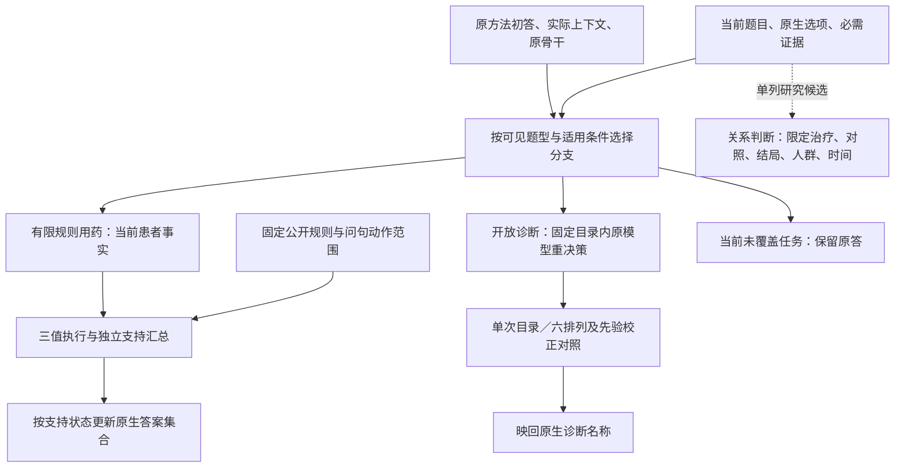

# 医学反事实问答中的支持更新与候选重决策：从失败机制到方法设计

更新：2026-09-16（Asia/Shanghai）。本文是面向论文写作的跨 R1–R3 方法论证稿，集中回答三个问题：现有方法在哪些任务上表现较差，实验把原因定位到了哪里，以及这些发现怎样导向我们自己的方法。它承担跨方向的论文叙述，不替代 [R1 研究记录](optimization.md)、[R2 支持重算记录](r2_support_head.md)和 [R3 候选比较记录](r3_candidate_comparison.md)中的完整运行历史。本文依据截至本日的已有实验与审查撰写，本次没有新增模型实验。

过程配套（2026-09-18）：[R1–R3实验全过程报告](support_update_experiment_report.md)按78个阶段还原初始判断、失败、恢复、用户反馈与逐步优化。

## 摘要

医学反事实问答要求模型在患者条件或给定证据发生变化后，重新判断哪些依据仍然成立、哪些判断获得支持，以及候选之间的相对优势是否改变。检索能够补充医学知识，但知识被找到，并不保证它被正确地应用到当前患者和当前问题。我们在七套医学问答系统的评测中观察到，新增支持、撤销支持和候选重新比较三类任务的得分均较低。进一步检查发现，这些低分来自不同环节：开放诊断受到名称映射和答案空间的影响；规则用药题存在患者事实错绑、条件执行错误及问句范围混用；证据关系题则可能把相邻结局或一般医学知识误用于当前判断。

基于这些发现，我们形成了以当前问题为约束的支持重算与候选重决策方案。对于可由公开规则表达的多选用药问题，模型提取当前患者事实，程序执行前提、例外和独立支持路径，并据此更新答案集合；对于开放诊断，原模型在固定公开目录内重新决策，使比较对象与输出形式保持明确；对于给定证据的关系判断，单独研究治疗、对照、结局和人群的目标绑定。已有开发结果表明，诊断与有限规则分支能够提高七方法在 R1、R2、R3 队列上的原生得分；受控实验进一步支持问句范围筛选和有限规则执行的作用。新的来源与更强对照也显示，目录适配、额外计算和推理改善需要分别归因。当前成果是一组有明确适用范围、可复现的决策组件，以及由失败实验逐步收敛的方法设计。

## 1. 研究问题：条件改变之后，答案应当怎样更新

医学 RAG 通常从问题出发检索相关文献，再由语言模型结合题干和文献生成答案。在这一流程中，检索解决的是知识是否可获得；最终回答还必须解决另一项工作：把一般知识中的条件、例外和结论准确绑定到当前患者。反事实任务使这项工作变得突出，因为与旧判断相关的大部分背景可能保持不变，而决定当前答案的一项条件已经变化。

我们按照变化对具体判断的作用区分三种现象。**R1 新增支持**指新条件为某个判断增加依据，支持增加并不意味着足以确诊。**R2 撤销支持**指原先的一条依据被明确取消或反驳，撤销这条依据后，其他独立理由可能仍然成立。**R3 重新比较**指变化影响至少两个可识别候选的相对支持，需要重新比较候选。三个标签可以共现；它们描述的是推理需求，而非互斥的题型。定义与已审实例见[分类主记录](../data/classification.md#record-0253)。

例如，已审病例 `M01:case_10000` 新增呼气哮鸣，既为一个诊断候选增加支持，也改变了急性喉炎与支气管炎之间的比较。因此，同一病例可以同时属于 R1 和 R3。另一个已审病例 `M01:case_13249` 将自发性气胸个人史替换为深静脉血栓个人史，变化涉及气胸与肺栓塞的相对依据；原文本不再出现气胸史，仍不能被解释为“已明确排除气胸史”。这些例子说明，正确更新需要追踪具体依据及其含义，而不是看到句子变化便强制改变答案。

由此，本文的研究问题是：**在只使用当前输入的条件下，能否把患者事实、问题目标和候选支持关系对应起来，使答案随有效依据更新，同时保留尚未失效的依据？** 原题与变体各自独立推理，分类标签、隐藏参考端和评分答案仅用于离线评价。本文所说的“支持更新”是根据当前条件重新计算判断，不要求推理接口额外获得两个世界，也不等同于估计临床干预的个体因果效应。

## 2. 现有方法究竟在哪些类别上较差

当前正式 v5 比较包括 M0 直接回答、M2 MedRGAG、M3 MA-RAG、M4 MedRAG-Llama、M5 MedRAG-Qwen、M6 MedGENIE 和 M7 TC-RAG 第二版。每个方法覆盖 13,905 个独立模型输入；类别指标先计算单元内非参考任务正确率，再对比较单元等权平均。

| 类别 | 单元数 | M0 | M2 | M3 | M4 | M5 | M6 | M7 |
|---|---:|---:|---:|---:|---:|---:|---:|---:|
| R1 新增支持 | 2,866 | 30.04% | 31.33% | 26.73% | 27.84% | 28.58% | 29.94% | 31.44% |
| R2 撤销支持 | 79 | 8.86% | 7.59% | 34.18% | 29.11% | 41.77% | 18.99% | 29.11% |
| R3 重新比较 | 733 | 17.87% | 24.69% | 8.59% | 30.42% | 25.24% | 21.42% | 28.92% |
| R4 推导后果 | 13 | 38.46% | 53.85% | 38.46% | 53.85% | 53.85% | 61.54% | 30.77% |
| R5 保持判断 | 3,600 | 65.70% | 65.88% | 73.37% | 65.28% | 63.42% | 65.15% | 66.17% |

数据来自[当前七方法正式结果](../evaluation/v5.md#current-seven-methods)。七方法等权均值中，R3 为 22.45%，R2 为 24.23%，R1 为 29.41%，均低于 R5 的 66.42%。这一现象确定了需要优先调查的范围，但类别的来源、题型和评分方式不同，分数排序本身不能证明某种认知机制更难。尤其是全部 733 个 R3 单元均包含于 R1，两个类别的收益不能算作两份独立证据。

进一步按来源拆分，低分具有明显集中性。R1 中 1,780 题为 MedEinst 开放诊断，788 题为 MedCounterFact 证据关系判断，另有 96 道 MedPIC 用药题和 202 道原生单选题；其中 Cultural 的 67 题原正确率已达 89.55%–98.51%。R3 的 733 题中，680 题为 MedEinst 诊断。R2 的 79 题中，75 题来自 MedPIC，其中 66 题答案为“以上皆非”，9 题仍应选择药物。因而，R1 不能被当成一种统一的失败题型；R2 的高分可能受撤销侧答案比例影响；R3 的总分则首先需要检查开放诊断的评价损失。[来源分层](optimization.md#r1-head-investigation)与[R2 分层分析](r2_support_head.md#r2-seven-method-diagnosis)给出了具体分母。

我们据此采取了两个相互补充的切入点：在 R1/R3 中区分诊断内容错误与输出映射损失；在 R2 中利用较明确的规则条件，直接定位支持关系的读取、执行和答案组合。这样的顺序由错误结构决定，而非按最低得分依次增加模型或检索轮数。

## 3. 从错误现象到可检验的原因

### 3.1 R2：知识可获得，支持关系仍可能执行错误

R2 最直接的证据来自同一道题的题面、实际检索材料和模型回答。病例 `s001169` 给出 CrCl=70，检索文献已经包含 15–30 的相关范围，M4 却明确将 70 判断为落在该区间。后续要求模型列出条件的试验中，`s001165` 同样写出了 CrCl=52 和规则 CrCl<30，却将状态标成满足。这些错误说明，在这些实例上，继续寻找相同知识不能解决条件代入错误。[原始病例和检索证据](r2_support_head.md#r2-initial-diagnosis)可以定位这一判断。

第二类错误出现在事实的来源绑定。`s001219` 的当前患者信息只包含年龄、房颤、长期抗凝需求及未孕等条件，模型却把检索文献中另一位患者的轮班、饮食和突变信息移植进当前病例。模型得到了一段医学上相关的文本，却没有保持“通用规则”和“当前患者事实”的边界。该例的最终答案本身无效，不能据它估计全部准确率损失；其过程错误则直接支持将患者事实提取限定在当前题面。

第三类错误来自规则目标和问题范围。自由生成规则时，`s001058` 将一个药物的选项、另一个药物的规则和第三个药物的引用混在一起，程序即使忠实计算这些输入，也会撤销错误的对象。另一类题明确只问肾功能相关的剂量或风险，而模型或早期程序把一般老年用药建议一并加入。这里缺少的不是一条更长的解释，而是对“为哪个选项、回答哪种动作、在什么范围内成立”的约束。[药物错绑](r2_support_head.md#r2-binding-failures)与[问句范围修正](r2_support_head.md#r2-evidence-first)分别保存了这两类证据。

最后，撤销支持要求对全部相关路径重新组合。某药的一项肾功能风险消失，并不代表其跌倒、溃疡或药物相互作用风险也消失；一个例外包含多个条件时，只满足其中一项也不足以触发完整例外。这使得“是否撤销原答案”无法由一个总体安全判断代替。R2 的核心操作应当落在逐选项、逐路径的支持状态上。

方法之间的差异还需要与骨干差异区分。针对同一 167 道 MedPIC、统一输出协议和三种子的受控试验中，75 道 R2 的平均正确率分别为 Llama 无检索 19.56%、相同检索证据下 21.78%，Qwen 无检索 42.22%、相同检索证据下 52.44%。Qwen 加检索的总分增益同时伴随 9 道仍选药物题从 22.22% 降到 7.41%。这说明 M5 的较高 R2 分数既涉及骨干及其原生适配条件，也包含偏向撤销侧的行为变化；不能只据七方法横向差值宣称某种 RAG 算法更善于处理全部支持更新。[骨干与检索实验](r2_support_head.md#r2-backbone-retrieval)给出了逐种子结果。

### 3.2 R1：新增事实必须与具体目标相连

R1 的诊断部分同时存在输出损失和内容错误。早期审阅中，`Pulmonary Embolism (PE)` 因冻结名称映射未覆盖括号形式而计错；另一些回答则把目标诊断判为完全不同的疾病。把全部未映射答案自动补成正确，或把它们全部解释为医学推理失败，都会混淆两种现象。[诊断未映射审阅](optimization.md#record-0255)保留了两类实例。

分类目标与最终诊断也需要区分。六例 Bronchitis 成对审阅确认，R1 标注针对新增咳痰带来的相容支持，原生评分却评价完整诊断是否命中唯一标签；多数原解释已经提及新咳痰。因而，诊断仍错不能统一解释为没有读取新增事实，也可能涉及候选权衡或来源标签的临床充分性。[六例原文、分类与输出对照](../../evidence/bronchitis_review.md)明确了这一边界。

冻结后对 ASCENT 的 47 条来源记录进一步验证了输出约束的影响。在相同本地 canonical-name 评分下，Llama 自由回答为 4/47，要求仅输出一个疾病或系统名称、但仍不给目录后，达到 27/47；这 23 个修复全部来自原回答已经包含目标的列表、同病描述或名称形式。它们支持“答案呈现会造成显著测量损失”，不能被记为新获得了 23 个医学判断。目录单次选择达到 38/47，完整六排列校正头也为 38/47；Qwen 对应为 20、22、39、39。输出形式、候选资源和额外决策需要分别比较。[无目录控制与逐例审阅](optimization.md#r1-postvalidation-refinement)保存了完整依据。

R1 的用药部分提出另一项要求：发现新支持后，系统必须能补入原答案遗漏的选项。早期“只撤销旧选项”的设计即使完全正确，也无法完成这一操作。因此，R2 研究最后采用的支持重算可以迁移到 R1：成立的规则加入选项，明确失效的路径撤销支持，未决部分按既定政策处理。这是同一种执行机制在不同支持变化下的应用。

证据关系题的障碍则是目标错配。MedCounterFact 的问题可能指定一个治疗、对照、结局和人群，而证据同时讨论主要结局、次要结局及不同研究范围。以 `M20:2:variant_1` 为例，当前问题关心医生印象中的认知改善，证据中同时出现主要结局无效和次要结局信息。若只读取文章的总体结论，便可能回答了相邻问题。由此产生的设计假设是先限定所问关系，再使用题目给定证据；后续对照将在第 6 节说明它目前获得的支持。

### 3.3 R3：候选重新比较还受到答案空间和先验影响

R3 要求重新比较候选，但开放生成首先允许模型输出目录外名称、宽泛诊断、亚型或多个诊断。这个生成空间与本地冻结标签空间之间的差异，会遮蔽候选比较本身。因此，我们先将开放诊断重构为公开目录内的原模型决策：让候选明确呈现，输出对应代码，再映回名称。

目录解决了比较对象不明确的问题，却没有保证新证据被正确利用。候选顺序、代码和模型对疾病名称的先验仍会影响概率。六排列和空内容先验校正由此成为进一步研究的组件。然而，观察到顺序敏感只能解释为什么需要测试这些组件，不能预先保证投票或校正有效。已有实验中，校正既产生修复，也会把正确亚型推向错误候选；其效果必须相对于同提示单次目录和未校正投票分别判断。

试图将比较拆成更多显式步骤也暴露了新的瓶颈。在逐观察核验中，模型曾把不含患者事实的标题判断为诊断支持；交换任意候选代码还会改变同一观察的关系判定。事实能被引用，不代表引用蕴含了所赋予的支持关系。如果将这些不稳定关系简单计数，系统只是把上游错误确定地放大。因此，当前保留的诊断方法以原模型目录重决策为主体，没有把未经验证的证据计数或关系图加入主流程。[关系接口试验](r3_candidate_comparison.md#r3-evidence-relations)记录了这一取舍。

### 3.4 为什么复杂基线也没有消除这些失败

多代理或多轮生成增加了产生候选和复核答案的机会，但候选覆盖不足时，继续在原候选之间投票无法补出遗漏答案。M3 在 R3 全部 680 道诊断中只答对 33 题，而在 43 道单选中答对 26 题，高于 M4 的 17 题；其问题集中在特定任务接口。对冻结开发 146 题的全部既有轮次检查发现，至少出现一个原生正确候选的题只有 33 道，最终答对 17 道。这里既有候选生成缺口，也有从已有正确候选中选择失败的问题。一个实例中，多数代理支持药物诱导诊断，题面却没有给出该药暴露。这解释了为何本研究没有把“再加一轮投票”作为 M3 的主要修复路径。[M3 候选覆盖审查](r3_candidate_comparison.md#r3-factorial-running)的前置章节保存了逐题缓存证据。

检索和生成式证据各有不同的问题。M4 的真实上下文中确实出现过指纹、音乐人物等非医学材料，但对开发集 1,168 个已选 query-document 对复演，只有 13 对发生患者 query 截断，所选错误实例并未被截断。因此，无关召回是实际问题，将它进一步解释为“患者尾部被截掉”则没有证据。M6 的定向病例审查发现生成背景后半段出现不连贯内容，也有背景退化但最终答对的例子；缺少参数消融，尚不能把某一采样参数确定为总分原因。[检索审查](r3_candidate_comparison.md#r3-start)与[M6 病例观察](r2_support_head.md#r2-seven-method-diagnosis)分别限定了这两项判断。

由此，现有证据可以解释各方法在若干具体环节的弱点，却不能把整套算法各归为一个单一原因。M0/M2 在 R3 中分别有 527/442 条诊断未映射；M3 还存在候选覆盖和终态无效；M4/M5 的 R2 差异有骨干与检索的受控证据；M6 的背景质量只获得定向病例观察；M7 原流程终态失败则与后接决策头产生新答案分别保留。本文据此选择跨方法可复用的末端干预，并让因果解释停留在实验确实区分过的因素上。

## 4. 失败试验怎样使方法逐步收敛

方法并不是从一个预定的大框架直接得到。研究先尝试了最直接的改进：再次回答、提示模型检查支持条件、增加指南、延长推理，然后才逐步固定事实和执行接口。失败结果决定了哪些工作交给模型，哪些环节可以明确计算，以及哪些分支应停止扩大。

R2 的完整支持审计最初让模型自由生成规则和多层条件，产生了大量长输出、解析失败和规则错绑；缩成局部撤回后，虽然减少了输出负担，却仍可能删掉原先正确的选项。原子核查进一步显示，模型可以在解释中说某条件不成立，却在最终动作中继续选择对应药物。这些结果促使我们缩小语言模型的任务：不再要求它同时发现规则、证明适用性并执行答案修订，而是先固定有出处的规则，只让它提取规则所需的患者事实。

增加医学资料也没有稳定解决这一问题。R2 的指南检索仍出现数值比较和动作范围错误；R3 的候选均分资料、区分性观察筛选、通用鉴别条件生成和医学资料效用筛选没有形成两骨干共同增益。以同一 R3 开发 40 题为例，已有校正头在 M4/M5 上为 21/24 题正确；候选均分新资料降至 7/16，四候选两两比较为 19/21，逐候选诊断核验为 19/20。资料量、比较次数和结构化程度增加，都没有自动提高患者特异性判断。[R3 失败索引与运行记录](r3_candidate_comparison.md)保存了各臂资源和范围。

已有失败也改变了对“程序优于模型”的解释。R2 在充分推理、可读规则和较长预算下，同事实模型执行可以接近程序：历史 Qwen 为程序 44/79、模型 43/79，Llama 为程序 34/79、模型 35/79。程序的价值因而应表述为明确执行约定、减少组合错误及省去额外执行生成，而不是笼统断言语言模型不能执行规则。具体增量需要在相同事实、规则、组装政策和预算下检验。[强执行对照](r2_support_head.md#r2-samefacts-reasoning)是这一判断的依据。

同样，训练病例最近邻曾产生很高的诊断得分，但直接返回近邻标签已经解释了主要效果，因此该路线被保留为有监督检索对照，退出原模型候选比较方法的核心定位。近期“引用必须逐字匹配”的新事实提取也被停止：它增加了引用拒绝和事实缺失，使七方法 R2 结果全部下降。方法最终收敛的依据是各组件实际承担了什么工作，而非中间产物是否显得更丰富、更可解释。

这些取舍也决定了完整方法不干预哪些任务。原生单选的全 202 题普通重答使 M4 从 131 到 134、M5 从 149 到 135；剔除已参与选臂的 24 题后，剩余 178 题分别从 119 到 117、137 到 121，目标提示也未形成稳定收益，因此保留原答。关系分支删除额外检索的扩展对照则为 M4 净增 5、M5 净减 5（各 137 题），最终保留原方法完整上下文。[单选与关系的扩展取舍](optimization.md#r1-relation-extension-complete)由这些对照直接确定。

## 5. 我们的方法：问题约束下的支持重算与候选重决策

### 5.1 共同接口与分工

将当前输入记为 $x=(q,o,e)$，其中 $q$ 是题目与当前患者信息，$o$ 是原生选项，$e$ 是题目要求保留的给定证据；原系统提供初答 $a_0$、其实际可用上下文及原骨干调用接口。不同分支分别使用自身需要的字段。规则分支的事实来自当前题面；诊断分支保留原方法的真实上下文并加入固定目录；关系分支研究如何读取当前给定证据。

这里的统一性体现在同一设计原则：**先明确问题允许哪种判断，再让证据改变对应的支持或候选决策。** 已交付 R1 入口组合了诊断和有限规则两条分支，其他任务透传；R2、R3 保留各自可调用接口。关系分支仍是单列研究候选。下面的图表示这组组件的关系，三个 R 标签仅用于离线分析，不参与在线路由。

### 5.2 用药分支：事实提取与规则执行分开

首先判断当前输入是否进入用药分支：仅原生多选、题面明确出现年龄 ≥65 的 `N-year-old` 表达，且选项至少精确匹配一个规则库药名时，才执行该分支。随后根据可见药名与问题动作选择规则和所需字段。当前库包含 71 条人工整理的公开规则，覆盖有限老年用药问题；一般问句执行相关规则，末问明确限定肾功能时，只执行相应 CrCl/eGFR 规则。当前范围识别采用固定英文问句模式。

原骨干随后仅从当前题面提取事实。布尔字段取 `true/false/null`，数值字段取数字或 `null`，并保留证据句 ID。未报告信息保持未知；列在候选中的药物不因此被视为正在服用。对实际容易反向理解的字段，提取采用正向表达，再由程序对明确布尔值取反。例如，将“无更安全替代方案”改为提取“有更安全替代方案”，避免模型同时理解否定字段名和否定句。句 ID 提供定位，语义可靠性由具体事实审查和端到端结果衡量。

规则执行返回三种状态：满足 `MET`、被当前事实否定 `CONTRADICTED`、信息不足 `UNKNOWN`。同一路径的多个必要条件采用 AND：任一条件被反驳则该路径失效，全部满足才成立，其余未知。同一选项的独立支持路径采用 OR：任一路径成立就保留支持，非空且全部路径失效才判为失效，其余未知。空规则集合也是未知，不能被当成没有风险。

例外按照当前固定的 `documented` 政策处理：完整例外明确成立时，撤销对应路径；前提已成立而例外未知时，保留指南的默认推荐，并记录这一政策被使用。该约定没有把未知事实改写为假，但它影响最终选择，是方法定义的一部分。

在原初答是合法集合 $S_0$ 时，最终集合为：

$$
S_{\mathrm{new}}=\{o_j:s_j=\mathrm{MET}\}\ \cup\ \bigl(S_0\cap\{o_j:s_j=\mathrm{UNKNOWN}\}\bigr).
$$

这条规则同时完成新增与撤销：新成立的支持补入选项，明确失效的支持移出选项，未知项继承原答。若初答无效且仍有未知项，实际入口整体回退；“以上皆非”按原生选项的独占规则组装，不与药物并选。完整定义见[R2 方法与接口](r2_support_head.md#r2-head-method-draft)。

接口示例可以展示这一过程：题面给出年龄 78、CrCl=55，问题问需减量的药物，选项包括 Gabapentin、Famotidine 和 None，原答只选 Famotidine。当前库对应阈值为 CrCl<60 和 CrCl<50，程序分别得到满足与失效，最终改选 Gabapentin。这是既有接口的演示例，说明如何由一份当前事实同时完成补选与撤销，不是新增临床验证样本。[演示与执行步骤](r2_support_head.md#r2-execution-guide)可直接追溯。

### 5.3 诊断分支：先明确候选，再检验重复决策与校正

诊断分支使用固定公开的 49 疾病目录，不检索训练病例答案。原骨干在原方法上下文中读取再次呈现的当前病例，以候选代码作答。选择代码后映回疾病名，按原冻结评分处理。

当前主候选使用六种候选排列；每次根据当前病例对候选代码评分，并以空内容条件的分布估计候选先验。先验请求保留系统消息、角色结构和固定示例，将最后一条可变用户内容整体替换为 `N/A`、`[MASK]` 或空串；该部分包括患者、动态检索及推理内容，追加呈现的病例也一并替换。它并非只删去患者词句、仍保留患者相关检索的条件。校正后分别得到各排列的选择，再聚合成最终诊断。先验、排列和聚合策略均固定，既没有根据当前题答案建立候选，也没有按骨干事后选择最好的一臂。精确实现与单次、未校正、校正控制见[R3 主候选](r3_candidate_comparison.md#r3-head-delivery)。

具体地，对排列 $k$ 和候选 $c$，令 $\ell_k(c;x)$ 为原骨干对候选代码的对数概率。先在各自候选代码内归一化 `N/A`、`[MASK]` 和空串三个空内容条件的分布，再取算术平均得到 $q_k(c)$。校正分布为：

$$
\widetilde p_k(c\mid x)=\operatorname{softmax}_c\bigl(\ell_k(c;x)-\log q_k(c)\bigr).
$$

每个排列按最大校正概率投一票，六票多数决定输出；平票依次按六个校正概率的平均值和固定目录顺序决定。原初答参数只用于错误回退，不单独追加为选择提示；原系统上下文中已有的推理历史仍保留。这里的代码概率校正与 CUPCase 对照中的“完整疾病名称似然除以字符长度”是不同操作。

这一分支的三个设计承担不同职责。目录明确比较对象并限制输出；不同排列用于检验并尝试减轻位置依赖；先验校正尝试降低无患者内容时仍偏好的候选对当前决策的影响。它们的价值在实验中分开报告。特别是空内容概率差是模型评分上的校正量，不能直接称为患者证据的临床因果效应。

### 5.4 关系分支：把证据绑定到所问关系

对于有完整给定证据的关系题，当前研究采用较小的干预：保留原方法完整上下文及题附证据，不额外拼入旧答案，原模型按治疗 A、对照 B、结局、人群和时间范围重新判断，回答 `Higher/Lower/No Difference/Uncertain`。它针对的是问题目标和证据结论错配。题目要求接受的假设证据继续保留；缺乏足够证据与证据支持“无差异”保持区分。

该分支在一个预先限定的 201 题问句族上完成了对照，尚未覆盖全部 788 题，也未加入七方法完整 R1 主候选。它为统一设计原则提供补充证据；实现与结果仍作为独立研究臂保存，避免把多个最佳局部成绩拼成一个实际没有运行过的方法。

## 6. 实验怎样支撑这条方法逻辑

### 6.1 开发结果：系统收益成立，贡献需要拆开

下表汇总当前保留的三个队列结果，单元格均为原答案正确数→相应已交付头的正确数。R1 包含 R3；R2/R3 部分用药题也重合。各列按各自完整分母报告，不能相加为总样本数或一个统一模型的总成绩。

| 原系统 | R1 /2,866 | R2 /79 | R3 /733 |
|---|---:|---:|---:|
| M0 | 861→1,329 | 7→29 | 131→338 |
| M2 | 898→1,323 | 6→23 | 181→340 |
| M3 | 766→1,260 | 27→43 | 63→238 |
| M4 | 798→1,225 | 23→39 | 223→386 |
| M5 | 819→1,367 | 33→46 | 185→443 |
| M6 | 858→1,317 | 15→38 | 157→305 |
| M7 | 901→1,331 | 23→37 | 212→349 |

完整结果分别见[R1 主候选](optimization.md#r1-core-head-delivery)、[R2 交付](r2_support_head.md#r2-head-delivery)与[R3 七方法扩展](r3_candidate_comparison.md#r3-calibrated-all-methods)。这些增益是已暴露开发范围中的实测结果。R1 主候选干预 1,780 道诊断及 72 道适用用药题，其他 1,014 题透传；其中旧 R3 之外的 2,133 题，七方法仍净增 261–319 个正确答案。因此，R1 收益不完全是将旧 R3 成绩重新记账，也没有覆盖全部 R1 推理需求。

R1 的诊断分解清楚展示了各组件的不同贡献。在全部 1,780 道诊断上，M4 从原答 236，增至单次目录 497、六排列未校正 617、校正 634；M5 对应为 194、562、714、718。目录与额外决策带来很大变化，排列有进一步开发收益，校正的附加效果则随骨干而异：七方法校正相对未校正的正确数变化为 +28、−27、+6、+17、+4、+37、−6。当前保留统一冻结策略，同时如实报告这种差异。

R3 的 680 道诊断、七方法合计 1,272 次修复中，1,186 次来自诊断未映射，23 次来自其他评分无效，两者合计 1,209/1,272（95.05%）；其余 63 次来自有效错答。这些是方法×题目观察，不是 1,272 个独立病例。95.05% 不等于简单格式错误：未映射中同时存在别名、粒度、列表以及错误疾病。但这一结构决定了，完整头相对原答的涨分首先证明决策接口的系统效用，候选比较能力的增量还要由同目录对照解释。同一 680 题上，七方法平均正确率从原答 20.97% 到单次目录 45.44%、未校正六票 46.47%、校正六票 46.13%，大部分开发增益已由单次目录取得。[R3 论文方法审查](r3_candidate_comparison.md#r3-paper-method-assessment)保留了该分解。

早期同 40 题名称控制还区分了表面规范化与重新读取患者：M4 原答 12/40，只对原答做名称规范化为 15/40，读取患者后在目录中选择为 18/40；M5 对应为 9、11、18。目录重决策有超出这一名称控制的局部增量，但该对照不等于对全部 680 题完成了临床语义归因。[同资源目录与名称控制](r3_candidate_comparison.md#r3-catalog-transfer)保存了这组开发结果。

R2 的情况不同：130 条跨方法修复均来自原本有效的初答，采用原生精确集合评分，因此不能归因为格式放宽。但是，常数答案是这一队列必须面对的对照。只在同一 55 道覆盖题上恒选可见的 None、其余 24 题仍保留原答，七方法正确数可达到 48、47、58、58、56、52、54，全部高于当前头。当前头在 9 道仍应保留药物的题中答对 2–6 题，而常数对照为 0/9。这支持它确实执行了不同于恒选 None 的行为，也显示当前原生总分仍未胜过答案分布基线。两项结果必须一起保留。[同覆盖政策对照](r2_support_head.md#r2-paper-method-assessment)解释了其范围。

### 6.2 机制证据：固定事实之后，哪些设计仍然有效

最清楚的范围证据来自 R2 的 48 道机制探针。固定最终事实、初答及其余执行条件后，全部相关规则都执行时，两骨干均为 24/48；加入问句范围筛选后均为 48/48。其中一般问句保持 24/24，肾功能限定问句从 0/24 变为 24/24。这里的变化直接落在执行阶段，支撑“正确规则还必须适用于当前问题”这一设计动机。这 48 题由三个机制模板、两种范围和八种实现组成，其意义是受控机制证据。[固定事实范围消融](r2_support_head.md#r2-paper-method-assessment)可复核。

R1 的冻结规则探针提供了执行环节的另一项证据。11 个病例组各含基础、新增支持、无关信息三个端点，共 33 端。Llama 的普通初答、同事实模型执行、程序头分别为 7/33、6/33、21/33；Qwen 为 6/33、17/33、25/33。模型执行与程序共享事实、规则、问句范围及答案组装，因此该差异更直接支持有限规则执行的作用。一个实际反例是，模型虽然识别出 metoclopramide 的胃轻瘫例外及独立的帕金森支持，却让前一路径的例外抑制了另一独立路径；程序按 OR 保留仍成立的支持。[33 端探针与逐例归因](optimization.md#r1-frozen-rules-results)给出了证据。

这一执行收益没有消除事实和最终组装的瓶颈。33 端中，支持路径保持稳定，不代表最终答案在无关变化下保持稳定；UNKNOWN 继承会将原答额外选项带回。后续固定旧事实，仅对明确要求“已记录或已建立支持”的问句收紧选择，Llama 从 21/33 提升到 28/33，Qwen 从 25/33 到 33/33。然而，该窄问句策略在旧 R1/R2 真实题上均未触发；取消问句门控、广泛删除 UNKNOWN 又误删了规则库未覆盖的相互作用支持。因此保留的是限定问句的开发候选，既有默认策略没有替换。

最终 R2 的强模型执行归因也应使用当前版本。旧充分推理对照中，与当前全部执行载荷严格相同的 Llama 26 条、Qwen 29 条，当前程序分别为 12/26、18/29，旧强模型输出经过当前同一组装后为 10/26、17/29。局部增量为 2 题和 1 题，支持程序替代部分执行生成，但不能外推为全部 79 题上的巨大程序优势。它与 33 端、较短预算迁移试验回答的是不同资源条件下的问题，不能合并成一条比较臂。[当前版本强控制的复用条件](r2_support_head.md#r2-paper-method-assessment)已完整记录。

### 6.3 新来源与目标对照：它们把结论限定在哪里

ASCENT 的 47 条记录按固定 49 疾病目录兼容条件筛入，包含 train 来源 42 条、test 来源 5 条。该试验直接沿用旧 MedRAG 模板先验，评价冻结参数向单 user 新模板的迁移；完整头与同提示单次目录的总正确数同为 Llama38、Qwen39。另外，CUPCase 的三批共 18 条来源记录采用来源原生四候选，统一候选标点，并为各题候选集合重新计算匹配模板的先验。累计结果如下，每个骨干都评价同一 18 条记录。

| CUPCase 决策方式 | Llama /18 | Qwen /18 |
|---|---:|---:|
| 同提示单次目录 | 15 | 18 |
| 六排列未校正投票 | 16 | 17 |
| 六排列先验校正 | 15 | 16 |
| 同格式完整名称字符归一对照 | 15 | 14 |

这组结果支持固定目录决策公式的有限来源适配，尚未显示校正优于更简单的同提示单次或未校正策略。记录 `1432` 中，Qwen 的患者分数原本更偏向来源参考 TTR，减去先验后转向野生型标签；先验校正本身可以造成内容退步。18 条记录是自然诊断更新后的单端任务，未构造独立前后端答案；三批又是依次追加，不能写成一次预先冻结的 18 例反事实配对试验。[外部三批审查与原始评分](../../evidence/r3_paper_assessment.md)保存了逐例结果和资格范围。

关系分支的 201 题对照则显示了目标绑定的骨干差异。在本轮同时生成的普通重答和目标提示之间，M4 从 102/201 到 118/201，M5 从 120/201 到 122/201。按 91 个原始 review 聚类，净增的 95% 区间分别为 [1.03,14.93] 和 [−5.19,7.37] 个百分点。当前证据支持 M4 的目标指令增量，对 M5 尚未确认；同请求重复生成也有波动。因此，这一结果可以支撑目标绑定值得保留为研究方向，不能写成两个骨干均已稳定解决关系判断。[本轮匹配对照](optimization.md#r1-frozen-relations-results)是应采用的结果，而非将旧轮最高分与新轮控制交叉比较。

### 6.4 可复现性与代价

三个已交付接口都有独立代码和缓存回放。R1 的 20,062 个方法×输入记录、75,264 次缓存回调与完整汇总一致；R2 的 553 条结果及 385 条真实事实请求已核对；R3 的完整 733 题包完成 28,630 次缓存回调。这些证明保存的组件、请求与结果能够对应复现；回调次数是验证操作，不是新增模型调用或新增病例。

规则分支的主要新增推理是一次原骨干事实提取，随后由程序执行；所选 R2 版本每个覆盖题约增加 Llama561/165、Qwen544/168 个输入/输出 token。诊断主头每题使用六次患者代码评分，同目录和模板的先验可以按原冻结方式复用；CUPCase 每条候选集合不同，每题每骨干还需 18 次先验评分。额外收益与额外调用应共同评价。

七方法结果也有明确生成身份：诊断使用各原模型和原方法实际上下文；规则事实由两种原骨干生成，再与七套原初答离线组合。它们是可接入原系统的末端优化实验，不是七套完整检索流程全部从零重跑。正式 v5 基线表保留，开发头单列，避免把不同实验阶段混成一张新的正式总表。

## 7. 由这些证据形成的论文主张

这项研究最有依据的主线，是把医学反事实问答中的低分拆成可以分别干预的环节，并使方法设计与这些环节对应。诊断名称映射损失导向公开目录决策；患者和文献事实混淆导向题面内事实提取；数值、例外和独立路径错误导向确定性支持重算；一般建议侵入限定问题导向问句范围筛选；相邻结局混用导向关系目标绑定。每个组件都有具体触发原因，也有实际失败来约束其边界。

因此，论文可以围绕三项相互衔接的贡献组织。首先，建立面向支持变化的错误分析，展示同一个低分类别内部可能存在不同的可修复环节。其次，实现可接入原骨干的有限规则支持重算与公开目录重决策，并在七套原系统结果上给出完整开发收益、覆盖和误伤。最后，通过固定事实、匹配目录、常数政策及新来源对照，说明哪些收益来自任务适配，哪些涉及规则执行，哪些机制尚无稳定增量。

方法的新意不能只建立在给三个类别各起一个模块名。三值状态、可执行规则、目录选择和先验校正都有既有技术基础。本工作的研究内容在于针对实际错误明确它们如何组合、何时适用，以及什么证据支持这种分工。与以训练获得领域自反思能力的 Self-BioRAG 相比，本方案研究原骨干上的决策组件；与通过反事实查询探索证据的 CF-RAG 相比，本方案把当前患者条件和问句范围作为执行边界。MedEinst 的 ECR-Agent 与 MedGuideX 也是需要比较的直接近邻，分别涉及医学证据审计和可执行指南逻辑；当前实现没有复现其完整训练或代理流程。[Self-BioRAG](https://arxiv.org/html/2401.15269v3)、[CF-RAG](https://proceedings.iclr.cc/paper_files/paper/2026/file/1c078897dc08d46091d0d361d9955c6b-Paper-Conference.pdf)、[MedEinst](https://aclanthology.org/2026.acl-long.1847/)、[MedGuideX](https://arxiv.org/abs/2605.26567)。

面向后续工作的统一方法方向也由负结果决定：应优先补足具体支持路径与事实含义，而非继续增加通用核验轮数。药物已有一条规则，并不等于其相互作用、用途和其他独立支持都被覆盖；引用存在，也不等于患者满足该条件。若要把当前组件推进为更广的支持更新方法，关键是固定清楚的适用范围和知识覆盖，再在未参与开发的病例上验证同资源净收益。这是后续方案，当前没有将其写成已完成的实现。

## 8. 局限与决定性补证

**第一，当前三类低分不能都归为单一推理缺陷。** 类别来源与任务构成不同，R3 全部包含于 R1；骨干、原流程预算和输出协议也不同。本文的原因解释来自实例与受控实验，尚未对每一类全部错误完成临床语义归因。诊断使用本地冻结 canonical 评分，ASCENT 未运行作者的完整语义 F1 评价。输出适配后的分数不能直接译为临床诊断能力。

**第二，开发收益与独立有效性有不同证明范围。** v5 已反复用于提示、范围和策略开发，这一用途可以保留，但其成绩不能再当未见测试。ASCENT47 在首轮冻结验证之后又参与定向开发；新版不能继续用同一批称作独立验证。R2 的 96/48 模板探针与 R1 的 33 端属于受控规则证据，独立临床用药验证仍缺失。CUPCase18 是经过资格选择的自然更新记录，并非独立 CF 两端评测。

**第三，支持执行可靠不等于端到端事实可靠。** 最终 R2 中每骨干有 112/220 个覆盖选项为 UNKNOWN；合法初答的变化可以影响大部分覆盖题的输出。证据句 ID 没有解决所有主体、否定、用途和数值绑定问题，有限规则库也未覆盖全部相互作用。近期新提取和广域删除 UNKNOWN 的退步，已经表明这些缺口会进入最终答案。

**第四，整体收益不替内部组件完成归因。** R2 总分低于同覆盖常数 None；强同事实模型有时接近程序。诊断的六排列和先验校正在开发、新来源和不同骨干间表现不一。新 1100 诊断中的既有病种仍可能很难，例如肺栓塞在旧 205 题与新 23 题上的表现显著不同，不能由目录覆盖或增加病种解释全部差距。当前也没有完整 R5 新干预评测：R1 中重合的 450 个 R5 单元均透传，不能据其零误伤宣称统一方法保持性已经成立。

最直接的补证有两个明确方向。有限规则组件需要冻结规则、事实提取、问句范围与 UNKNOWN 政策，在新的病例或未见机制家族上，同时评价撤销、保留和新增支持；与同规则资源的模型回答及同事实充分推理控制比较。候选比较组件若要承担 CF 机制主张，需要具有可信前后端答案的独立病例组，各端单独调用，比较同提示单次、未校正和完整冻结头，并报告两端均正确和应保持情形。它们分别回答当前实际缺口，不要求为了写作再次启动一轮无明确目标的复杂方法搜索。

本文据此完成的逻辑链是：**先从低分中辨认测量与推理问题，再定位事实、范围、执行及候选决策的具体失效，随后用有边界的组件逐一修复，最后以能够区分替代解释的对照确定方法贡献。**

## 附录 A. 调整、失败与方法取舍的追溯索引

本索引按照对方法设计的影响组织；连续试跑、恢复和全部配置仍由链接中的主记录维护。不同分母、不同事实版本和不同预算的结果分别保留。运行初始化失败与有完整输出的机制负结果分开处理。

### A.1 R2：从自由审计到有限支持重算

| 尝试或调整 | 观察与取舍 | 对方法形成的作用及记录 |
|---|---|---|
| 通用复核、来源复核、支持更新提示 | 原 M4 23/79，三臂为 12、12、22；支持版 6 修复、7 误伤，未采用 | 额外复核本身不能解释为有效支持更新。[首轮](r2_support_head.md#r2-first-prompt-trial) |
| 自由完整审计 v1 | 程序版 2/79，34 条无效，规则与条件层次难以可靠生成 | 停止长审计原型，缩小模型职责。[v1](r2_support_head.md#r2-v1-result) |
| 只撤回旧选项 v2 | 程序仍 23/79；唯一实际撤回仍答错，并删除原集合中正确选项 | 程序不能修复错绑的规则，只删除也不能补漏选。[v2 与绑定](r2_support_head.md#r2-binding-failures) |
| 原子判断、自述反例、解释后再映射动作 | 原子两候选 7/79、8/79；再映射降到 5/79，输出可有效但动作仍错 | 不把文本解释的一致性当作规则执行正确性。[原子判断](r2_support_head.md#r2-atomic-result)、[动作映射](r2_support_head.md#r2-action-mapping) |
| 患者与空内容对比分数、自然词标签 | 字母和自然词仍有明显标签/展示顺序敏感，没有形成有效头 | 停止继续扫标签或校正系数。[CAD 与标签](r2_support_head.md#r2-verbalizer) |
| 指南整页检索、条件提示、thinking、覆盖扩展 | 指南版低于普通复核；thinking 条件 51/79 低于同配置重答 56/79，保留侧仍 0/9 | 继续增加资料和预算没有解决独立支持保留，转向固定规则。[指南](r2_support_head.md#r2-guideline-pages)、[强推理](r2_support_head.md#r2-thinking-result) |
| 虚构规则与多选 schema 顺序对照 | 简单规则上普通和条件提示均满分；顺序问题修正不能单独解释临床差值 | 区分接口正确、规则读取和真实用药判断。[探针](r2_support_head.md#r2-fictional-rule-probes)、[顺序](r2_support_head.md#r2-order-native-result) |
| 固定公开规则、句 ID 事实提取 | 首批 Qwen 程序 40/79、保留 4/9，句 ID 版 44/79、保留 6/9 | 形成同时撤销和保留的可用分支；规则来源与患者事实分离。[固定规则](r2_support_head.md#r2-executable-rule-head) |
| 旧串联负结果更正 | tuple/list 组装修复后，串联可达 49、55 或严格政策 57/79，旧“只能恢复 1/9”撤回 | 实现错误修复后的离线重算不能继续列为方法失败，也不能混入其他政策成绩。[更正](r2_support_head.md#r2-native-answer-type-fix) |
| 覆盖外再答路由 | Qwen 完整路由 54/79；Llama 27/79，覆盖外 24 题中 13 条长输出截断 | 统一默认保留覆盖外原答。[路由](r2_support_head.md#r2-task-scoped-complete) |
| 问句动作与肾范围 | 在同事实下增加正确答案，固定事实探针 24→48/48 | 把“知识成立”进一步收窄到“对所问动作和范围适用”。[范围](r2_support_head.md#r2-evidence-first) |
| 长提取提示、证据先行、正向变量 | 加长提示未稳定改善；两个否定式字段改正向后修复 Llama 范围探针 40→48/48，原生最终答案不变 | 保留短正向提取；收益属于表示组合，不宣称字段名单因素作用。[表示](r2_support_head.md#r2-positive-facts) |
| 仅 MET 与恒选 None | 同覆盖总分持平，但支持保留构成不同；默认 UNKNOWN 继承的总分更低 | 总分、保留行为和政策身份分开，未按答案分布改称全局成功。[政策](r2_support_head.md#r2-selection-policy) |

R2 还保留了 schema 后端不支持、PDF 旋转表抽取遗漏、共享显存初始化失败、driver 未退出和正向字段影响范围误判等恢复记录。它们决定实现和复现条件，不直接证明医学机制有效或无效。[工程失败与恢复](r2_support_head.md#r2-engineering-failures)。

### A.2 R3：从增加比较步骤到明确候选空间

| 尝试或调整 | 观察与取舍 | 对方法形成的作用及记录 |
|---|---|---|
| 普通与判别复核 | 同 146 题，M4 原 39→31/28，M5 原 32→32/29；没有净收益 | 不把更详细的审计提示直接作为方法。[首轮](r3_candidate_comparison.md#r3-start) |
| 临床查询、原文查询、原/新资料×普通/判别六臂 | 查询相关性可改善，但出现患者事实改写，六臂没有形成有效头 | 能检索到更相关文档不等于最终比较更可靠。[六臂](r3_candidate_comparison.md#r3-factorial-result) |
| 训练病例差分、近邻记忆及来源控制 | 开发诊断 124/128、旧确认 535/552；直接近邻标签已解释主要收益 | 改列有监督检索对照，撤回核心原模型比较机制定位。[自我审查](r3_candidate_comparison.md#r3-head-self-review) |
| 患者证据暂隐、再审计、多数门控 | 规划引文大量来自外部文档；修复句 ID 后仍无跨骨干收益 | 合法编辑不等于正确反事实诊断，停止该版。[过程重启](r3_candidate_comparison.md#r3-process-restart) |
| 三候选似然、表面规范、目录名称、代码、病例重呈现 | 目录资源与重新选择解释较大部分增益，重呈现附加增量较小 | 固定公开候选空间，加入同资源名称/单次控制。[目录迁移](r3_candidate_comparison.md#r3-catalog-transfer)、[v1](r3_candidate_comparison.md#r3-patient-selection-v1) |
| 去旧推理、去检索资料、统一系统提示 | 未形成一致改善 | 保留各原方法真实上下文，不事后挑上下文版本。[上下文](r3_candidate_comparison.md#r3-context-selection) |
| 完整分布、六排列与空内容先验 | 形成当前可交付开发头，但投票/校正各自不对所有方法增益 | 将系统收益与组件作用分开；保留统一冻结策略。[分布](r3_candidate_comparison.md#r3-catalog-distribution)、[完整扩展](r3_candidate_comparison.md#r3-calibrated-all-methods) |
| 患者/背景概率对比、双向两两比较 | 同 40 题均未超过当前主候选 | 额外比较与背景扣除不能替代可靠的患者支持。[背景](r3_candidate_comparison.md#r3-patient-contrast)、[两两比较](r3_candidate_comparison.md#r3-pairwise-comparison) |
| 区分性观察选择、逐候选核验 | 局部有改善，整体无两骨干共同收益；存在无效选择回退 | 不将单例表面增分当作证据选择机制成立。[观察选择](r3_candidate_comparison.md#r3-evidence-selection)、[候选核验](r3_candidate_comparison.md#r3-pointwise-verification) |
| 候选资料均分、相关性检索、效用筛选 | 新资料可能被学习目标和通用介绍占据；减少此类材料仍未提高主结果 | 资料供给须满足实际鉴别需求，未加入主头。[资料分配](r3_candidate_comparison.md#r3-candidate-knowledge-allocation)、[效用](r3_candidate_comparison.md#r3-knowledge-utility) |
| 延迟选项与分项汇总 | 原生单选和分项解释未形成共同收益 | 保留单选透传；不把结构化汇总当作自动有效。[延迟](r3_candidate_comparison.md#r3-delayed-options)、[汇总](r3_candidate_comparison.md#r3-option-aggregation) |
| 冻结 R2 规则迁移 | R3 用药 10 题七方法提升；3 题与 R2 重合，另 7 题也属已暴露 v5 | 复用已有有效机制，形成规则子分支。[规则迁移](r3_candidate_comparison.md#r3-frozen-rule-transfer) |
| 反向病例似然、先生成通用鉴别条件 | 反向评分同 40 题 M4/M5 为 1/11；通用条件没有超过现头 | 不将生成病例概率直接当患者支持强度。[反向似然](r3_candidate_comparison.md#r3-channel-likelihood)、[通用条件](r3_candidate_comparison.md#r3-general-criteria) |
| 逐观察关系、局部输入、名称绑定、逐候选接口 | 标题被当成支持，代码交换改变关系，修正后仍无共同诊断收益 | 不将不可靠关系用确定性计数放大。[关系](r3_candidate_comparison.md#r3-evidence-relations)、[局部输入](r3_candidate_comparison.md#r3-local-evidence-relations)、[名称绑定](r3_candidate_comparison.md#r3-bound-evidence-relations) |
| 训练统计特征与事实综合 | 合成训练中的零频率会惩罚反事实保留背景，事实主体/否定也有错误 | 停止该统计头，不把训练分布缺失当临床反证。[统计头](r3_candidate_comparison.md#r3-empirical-feature-head) |
| 字段说明×约束解码、R2 三值接口迁移、NLI | 显式说明有局部改善，取消约束未改变相应判断；整体未形成共同收益 | 接口形式和闭世界假设不能直接跨任务迁移。[字段](r3_candidate_comparison.md#r3-fact-scope-factorial)、[NLI](r3_candidate_comparison.md#r3-fact-nli) |
| CUPCase 标点与三批冻结验证 | 开发时发现唯一句号与答案对应，统一格式后旧表面增量消失；新三批未证明校正稳定增量 | 保留四候选适配成果，明确单端、分批和控制范围。[标点](r3_candidate_comparison.md#r3-cupcase-option-style)、[最终审查](r3_candidate_comparison.md#r3-paper-method-assessment) |

R3 的 token 长度误计、引文跨块定位、依赖导入、共享显存、先验准备、上下文超长与中断恢复，均在相应章节和运行包保留。特别是源数据超窗或初始化失败没有产生合法医学输出，不能作为候选比较的负准确率；已经生成但无效的输出则保留原评分分母。

### A.3 R1：共享组件扩展与新增缺口

| 尝试或调整 | 观察与取舍 | 对方法形成的作用及记录 |
|---|---|---|
| 回查 DeltaRev、DeltaRank、Profile/CPG 和 Residual Adapter | 旧路线既有负结果/局部收益，又依赖两端和旧候选构造权限 | 借评分与对照思想，不直接移植成当前单输入方法。[历史调查](optimization.md#r1-head-investigation) |
| 冻结诊断与规则扩展 | 新 1100 诊断和 62 规则题进入扩展，七方法主候选完整交付 | R1 复用 R2/R3 的共同结构；旧重合与新增贡献分开。[完整结果](optimization.md#r1-core-head-delivery) |
| 原生单选目标提示、去旧答、普通重答 | 全 202 普通重答 M4 131→134、M5 149→135；去掉已用于选臂的 24 题后，两骨干剩余范围均退步 | 不加入完整头，保留原答案。[单选扩展](optimization.md#r1-relation-extension-complete)的前置小节 |
| 关系带旧答/去旧答、题附证据/检索上下文、目标提示 | 去旧答有开发信号，删除检索无共同增量；最终新匹配控制仅 M4 确认目标提示增量 | 关系限定为 201 题独立候选，不扩大到完整 788。[关系对照](optimization.md#r1-frozen-relations-results) |
| ASCENT47 冻结目录验证与自由答案审核 | 完整头与单次同分；“无效”大多是本地单标签未映射 | 收窄诊断提升的医学解释。[冻结验证](optimization.md#r1-frozen-validation-complete) |
| 33 端规则验证 | 程序比同事实模型执行更好，但 UNKNOWN 继承和有利事实错误仍存在 | 支持有限执行机制，继续分析事实与最终集合。[规则探针](optimization.md#r1-frozen-rules-results) |
| 明确支持问句的窄策略与广域删 UNKNOWN | 窄策略探针有效、旧真实题不触发；广域策略误删未编码相互作用支持 | 仅保留窄问句开发候选，默认未替换。[后续组合](optimization.md#r1-postvalidation-refinement) |
| 引文先行的新事实表示及大小写敏感性 | 新事实使七方法真实 R2 全部退步，大小写恢复未挽回结论 | 不采用；引用要求更严不能替代语义正确。[新事实失败](optimization.md#r1-postvalidation-refinement) |
| 无目录单名诊断控制 | Llama 4→27 的 23 修复来自旧答已包含目标，Qwen 有修复也有误伤 | 将输出形式贡献从推理主张中分离。[完整审阅](../../evidence/diagnosis_refinement_results.md) |

R1 的目录恢复、vLLM/KV 预算、依赖环境、共享卡 OOM、关系队列无 traceback 中断及完成后的陈旧显存门槛失败，都有原样保留的恢复记录。后续事实分析还纠正了 tuple/list 导致的变化条数误计及缺字段被算作空值正确的问题，原输出和主准确数保持。这些过程见[R1 开发包](../../evidence/r1_head_experiments.md)、[冻结验证包](../../evidence/r1_head_validation.md)与[定向开发包](../../evidence/r1_head_refinement.md)。

## 附录 B. 三篇写作参考及采用方式

本次查阅了以下三篇正式发表论文的摘要、引言、方法、实验分析与结论部分，用于学习论证组织。这里选择的是与本任务相关的代表性论文；未核实到三篇获得 Best Paper 奖，不将发表场所等同于获奖。正文采用它们共有的“问题—观察—设计—验证”结构，以本项目证据重新写作。

| 论文 | 借鉴的组织方式 | 在本文中的体现 |
|---|---|---|
| Xiong et al., **Benchmarking Retrieval-Augmented Generation for Medicine**, Findings of ACL 2024 | 先固定评测问题，再按语料、检索器与骨干拆分影响，最后从结果形成建议 | 先给类别及来源构成，再用受控结果解释方法差异。[论文](https://aclanthology.org/2024.findings-acl.372/) |
| Jeong et al., **Improving Medical Reasoning through Retrieval and Self-Reflection with Retrieval-Augmented Large Language Models**, ISMB/Bioinformatics 2024（Self-BioRAG） | 从领域适用缺口导出组件，将整体结果与组件分析分开 | 事实提取、范围、执行和初答继承分别说明职责与证据。[全文](https://arxiv.org/html/2401.15269v3) |
| Qin et al., **Counterfactual Reasoning for Retrieval-Augmented Generation**, ICLR 2026（CF-RAG） | 用具体失败引出问题，再让设计回应失败，并安排相应对照 | 用数值错判、患者错绑与候选敏感性串联动机和方法；因果措辞按本地证据限定。[正式论文](https://proceedings.iclr.cc/paper_files/paper/2026/file/1c078897dc08d46091d0d361d9955c6b-Paper-Conference.pdf) |

本文另核对了[MedEinst/ECR-Agent 正式发表页](https://aclanthology.org/2026.acl-long.1847/)、[MedGuideX](https://arxiv.org/abs/2605.26567)及[MedPIC](https://arxiv.org/abs/2608.03028)的一手信息，以定位直接近邻和来源任务。三篇写作参考不构成穷尽的新颖性综述；本文的实验数值均来自本地记录，不移用外部论文分数。

## 附录 C. 会话与文档阅读范围

三个 ID 对应本地会话，而非 Linux PID。本次按时间完整阅读了三个会话中全部可读的实质用户/助手正文，并将调整、失败和结果追溯到当前主文档、运行文档及必要制品。事件镜像和重复工作区提示按同一文本处理。

| 会话 ID | 原始日志规模 | 实际内容与阅读覆盖 |
|---|---|---|
| `01a0a9f0-8f78-7cf2-8287-945bf42130ea` | 748 行，5,643,047 字节 | R1/R2 交叉审计，随后按用户纠正审查 R2/R3；2 条实质用户正文、14 条助手正文及可读代理结论 |
| `01a09dd7-8667-7ab0-8a9e-7051b56031e7` | 18,231 行，113,391,220 字节 | R2 完整探索后转 R3，直到开发交付与外部验证；519 条去重实质用户/助手消息顺序阅读 |
| `01a0a866-0afc-7803-a5d3-a915d7b45e1b` | 5,102 行，22,941,936 字节 | R1 接续调查、方法扩展、冻结验证及 270 调用定向开发；126 条可读用户/助手正文及 16 份可读代理结论 |

原件分别为 01a0a9f0 会话（本地来源：`/home/data3/txy/.codex/sessions/2026/09/16/rollout-2026-09-16T19-18-30-01a0a9f0-8f78-7cf2-8287-945bf42130ea.jsonl`）、01a09dd7 会话（本地来源：`/home/data3/txy/.codex/sessions/2026/09/14/rollout-2026-09-14T10-55-42-01a09dd7-8667-7ab0-8a9e-7051b56031e7.jsonl`）、01a0a866 会话（本地来源：`/home/data3/txy/.codex/sessions/2026/09/16/rollout-2026-09-16T12-07-34-01a0a866-0afc-7803-a5d3-a915d7b45e1b.jsonl`）。

当前主文档全文覆盖为：`optimization.md` 955 行、`r2_support_head.md` 1,796 行、`r3_candidate_comparison.md` 1,975 行（均为读取时规模）；另读取分类、统一协议、v5 当前结果及有关审查。R1 对应运行叙事文档 31 份，R2 运行/审计文档 66 份，R3 运行/候选文档 75 份及来源说明；相关失败与恢复收据一并核对。详细清单和阅读范围保存在[本次写作证据包](../../evidence/reading_scope.md)。

**阅读边界：** 部分内部消息与压缩记录只有加密字段，本次无法解读；一些旧工具返回在生成时已截断，无法从该返回恢复全文。对实质研究内容，已回到现存完整主记录、运行说明和原始制品补读，但不把全部日志字节、加密内容或每条重复工具输出称作逐字通读。长病例/论文原文汇编主要复核其已完成的完整审阅报告，并定向核对用于正文的实例；没有重新为所有病例进行一次独立临床审阅。
