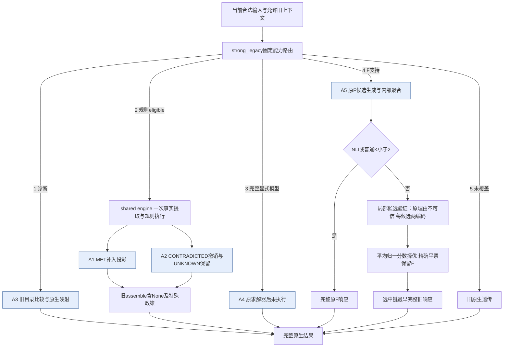

# 五张主表：当前已完成开发范围快照

本文件汇集真实已有历史121、自然52、C5及已完成的C0缺项补充，具体制品日期与来源见同目录receipt.json；持续研究正文仍由 `docs/research/cf_moa.md` 维护。完整v5及冻结后新家族/独立F池复本尚待完成，不能将下面的小面板结果冒称全量或盲测。

C0为各骨干原始方法初答；C1为保留采用head的强B；C2/C3/C5共享原F实际候选池，C4单列已付费追加三回答扩池控制。C3是唯一主研究候选，旧默认B不被本表覆盖。

## 表1：整体原生效果

单元格为“正确输入数/完整分母；非reference原生ALL单元均分”。历史各74单元，自然各18单元。参考端和重叠R标签不重复加入ALL。

| 方法 | 历史121 M4 | 历史121 M5 | 自然52 M4 | 自然52 M5 |
|---|---:|---:|---:|---:|
| 原方法初答 | 74/121；61.892% | 69/121；55.856% | 35/52；54.815% | partial：27/48已观察，4/52缺原答；ALL待补 |
| 强B | 87/121；70.270% | 82/121；64.414% | 35/52；60.370% | 26/52；49.259% |
| 逐候选，无理由 | 87/121；68.919% | 83/121；63.964% | 33/52；61.481% | 27/52；52.593% |
| 逐候选，带理由（主研究） | 88/121；71.622% | 87/121；68.919% | 35/52；66.667% | 28/52；48.148% |
| 旧池＋三份已有重答 | 89/121；71.622% | 83/121；66.667% | 35/52；62.222% | 26/52；53.704% |
| 同池同理由，整体选择 | 87/121；68.919% | 79/121；63.964% | 32/52；54.815% | 29/52；52.593% |

**C0自然身份与补充。** `baseline_native_scores_reused.jsonl`实际来源是 `combined_head`，不能当C0。原来源断言保留，每骨干48条original分数继续复用；n00000/n00005/n00019/n00030原历史输入没有原答。只有已完成固定四条原C0运行并保存评分的骨干才追加结果，未完成者保持partial，不以native_single代替、不把缺项补为错误。当前：M4 52/52，complete；M5 48/52，partial_original_response_absent。

四个面板/骨干的C1–C5输出均完整。历史M5原B的一条不可用答案（d00050）在C1–C5继续保留；C5新调用失败为0不意味着旧B可用率100%。720个来源×R原生分层见 `table1_source_R_strata.json`，每层保留原单元权重，重叠R不能相加。

完整v5：每骨干13905输入、15616原生映射、6104非参考单元。本表仅覆盖已完成小面板；全v5实际运行进度见持续主记录，质量表待实际全量完成；冻结后新家族及独立F池复本也不填预期成绩。

## 表2：候选选择机制

每格为“在旧池含正确键时选中数/覆盖数；相对B修复/误伤”。旧非NLI分歧范围依次25、26、22、15组；正确键覆盖17、21、20、13。C4已有三份追加回答未新增正确键覆盖，仍属于扩池控制，不能称与C1/C2/C3/C5严格同池。

| 方法 | 历史M4 | 历史M5 | 自然M4 | 自然M5 |
|---|---:|---:|---:|---:|
| 强B | 9/17；0/0 | 10/21；0/0 | 14/20；0/0 | 5/13；0/0 |
| 逐候选，无理由 | 9/17；3/3 | 11/21；5/4 | 12/20；4/6 | 6/13；6/5 |
| 逐候选，带理由（主研究） | 10/17；3/2 | 15/21；6/1 | 14/20；3/3 | 7/13；5/3 |
| 旧池＋三份已有重答 | 11/17；3/1 | 11/21；4/3 | 14/20；2/2 | 5/13；2/2 |
| 同池同理由，整体选择 | 9/17；4/4 | 7/21；2/5 | 11/20；3/6 | 8/13；6/3 |

C3合计17修复/9误伤，C5为15修复/18误伤。C5自然M5有收益，但历史M5和自然M4退步；不能按面板/骨干事后拼最好控制。C3全部26新变更的私有原文审阅另存 `../changes_review/`；旧理由不是验证器生成的推理，正确键选择也不意味着旧理由或辅助字段全正确。

C5相对B的新增配对家族区间（5000次、seed240924；旧C2/C3/C4统计不覆盖）：

| 面板 / 骨干 | 原生点差pp | 95%配对家族差值区间pp |
|---|---:|---:|
| historical121 / M4 | -1.351 | [-8.238, 5.882] |
| historical121 / M5 | -0.450 | [-5.993, 5.229] |
| natural52 / M4 | -5.556 | [-16.667, 0.000] |
| natural52 / M5 | +3.333 | [0.000, 8.889] |

这些区间是已暴露开发范围下的描述性统计，不移除方法选择偏差，不证明未见泛化；区间跨零不是停止预定评价的门。

## 表3：CF行为和完整响应字段

保持与应变分别报告双正确，不能由两端不同就称反事实成功。每格为“保持双正确/对数；应变双正确/对数；辅助valid/exact/映射数”。

| 方法 | 历史M4 | 历史M5 | 自然M4 | 自然M5 |
|---|---:|---:|---:|---:|
| 原方法初答 | 35/73；0/4；11/0/12 | 38/73；0/4；12/2/12 | 16/28；0/2；11/0/12 | 9/28；partial 0/0已观察（总2）；12/2/12 |
| 强B | 48/73；1/4；11/0/12 | 44/73；1/4；12/2/12 | 17/28；1/2；12/0/12 | 10/28；1/2；12/2/12 |
| 逐候选，无理由 | 48/73；1/4；11/0/12 | 44/73；1/4；12/2/12 | 14/28；1/2；12/0/12 | 7/28；1/2；12/2/12 |
| 逐候选，带理由（主研究） | 47/73；1/4；11/0/12 | 46/73；1/4；12/2/12 | 16/28；1/2；11/0/12 | 9/28；1/2；12/2/12 |
| 旧池＋三份已有重答 | 50/73；1/4；11/0/12 | 44/73；1/4；12/2/12 | 17/28；1/2；12/0/12 | 10/28；1/2；12/2/12 |
| 同池同理由，整体选择 | 48/73；1/4；11/0/12 | 42/73；1/4；12/2/12 | 10/28；1/2；11/0/12 | 10/28；1/2；12/2/12 |

辅助correction语义质量尚未独立评分，维持null。C5历史/自然M4均出现11/12辅助valid；没有事后拦截或修补，以整份选中旧响应原样计分。完整TP/FP/FN与C0已存资格见 `table3_pairs_auxiliary.json`。自然C0辅助结果可从已绑定的正式document_detection文件精确复用；历史缺旧辅助评分者仍明确未知，未为填表重grader或重算辅助。

**表3独立分表：旧A4给定模型验证。** 下列为2026-09-17事前冻结的24参数/初态profile×12题=288，不是新患者、不是本轮121/52临床覆盖，也不是本轮新增模型调用。

| 骨干 | 原臂 | 二元正确/288 | 联合数值正确/288 | 三输出同时正确/288 |
|---|---|---:|---:|---:|
| M4 | redo | 118 | 0 | 0 |
| M4 | full | 286 | 270 | 270 |
| M4 | patch_no_do | 234 | 67 | 67 |
| M4 | patch | 288 | 288 | 288 |
| M5 | redo | 187 | 0 | 0 |
| M5 | full | 265 | 222 | 222 |
| M5 | patch_no_do | 234 | 67 | 67 |
| M5 | patch | 288 | 288 | 288 |

联合数值按旧容差：CF Gsub和CF−factual两值各绝对误差≤1mg/dL。它验证同一已给simglucose模型内的动作绑定/数值执行，不证明真实临床患者预测误差为零。来源：`Documents/Codex/2026-09-17/r4_structural_head/physiology_head/v2/heldout/summary.json`；持续说明 `docs/research/r4_consequence_head.md`。

## 表4：角色、覆盖与操作消融

| 角色 | 实际代码入口 | 输入与输出 | 历史121激活/骨干 | 自然52激活/骨干 | 完整v5合法覆盖/骨干 |
|---|---|---|---:|---:|---:|
| A1支持建立 | minimal_operations.rule_operations | shared engine同一facts/status/S0 → add及依据 | 9 | 0 | 123（规则分支已完成；全系统未完成） |
| A2支持撤销 | 同一rule_operations | 同一执行结果 → remove/UNKNOWN保留；旧assemble决定最终集合 | 9，同一次共享执行 | 0 | 123，同一次共享执行 |
| A3候选比较 | adopted catalogue / legacy_R1 | 全病例/旧上下文/目录 → 旧键到原生名称映射直返 | 8 | 0 | 3560（目录分支已完成；全系统未完成） |
| A4后果执行 | adopted a4 executor | 完整显式模型/起点/干预 → 原求解数值直返 | 0 | 0 | 0；另列旧24profile |
| A5稳健读出＋局部验证 | a5_robust_readout.run_legacy → a5_candidate_verify.run | 完整原输入 → 原F候选 → 普通K≥2逐候选双编码 → 旧完整响应 | F104；C3验证25/26 | F52；C3验证22/15 | F10178；实际K分布待运行 |
| 旧透传 | strong_legacy未覆盖分支 | 原完整原生响应保留 | 0 | 0 | 44 |

A1/A2是同一个旧规则执行核的正负操作投影，不是两个独立训练模型，不新增两次事实抽取。非F路径不运行候选验证器；NLI及普通K<2不追加取分。覆盖不等于已运行或有效贡献。

本轮完整123规则覆盖输入/骨干的两个独立操作视图已完成；它们共用已保存事实与规则执行，不代表两位独立模型合作。该范围正好逐题对应123非参考ALL单元。

| 骨干 | 操作视图 | 正确/123 | 原生ALL | 适用视图数 | 修复/误伤相对B | 不可用 |
|---|---|---:|---:|---:|---:|---:|
| M4 | strong_B | 69 | 56.098% | — | 0/0 | 1 |
| M4 | disable_add | 43 | 34.959% | 119 | 3/29 | 1 |
| M4 | disable_remove | 53 | 43.089% | 119 | 2/18 | 1 |
| M5 | strong_B | 71 | 57.724% | — | 0/0 | 14 |
| M5 | disable_add | 48 | 39.024% | 106 | 4/27 | 14 |
| M5 | disable_remove | 60 | 48.780% | 106 | 0/11 | 14 |

禁用add将未选实体的MET在独立组装视图映为UNKNOWN；禁用remove将已选CONTRADICTED在视图映为UNKNOWN，均继续调用旧assemble。原facts、paths、原执行结果、None/UNKNOWN特殊政策和默认方法不修改。无效原答导致不适用者保留B与完整分母，既有不可用M4 1、M5 14条未删除。

删除add分别损失26/23个正确输入，删除remove分别损失16/11；两操作也各有个别误伤，不能声称更新必定正确。旧9题面板未观察到移除动作，其旧结论不被重写成已显示撤销收益；这里是完整123规则子范围的新机制视图，仍非13905全系统结果。

证据来自 `../operation_ablations/` 的492操作trace、738原生记录及收据；该独立任务新增53次缺失原生评分（39改答＋14不可用接口），0模型/0重做facts。本次表格只读复核，没有再次评分。

## 表5：质量—成本与稳定性

每个部署方法归属一次同范围已付B/F成本；共同历史初答按既有口径排除，其实际花费不能写成零。表中增量是该方法依赖的真实调用，C2/C3及C4已在此前批次支付，只有C5为本轮新取分。

| 范围 / 骨干 | 方法 | 额外调用 | 额外输入/输出token | B＋增量调用 | B＋增量输入/输出token |
|---|---|---:|---:|---:|---:|
| historical121 / M4 | C1 | 0 | 0/0 | 420 | 1,828,059/84,395 |
| historical121 / M4 | C2 | 110 | 810,638/110 | 530 | 2,638,697/84,505 |
| historical121 / M4 | C3 | 110 | 869,408/110 | 530 | 2,697,467/84,505 |
| historical121 / M4 | C4 | 75 | 588,135/7,894 | 495 | 2,416,194/92,289 |
| historical121 / M4 | C5 | 50 | 414,842/50 | 470 | 2,242,901/84,445 |
| historical121 / M5 | C1 | 0 | 0/0 | 419 | 1,741,881/84,025 |
| historical121 / M5 | C2 | 120 | 986,162/120 | 539 | 2,728,043/84,145 |
| historical121 / M5 | C3 | 120 | 1,060,586/120 | 539 | 2,802,467/84,145 |
| historical121 / M5 | C4 | 78 | 614,025/9,980 | 497 | 2,355,906/94,005 |
| historical121 / M5 | C5 | 52 | 436,376/52 | 471 | 2,178,257/84,077 |
| natural52 / M4 | C1 | 0 | 0/0 | 212 | 732,733/52,536 |
| natural52 / M4 | C2 | 100 | 512,594/100 | 312 | 1,245,327/52,636 |
| natural52 / M4 | C3 | 100 | 578,456/100 | 312 | 1,311,189/52,636 |
| natural52 / M4 | C4 | 66 | 308,178/10,322 | 278 | 1,040,911/62,858 |
| natural52 / M4 | C5 | 44 | 232,688/44 | 256 | 965,421/52,580 |
| natural52 / M5 | C1 | 0 | 0/0 | 197 | 634,844/39,074 |
| natural52 / M5 | C2 | 60 | 329,314/60 | 257 | 964,158/39,134 |
| natural52 / M5 | C3 | 60 | 357,250/60 | 257 | 992,094/39,134 |
| natural52 / M5 | C4 | 45 | 244,455/6,361 | 242 | 879,299/45,435 |
| natural52 / M5 | C5 | 30 | 177,666/30 | 227 | 812,510/39,104 |

C0自然补缺费用单列；原48初答历史成本仍为unknown，不能将下列已知新增费用当作完整C0总费用。

| 骨干 | 已完成新增调用 | 已知新增输入/输出token | 事件模型秒 / 整作业wall秒 |
|---|---:|---:|---:|
| M4 | 4 | 4,612/810 | 15.156 / 236.412 |
| M5 | 未完成补缺 | unknown | unknown |

事件时间是共享模型batch的wall分摊；recorded_call_wall_seconds可能重复包含惰性初始化，原字段保留但不当作独占GPU时长。

C5实际新增176次score、1,261,572输入/176输出token，累计模型事件243.779秒；95输出中88普通选择、7 NLI原样返回。新C5评分13映射，其余405行精确完整响应复用；本次表格核验0模型/0grader。C5 cost原logical_score_callbacks误写0已限定改为50/52/44/30，physical/token及原13调用收据保持，前后diff见 `c5_cost_metadata_fix/`。

自然旧B模型时延缺失仍为unknown；GPU共享条件及初始化计时不等于独占延迟或能耗。C4这里只计实际用于普通投票控制的264份既有回答，NLI不转票；不能把这些付费生成写成免费CPU方法。

当前C1/C2/C3/C5均在固定旧F池上比较，不是独立F生成复本或端到端跨seed稳定性证据。完整v5实际token/调用与冻结后新池复本必须完成后单列，不能用改变温度0验证器seed代替候选池重复。

## 实际架构

没有全局生成式改答，也没有五名独立医生同时辩论。新增可测计算是A5内部候选验证选择；五操作框架本身不增加正确题。

## 复核与交接

`c5_independent_verification.json`绑定C5全部实际调用、归一/最大/精确平票、完整响应、原生与pair点值、成本。`c5_paired_atoms.jsonl`398行、`c5_paired_effects.json`12分层；原任务2文件未覆盖。720来源/R分层与五表机器数据同目录。原C0自然身份缺口、C5logical字段元数据修复均显式保存，不通过重grader“确认”相同分数。

本次只读核验脚本初次错误地期待submission_state=completed；真实journal用accepted表示提交、另以status=complete表示完成，检查按真实字段含义修正后通过。0新推理/评分，旧运行状态未修改。

当前结论只限已完成开发面板：C3有保留价值但自然M5原生主指标下降，C5更低成本却不构成统一优势；默认B保持，完整v5及确认结果决定最终采用。
