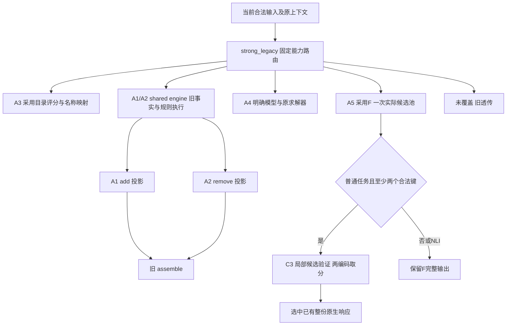

# CF-MoA RCV：完整v5结果、运作过程与交付索引

报告日期：2026-09-26（Asia/Shanghai）。模型与原生分析于当日15:19:42全部完成；资源状态引用18:44只读快照。**完整v5回归完成，整个收口计划仍未完成。** 本次发布只整理已经保存的结果，0新模型调用、0原生重评分、0进程操作。

完整研究历史见[报告第16章及09-26补充](docs/research/cf_moa_experiment_report.md#rcv-full-v5-results-20260926)；精确机器索引见[public_delivery_index.json](data/public_delivery_index.json)。前一份09-25“执行中”快照及更早所有负结果继续保留。

## 1. 已经得到的结果

每骨干13,905唯一输入，每臂15,616原生映射、6,104非reference ALL单元；六臂均已评分，pending=0。不可用答案仍留在完整分母。原生单元均分与正确输入数采用不同权重，不能互换。以下属于已暴露开发范围，并非冻结后独立验证。

| 方法 | M4正确/13905 | M4原生ALL | M4不可用 | M5正确/13905 | M5原生ALL | M5不可用 |
|---|---:|---:|---:|---:|---:|---:|
| C0 原方法 | 7,441 | 48.198995% | 0 | 6,913 | 47.348733% | 0 |
| C1 强旧B | 8,924 | 58.292377% | 51 | 8,971 | 59.361621% | 22 |
| C2 无理由验证 | 8,554 | 55.993884% | 51 | 8,843 | 59.356160% | 22 |
| C3 带理由验证（主研究） | 8,649 | 56.481542% | 51 | 9,060 | 60.288882% | 22 |
| C4 旧池＋三份回答 | 8,951 | 58.321865% | 157 | 8,878 | 59.672346% | 86 |
| C5 同池整体选择 | 8,660 | 56.729467% | 51 | 8,739 | 58.968982% | 22 |

主C3相对B：M4少275个正确输入，原生ALL下降1.810834个百分点；M5多89个，原生ALL增加0.927261个百分点。两骨干方向不一致，**旧默认B保持，不能据M5单格上涨宣称稳定增益或最终采用**。C3与B不可用数相同，M4损失不是新增失败分母造成。

| 相对B | M4修复/误伤 | M4正确→不可用 | M5修复/误伤 | M5正确→不可用 |
|---|---:|---:|---:|---:|
| C2 无理由验证 | 393/763 | 0 | 345/473 | 0 |
| C3 带理由验证（主研究） | 436/711 | 0 | 452/363 | 0 |
| C4 旧池＋三份回答 | 319/252 | 40 | 275/341 | 27 |
| C5 同池整体选择 | 417/681 | 0 | 357/589 | 0 |

C4的M4修复319、误伤252之外另有40个正确→不可用，净正确为+27；M5对应275−341−27=−93。不能只拿修复减误伤冒充总变化。保持/应变配对分别6,838/1,780；C3保持双正确M4从4,440降至4,144，M5从4,460升至4,486，应变双正确分别347/360且与B相同。完整R类别、辅助指标和各臂配对见[M4质量](data/full_v5/m4/quality_summary.json)、[M5质量](data/full_v5/m5/quality_summary.json)。R类别存在重叠，不能相加成ALL。

## 2. 实际代码、五角色与配置

本轮唯一主候选为`a5_candidate_with_rationales_v1`。候选全部保留，每键最早完整原响应；完整当前上下文，旧理由标为不可信；每候选两编码分别归一后平均，最大值选中，精确平票保留F；直接返回选中的完整响应。没有全局重写，没有普通重答增量叠加，`f_disagreement_reanswer=false`。



| 角色/组件 | 实际源码 | 输出及边界 |
|---|---|---|
| 固定路由 | [strong_legacy.py](source_snapshot/cf_moa/controller/strong_legacy.py) | 目录→规则→完整模型→F→透传；不按gold/来源ID选臂 |
| A1/A2共享规则核 | [minimal_operations.py](source_snapshot/cf_moa/controller/minimal_operations.py) | add/remove及依据，最终旧assemble；不是两独立训练模型 |
| A3 | [a3_contrastive_comparison.py](source_snapshot/cf_moa/agents/a3_contrastive_comparison.py) | 旧目录评分、完整目录名称直返 |
| A4 | [a4_intervention_execution.py](source_snapshot/cf_moa/agents/a4_intervention_execution.py) | 真实完整模型条件与工具执行；主临床v5适用0 |
| A5旧F | [a5_robust_readout.py](source_snapshot/cf_moa/agents/a5_robust_readout.py)、[采用F](source_snapshot/selected_legacy/2026-09-18/r5_head/delivery/r5_head.py) | 保留实际候选、NLI分布和原早停，不补造未生成票 |
| C2/C3验证 | [a5_candidate_verify.py](source_snapshot/cf_moa/agents/a5_candidate_verify.py) | 复用ModelSession.score；C2无理由、C3不可信旧理由 |
| C5整体选择 | [a5_joint_selector.py](source_snapshot/cf_moa/agents/a5_joint_selector.py) | 相同池与理由，两映射有限编码选择 |
| 在线控制/CLI | [moa_rcv.py](source_snapshot/cf_moa/controller/moa_rcv.py)、[run_moa_rcv.py](source_snapshot/cf_moa/evaluation/run_moa_rcv.py) | cached/live同一原生入口 |
| 全量实际driver | [run_moa_rcv_batched.py](source_snapshot/cf_moa/evaluation/run_moa_rcv_batched.py) | `db06c973…`，跨题调度、不投机增加F票 |
| 原生分析 | [analyze_full.py](analysis_source/full_v5/analyze_full.py) | 复用旧评分，仅当时缺失映射调用原grader |

角色覆盖：目录3,560、共享规则123、F10,178、旧透传44、完整模型0。A4模型内连通与旧24profile单列，不能冒充当前临床全量已有A4协作。

配置：[方法解析规格](method_spec.resolved.json)、[研究入口](source_snapshot/cf_moa/configs/moa_rcv_v1.json)、[全量参数](configs/full_v5.resolved.json)、[M4实际profiles](configs/M4_actual_profiles.json)、[M5实际profiles](configs/M5_actual_profiles.json)、[运行身份](runtime_identity.json)。两个骨干各自配置保持；GPU拆分不修改模型、提示、精度、上下文、temperature、seed或输出预算。计划文件内原始`prepared_not_launched`是启动前字段，实际完成状态以本包收据为准。

```bash
python -m cf_moa.evaluation.run_moa_rcv --plan PLAN --method M4 --mode cached --output OUT
python -m cf_moa.evaluation.run_moa_rcv --plan PLAN --method M5 --mode live --gpu AUTHORIZED_GPU --output OUT
```

以上是研究入口，运行需要合法输入、实际采用模块及本地模型/vLLM环境；本包不是无模型、无数据即可复现的安装包。107个已有运行源码/配置与实际来源逐字匹配，另附本次调度及恢复源码。未来暂存callback/独立候选池复本入口未在此全量运行中启用。

## 3. 最近运作过程及错误

| 时间（北京时间） | 实际事件与处理 |
|---|---|
| 09-25 15:04 | M4评分监听因JSONDecodeError退出；推理继续。旧错误保留；没有证据定位到底是哪份文件的瞬时内容。 |
| 09-26 09:04 / 10:27 | M4 GPU3/GPU1余量分片分别完成；此前正常STOP部分合法复用。 |
| 09-26 11:19:48 | M4限定恢复监听完成评分；稳定JSON读取只对解码错误有限重读，永久错误记录路径与定位；14项相关测试通过。新增14,310缺失grader映射，63,770缓存命中。 |
| 09-26 11:23 | M5原GPU2单卡作业按请求正常STOP，已提交收尾并持久化；未提交部分按原输入顺序分给三卡。 |
| 09-26 11:27 / 11:35 | 新GPU2先后因vLLM初始化free-memory断言和KV可用17.54GiB小于所需18GiB失败；均0物理模型调用，原失败不覆盖。第二次期间有外部进程竞争证据，不能声称精确分解所有显存原因。 |
| 09-26 13:19 / 13:26 | M5 GPU1/GPU3分别完成949输入；原GPU2仍有962实际未完输入、4,779任务。 |
| 09-26 14:18 | 用户明确授权后，三卡分配964原计划输入/4,791任务，包含2已完整缓存输入/12无需模型任务；每题所有arm同卡。模型参数不变。 |
| 09-26 14:57:56 / 14:59:52 / 15:18:41 | 尾片GPU3/GPU1/GPU2依次退出0；合计5,636新增物理调用。全部原生不可用仍留分母。 |
| 09-26 15:19:42 | M5固定CPU监听完成一次合并评分：13,302缺失grader映射、64,778复用命中；0分析模型调用。 |
| 09-26 18:44 | 所有本任务模型/评分作业已结束；GPU1/2/3保留既有自有占位约58.43/60/58.01GiB，GPU0空闲。本次整理未操作这些进程。 |

M4模型分片首尾时间不是监听评分时间。status的`complete`是方法任务行，不是病例数；`scored`表示已计入评分，也不表示答案有效。原监听错误、两次初始化失败、STOP前日志、36尾片继承回调和所有未采用结果保留。

恢复源码见[execution_source](execution_source/full_v5)，状态与有限修复收据见[evidence/full_v5](evidence/full_v5)。这些代码公开用于复核，不因发布自动再次执行。一般自动实验队列继续停止。

## 4. 实际新增成本与不重复计费

以下仅统计**完整v5的17个有调用闭合来源＋两次零调用初始化失败**，依据实际status里的唯一持久物理调用字段；本次没有重算SQL内模型请求，更没有重跑模型。原始逐来源cost字段及SHA见[完整成本索引](data/full_v5_new_physical_cost.json)。

| 骨干 | 新物理调用 | 输入token | 输出token | 模型事件秒 |
|---|---:|---:|---:|---:|
| M4 | 87,429 | 550,919,327 | 10,309,134 | 189,662.726 |
| M5 | 75,550 | 406,890,997 | 7,982,772 | 141,578.568 |
| 合计 | 162,979 | 957,810,324 | 18,291,906 | 331,241.294 |

| 实际来源（完整v5下） | 状态 | 新调用 | 输入token | 输出token | 模型事件秒 |
|---|---|---:|---:|---:|---:|
| `batch8/runs/m4` | complete | 48 | 148,422 | 48 | 11.611 |
| `batch8/runs/m5` | complete | 48 | 135,330 | 48 | 12.412 |
| `catalog_remaining/runs/m4` | complete | 10,416 | 31,745,970 | 10,416 | 3548.475 |
| `catalog_remaining/runs/m5` | complete | 10,416 | 28,996,314 | 10,416 | 3044.785 |
| `prefix32/runs/m4` | complete | 192 | 586,494 | 192 | 51.173 |
| `prefix32/runs/m5` | complete | 192 | 536,166 | 192 | 60.512 |
| `readout16/runs/m5` | complete | 90 | 226,169 | 12,778 | 204.541 |
| `readout16_gpu1/runs/m4` | complete | 119 | 334,933 | 13,020 | 181.950 |
| `readout_parallel_gpu13_20260925/gpu1/runs/m4` | complete | 28,336 | 221,145,105 | 3,823,690 | 77569.223 |
| `readout_parallel_gpu13_20260925/gpu3/runs/m4` | complete | 28,361 | 215,622,964 | 3,804,031 | 72536.337 |
| `readout_parallel_m5_20260926/gpu1/runs/m5` | complete | 6,535 | 24,138,119 | 710,106 | 6297.112 |
| `readout_parallel_m5_20260926/gpu2/runs/m5` | stopped_on_systemic_error | 0 | 0 | 0 | 0.000 |
| `readout_parallel_m5_20260926/gpu2_recovery1/runs/m5` | stopped_on_systemic_error | 0 | 0 | 0 | 0.000 |
| `readout_parallel_m5_20260926/gpu3/runs/m5` | complete | 6,916 | 25,330,952 | 737,630 | 6694.492 |
| `readout_remaining/runs/m5` | stopped_by_request | 45,717 | 303,255,578 | 5,825,290 | 117312.388 |
| `readout_remaining_gpu1/runs/m4` | stopped_by_request | 19,957 | 81,335,439 | 2,657,737 | 35763.956 |
| `readout_tail_gpu123_20260926/gpu1/runs/m5` | complete | 1,934 | 7,868,060 | 229,251 | 2314.987 |
| `readout_tail_gpu123_20260926/gpu2/runs/m5` | complete | 1,874 | 8,142,442 | 229,001 | 3445.778 |
| `readout_tail_gpu123_20260926/gpu3/runs/m5` | complete | 1,828 | 8,261,867 | 228,060 | 2191.561 |

成本解释：

- 迁移继承回调的`physical=[]`，不计第二次模型调用。`submission_attempts=163154`含继承和初始化失败，不能当作162,979之外的新生成。
- 两次GPU2初始化虽然0token，runner耗时42.358/28.729秒仍记录；不是零资源代价。17非零来源未知推理用量均为0。
- 模型事件秒合计约92.011小时，是共享GPU条件下事件时间之和；不等于日历墙钟、独占GPU小时或能耗。原始callback累计wall可能重复包含批次/初始化，不作为GPU耗时。
- [先前阶段费用](data/completed_new_physical_cost.json)包含C5 176次、live连通40次、自然M4 C0四次等，同时含目录和readout16，后两者已进入上表。**不能把该文件总数直接再相加。** 更早780次候选验证和旧B/F/检索初答费用另有历史身份。
- 跨arm共享一次F只计一次实际支付。每方法归属的完整历史＋新增成本尚待统一收尾；不能把上表除以六冒充方法费用，也不把历史复用写成免费。

## 5. 逐题trace及公私交付位置

| 内容 | 公共位置 | 说明 |
|---|---|---|
| 逐题状态 | [M4](data/full_v5/m4/per_input_status.jsonl.gz) / [M5](data/full_v5/m5/per_input_status.jsonl.gz) | 各83,430行，六臂×13,905；保留不可用null |
| 原生单元 | [M4](data/full_v5/m4/native_units.jsonl.gz) / [M5](data/full_v5/m5/native_units.jsonl.gz) | 各80,370行，含ALL及重叠R类别；非80,370独立病例 |
| 配对端结果 | [M4](data/full_v5/m4/pairs.jsonl.gz) / [M5](data/full_v5/m5/pairs.jsonl.gz) | 各51,708行，保持/应变分开 |
| 家族配对atom | [M4](data/full_v5/m4/paired_atoms.jsonl.gz) / [M5](data/full_v5/m5/paired_atoms.jsonl.gz) | 各73,610行；完整atoms已保存，新的全量bootstrap尚未执行 |
| 全家族效应 | [M4](data/full_v5/m4/family_effects.jsonl.gz) / [M5](data/full_v5/m5/family_effects.jsonl.gz) | 各46,760行；按模型/候选/metric/家族区分 |
| 原始完整trace索引 | [private_artifact_index.json](data/private_artifact_index.json) | 输入、完整F池、messages/响应、verification、SQL和离线gold的实际服务器路径与来源绑定 |
| 运行/评分收据 | [M4](data/full_v5/m4/receipt.json) / [M5](data/full_v5/m5/receipt.json) | 全部来源、当时新增评分与复用数，不是此次发布又调用grader |
| 开发121/52及操作消融 | [开发五表](data/tables/five_tables.md) / [操作消融](data/operation_ablations) | 历史已完成结果；不是全量最终五张论文表 |

`.jsonl.gz`为原元数据无损压缩，解压后的字节与服务器原文件一致。完整题面、检索片段、模型消息、原始响应、gold内容及SQL没有公开上传；这里的公共逐题文件是完整分母元数据，不能冒充完整医学trace。需原文复核时按私有索引的模型、request_id、arm和proposal/journal定位。原生gold仅离线，未拼入推理消息。

## 6. 仍未完成的工作

全量家族bootstrap区间、统一每方法归属费用及五张完整论文表还未完成。原121/52的区间不能替代全量区间。自然52 M5原C0仍缺4条，这是独立小面板缺口；完整v5 C0已经齐全，二者不能混淆。

共同冻结、后续确认范围及真实独立F候选生成复本尚未运行。准备清单不等于产生新结果；自然52和本次完整v5均已暴露，不能称盲测。当前没有新的稳定泛化或最终采用结论，旧B默认配置不覆盖。

本包完整交付的是**截至本时点已经执行的方案、全量结果、失败恢复和证据索引**，不将尚未执行部分标为完成。源文件哈希、压缩前哈希及来源转换见[SOURCE_MANIFEST.json](SOURCE_MANIFEST.json)。
